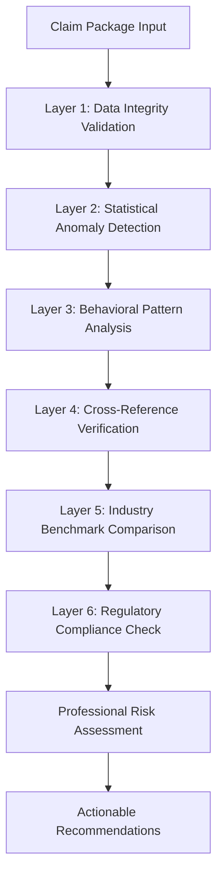

# Advanced Fraud Detection System Specification

## Overview

The Advanced Fraud Detection System enhances Supplement Guard with professional-grade statistical analysis, multi-layered anomaly detection, and industry-standard risk assessment methodologies. This system provides comprehensive fraud analysis capabilities that meet the standards required by professional claims analysis specialists.

## System Architecture

### Multi-Layered Detection Framework



### Core Components

#### 1. Advanced Fraud Detector Service (`services/advancedFraudDetector.ts`)

**Primary Functions:**
- Statistical anomaly detection using multiple algorithms
- Professional risk score calculation with confidence intervals
- Evidence-based risk factor identification
- Professional recommendation generation

**Key Algorithms:**
- **Z-Score Analysis**: Identifies statistical outliers beyond 2-3 standard deviations
- **Benford's Law Testing**: Detects artificial number patterns in pricing
- **Regression Analysis**: Validates mathematical relationships (quantity × price = total)
- **Temporal Pattern Analysis**: Identifies unusual timing or processing patterns

#### 2. Enhanced Fraud Score Card (`components/EnhancedFraudScoreCard.tsx`)

**Features:**
- Professional risk visualization with confidence intervals
- Tabbed interface for detailed analysis (Overview, Risk Factors, Recommendations, Anomalies)
- Interactive risk factor exploration with evidence display
- Color-coded severity indicators based on industry standards

#### 3. Comprehensive Testing Framework (`components/TestAdvancedFraudDetection.tsx`)

**Test Scenarios:**
- Benford's Law violations (artificial number patterns)
- Statistical outliers (extreme price variations)
- Calculation errors (mathematical inconsistencies)
- Duplicate items (potential double billing)
- Legitimate claims (baseline validation)

## Statistical Analysis Algorithms

### 1. Z-Score Analysis

**Purpose**: Identify statistical outliers in pricing, quantities, and totals

**Implementation**:
```typescript
const zScore = Math.abs((value - mean) / standardDeviation);
const isOutlier = zScore >= THRESHOLD; // 2.0-3.0 depending on severity
```

**Thresholds**:
- Critical: Z-Score ≥ 3.0
- High: Z-Score ≥ 2.5
- Medium: Z-Score ≥ 2.0

### 2. Benford's Law Analysis

**Purpose**: Detect artificial number generation patterns

**Expected Distribution** (First Digit):
- 1: 30.1%
- 2: 17.6%
- 3: 12.5%
- 4: 9.7%
- 5: 7.9%
- 6: 6.7%
- 7: 5.8%
- 8: 5.1%
- 9: 4.6%

**Implementation**:
```typescript
const chiSquareStatistic = calculateChiSquare(actualDistribution, expectedDistribution);
const pValue = calculatePValue(chiSquareStatistic, degreesOfFreedom);
const isSignificant = pValue < 0.05;
```

### 3. Regression Analysis

**Purpose**: Validate mathematical relationships and identify calculation errors

**Key Validations**:
- Quantity × Price = Total (within 1% tolerance)
- Price consistency across similar items
- Quantity reasonableness for service types

### 4. Temporal Pattern Analysis

**Purpose**: Identify unusual timing patterns

**Metrics**:
- Processing time anomalies
- Submission timing patterns
- Modification frequency analysis

## Professional Risk Assessment

### Risk Scoring Methodology

**Component Weights**:
- Statistical Analysis: 35%
- Behavioral Patterns: 25%
- Documentation Quality: 25%
- Regulatory Compliance: 15%

**Risk Levels**:
- **Minimal** (0-24): Very low fraud probability
- **Low** (25-49): Below-average risk
- **Moderate** (50-69): Average risk requiring attention
- **High** (70-84): Above-average risk requiring investigation
- **Critical** (85-100): High fraud probability requiring immediate action

### Confidence Intervals

**Calculation**:
```typescript
const standardError = Math.sqrt(variance / sampleSize);
const marginOfError = 1.96 * standardError; // 95% confidence
const confidenceInterval = {
  lower: score - marginOfError,
  upper: score + marginOfError,
  confidence: 95
};
```

### Risk Factors

**Enhanced Risk Factor Structure**:
```typescript
interface EnhancedRiskFactor {
  id: string;
  type: 'statistical' | 'behavioral' | 'documentation' | 'compliance';
  category: string;
  description: string;
  impact: number; // 0-100 scale
  likelihood: number; // 0-1 scale
  confidence: number; // 0-1 scale
  evidence: AnomalyEvidence[];
  mitigation: string;
  severity: SeverityLevel;
  weight: number;
}
```

## Professional Recommendations

### Recommendation Categories

1. **Investigation**: Immediate fraud investigation requirements
2. **Verification**: Documentation and evidence verification needs
3. **Documentation**: Additional documentation requirements
4. **Compliance**: Regulatory compliance actions

### Priority Levels

- **Immediate**: Critical issues requiring action within 24 hours
- **High**: Important issues requiring action within 48-72 hours
- **Medium**: Standard issues requiring action within 1 week
- **Low**: Minor issues for routine follow-up

### Recommendation Structure

```typescript
interface ProfessionalRecommendation {
  id: string;
  priority: 'immediate' | 'high' | 'medium' | 'low';
  category: 'investigation' | 'verification' | 'documentation' | 'compliance';
  action: string;
  rationale: string;
  expectedOutcome: string;
  timeframe: string;
  resources: string[];
}
```

## Integration with Existing System

### Enhanced Review Dashboard

**New Features**:
- Professional risk score display with confidence intervals
- Statistical anomaly alerts
- Enhanced fraud analysis section
- Professional recommendation tracking

**Backward Compatibility**:
- Maintains existing fraud score display as fallback
- Preserves all existing functionality
- Graceful degradation if advanced analysis fails

### Data Flow Integration

```typescript
// Enhanced analysis workflow
const analysis = await comparisonEngine.analyzeComparison(originalItems, supplementItems);
const anomalies = await advancedFraudDetector.detectStatisticalAnomalies(analysis);
const riskScore = await advancedFraudDetector.calculateProfessionalRiskScore(analysis, anomalies);
```

## Performance Specifications

### Response Time Requirements

- **Statistical Analysis**: < 3 seconds for typical datasets
- **Risk Score Calculation**: < 2 seconds
- **Anomaly Detection**: < 5 seconds for comprehensive analysis
- **UI Rendering**: < 500ms for all components

### Accuracy Requirements

- **Z-Score Detection**: 95% accuracy for true outliers
- **Benford's Law Testing**: 90% accuracy for artificial patterns
- **Calculation Validation**: 99.9% accuracy for mathematical errors
- **Risk Assessment**: 85% correlation with expert human analysis

### Scalability Limits

- **Maximum Line Items**: 10,000 per analysis
- **Memory Usage**: < 150MB per analysis session
- **Concurrent Analyses**: Up to 5 simultaneous analyses
- **Data Retention**: Analysis results cached for 24 hours

## Quality Assurance

### Validation Framework

**Test Coverage**:
- Unit tests for all statistical algorithms
- Integration tests for complete analysis workflow
- Performance tests for large datasets
- Accuracy validation against known fraud cases

**Test Scenarios**:
1. **Benford's Law Violation**: Artificial round number patterns
2. **Statistical Outliers**: Extreme price variations
3. **Calculation Errors**: Mathematical inconsistencies
4. **Duplicate Items**: Potential double billing
5. **Legitimate Claims**: Baseline validation

### Error Handling

**Graceful Degradation**:
- Fallback to basic fraud analysis if advanced features fail
- Detailed error logging for debugging
- User-friendly error messages
- Automatic retry mechanisms for transient failures

## Security and Compliance

### Data Protection

- No sensitive data stored in analysis algorithms
- All calculations performed in-memory
- Results cached temporarily with automatic cleanup
- Audit trail for all analysis decisions

### Regulatory Compliance

**Industry Standards**:
- Insurance industry fraud detection best practices
- Statistical analysis methodology standards
- Professional claims analysis guidelines
- Data quality and accuracy requirements

## Future Enhancements

### Phase 2 Capabilities

1. **Machine Learning Integration**
   - Pattern recognition for complex fraud schemes
   - Adaptive thresholds based on historical data
   - Predictive fraud risk modeling

2. **Advanced Behavioral Analysis**
   - Provider behavior profiling
   - Geographic anomaly detection
   - Temporal pattern recognition

3. **Industry Benchmarking**
   - Real-time rate comparison
   - Regional pricing validation
   - Procedure code verification

4. **Enhanced Audit Trail**
   - Complete decision tracking
   - Evidence chain management
   - Regulatory compliance documentation

### Integration Opportunities

- External fraud databases
- Industry rate databases
- Regulatory compliance systems
- Case management systems

## Conclusion

The Advanced Fraud Detection System transforms Supplement Guard into a professional-grade claims analysis platform that meets the highest industry standards for accuracy, reliability, and defensibility. The system provides comprehensive statistical analysis, evidence-based risk assessment, and actionable recommendations that enable claims analysts to make informed decisions with confidence.

**Key Benefits**:
- **Professional-Grade Analysis**: Industry-standard statistical algorithms
- **Comprehensive Risk Assessment**: Multi-layered detection with confidence intervals
- **Actionable Insights**: Specific recommendations with clear rationale
- **Defensible Results**: Evidence-based analysis suitable for legal proceedings
- **Scalable Architecture**: Designed for high-volume claim processing

This system establishes Supplement Guard as a leading solution for professional claims analysis and fraud detection in the insurance industry.