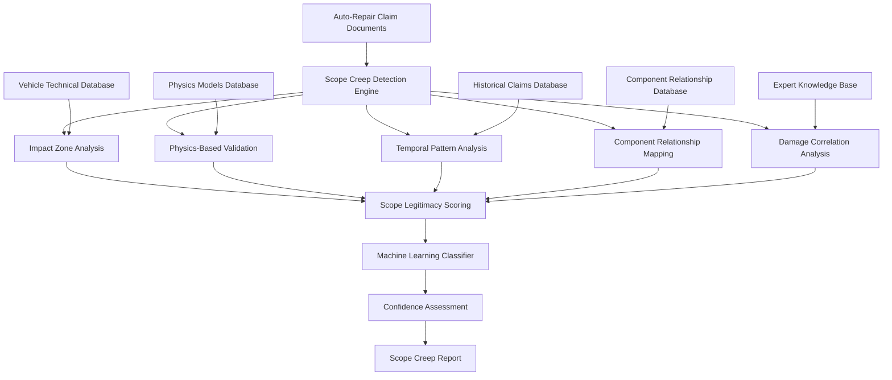

# Advanced Scope Creep Detection Algorithms Specification

## Overview

This document specifies advanced algorithms for detecting scope creep in auto-repair claims through sophisticated analysis of damage patterns, impact zones, physics-based validation, and temporal analysis. The system combines multiple detection methodologies to identify unrelated repairs, questionable additions, and illegitimate scope expansions with high accuracy and confidence.

## Scope Creep Detection Architecture

### High-Level Architecture



### Core Detection Components

#### 1. Advanced Scope Creep Detection Engine

```typescript
export class AdvancedScopeCreepDetector {
  // Primary detection methods
  async detectScopeCreep(
    claimData: AutoRepairClaimData
  ): Promise<ScopeCreepDetectionResult>;
  
  async analyzeImpactZones(
    claimData: AutoRepairClaimData
  ): Promise<ImpactZoneAnalysisResult>;
  
  async validatePhysicsConsistency(
    damagePattern: DamagePattern,
    impactData: ImpactData
  ): Promise<PhysicsValidationResult>;
  
  async analyzeTemporalPatterns(
    claimTimeline: ClaimTimeline
  ): Promise<TemporalPatternAnalysisResult>;
  
  async mapComponentRelationships(
    damagedComponents: DamagedComponent[]
  ): Promise<ComponentRelationshipMap>;
  
  async correlateDamagePatterns(
    damageItems: DamageItem[]
  ): Promise<DamageCorrelationResult>;
  
  // Advanced analysis
  async detectHiddenDamagePatterns(
    claimData: AutoRepairClaimData
  ): Promise<HiddenDamageAnalysis>;
  
  async analyzeRepairSequencing(
    repairOperations: RepairOperation[]
  ): Promise<RepairSequencingAnalysis>;
  
  async validateScopeJustifications(
    scopeAdditions: ScopeAddition[]
  ): Promise<JustificationValidationResult>;
}
```

## Impact Zone Analysis

### 1. Sophisticated Impact Zone Mapping

```typescript
export interface ImpactZoneAnalysisResult {
  // Primary impact analysis
  primary_impact_zone: PrimaryImpactZone;
  impact_severity: ImpactSeverity;
  impact_vector_analysis: ImpactVectorAnalysis;
  
  // Secondary impact zones
  secondary_impact_zones: SecondaryImpactZone[];
  energy_dissipation_pattern: EnergyDissipationPattern;
  structural_load_paths: StructuralLoadPath[];
  
  // Damage propagation analysis
  damage_propagation_model: DamagePropagationModel;
  propagation_probability_map: PropagationProbabilityMap;
  cascade_failure_analysis: CascadeFailureAnalysis;
  
  // Scope validation
  legitimate_damage_zones: LegitimateZone[];
  questionable_damage_zones: QuestionableZone[];
  unrelated_damage_zones: UnrelatedZone[];
  
  // Confidence metrics
  analysis_confidence: number;
  zone_classification_confidence: ZoneClassificationConfidence[];
  expert_validation_alignment: ExpertValidationAlignment;
}

export interface PrimaryImpactZone {
  zone_identifier: string;
  zone_description: string;
  impact_coordinates: ImpactCoordinates;
  impact_angle: number;
  impact_force_estimate: ForceEstimate;
  
  // Damage characteristics
  damage_severity_score: number;
  damage_pattern_type: DamagePatternType;
  deformation_characteristics: DeformationCharacteristics;
  
  // Physics validation
  energy_absorption_analysis: EnergyAbsorptionAnalysis;
  material_failure_analysis: MaterialFailureAnalysis;
  structural_response_analysis: StructuralResponseAnalysis;
}

export interface SecondaryImpactZone {
  zone_identifier: string;
  relationship_to_primary: RelationshipToPrimary;
  propagation_mechanism: PropagationMechanism;
  propagation_probability: number;
  
  // Validation metrics
  physics_consistency_score: number;
  structural_connectivity: StructuralConnectivity;
  energy_transfer_validation: EnergyTransferValidation;
  
  // Risk assessment
  legitimacy_score: number;
  scope_creep_risk: ScopeCreepRisk;
  investigation_priority: InvestigationPriority;
}
```

### 2. Energy Transfer and Damage Propagation Models

```typescript
export class PhysicsBasedDamageAnalyzer {
  // Energy analysis
  async analyzeEnergyTransfer(
    impactData: ImpactData,
    vehicleStructure: VehicleStructure
  ): Promise<EnergyTransferAnalysis>;
  
  async calculateEnergyDissipation(
    impactForce: number,
    impactDuration: number,
    materialProperties: MaterialProperties[]
  ): Promise<EnergyDissipationCalculation>;
  
  // Structural analysis
  async analyzeStructuralResponse(
    impactVector: ImpactVector,
    structuralElements: StructuralElement[]
  ): Promise<StructuralResponseAnalysis>;
  
  async validateLoadPaths(
    forceVector: ForceVector,
    structuralConnections: StructuralConnection[]
  ): Promise<LoadPathValidation>;
  
  // Damage propagation
  async modelDamagePropagation(
    initialDamage: InitialDamage,
    structuralModel: StructuralModel
  ): Promise<DamagePropagationModel>;
  
  async calculatePropagationProbabilities(
    damageScenario: DamageScenario
  ): Promise<PropagationProbabilityMap>;
}

export interface EnergyTransferAnalysis {
  // Energy calculations
  total_impact_energy: number;
  energy_absorption_by_zone: EnergyAbsorptionByZone[];
  energy_dissipation_mechanisms: EnergyDissipationMechanism[];
  
  // Transfer pathways
  primary_energy_paths: EnergyPath[];
  secondary_energy_paths: EnergyPath[];
  energy_reflection_points: EnergyReflectionPoint[];
  
  // Validation metrics
  energy_conservation_validation: EnergyConservationValidation;
  physics_consistency_score: number;
  model_accuracy_confidence: number;
  
  // Damage correlation
  energy_damage_correlation: EnergyDamageCorrelation[];
  unexplained_damage_analysis: UnexplainedDamageAnalysis[];
  energy_based_scope_validation: EnergyBasedScopeValidation;
}

export interface DamagePropagationModel {
  // Propagation pathways
  propagation_chains: PropagationChain[];
  cascade_sequences: CascadeSequence[];
  failure_mode_analysis: FailureModeAnalysis[];
  
  // Probability modeling
  propagation_probabilities: PropagationProbability[];
  conditional_damage_probabilities: ConditionalDamageProbability[];
  cumulative_damage_risk: CumulativeDamageRisk;
  
  // Validation and confidence
  model_validation_score: number;
  historical_correlation: HistoricalCorrelation;
  expert_opinion_alignment: ExpertOpinionAlignment;
}
```

## Temporal Pattern Analysis

### 1. Advanced Timeline Analysis

```typescript
export interface TemporalPatternAnalysisResult {
  // Timeline reconstruction
  damage_discovery_timeline: DamageDiscoveryTimeline;
  inspection_sequence_analysis: InspectionSequenceAnalysis;
  documentation_timeline: DocumentationTimeline;
  
  // Pattern detection
  suspicious_timing_patterns: SuspiciousTimingPattern[];
  discovery_velocity_analysis: DiscoveryVelocityAnalysis;
  late_discovery_analysis: LateDiscoveryAnalysis;
  
  // Legitimacy assessment
  discovery_legitimacy_scores: DiscoveryLegitimacyScore[];
  timing_consistency_analysis: TimingConsistencyAnalysis;
  inspection_quality_correlation: InspectionQualityCorrelation;
  
  // Risk indicators
  temporal_red_flags: TemporalRedFlag[];
  timing_anomalies: TimingAnomaly[];
  discovery_pattern_risks: DiscoveryPatternRisk[];
}

export class TemporalPatternAnalyzer {
  // Timeline analysis
  async analyzeDiscoveryTimeline(
    claimEvents: ClaimEvent[]
  ): Promise<DiscoveryTimelineAnalysis>;
  
  async detectSuspiciousTimingPatterns(
    timeline: ClaimTimeline
  ): Promise<SuspiciousTimingPattern[]>;
  
  async analyzeInspectionQuality(
    inspectionEvents: InspectionEvent[]
  ): Promise<InspectionQualityAnalysis>;
  
  // Pattern recognition
  async identifyDiscoveryPatterns(
    historicalClaims: HistoricalClaim[],
    currentClaim: AutoRepairClaimData
  ): Promise<DiscoveryPatternAnalysis>;
  
  async analyzeDocumentationPatterns(
    documentationEvents: DocumentationEvent[]
  ): Promise<DocumentationPatternAnalysis>;
  
  // Legitimacy validation
  async validateDiscoveryLegitimacy(
    damageItem: DamageItem,
    discoveryContext: DiscoveryContext
  ): Promise<DiscoveryLegitimacyValidation>;
  
  async assessTimingConsistency(
    claimTimeline: ClaimTimeline
  ): Promise<TimingConsistencyAssessment>;
}

export interface DiscoveryTimelineAnalysis {
  // Timeline events
  initial_inspection_findings: InspectionFinding[];
  subsequent_discoveries: SubsequentDiscovery[];
  late_additions: LateAddition[];
  
  // Discovery patterns
  discovery_velocity: DiscoveryVelocity;
  discovery_clustering: DiscoveryClustering;
  discovery_sequencing: DiscoverySequencing;
  
  // Legitimacy indicators
  discovery_justifications: DiscoveryJustification[];
  inspection_thoroughness: InspectionThoroughness;
  documentation_quality: DocumentationQuality;
  
  // Risk assessment
  timeline_risk_score: number;
  discovery_legitimacy_score: number;
  temporal_consistency_score: number;
}
```

### 2. Hidden Damage Pattern Detection

```typescript
export interface HiddenDamageAnalysis {
  // Hidden damage classification
  legitimate_hidden_damage: LegitimateHiddenDamage[];
  questionable_hidden_damage: QuestionableHiddenDamage[];
  suspicious_hidden_damage: SuspiciousHiddenDamage[];
  
  // Discovery analysis
  discovery_circumstances: DiscoveryCircumstances[];
  discovery_methodology: DiscoveryMethodology[];
  discovery_documentation: DiscoveryDocumentation[];
  
  // Validation metrics
  hidden_damage_legitimacy_score: number;
  discovery_process_quality: DiscoveryProcessQuality;
  technical_feasibility_score: TechnicalFeasibilityScore;
  
  // Risk indicators
  hidden_damage_red_flags: HiddenDamageRedFlag[];
  discovery_timing_anomalies: DiscoveryTimingAnomaly[];
  documentation_inconsistencies: DocumentationInconsistency[];
}

export class HiddenDamageDetector {
  // Detection algorithms
  async detectHiddenDamagePatterns(
    claimData: AutoRepairClaimData
  ): Promise<HiddenDamagePatternDetection>;
  
  async analyzeDiscoveryCircumstances(
    hiddenDamageItems: HiddenDamageItem[]
  ): Promise<DiscoveryCircumstancesAnalysis>;
  
  async validateTechnicalFeasibility(
    hiddenDamage: HiddenDamageItem,
    vehicleData: VehicleData
  ): Promise<TechnicalFeasibilityValidation>;
  
  // Pattern analysis
  async identifyDiscoveryPatterns(
    discoveryEvents: DiscoveryEvent[]
  ): Promise<DiscoveryPatternIdentification>;
  
  async analyzeDocumentationQuality(
    hiddenDamageDocumentation: HiddenDamageDocumentation[]
  ): Promise<DocumentationQualityAnalysis>;
  
  // Risk assessment
  async assessHiddenDamageRisk(
    hiddenDamageAnalysis: HiddenDamageAnalysis
  ): Promise<HiddenDamageRiskAssessment>;
}

export interface LegitimateHiddenDamage {
  damage_description: string;
  discovery_method: DiscoveryMethod;
  technical_justification: TechnicalJustification;
  
  // Validation factors
  structural_accessibility: StructuralAccessibility;
  damage_correlation: DamageCorrelation;
  discovery_timing_appropriateness: DiscoveryTimingAppropriateness;
  
  // Supporting evidence
  photographic_evidence: PhotographicEvidence[];
  technical_documentation: TechnicalDocumentation[];
  expert_opinions: ExpertOpinion[];
  
  // Confidence metrics
  legitimacy_confidence: number;
  technical_feasibility_score: number;
  discovery_appropriateness_score: number;
}
```

## Component Relationship Analysis

### 1. Advanced Component Relationship Mapping

```typescript
export interface ComponentRelationshipMap {
  // Relationship types
  structural_relationships: StructuralRelationship[];
  functional_relationships: FunctionalRelationship[];
  proximity_relationships: ProximityRelationship[];
  
  // Damage correlation
  correlated_damage_groups: CorrelatedDamageGroup[];
  independent_damage_items: IndependentDamageItem[];
  questionable_correlations: QuestionableCorrelation[];
  
  // Validation metrics
  relationship_validation_scores: RelationshipValidationScore[];
  correlation_confidence_levels: CorrelationConfidenceLevel[];
  expert_opinion_alignment: ExpertOpinionAlignment[];
  
  // Risk assessment
  relationship_based_risk_scores: RelationshipBasedRiskScore[];
  scope_creep_indicators: ScopeCreepIndicator[];
  unrelated_item_flags: UnrelatedItemFlag[];
}

export class ComponentRelationshipAnalyzer {
  // Relationship mapping
  async mapComponentRelationships(
    vehicleComponents: VehicleComponent[],
    damagedComponents: DamagedComponent[]
  ): Promise<ComponentRelationshipMapping>;
  
  async analyzeStructuralConnections(
    components: VehicleComponent[]
  ): Promise<StructuralConnectionAnalysis>;
  
  async analyzeFunctionalDependencies(
    systems: VehicleSystem[]
  ): Promise<FunctionalDependencyAnalysis>;
  
  // Correlation analysis
  async correlateDamagePatterns(
    damageItems: DamageItem[]
  ): Promise<DamageCorrelationAnalysis>;
  
  async identifyDamageGroups(
    correlatedDamage: CorrelatedDamage[]
  ): Promise<DamageGroupIdentification>;
  
  async validateDamageRelationships(
    damageRelationships: DamageRelationship[]
  ): Promise<DamageRelationshipValidation>;
  
  // Risk assessment
  async assessRelationshipRisk(
    relationshipMap: ComponentRelationshipMap
  ): Promise<RelationshipRiskAssessment>;
}

export interface StructuralRelationship {
  component_a: ComponentIdentifier;
  component_b: ComponentIdentifier;
  relationship_type: StructuralRelationshipType;
  connection_strength: ConnectionStrength;
  
  // Physical characteristics
  physical_connection: PhysicalConnection;
  load_transfer_capability: LoadTransferCapability;
  failure_propagation_potential: FailurePropagationPotential;
  
  // Damage correlation
  damage_correlation_probability: number;
  simultaneous_damage_likelihood: number;
  sequential_damage_probability: number;
  
  // Validation
  relationship_confidence: number;
  technical_documentation: TechnicalDocumentation[];
  expert_validation: ExpertValidation;
}

export interface CorrelatedDamageGroup {
  group_identifier: string;
  damage_items: DamageItem[];
  correlation_type: CorrelationType;
  correlation_strength: number;
  
  // Group characteristics
  damage_pattern_consistency: DamagePatternConsistency;
  timing_consistency: TimingConsistency;
  severity_consistency: SeverityConsistency;
  
  // Validation metrics
  group_legitimacy_score: number;
  correlation_confidence: number;
  expert_opinion_alignment: number;
  
  // Risk indicators
  scope_creep_risk: ScopeCreepRisk;
  unrelated_item_probability: number;
  investigation_priority: InvestigationPriority;
}
```

## Machine Learning-Based Detection

### 1. Advanced ML Classification System

```typescript
export class MLScopeCreepClassifier {
  // Model training and inference
  async trainScopeCreepModels(
    trainingData: ScopeCreepTrainingData[]
  ): Promise<TrainedScopeCreepModels>;
  
  async classifyScopeCreep(
    claimFeatures: ScopeCreepFeatures,
    models: TrainedScopeCreepModels
  ): Promise<ScopeCreepClassification>;
  
  // Feature engineering
  async extractScopeCreepFeatures(
    claimData: AutoRepairClaimData
  ): Promise<ScopeCreepFeatureVector>;
  
  async engineerTemporalFeatures(
    timeline: ClaimTimeline
  ): Promise<TemporalFeatureVector>;
  
  async engineerSpatialFeatures(
    damagePattern: DamagePattern
  ): Promise<SpatialFeatureVector>;
  
  // Model validation and interpretation
  async validateModelPerformance(
    models: TrainedScopeCreepModels,
    testData: ScopeCreepTestData[]
  ): Promise<ModelValidationResults>;
  
  async explainClassification(
    classification: ScopeCreepClassification,
    features: ScopeCreepFeatureVector
  ): Promise<ClassificationExplanation>;
  
  // Ensemble methods
  async ensembleClassification(
    individualPredictions: IndividualPrediction[]
  ): Promise<EnsembleClassification>;
}

export interface ScopeCreepFeatureVector {
  // Spatial features
  impact_zone_features: ImpactZoneFeatures;
  damage_distribution_features: DamageDistributionFeatures;
  component_relationship_features: ComponentRelationshipFeatures;
  
  // Temporal features
  discovery_timing_features: DiscoveryTimingFeatures;
  inspection_sequence_features: InspectionSequenceFeatures;
  documentation_timing_features: DocumentationTimingFeatures;
  
  // Physics-based features
  energy_transfer_features: EnergyTransferFeatures;
  structural_response_features: StructuralResponseFeatures;
  damage_propagation_features: DamagePropagationFeatures;
  
  // Pattern features
  damage_pattern_features: DamagePatternFeatures;
  repair_sequence_features: RepairSequenceFeatures;
  cost_pattern_features: CostPatternFeatures;
  
  // Contextual features
  vehicle_characteristics_features: VehicleCharacteristicsFeatures;
  claim_context_features: ClaimContextFeatures;
  historical_pattern_features: HistoricalPatternFeatures;
}

export interface ScopeCreepClassification {
  // Primary classification
  scope_creep_probability: number;
  classification_confidence: number;
  risk_level: ScopeCreepRiskLevel;
  
  // Detailed classifications
  unrelated_items_classification: UnrelatedItemsClassification[];
  questionable_additions_classification: QuestionableAdditionsClassification[];
  hidden_damage_classification: HiddenDamageClassification[];
  
  // Model outputs
  model_predictions: ModelPrediction[];
  ensemble_weights: EnsembleWeight[];
  prediction_uncertainty: PredictionUncertainty;
  
  // Explanation and interpretation
  feature_importance: FeatureImportance[];
  decision_factors: DecisionFactor[];
  classification_reasoning: ClassificationReasoning;
}
```

### 2. Anomaly Detection Algorithms

```typescript
export class ScopeCreepAnomalyDetector {
  // Anomaly detection methods
  async detectSpatialAnomalies(
    damagePattern: DamagePattern,
    normalPatterns: NormalDamagePattern[]
  ): Promise<SpatialAnomalyDetection>;
  
  async detectTemporalAnomalies(
    discoveryTimeline: DiscoveryTimeline,
    normalTimelines: NormalDiscoveryTimeline[]
  ): Promise<TemporalAnomalyDetection>;
  
  async detectCostAnomalies(
    costPattern: CostPattern,
    normalCostPatterns: NormalCostPattern[]
  ): Promise<CostAnomalyDetection>;
  
  // Statistical anomaly detection
  async performStatisticalAnomalyDetection(
    claimMetrics: ClaimMetrics,
    historicalDistributions: HistoricalDistribution[]
  ): Promise<StatisticalAnomalyResult>;
  
  // Multivariate anomaly detection
  async performMultivariateAnomalyDetection(
    featureVector: ScopeCreepFeatureVector,
    normalFeatureSpace: NormalFeatureSpace
  ): Promise<MultivariateAnomalyResult>;
  
  // Deep learning anomaly detection
  async performDeepAnomalyDetection(
    claimData: AutoRepairClaimData,
    autoencoderModel: AutoencoderModel
  ): Promise<DeepAnomalyResult>;
}

export interface SpatialAnomalyDetection {
  // Anomaly identification
  spatial_anomalies: SpatialAnomaly[];
  anomaly_severity_scores: AnomalySeverityScore[];
  anomaly_confidence_levels: AnomalyConfidenceLevel[];
  
  // Pattern analysis
  normal_pattern_deviation: NormalPatternDeviation;
  clustering_anomalies: ClusteringAnomaly[];
  distribution_anomalies: DistributionAnomaly[];
  
  // Risk assessment
  anomaly_risk_scores: AnomalyRiskScore[];
  investigation_priorities: InvestigationPriority[];
  false_positive_probabilities: FalsePositiveProbability[];
}
```

## Validation and Quality Assurance

### 1. Multi-Layer Validation System

```typescript
export class ScopeCreepValidationSystem {
  // Validation layers
  async performPhysicsValidation(
    scopeCreepDetection: ScopeCreepDetectionResult
  ): Promise<PhysicsValidationResult>;
  
  async performExpertValidation(
    scopeCreepDetection: ScopeCreepDetectionResult,
    expertKnowledgeBase: ExpertKnowledgeBase
  ): Promise<ExpertValidationResult>;
  
  async performHistoricalValidation(
    scopeCreepDetection: ScopeCreepDetectionResult,
    historicalClaims: HistoricalClaim[]
  ): Promise<HistoricalValidationResult>;
  
  // Cross-validation
  async performCrossValidation(
    detectionMethods: DetectionMethod[],
    claimData: AutoRepairClaimData
  ): Promise<CrossValidationResult>;
  
  // Confidence assessment
  async assessDetectionConfidence(
    validationResults: ValidationResult[]
  ): Promise<ConfidenceAssessment>;
  
  // Quality metrics
  async calculateQualityMetrics(
    detectionResults: ScopeCreepDetectionResult[],
    groundTruth: GroundTruthData[]
  ): Promise<QualityMetrics>;
}

export interface ValidationResult {
  validation_type: ValidationType;
  validation_score: number;
  validation_confidence: number;
  
  // Supporting evidence
  supporting_evidence: SupportingEvidence[];
  contradicting_evidence: ContradictingEvidence[];
  inconclusive_evidence: InconclusiveEvidence[];
  
  // Validation details
  validation_methodology: ValidationMethodology;
  validation_criteria: ValidationCriteria[];
  validation_limitations: ValidationLimitation[];
  
  // Risk assessment
  validation_risk_score: number;
  false_positive_risk: FalsePositiveRisk;
  false_negative_risk: FalseNegativeRisk;
}
```

### 2. Performance Metrics and Benchmarking

```typescript
export interface ScopeCreepDetectionMetrics {
  // Accuracy metrics
  overall_accuracy: number;
  precision: number;
  recall: number;
  f1_score: number;
  
  // Classification metrics
  true_positive_rate: number;
  false_positive_rate: number;
  true_negative_rate: number;
  false_negative_rate: number;
  
  // Confidence metrics
  average_confidence: number;
  confidence_calibration: ConfidenceCalibration;
  uncertainty_quantification: UncertaintyQuantification;
  
  // Business impact metrics
  cost_savings_achieved: number;
  processing_time_reduction: number;
  manual_review_reduction: number;
  expert_agreement_rate: number;
  
  // Risk metrics
  missed_scope_creep_cost: number;
  false_alarm_cost: number;
  investigation_efficiency: InvestigationEfficiency;
}

export class PerformanceBenchmarking {
  // Benchmarking methods
  async benchmarkAgainstExpertReview(
    detectionResults: ScopeCreepDetectionResult[],
    expertReviews: ExpertReview[]
  ): Promise<ExpertBenchmarkResult>;
  
  async benchmarkAgainstHistoricalOutcomes(
    detectionResults: ScopeCreepDetectionResult[],
    historicalOutcomes: HistoricalOutcome[]
  ): Promise<HistoricalBenchmarkResult>;
  
  async benchmarkAgainstIndustryStandards(
    detectionResults: ScopeCreepDetectionResult[],
    industryStandards: IndustryStandard[]
  ): Promise<IndustryBenchmarkResult>;
  
  // Performance optimization
  async optimizeDetectionThresholds(
    validationData: ValidationData[],
    businessObjectives: BusinessObjective[]
  ): Promise<OptimizedThresholds>;
  
  async optimizeFeatureSelection(
    featureImportance: FeatureImportance[],
    performanceMetrics: PerformanceMetrics
  ): Promise<OptimizedFeatureSet>;
}
```

## Integration and Implementation

### 1. System Integration Architecture

```typescript
export class ScopeCreepDetectionIntegrator {
  // Core integration
  async integrateWithRiskAnalysisEngine(
    scopeCreepResult: ScopeCreepDetectionResult,
    riskAnalysisEngine: MultiDimensionalRiskEngine
  ): Promise<IntegratedRiskAssessment>;
  
  async integrateWithPDFExtractionService(
    pdfExtractionResult: PDFExtractionResult,
    scopeCreepDetector: AdvancedScopeCreepDetector
  ): Promise<IntegratedAnalysisResult>;
  
  async integrateWithComparisonEngine(
    comparisonResult: ComparisonResult,
    scopeCreepAnalysis: ScopeCreepAnalysis
  ): Promise<EnhancedComparisonResult>;
  
  // Data flow integration
  async orchestrateAnalysisPipeline(
    claimData: AutoRepairClaimData
  ): Promise<ComprehensiveAnalysisResult>;
  
  // Real-time integration
  async enableRealTimeDetection(
    claimStream: ClaimDataStream
  ): Promise<RealTimeDetectionStream>;
}
```

### 2. API and Service Architecture

```typescript
export interface ScopeCreepDetectionAPI {
  // Primary endpoints
  detectScopeCreep(claimData: AutoRepairClaimData): Promise<ScopeCreepDetectionResult>;
  analyzeImpactZones(claimData: AutoRepairClaimData): Promise<ImpactZoneAnalysisResult>;
  validatePhysicsConsistency(damagePattern: DamagePattern): Promise<PhysicsValidationResult>;
  
  // Batch processing
  batchDetectScopeCreep(claimDataBatch: AutoRepairClaimData[]): Promise<BatchDetectionResult>;
  
  // Real-time processing
  streamScopeCreepDetection(claimStream: ClaimDataStream): Promise<DetectionResultStream>;
  
  // Configuration and management
  updateDetectionModels(modelUpdates: ModelUpdate[]): Promise<ModelUpdateResult>;
  configureDetectionThresholds(thresholds: DetectionThreshold[]): Promise<ConfigurationResult>;
}
```

## Implementation Roadmap

### Phase 1: Core Detection Framework (Weeks 1-2)
1. **Impact Zone Analysis**: Implement sophisticated impact zone mapping and energy transfer analysis
2. **Physics-Based Validation**: Build physics consistency validation algorithms
3. **Component Relationship Mapping**: Create comprehensive component relationship analysis
4. **Basic ML Classification**: Implement initial machine learning classification models

### Phase 2: Advanced Pattern Detection (Weeks 3-4)
1. **Temporal Pattern Analysis**: Build advanced timeline and discovery pattern analysis
2. **Hidden Damage Detection**: Implement sophisticated hidden damage pattern detection
3. **Anomaly Detection**: Build multi-layered anomaly detection algorithms
4. **Validation System**: Create comprehensive multi-layer validation framework

### Phase 3: Machine Learning Enhancement (Weeks 5-6)
1. **Advanced ML Models**: Implement ensemble methods and deep learning models
2. **Feature Engineering**: Build comprehensive feature extraction and engineering
3. **Model Optimization**: Optimize model performance and accuracy
4. **Uncertainty Quantification**: Implement confidence and uncertainty assessment

### Phase 4: Integration and Optimization (Weeks 7-8)
1. **System Integration**: Integrate with existing SupplementGuard components
2. **Performance Optimization**: Optimize for high-volume processing
3. **Quality Assurance**: Implement comprehensive testing and validation
4. **API Development**: Build robust API and service architecture

## Success Metrics

### Detection Accuracy Requirements
- **Overall Accuracy**: > 90% in identifying scope creep vs legitimate repairs
- **Precision**: > 85% for scope creep classifications (minimize false positives)
- **Recall**: > 88% for scope creep detection (minimize false negatives)
- **Expert Agreement**: > 85% agreement with expert human reviewers
- **Physics Validation Accuracy**: > 95% consistency with physics-based analysis

### Performance Requirements
- **Analysis Time**: < 10 seconds for comprehensive scope creep analysis
- **Real-Time Processing**: < 2 seconds for real-time scope creep alerts
- **Batch Processing**: 100+ claims per minute for batch analysis
- **Memory Usage**: < 500MB per analysis session
- **Scalability**: Linear scaling to 500+ concurrent analyses

### Business Impact Requirements
- **Cost Savings**: 25% improvement in scope creep cost containment
- **Processing Efficiency**: 50% reduction in manual scope review time
- **Investigation Accuracy**: 30% improvement in investigation targeting
- **False Alarm Reduction**: 40% reduction in unnecessary investigations
- **Expert Productivity**: 60% improvement in expert reviewer efficiency

## Conclusion

This advanced scope creep detection specification provides a comprehensive framework for identifying illegitimate scope expansions in auto-repair claims through sophisticated multi-dimensional analysis. The system combines physics-based validation, temporal pattern analysis, machine learning classification, and expert knowledge to deliver highly accurate and actionable scope creep detection capabilities.

The modular architecture ensures scalability and maintainability while the comprehensive validation framework guarantees accuracy and reliability in production environments. Integration with existing SupplementGuard components provides a seamless enhancement path that leverages existing investments while adding specialized scope creep detection capabilities.