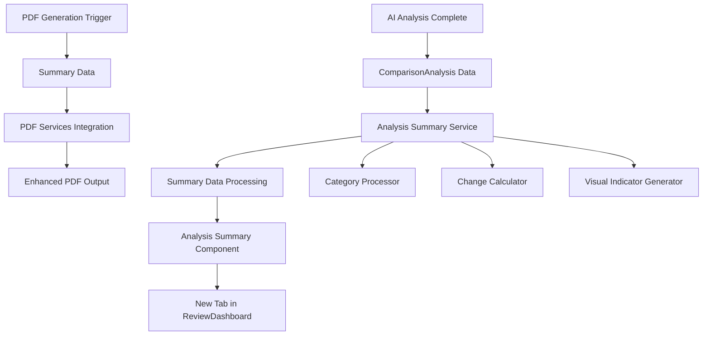

# Analysis Summary Implementation Plan

## Overview

This document outlines the comprehensive implementation plan for the Analysis Summary feature that provides detailed breakdowns of all pricing changes and modifications when AI analysis is completed and PDF generation is triggered.

## Requirements Summary

- **Display Location**: New "Analysis Summary" tab in ReviewDashboard
- **Integration Scope**: All existing PDF services (basic, improved, enhanced, premium)
- **Data Source**: Existing ComparisonAnalysis data structure
- **Visual Features**: Color-coded indicators, percentage calculations, category grouping
- **Content**: Line-by-line comparisons, category subtotals, grand total summary

## Architecture Overview



## Data Structure Design

### Enhanced Summary Data Types

```typescript
// New types to extend existing ComparisonAnalysis
export interface AnalysisSummaryData {
  categoryBreakdown: CategorySummary[];
  changesByType: ChangeTypeSummary;
  grandTotalSummary: GrandTotalSummary;
  visualIndicators: VisualIndicatorConfig;
}

export interface CategorySummary {
  category: CostCategory;
  categoryName: string;
  items: SummaryLineItem[];
  subtotal: CategorySubtotal;
}

export interface SummaryLineItem {
  id: string;
  description: string;
  changeType: 'increase' | 'decrease' | 'new' | 'removed' | 'unchanged';
  originalAmount: number | null;
  supplementAmount: number | null;
  dollarChange: number;
  percentageChange: number | null;
  visualIndicator: VisualIndicator;
}

export interface CategorySubtotal {
  totalIncrease: number;
  totalDecrease: number;
  netChange: number;
  percentageChange: number | null;
  itemCount: number;
}

export interface ChangeTypeSummary {
  increases: { count: number; totalAmount: number };
  decreases: { count: number; totalAmount: number };
  additions: { count: number; totalAmount: number };
  removals: { count: number; totalAmount: number };
}

export interface GrandTotalSummary {
  originalTotal: number;
  supplementTotal: number;
  netChange: number;
  percentageChange: number;
  breakdown: ChangeTypeSummary;
}

export interface VisualIndicator {
  color: string;
  backgroundColor: string;
  icon: string;
  label: string;
}
```

## Component Architecture

### 1. Analysis Summary Service

**File**: `services/analysisSummaryService.ts`

```typescript
export class AnalysisSummaryService {
  /**
   * Processes ComparisonAnalysis data into structured summary format
   */
  generateSummaryData(analysis: ComparisonAnalysis): AnalysisSummaryData;
  
  /**
   * Calculates category-specific breakdowns
   */
  private processCategoryBreakdown(analysis: ComparisonAnalysis): CategorySummary[];
  
  /**
   * Calculates change type summaries
   */
  private calculateChangesByType(analysis: ComparisonAnalysis): ChangeTypeSummary;
  
  /**
   * Generates grand total summary with all aggregations
   */
  private generateGrandTotalSummary(analysis: ComparisonAnalysis): GrandTotalSummary;
  
  /**
   * Determines visual indicators based on change type and magnitude
   */
  private getVisualIndicator(changeType: string, amount: number): VisualIndicator;
}
```

### 2. Analysis Summary Component

**File**: `components/AnalysisSummary.tsx`

```typescript
interface AnalysisSummaryProps {
  analysis: ComparisonAnalysis;
  onItemSelect?: (item: SummaryLineItem) => void;
  showDetailedView?: boolean;
}

export const AnalysisSummary: React.FC<AnalysisSummaryProps> = ({
  analysis,
  onItemSelect,
  showDetailedView = true
}) => {
  // Component implementation with sections:
  // - Executive Summary Cards
  // - Category Breakdown Tables
  // - Change Type Distribution
  // - Grand Total Summary
  // - Visual Indicators Legend
};
```

### 3. Updated ReviewDashboard

**File**: `components/ReviewDashboard.tsx` (modifications)

```typescript
// Add new tab state
const [activeTab, setActiveTab] = useState<'overview' | 'comparison' | 'statistics' | 'summary'>('overview');

// Add Analysis Summary tab
<button
  onClick={() => setActiveTab('summary')}
  className={getTabButtonClass('summary')}
  disabled={!comparisonAnalysis}
>
  Analysis Summary
  {comparisonAnalysis && (
    <span className="ml-2 bg-purple-100 text-purple-800 text-xs px-2 py-1 rounded-full">
      {getTotalChangesCount(comparisonAnalysis)}
    </span>
  )}
</button>

// Add tab content
{activeTab === 'summary' && comparisonAnalysis && (
  <AnalysisSummary
    analysis={comparisonAnalysis}
    onItemSelect={(item) => console.log('Selected item:', item)}
    showDetailedView={true}
  />
)}
```

## Visual Design Specifications

### Color Coding System

```typescript
export const CHANGE_TYPE_COLORS = {
  increase: {
    color: '#dc2626', // red-600
    backgroundColor: '#fef2f2', // red-50
    borderColor: '#fecaca', // red-200
    icon: '↗️',
    label: 'Price Increase'
  },
  decrease: {
    color: '#16a34a', // green-600
    backgroundColor: '#f0fdf4', // green-50
    borderColor: '#bbf7d0', // green-200
    icon: '↘️',
    label: 'Price Decrease'
  },
  new: {
    color: '#2563eb', // blue-600
    backgroundColor: '#eff6ff', // blue-50
    borderColor: '#bfdbfe', // blue-200
    icon: '➕',
    label: 'New Item'
  },
  removed: {
    color: '#6b7280', // gray-500
    backgroundColor: '#f9fafb', // gray-50
    borderColor: '#e5e7eb', // gray-200
    icon: '➖',
    label: 'Removed Item'
  },
  unchanged: {
    color: '#6b7280', // gray-500
    backgroundColor: '#ffffff', // white
    borderColor: '#e5e7eb', // gray-200
    icon: '➡️',
    label: 'No Change'
  }
};
```

### Component Layout Structure

```
┌─────────────────────────────────────────────────────────────┐
│                    Analysis Summary Tab                      │
├─────────────────────────────────────────────────────────────┤
│  Executive Summary Cards                                    │
│  ┌─────────────┐ ┌─────────────┐ ┌─────────────┐          │
│  │ Total Change│ │ Items Added │ │ Items Removed│          │
│  │   +$3,069   │ │     15      │ │      0       │          │
│  └─────────────┘ └─────────────┘ └─────────────┘          │
├─────────────────────────────────────────────────────────────┤
│  Category Breakdown                                         │
│  ┌─ LABOR ──────────────────────────────────────────────┐  │
│  │ ↗️ Rpr RT Quarter panel: $298.30 → $1,108.80 (+271%) │  │
│  │ ↗️ Rpr RT Outer panel: $176.00 → $684.00 (+289%)     │  │
│  │ Subtotal: +$1,318.50                                  │  │
│  └───────────────────────────────────────────────────────┘  │
│  ┌─ PARTS ─────────────────────────────────────────────┐   │
│  │ ➕ Repl RT Quarter panel protector: +$44.54          │   │
│  │ ➕ Repl RT/Rear Wheel cover: +$105.94                │   │
│  │ Subtotal: +$150.48                                   │   │
│  └───────────────────────────────────────────────────────┘  │
├─────────────────────────────────────────────────────────────┤
│  Grand Total Summary                                        │
│  Original Total: $1,215.24                                 │
│  Supplement Total: $4,284.42                               │
│  Net Change: +$3,069.18 (+252.6%)                         │
└─────────────────────────────────────────────────────────────┘
```

## PDF Integration Plan

### 1. Enhanced PDF Service Updates

**All PDF services will be updated to include the Analysis Summary section:**

- `services/pdfService.ts` - Basic PDF service
- `services/improvedPdfService.ts` - Improved PDF service  
- `services/enhancedPdfService.ts` - Enhanced PDF service
- `services/premiumPdfService.ts` - Premium PDF service

### 2. PDF Section Structure

```typescript
// New PDF section generation method
private generateAnalysisSummarySection(
  doc: jsPDF,
  summaryData: AnalysisSummaryData,
  startY: number
): number {
  // 1. Executive Summary Cards
  // 2. Category Breakdown Tables
  // 3. Line-by-line Change Details
  // 4. Grand Total Summary
  // 5. Visual Legend
}
```

### 3. PDF Color Coding Implementation

```typescript
// PDF color mapping for different change types
const PDF_COLORS = {
  increase: { fill: [254, 226, 226], text: [220, 38, 38] }, // Light red bg, dark red text
  decrease: { fill: [220, 252, 231], text: [22, 163, 74] }, // Light green bg, dark green text
  new: { fill: [219, 234, 254], text: [37, 99, 235] },      // Light blue bg, dark blue text
  removed: { fill: [249, 250, 251], text: [107, 114, 128] } // Light gray bg, gray text
};
```

## Implementation Steps

### Phase 1: Data Processing Foundation
1. **Create Analysis Summary Service** (`services/analysisSummaryService.ts`)
   - Implement data transformation logic
   - Add category processing methods
   - Create change calculation utilities
   - Add visual indicator generation

2. **Extend Type Definitions** (`types.ts`)
   - Add new summary-specific interfaces
   - Extend existing types as needed
   - Add color and visual indicator types

### Phase 2: UI Component Development
3. **Create Analysis Summary Component** (`components/AnalysisSummary.tsx`)
   - Executive summary cards section
   - Category breakdown tables
   - Line-by-line change details
   - Grand total summary section
   - Responsive design implementation

4. **Update ReviewDashboard** (`components/ReviewDashboard.tsx`)
   - Add new "Analysis Summary" tab
   - Integrate summary component
   - Add tab state management
   - Update navigation logic

### Phase 3: PDF Integration
5. **Update All PDF Services**
   - Add summary section generation methods
   - Implement color-coded PDF output
   - Add proper page break handling
   - Ensure consistent formatting across services

6. **PDF Formatting Enhancements**
   - Color-coded table rows
   - Visual indicators in PDF
   - Proper section spacing
   - Page overflow handling

### Phase 4: Testing and Refinement
7. **Component Testing**
   - Unit tests for summary service
   - Component rendering tests
   - Integration tests with ReviewDashboard
   - PDF generation tests

8. **Visual and UX Testing**
   - Color accessibility testing
   - Responsive design validation
   - PDF output quality verification
   - Cross-browser compatibility

## Technical Considerations

### Performance Optimization
- **Memoization**: Use React.useMemo for expensive calculations
- **Lazy Loading**: Load summary data only when tab is accessed
- **Efficient Rendering**: Virtualize large item lists if needed

### Error Handling
- **Data Validation**: Validate ComparisonAnalysis data structure
- **Fallback UI**: Show meaningful errors when data is incomplete
- **PDF Generation**: Handle PDF generation failures gracefully

### Accessibility
- **Color Contrast**: Ensure WCAG AA compliance for all color combinations
- **Screen Readers**: Add proper ARIA labels and descriptions
- **Keyboard Navigation**: Support full keyboard navigation

### Browser Compatibility
- **PDF Generation**: Test across different browsers
- **CSS Grid/Flexbox**: Ensure layout compatibility
- **Color Support**: Verify color rendering consistency

## Success Metrics

### Functional Requirements
- ✅ Display detailed line-by-line price comparisons
- ✅ Show exact dollar amounts for increases/decreases
- ✅ Identify newly added parts with values
- ✅ Highlight removed parts with previous costs
- ✅ Calculate category subtotals
- ✅ Generate grand total summary
- ✅ Implement color coding system
- ✅ Include percentage change calculations
- ✅ Integrate into all PDF services

### User Experience Requirements
- ✅ Prominently display before PDF generation
- ✅ Include in generated PDF documents
- ✅ Responsive design for all screen sizes
- ✅ Intuitive color coding and visual indicators
- ✅ Clear category organization
- ✅ Accessible design for all users

## Future Enhancements

### Phase 2 Features (Future Scope)
- **Interactive Filtering**: Filter by change type or category
- **Export Options**: Export summary as separate CSV/Excel
- **Drill-down Details**: Click items for detailed change history
- **Comparison Views**: Side-by-side before/after views
- **Custom Thresholds**: User-configurable significance thresholds

### Advanced Analytics
- **Trend Analysis**: Historical change pattern analysis
- **Benchmark Comparisons**: Industry standard comparisons
- **Predictive Insights**: ML-based change predictions
- **Risk Scoring**: Enhanced risk assessment based on changes

## Conclusion

This implementation plan provides a comprehensive roadmap for developing the Analysis Summary feature. The modular architecture ensures maintainability while the phased approach allows for iterative development and testing. The integration with all existing PDF services ensures consistency across the application while the new tab-based UI provides an intuitive user experience.

The color-coded visual system and detailed breakdown structure will significantly enhance the user's ability to understand and analyze pricing changes, making the fraud detection process more transparent and actionable.