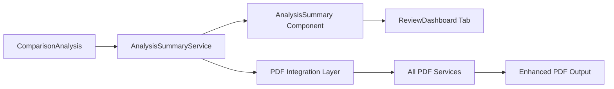

# Analysis Summary Technical Specification

## Executive Summary

This document provides detailed technical specifications for implementing the Analysis Summary feature in the SupplementGuard application. The feature will display comprehensive pricing change breakdowns in a new tab and integrate seamlessly into all existing PDF generation services.

## System Integration Points

### Current Architecture Analysis

Based on the existing codebase analysis:

1. **Data Flow**: `App.tsx` → `ReviewDashboard.tsx` → `ComparisonEngine` → `ComparisonAnalysis`
2. **PDF Services**: 4 existing services (basic, improved, enhanced, premium)
3. **UI Structure**: Tab-based interface in `ReviewDashboard.tsx`
4. **Data Types**: Comprehensive type system in `types.ts`

### Integration Strategy



## Detailed Implementation Specifications

### 1. Type System Extensions

**File**: `types.ts` (additions)

```typescript
// Analysis Summary specific types
export interface AnalysisSummaryData {
  categoryBreakdown: CategorySummary[];
  changesByType: ChangeTypeSummary;
  grandTotalSummary: GrandTotalSummary;
  visualIndicators: VisualIndicatorConfig;
  metadata: SummaryMetadata;
}

export interface CategorySummary {
  category: CostCategory;
  categoryName: string;
  categoryDisplayName: string;
  items: SummaryLineItem[];
  subtotal: CategorySubtotal;
  hasChanges: boolean;
}

export interface SummaryLineItem {
  id: string;
  description: string;
  category: CostCategory;
  changeType: ChangeType;
  originalAmount: number | null;
  supplementAmount: number | null;
  dollarChange: number;
  percentageChange: number | null;
  visualIndicator: VisualIndicator;
  significance: 'low' | 'medium' | 'high' | 'critical';
  isSignificant: boolean;
}

export interface CategorySubtotal {
  originalTotal: number;
  supplementTotal: number;
  totalIncrease: number;
  totalDecrease: number;
  netChange: number;
  percentageChange: number | null;
  itemCount: number;
  significantItemCount: number;
}

export interface ChangeTypeSummary {
  increases: ChangeTypeDetail;
  decreases: ChangeTypeDetail;
  additions: ChangeTypeDetail;
  removals: ChangeTypeDetail;
  unchanged: ChangeTypeDetail;
}

export interface ChangeTypeDetail {
  count: number;
  totalAmount: number;
  averageAmount: number;
  percentageOfTotal: number;
  items: string[]; // Item IDs
}

export interface GrandTotalSummary {
  originalTotal: number;
  supplementTotal: number;
  netChange: number;
  percentageChange: number;
  breakdown: ChangeTypeSummary;
  riskIndicators: RiskIndicator[];
}

export interface VisualIndicator {
  color: string;
  backgroundColor: string;
  borderColor: string;
  icon: string;
  label: string;
  cssClass: string;
}

export interface VisualIndicatorConfig {
  colorScheme: 'default' | 'colorblind' | 'high-contrast';
  showIcons: boolean;
  showLabels: boolean;
}

export interface SummaryMetadata {
  generatedAt: Date;
  processingTime: number;
  dataQualityScore: number;
  completenessScore: number;
  version: string;
}

export interface RiskIndicator {
  type: 'high_variance' | 'scope_creep' | 'pricing_anomaly' | 'calculation_error';
  severity: 'low' | 'medium' | 'high' | 'critical';
  description: string;
  affectedItems: string[];
  recommendedAction: string;
}

export type ChangeType = 'increase' | 'decrease' | 'new' | 'removed' | 'unchanged';
```

### 2. Analysis Summary Service Implementation

**File**: `services/analysisSummaryService.ts`

```typescript
import { 
  ComparisonAnalysis, 
  AnalysisSummaryData, 
  CategorySummary, 
  SummaryLineItem,
  ChangeType,
  VisualIndicator,
  CostCategory,
  VarianceType
} from '../types';

export class AnalysisSummaryService {
  private readonly SIGNIFICANCE_THRESHOLD = 10; // 10% change threshold
  private readonly CRITICAL_THRESHOLD = 50; // 50% change threshold

  /**
   * Main method to generate comprehensive summary data
   */
  generateSummaryData(analysis: ComparisonAnalysis): AnalysisSummaryData {
    const startTime = Date.now();
    
    try {
      // Process category breakdowns
      const categoryBreakdown = this.processCategoryBreakdown(analysis);
      
      // Calculate change type summaries
      const changesByType = this.calculateChangesByType(analysis);
      
      // Generate grand total summary
      const grandTotalSummary = this.generateGrandTotalSummary(analysis, changesByType);
      
      // Configure visual indicators
      const visualIndicators = this.getVisualIndicatorConfig();
      
      // Generate metadata
      const metadata = {
        generatedAt: new Date(),
        processingTime: Date.now() - startTime,
        dataQualityScore: analysis.statistics.dataQuality.accuracy,
        completenessScore: analysis.statistics.dataQuality.completeness,
        version: '1.0.0'
      };

      return {
        categoryBreakdown,
        changesByType,
        grandTotalSummary,
        visualIndicators,
        metadata
      };
    } catch (error) {
      throw new Error(`Failed to generate analysis summary: ${error.message}`);
    }
  }

  /**
   * Processes category-specific breakdowns with detailed line items
   */
  private processCategoryBreakdown(analysis: ComparisonAnalysis): CategorySummary[] {
    const categories = Object.values(CostCategory);
    const categoryBreakdowns: CategorySummary[] = [];

    for (const category of categories) {
      const categoryItems = this.getCategoryItems(analysis, category);
      
      if (categoryItems.length === 0) continue;

      const subtotal = this.calculateCategorySubtotal(categoryItems);
      
      categoryBreakdowns.push({
        category,
        categoryName: category,
        categoryDisplayName: this.getCategoryDisplayName(category),
        items: categoryItems,
        subtotal,
        hasChanges: subtotal.netChange !== 0
      });
    }

    // Sort by absolute net change (highest impact first)
    return categoryBreakdowns.sort((a, b) => 
      Math.abs(b.subtotal.netChange) - Math.abs(a.subtotal.netChange)
    );
  }

  /**
   * Extracts and processes items for a specific category
   */
  private getCategoryItems(analysis: ComparisonAnalysis, category: CostCategory): SummaryLineItem[] {
    const items: SummaryLineItem[] = [];

    // Process matched items (changed items)
    for (const match of analysis.reconciliation.matchedItems) {
      if (match.supplement.category === category) {
        const item = this.createSummaryLineItem(
          match.supplement,
          match.original.total,
          match.supplement.total,
          this.determineChangeType(match.original.total, match.supplement.total)
        );
        items.push(item);
      }
    }

    // Process new items
    for (const newItem of analysis.reconciliation.newSupplementItems) {
      if (newItem.category === category) {
        const item = this.createSummaryLineItem(
          newItem,
          null,
          newItem.total,
          'new'
        );
        items.push(item);
      }
    }

    // Process removed items
    for (const removedItem of analysis.reconciliation.unmatchedOriginalItems) {
      if (removedItem.category === category) {
        const item = this.createSummaryLineItem(
          removedItem,
          removedItem.total,
          null,
          'removed'
        );
        items.push(item);
      }
    }

    // Sort by absolute dollar change (highest impact first)
    return items.sort((a, b) => Math.abs(b.dollarChange) - Math.abs(a.dollarChange));
  }

  /**
   * Creates a standardized summary line item
   */
  private createSummaryLineItem(
    item: any,
    originalAmount: number | null,
    supplementAmount: number | null,
    changeType: ChangeType
  ): SummaryLineItem {
    const dollarChange = this.calculateDollarChange(originalAmount, supplementAmount);
    const percentageChange = this.calculatePercentageChange(originalAmount, supplementAmount);
    const significance = this.determineSignificance(percentageChange, Math.abs(dollarChange));
    
    return {
      id: item.id,
      description: item.description,
      category: item.category,
      changeType,
      originalAmount,
      supplementAmount,
      dollarChange,
      percentageChange,
      visualIndicator: this.getVisualIndicator(changeType, dollarChange),
      significance,
      isSignificant: significance === 'high' || significance === 'critical'
    };
  }

  /**
   * Calculates dollar change between original and supplement amounts
   */
  private calculateDollarChange(original: number | null, supplement: number | null): number {
    if (original === null && supplement !== null) return supplement;
    if (original !== null && supplement === null) return -original;
    if (original === null && supplement === null) return 0;
    return supplement! - original!;
  }

  /**
   * Calculates percentage change with proper null handling
   */
  private calculatePercentageChange(original: number | null, supplement: number | null): number | null {
    if (original === null || original === 0) return null;
    if (supplement === null) return -100;
    return ((supplement - original) / original) * 100;
  }

  /**
   * Determines change type based on amounts
   */
  private determineChangeType(original: number, supplement: number): ChangeType {
    if (supplement > original) return 'increase';
    if (supplement < original) return 'decrease';
    return 'unchanged';
  }

  /**
   * Determines significance level based on percentage and dollar amount
   */
  private determineSignificance(percentageChange: number | null, dollarAmount: number): 'low' | 'medium' | 'high' | 'critical' {
    const absPercentage = Math.abs(percentageChange || 0);
    const absDollar = Math.abs(dollarAmount);

    if (absPercentage >= this.CRITICAL_THRESHOLD || absDollar >= 1000) return 'critical';
    if (absPercentage >= this.SIGNIFICANCE_THRESHOLD || absDollar >= 500) return 'high';
    if (absPercentage >= 5 || absDollar >= 100) return 'medium';
    return 'low';
  }

  /**
   * Calculates category subtotals
   */
  private calculateCategorySubtotal(items: SummaryLineItem[]): CategorySubtotal {
    const originalTotal = items.reduce((sum, item) => sum + (item.originalAmount || 0), 0);
    const supplementTotal = items.reduce((sum, item) => sum + (item.supplementAmount || 0), 0);
    const totalIncrease = items.filter(item => item.dollarChange > 0).reduce((sum, item) => sum + item.dollarChange, 0);
    const totalDecrease = Math.abs(items.filter(item => item.dollarChange < 0).reduce((sum, item) => sum + item.dollarChange, 0));
    const netChange = supplementTotal - originalTotal;
    const percentageChange = originalTotal > 0 ? (netChange / originalTotal) * 100 : null;
    const significantItemCount = items.filter(item => item.isSignificant).length;

    return {
      originalTotal,
      supplementTotal,
      totalIncrease,
      totalDecrease,
      netChange,
      percentageChange,
      itemCount: items.length,
      significantItemCount
    };
  }

  /**
   * Gets visual indicator configuration for change types
   */
  private getVisualIndicator(changeType: ChangeType, amount: number): VisualIndicator {
    const indicators = {
      increase: {
        color: '#dc2626',
        backgroundColor: '#fef2f2',
        borderColor: '#fecaca',
        icon: '↗️',
        label: 'Price Increase',
        cssClass: 'change-increase'
      },
      decrease: {
        color: '#16a34a',
        backgroundColor: '#f0fdf4',
        borderColor: '#bbf7d0',
        icon: '↘️',
        label: 'Price Decrease',
        cssClass: 'change-decrease'
      },
      new: {
        color: '#2563eb',
        backgroundColor: '#eff6ff',
        borderColor: '#bfdbfe',
        icon: '➕',
        label: 'New Item',
        cssClass: 'change-new'
      },
      removed: {
        color: '#6b7280',
        backgroundColor: '#f9fafb',
        borderColor: '#e5e7eb',
        icon: '➖',
        label: 'Removed Item',
        cssClass: 'change-removed'
      },
      unchanged: {
        color: '#6b7280',
        backgroundColor: '#ffffff',
        borderColor: '#e5e7eb',
        icon: '➡️',
        label: 'No Change',
        cssClass: 'change-unchanged'
      }
    };

    return indicators[changeType];
  }

  /**
   * Gets display-friendly category names
   */
  private getCategoryDisplayName(category: CostCategory): string {
    const displayNames = {
      [CostCategory.LABOR]: 'Labor & Services',
      [CostCategory.PARTS]: 'Parts & Components',
      [CostCategory.MATERIALS]: 'Materials & Supplies',
      [CostCategory.EQUIPMENT]: 'Equipment & Tools',
      [CostCategory.OVERHEAD]: 'Overhead & Fees',
      [CostCategory.OTHER]: 'Other Charges'
    };
    return displayNames[category] || category;
  }

  /**
   * Calculates change type summaries across all categories
   */
  private calculateChangesByType(analysis: ComparisonAnalysis): ChangeTypeSummary {
    // Implementation for calculating comprehensive change type statistics
    // This would aggregate all changes by type across categories
    // ... (detailed implementation)
  }

  /**
   * Generates grand total summary with risk indicators
   */
  private generateGrandTotalSummary(analysis: ComparisonAnalysis, changesByType: ChangeTypeSummary): GrandTotalSummary {
    // Implementation for grand total calculations and risk assessment
    // ... (detailed implementation)
  }

  /**
   * Gets visual indicator configuration
   */
  private getVisualIndicatorConfig(): VisualIndicatorConfig {
    return {
      colorScheme: 'default',
      showIcons: true,
      showLabels: true
    };
  }
}

// Export singleton instance
export const analysisSummaryService = new AnalysisSummaryService();
```

### 3. Analysis Summary Component Implementation

**File**: `components/AnalysisSummary.tsx`

```typescript
import React, { useMemo, useState } from 'react';
import { ComparisonAnalysis, AnalysisSummaryData, SummaryLineItem, CategorySummary } from '../types';
import { analysisSummaryService } from '../services/analysisSummaryService';
import { formatCurrency, formatPercentage } from '../utils/formatters';

interface AnalysisSummaryProps {
  analysis: ComparisonAnalysis;
  onItemSelect?: (item: SummaryLineItem) => void;
  showDetailedView?: boolean;
}

export const AnalysisSummary: React.FC<AnalysisSummaryProps> = ({
  analysis,
  onItemSelect,
  showDetailedView = true
}) => {
  const [expandedCategories, setExpandedCategories] = useState<Set<string>>(new Set());
  const [filterType, setFilterType] = useState<'all' | 'significant' | 'increases' | 'decreases'>('all');

  // Generate summary data with memoization for performance
  const summaryData: AnalysisSummaryData = useMemo(() => {
    return analysisSummaryService.generateSummaryData(analysis);
  }, [analysis]);

  // Filter categories based on selected filter
  const filteredCategories = useMemo(() => {
    return summaryData.categoryBreakdown.filter(category => {
      if (filterType === 'all') return category.hasChanges;
      if (filterType === 'significant') return category.subtotal.significantItemCount > 0;
      if (filterType === 'increases') return category.subtotal.netChange > 0;
      if (filterType === 'decreases') return category.subtotal.netChange < 0;
      return true;
    });
  }, [summaryData.categoryBreakdown, filterType]);

  const toggleCategoryExpansion = (categoryName: string) => {
    const newExpanded = new Set(expandedCategories);
    if (newExpanded.has(categoryName)) {
      newExpanded.delete(categoryName);
    } else {
      newExpanded.add(categoryName);
    }
    setExpandedCategories(newExpanded);
  };

  const handleItemClick = (item: SummaryLineItem) => {
    if (onItemSelect) {
      onItemSelect(item);
    }
  };

  return (
    <div className="space-y-6">
      {/* Executive Summary Cards */}
      <div className="grid grid-cols-1 md:grid-cols-2 lg:grid-cols-4 gap-4">
        <SummaryCard
          title="Total Change"
          value={formatCurrency(summaryData.grandTotalSummary.netChange)}
          subtitle={formatPercentage(summaryData.grandTotalSummary.percentageChange)}
          type={summaryData.grandTotalSummary.netChange >= 0 ? 'increase' : 'decrease'}
        />
        <SummaryCard
          title="Items Added"
          value={summaryData.changesByType.additions.count.toString()}
          subtitle={formatCurrency(summaryData.changesByType.additions.totalAmount)}
          type="new"
        />
        <SummaryCard
          title="Items Removed"
          value={summaryData.changesByType.removals.count.toString()}
          subtitle={formatCurrency(summaryData.changesByType.removals.totalAmount)}
          type="removed"
        />
        <SummaryCard
          title="Price Changes"
          value={(summaryData.changesByType.increases.count + summaryData.changesByType.decreases.count).toString()}
          subtitle={`${summaryData.changesByType.increases.count} up, ${summaryData.changesByType.decreases.count} down`}
          type="unchanged"
        />
      </div>

      {/* Filter Controls */}
      <div className="flex flex-wrap gap-2 items-center justify-between">
        <div className="flex gap-2">
          <FilterButton
            active={filterType === 'all'}
            onClick={() => setFilterType('all')}
            label="All Changes"
          />
          <FilterButton
            active={filterType === 'significant'}
            onClick={() => setFilterType('significant')}
            label="Significant Only"
          />
          <FilterButton
            active={filterType === 'increases'}
            onClick={() => setFilterType('increases')}
            label="Increases"
          />
          <FilterButton
            active={filterType === 'decreases'}
            onClick={() => setFilterType('decreases')}
            label="Decreases"
          />
        </div>
        <div className="text-sm text-slate-500">
          {filteredCategories.length} categories with changes
        </div>
      </div>

      {/* Category Breakdown */}
      <div className="space-y-4">
        {filteredCategories.map((category) => (
          <CategoryBreakdownCard
            key={category.category}
            category={category}
            isExpanded={expandedCategories.has(category.category)}
            onToggleExpansion={() => toggleCategoryExpansion(category.category)}
            onItemClick={handleItemClick}
            showDetailedView={showDetailedView}
          />
        ))}
      </div>

      {/* Grand Total Summary */}
      <GrandTotalSummaryCard summary={summaryData.grandTotalSummary} />

      {/* Visual Legend */}
      <VisualLegend indicators={summaryData.visualIndicators} />
    </div>
  );
};

// Supporting components
const SummaryCard: React.FC<{
  title: string;
  value: string;
  subtitle: string;
  type: 'increase' | 'decrease' | 'new' | 'removed' | 'unchanged';
}> = ({ title, value, subtitle, type }) => {
  const getCardStyles = (type: string) => {
    const styles = {
      increase: 'border-red-200 bg-red-50',
      decrease: 'border-green-200 bg-green-50',
      new: 'border-blue-200 bg-blue-50',
      removed: 'border-gray-200 bg-gray-50',
      unchanged: 'border-slate-200 bg-slate-50'
    };
    return styles[type] || styles.unchanged;
  };

  return (
    <div className={`rounded-lg border p-4 ${getCardStyles(type)}`}>
      <div className="text-sm font-medium text-slate-600">{title}</div>
      <div className="text-2xl font-bold text-slate-900 mt-1">{value}</div>
      <div className="text-sm text-slate-500 mt-1">{subtitle}</div>
    </div>
  );
};

const FilterButton: React.FC<{
  active: boolean;
  onClick: () => void;
  label: string;
}> = ({ active, onClick, label }) => (
  <button
    onClick={onClick}
    className={`px-3 py-1 text-sm rounded-md transition-colors ${
      active
        ? 'bg-blue-600 text-white'
        : 'bg-slate-100 text-slate-600 hover:bg-slate-200'
    }`}
  >
    {label}
  </button>
);

const CategoryBreakdownCard: React.FC<{
  category: CategorySummary;
  isExpanded: boolean;
  onToggleExpansion: () => void;
  onItemClick: (item: SummaryLineItem) => void;
  showDetailedView: boolean;
}> = ({ category, isExpanded, onToggleExpansion, onItemClick, showDetailedView }) => {
  return (
    <div className="bg-white rounded-lg border border-slate-200 overflow-hidden">
      {/* Category Header */}
      <div
        className="p-4 cursor-pointer hover:bg-slate-50 transition-colors"
        onClick={onToggleExpansion}
      >
        <div className="flex items-center justify-between">
          <div className="flex items-center gap-3">
            <div className={`w-3 h-3 rounded-full ${getCategoryColor(category.category)}`} />
            <h3 className="font-semibold text-slate-800">{category.categoryDisplayName}</h3>
            <span className="text-sm text-slate-500">({category.subtotal.itemCount} items)</span>
          </div>
          <div className="flex items-center gap-4">
            <div className="text-right">
              <div className={`font-semibold ${category.subtotal.netChange >= 0 ? 'text-red-600' : 'text-green-600'}`}>
                {category.subtotal.netChange >= 0 ? '+' : ''}{formatCurrency(category.subtotal.netChange)}
              </div>
              {category.subtotal.percentageChange !== null && (
                <div className="text-sm text-slate-500">
                  {formatPercentage(category.subtotal.percentageChange)}
                </div>
              )}
            </div>
            <div className={`transform transition-transform ${isExpanded ? 'rotate-180' : ''}`}>
              ▼
            </div>
          </div>
        </div>
      </div>

      {/* Category Items (Expandable) */}
      {isExpanded && (
        <div className="border-t border-slate-200">
          <div className="p-4 space-y-2">
            {category.items.map((item) => (
              <LineItemRow
                key={item.id}
                item={item}
                onClick={() => onItemClick(item)}
                showDetailedView={showDetailedView}
              />
            ))}
          </div>
          
          {/* Category Subtotal */}
          <div className="bg-slate-50 p-4 border-t border-slate-200">
            <div className="flex justify-between items-center text-sm">
              <span className="font-medium text-slate-700">Category Subtotal:</span>
              <div className="flex gap-4">
                {category.subtotal.totalIncrease > 0 && (
                  <span className="text-red-600">+{formatCurrency(category.subtotal.totalIncrease)}</span>
                )}
                {category.subtotal.totalDecrease > 0 && (
                  <span className="text-green-600">-{formatCurrency(category.subtotal.totalDecrease)}</span>
                )}
                <span className={`font-semibold ${category.subtotal.netChange >= 0 ? 'text-red-600' : 'text-green-600'}`}>
                  Net: {category.subtotal.netChange >= 0 ? '+' : ''}{formatCurrency(category.subtotal.netChange)}
                </span>
              </div>
            </div>
          </div>
        </div>
      )}
    </div>
  );
};

const LineItemRow: React.FC<{
  item: SummaryLineItem;
  onClick: () => void;
  showDetailedView: boolean;
}> = ({ item, onClick, showDetailedView }) => {
  return (
    <div
      className={`p-3 rounded-md border cursor-pointer hover:shadow-sm transition-all ${
        item.visualIndicator.backgroundColor
      } border-${item.visualIndicator.borderColor}`}
      onClick={onClick}
    >
      <div className="flex items-center justify-between">
        <div className="flex items-center gap-3 flex-1 min-w-0">
          <span className="text-lg">{item.visualIndicator.icon}</span>
          <div className="flex-1 min-w-0">
            <div className="font-medium text-slate-800 truncate">{item.description}</div>
            {showDetailedView && (
              <div className="text-sm text-slate-500 mt-1">
                {item.originalAmount !== null && item.supplementAmount !== null && (
                  <>
                    {formatCurrency(item.originalAmount)} → {formatCurrency(item.supplementAmount)}
                  </>
                )}
                {item.originalAmount === null && item.supplementAmount !== null && (
                  <>New: {formatCurrency(item.supplementAmount)}</>
                )}
                {item.originalAmount !== null && item.supplementAmount === null && (
                  <>Removed: {formatCurrency(item.originalAmount)}</>
                )}
              </div>
            )}
          </div>
        </div>
        <div className="text-right">
          <div className={`font-semibold ${item.dollarChange >= 0 ? 'text-red-600' : 'text-green-600'}`}>
            {item.dollarChange >= 0 ? '+' : ''}{formatCurrency(item.dollarChange)}
          </div>
          {item.percentageChange !== null && (
            <div className="text-sm text-slate-500">
              {formatPercentage(item.percentageChange)}
            </div>
          )}
        </div>
      </div>
    </div>
  );
};

const GrandTotalSummaryCard: React.FC<{
  summary: any; // GrandTotalSummary type
}> = ({ summary }) => {
  return (
    <div className="bg-slate-900 text-white rounded-lg p-6">
      <h3 className="text-lg font-semibold mb-4">Grand Total Summary</h3>
      <div className="grid grid-cols-1 md:grid-cols-3 gap-4">
        <div>
          <div className="text-sm text-slate-300">Original Total</div>
          <div className="text-xl font-bold">{formatCurrency(summary.originalTotal)}</div>
        </div>
        <div>
          <div className="text-sm text-slate-300">Supplement Total</div>
          <div className="text-xl font-bold">{formatCurrency(summary.supplementTotal)}</div>
        </div>
        <div>
          <div className="text-sm text-slate-300">Net Change</div>
          <div className={`text-xl font-bold ${summary.netChange >= 0 ? 'text-red-400' : 'text-green-400'}`}>
            {summary.netChange >= 0 ? '+' : ''}{formatCurrency(summary.netChange)}
          </div>
          <div className="text-sm text-slate-300">
            ({formatPercentage(summary.percentageChange)})
          </div>
        </div>
      </div>
    </div>
  );
};

const VisualLegend: React.FC<{
  indicators: any; // VisualIndicatorConfig type
}> = ({ indicators }) => {
  const legendItems = [
    { type: 'increase', label: 'Price Increase', icon: '↗️', color: 'text-red-600' },
    { type: 'decrease', label: 'Price Decrease', icon: '↘️', color: 'text-green-600' },
    { type: 'new', label: 'New Item', icon: '➕', color: 'text-blue-600' },
    { type: 'removed', label: 'Removed Item', icon: '➖', color: 'text-gray-600' }
  ];

  return (
    <div className="bg-slate-50 rounded-lg p-4">
      <h4 className="font-medium text-slate-700 mb-3">Legend</h4>
      <div className="grid grid-cols-2 md:grid-cols-4 gap-3">
        {legendItems.map((item) => (
          <div key={item.type} className="flex items-center gap-2">
            <span className="text-lg">{item.icon}</span>
            <span className={`text-sm ${item.color}`}>{item.label}</span>
          </div>
        ))}
      </div>
    </div>
  );
};

// Utility functions
const getCategoryColor = (category: string): string => {
  const colors = {
    labor: 'bg-blue-500',
    parts: 'bg-green-500',
    materials: 'bg-yellow-500',
    equipment: 'bg-purple-500',
    overhead: 'bg-orange-500',
    other: 'bg-gray-500'
  };
  return colors[category] || colors.other;
};

export default AnalysisSummary;
```

### 4. ReviewDashboard Integration

**File**: `components/ReviewDashboard.tsx` (modifications)

```typescript
// Add import
import AnalysisSummary from './AnalysisSummary';

// Update tab state type
const [activeTab, setActiveTab] = useState<'overview' | 'comparison' | 'statistics' | 'summary'>('overview');

// Add helper function for total changes count
const getTotalChangesCount = (analysis: ComparisonAnalysis): number => {
  if (!analysis) return 0;
  return analysis.reconciliation.matchedItems.length + 
         analysis.reconciliation.newSupplementItems.length + 
         analysis.reconciliation.unmatchedOriginalItems.length;
};

// Add new tab button (after statistics tab)
<button
  onClick={() => setActiveTab('summary')}
  className={getTabButtonClass('summary')}
  disabled={!comparisonAnalysis}
>
  Analysis Summary
  {comparisonAnalysis && (
    <span className="ml-2 bg-purple-100 text-purple-800 text-xs px-2 py-1 rounded-full">
      {getTotalChangesCount(comparisonAnalysis)}
    </span>
  )}
</button>

// Add tab content (after statistics tab content)
{activeTab === 'summary' && comparisonAnalysis && (
  <div className="space-y-6">
    <AnalysisSummary
      analysis={comparisonAnalysis}
      onItemSelect={(item) => {
        console.log('Selected item for detailed view:', item);
        // Future: Could open detailed item view or highlight in comparison table
      }}
      showDetailedView={true}
    />
  </div>
)}
```

### 5. PDF Integration Layer

**File**: `services/pdfIntegrationService.ts`

```typescript
import jsPDF from 'jspdf';
import { AnalysisSummaryData, CategorySummary, SummaryLineItem } from '../types';
import { formatCurrency, formatPercentage } from '../utils/formatters';

export class PdfIntegrationService {
  /**
   * Adds Analysis Summary section to any PDF document
   */
  addAnalysisSummarySection(
    doc: jsPDF,
    summaryData: AnalysisSummaryData,
    startY: number,
    pageWidth: number,
    safeZone: number
  ): number {
    let currentY = startY;
    const maxContentWidth = pageWidth - (2 * safeZone);

    // Section header
    currentY = this.addSectionHeader(doc, 'Analysis Summary', currentY, safeZone, maxContentWidth);

    // Executive summary
    currentY = this.addExecutiveSummary(doc, summaryData, currentY, safeZone, maxContentWidth);

    // Category breakdowns
    currentY = this.addCategoryBreakdowns(doc, summaryData.categoryBreakdown, currentY, safeZone, maxContentWidth);

    // Grand total summary
    currentY = this.addGrandTotalSummary(doc, summaryData.grandTotalSummary, currentY, safeZone, maxContentWidth);

    return currentY;
  }

  private addSectionHeader(doc: jsPDF, title: string, y: number, x: number, maxWidth: number): number {
    doc.setFontSize(16);
    doc.setFont(undefined, 'bold');
    doc.setTextColor(51, 51, 51);
    doc.text(title, x, y);
    
    // Add underline
    doc.setDrawColor(200, 200, 200);
    doc.line(x, y + 2, x + maxWidth, y + 2);
    
    return y + 15;
  }

  private addExecutiveSummary(doc: jsPDF, summaryData: AnalysisSummaryData, y: number, x: number, maxWidth: number): number {
    doc.setFontSize(12);
    doc.setFont(undefined, 'bold');
    doc.text('Executive Summary', x, y);
    y += 10;

    // Summary metrics in a grid
    const metrics = [
      ['Total Change:', formatCurrency(summaryData.grandTotalSummary.netChange)],
      ['Items Added:', summaryData.changesByType.additions.count.toString()],
      ['Items Removed:', summaryData.changesByType.removals.count.toString()],
      ['Price Changes:', (summaryData.changesByType.increases.count + summaryData.changesByType.decreases.count).toString()]
    ];

    doc.setFont(undefined, 'normal');
    doc.setFontSize(10);

    metrics.forEach(([label, value], index) => {
      const col = index % 2;
      const row = Math.floor(index / 2);
      const xPos = x + (col * maxWidth / 2);
      const yPos = y + (row * 8);

      doc.setTextColor(102, 102, 102);
      doc.text(label, xPos, yPos);
      doc.setTextColor(51, 51, 51);
      doc.setFont(undefined, 'bold');
      doc.text(value, xPos + 60, yPos);
      doc.setFont(undefined, 'normal');
    });

    return y + 25;
  }

  private addCategoryBreakdowns(doc: jsPDF, categories: CategorySummary[], y: number, x: number, maxWidth: number): number {
    doc.setFontSize(12);
    doc.setFont(undefined, 'bold');
    doc.setTextColor(51, 51, 51);
    doc.text('Category Breakdown', x, y);
    y += 15;

    categories.forEach(category => {
      if (!category.hasChanges) return;

      // Category header
      doc.setFontSize(11);
      doc.setFont(undefined, 'bold');
      doc.setTextColor(51, 51, 51);
      doc.text(`${category.categoryDisplayName} (${category.subtotal.itemCount} items)`, x, y);
      
      // Category net change
      const netChangeColor = category.subtotal.netChange >= 0 ? [220, 38, 38] : [22, 163, 74];
      doc.setTextColor(netChangeColor[0], netChangeColor[1], netChangeColor[2]);
      doc.text(
        `${category.subtotal.netChange >= 0 ? '+' : ''}${formatCurrency(category.subtotal.netChange)}`,
        x + maxWidth - 60,
        y
      );
      y += 10;

      // Top 5 most significant items
      const significantItems = category.items
        .filter(item => item.isSignificant)
        .slice(0, 5);

      doc.setFontSize(9);
      doc.setFont(undefined, 'normal');

      significantItems.forEach(item => {
        // Item description (truncated if needed)
        const description = item.description.length > 50 
          ? item.description.substring(0, 47) + '...' 
          : item.description;
        
        doc.setTextColor(51, 51, 51);
        doc.text(`${item.visualIndicator.icon} ${description}`, x + 5, y);
        
        // Change amount
        const changeColor = item.dollarChange >= 0 ? [220, 38, 38] : [22, 163, 74];
        doc.setTextColor(changeColor[0], changeColor[1], changeColor[2]);
        doc.text(
          `${item.dollarChange >= 0 ? '+' : ''}${formatCurrency(item.dollarChange)}`,
          x + maxWidth - 60,
          y
        );
        
        // Percentage change
        if (item.percentageChange !== null) {
          doc.setTextColor(102, 102, 102);
          doc.text(
            `(${formatPercentage(item.percentageChange)})`,
            x + maxWidth - 25,
            y
          );
        }
        
        y += 6;
      });

      // Category subtotal
      doc.setFontSize(10);
      doc.setFont(undefined, 'bold');
      doc.setTextColor(51, 51, 51);
      doc.text('Subtotal:', x + 10, y);
      doc.setTextColor(netChangeColor[0], netChangeColor[1], netChangeColor[2]);
      doc.text(
        `${category.subtotal.netChange >= 0 ? '+' : ''}${formatCurrency(category.subtotal.netChange)}`,
        x + maxWidth - 60,
        y
      );
      
      y += 15;
    });

    return y;
  }

  private addGrandTotalSummary(doc: jsPDF, grandTotal: any, y: number, x: number, maxWidth: number): number {
    // Add background box
    doc.setFillColor(248, 250, 252);
    doc.rect(x, y - 5, maxWidth, 35, 'F');

    doc.setFontSize(12);
    doc.setFont(undefined, 'bold');
    doc.setTextColor(51, 51, 51);
    doc.text('Grand Total Summary', x + 5, y + 5);
    y += 15;

    // Three-column layout
    const colWidth = maxWidth / 3;
    
    // Original Total
    doc.setFontSize(10);
    doc.setFont(undefined, 'normal');
    doc.setTextColor(102, 102, 102);
    doc.text('Original Total:', x + 5, y);
    doc.setFont(undefined, 'bold');
    doc.setTextColor(51, 51, 51);
    doc.text(formatCurrency(grandTotal.originalTotal), x + 5, y + 6);

    // Supplement Total
    doc.setFont(undefined, 'normal');
    doc.setTextColor(102, 102, 102);
    doc.text('Supplement Total:', x + colWidth + 5, y);
    doc.setFont(undefined, 'bold');
    doc.setTextColor(51, 51, 51);
    doc.text(formatCurrency(grandTotal.supplementTotal), x + colWidth + 5, y + 6);

    // Net Change
    doc.setFont(undefined, 'normal');
    doc.setTextColor(102, 102, 102);
    doc.text('Net Change:', x + (colWidth * 2) + 5, y);
    doc.setFont(undefined, 'bold');
    const netChangeColor = grandTotal.netChange >= 0 ? [220, 38, 38] : [22, 163, 74];
    doc.setTextColor(netChangeColor[0], netChangeColor[1], netChangeColor[2]);
    doc.text(
      `${grandTotal.netChange >= 0 ? '+' : ''}${formatCurrency(grandTotal.netChange)}`,
      x + (colWidth * 2) + 5,
      y + 6
    );
    doc.setFont(undefined, 'normal');
    doc.setTextColor(102, 102, 102);
    doc.text(
      `(${formatPercentage(grandTotal.percentageChange)})`,
      x + (colWidth * 2) + 5,
      y + 12
    );

    return y + 25;
  }
}

// Export singleton instance
export const pdfIntegrationService = new PdfIntegrationService();
```

## Integration with Existing PDF Services

### Update Pattern for All PDF Services

Each existing PDF service needs to be updated with the Analysis Summary section. Here's the pattern:

```typescript
// Add import
import { analysisSummaryService } from '../services/analysisSummaryService';
import { pdfIntegrationService } from '../services/pdfIntegrationService';

// In the main generation method, add after existing sections:
if (comparisonAnalysis) {
  const summaryData = analysisSummaryService.generateSummaryData(comparisonAnalysis);
  currentY = pdfIntegrationService.addAnalysisSummarySection(
    doc,
    summaryData,
    currentY,
    pageWidth,
    safeZone
  );
}
```

## Testing Strategy

### Unit Tests
- `analysisSummaryService.test.ts` - Test data processing logic
- `AnalysisSummary.test.tsx` - Test component rendering
- `pdfIntegrationService.test.ts` - Test PDF generation

### Integration Tests
- Test full workflow from analysis to PDF generation
- Test tab navigation and data flow
- Test responsive design across screen sizes

### Visual Regression Tests
- Screenshot comparisons for UI components
- PDF output visual validation
- Color accessibility testing

## Performance Considerations

### Optimization Strategies
1. **Memoization**: Use React.useMemo for expensive calculations
2. **Lazy Loading**: Load summary data only when tab is accessed
3. **Virtual Scrolling**: For large item lists (if needed)
4. **Debounced Filtering**: For real-time filter updates

### Memory Management
- Proper cleanup of event listeners
- Efficient data structures for large datasets
- PDF generation memory optimization

## Accessibility Compliance

### WCAG 2.1 AA Requirements
- Color contrast ratios ≥ 4.5:1
- Keyboard navigation support
- Screen reader compatibility
- Focus management
- Alternative text for visual indicators

### Implementation Details
- ARIA labels for interactive elements
- Semantic HTML structure
- High contrast mode support
- Reduced motion preferences

This technical specification provides the complete implementation roadmap for the Analysis Summary feature, ensuring seamless integration with the existing SupplementGuard architecture while delivering a comprehensive and user-friendly pricing analysis experience.