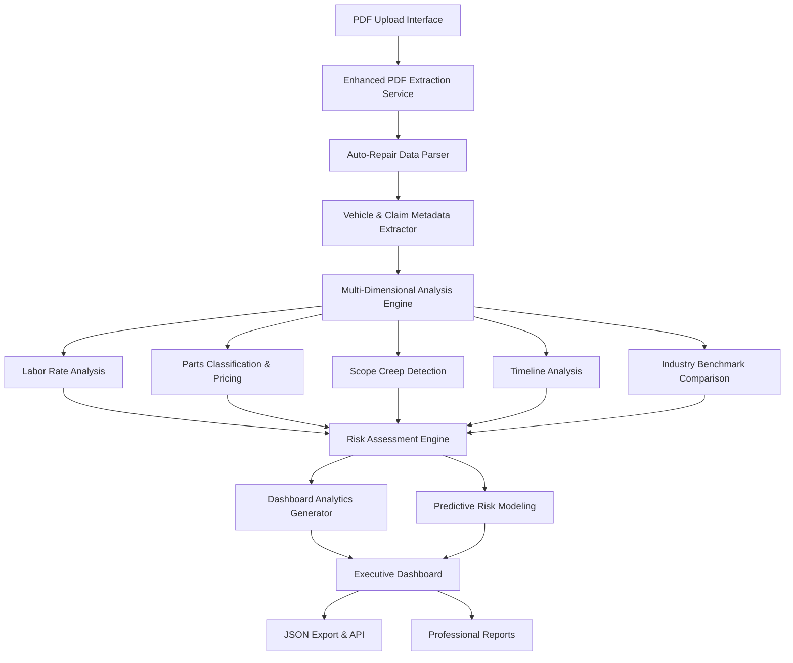

# Auto-Repair Claims Auditor Architecture Specification

## Executive Summary

This document outlines the architectural transformation of SupplementGuard into a specialized auto-repair claims auditor system. The enhanced system will provide comprehensive analysis of auto-repair estimate PDFs, detect cost inflation, scope creep, and potential misuse while generating structured JSON outputs optimized for advanced dashboard visualization and analytics.

## System Architecture Overview

### High-Level Architecture



### Core System Components

#### 1. Reusable Components from Existing System
- **Base Infrastructure**: React + TypeScript + Vite setup
- **PDF Processing Foundation**: File upload and basic PDF handling
- **Statistical Analysis Engine**: [`comparisonEngine.ts`](services/comparisonEngine.ts) - Enhanced for auto-repair specifics
- **Advanced Fraud Detection**: [`advancedFraudDetector.ts`](services/advancedFraudDetector.ts) - Extended with auto-repair patterns
- **Enhanced PDF Export**: [`enhancedPdfService.ts`](services/enhancedPdfService.ts) - Customized for auto-repair reports
- **UI Component Library**: Base components for tables, charts, and dashboards

#### 2. New Auto-Repair Specific Components
- **Auto-Repair PDF Extraction Service**: Specialized OCR and data extraction
- **Vehicle Metadata Parser**: VIN decoding, make/model/year extraction
- **Labor Rate Analysis Engine**: Multi-dimensional labor cost analysis
- **Parts Classification System**: OEM vs aftermarket, supplier analysis
- **Scope Creep Detection**: Impact zone mapping and damage progression analysis
- **Timeline Analysis Engine**: Rental car cost tracking and completion predictions
- **Industry Benchmark Service**: Real-time rate comparison and validation

## Enhanced Data Architecture

### Auto-Repair Specific Type System

```typescript
// Core auto-repair claim data structure
export interface AutoRepairClaimData {
  // Metadata
  claim_metadata: ClaimMetadata;
  
  // Document analysis
  documents: DocumentAnalysis[];
  
  // Enhanced comparison analysis
  changes_analysis: ChangesAnalysis;
  
  // Multi-dimensional risk assessment
  risk_assessment: EnhancedRiskAssessment;
  
  // Dashboard-ready metrics
  dashboard_metrics: DashboardMetrics;
  
  // Professional recommendations
  recommendations: ProfessionalRecommendations;
  
  // Data quality indicators
  data_quality: DataQualityAssessment;
}

// Vehicle and claim metadata
export interface ClaimMetadata {
  claim_number: string;
  vehicle: VehicleInfo;
  point_of_impact: string;
  inspection_location: string;
  shop_info: ShopInfo;
  labor_rate_table: LaborRateTable;
  adjuster_info: AdjusterInfo;
  claim_dates: ClaimDates;
}

export interface VehicleInfo {
  year: number;
  make: string;
  model: string;
  trim?: string;
  vin: string;
  mileage: number;
  engine_size?: string;
  transmission?: string;
  drive_type?: string;
}

export interface LaborRateTable {
  body: number;
  paint: number;
  mechanical: number;
  frame: number;
  sublet: number;
}

// Enhanced financial analysis
export interface DocumentAnalysis {
  document_type: 'original' | 'supplement_1' | 'supplement_2' | 'supplement_3';
  document_date: string;
  total_cost: number;
  parts_cost: number;
  labor_breakdown: LaborBreakdown;
  paint_supplies: number;
  miscellaneous: number;
  sales_tax: number;
  betterment_deduction: number;
  depreciation: number;
  
  // Enhanced line-item analysis
  line_items: AutoRepairLineItem[];
}

export interface LaborBreakdown {
  body: LaborDetail;
  paint: LaborDetail;
  mechanical: LaborDetail;
  frame: LaborDetail;
  sublet: SubletDetail[];
}

export interface LaborDetail {
  hours: number;
  rate: number;
  total: number;
  efficiency_score?: number;
  industry_benchmark?: number;
}

export interface SubletDetail {
  description: string;
  total: number;
  vendor?: string;
  justification?: string;
}

// Enhanced line item with auto-repair specifics
export interface AutoRepairLineItem extends EnhancedInvoiceLineItem {
  // Auto-repair specific fields
  part_number?: string;
  oem_aftermarket: 'OEM' | 'Aftermarket' | 'Recycled' | 'Remanufactured';
  supplier?: string;
  labor_operation?: string;
  labor_hours?: number;
  paint_time?: number;
  impact_zone: ImpactZone;
  damage_severity: DamageSeverity;
  repair_necessity: RepairNecessity;
  
  // Enhanced analysis
  industry_standard_hours?: number;
  rate_comparison: RateComparison;
  scope_justification?: string;
}

export enum ImpactZone {
  PRIMARY = 'primary',
  SECONDARY = 'secondary',
  TERTIARY = 'tertiary',
  UNRELATED = 'unrelated'
}

export enum DamageSeverity {
  MINOR = 'minor',
  MODERATE = 'moderate',
  SEVERE = 'severe',
  TOTAL_LOSS = 'total_loss'
}

export enum RepairNecessity {
  REQUIRED = 'required',
  RECOMMENDED = 'recommended',
  OPTIONAL = 'optional',
  QUESTIONABLE = 'questionable'
}

export interface RateComparison {
  shop_rate: number;
  market_average: number;
  percentile_ranking: number;
  variance_percentage: number;
}
```

### Advanced Analysis Structures

```typescript
// Multi-dimensional scope analysis
export interface ScopeAnalysis {
  unrelated_items: UnrelatedItem[];
  damage_progression: DamageProgression[];
  hidden_damage_legitimacy: 'justified' | 'questionable' | 'suspicious';
  impact_zone_mapping: ImpactZoneMap;
  severity_escalation: SeverityEscalation[];
}

export interface UnrelatedItem {
  item: string;
  zone: ImpactZone;
  distance_from_impact: number;
  likelihood_score: number;
  justification?: string;
}

export interface DamageProgression {
  component: string;
  discovery_date: string;
  plausibility_score: number;
  supporting_evidence?: string[];
}

// Enhanced labor analysis
export interface LaborAnalysis {
  labor_rate_progression: LaborRateProgression[];
  labor_efficiency_flags: LaborEfficiencyFlag[];
  cross_shop_rate_comparison: CrossShopComparison;
  overtime_analysis: OvertimeAnalysis;
}

export interface LaborEfficiencyFlag {
  operation: string;
  hours_claimed: number;
  industry_standard: number;
  variance_pct: number;
  efficiency_rating: 'excellent' | 'good' | 'average' | 'poor' | 'suspicious';
}

// Predictive risk modeling
export interface PredictiveRiskModel {
  likely_final_cost: number;
  probability_additional_supplements: number;
  estimated_completion_date: string;
  cost_escalation_velocity: number;
  risk_trajectory: 'improving' | 'stable' | 'deteriorating';
  confidence_intervals: {
    cost_range: { min: number; max: number; confidence: number };
    timeline_range: { min_days: number; max_days: number; confidence: number };
  };
}

// Dashboard-ready analytics
export interface DashboardMetrics {
  cost_trend_analysis: CostTrendAnalysis;
  efficiency_metrics: EfficiencyMetrics;
  quality_indicators: QualityIndicators;
  comparative_benchmarks: ComparativeBenchmarks;
  kpi_summary: KPISummary;
}

export interface CostTrendAnalysis {
  daily_burn_rate: number;
  projected_total: number;
  variance_from_initial: number;
  cost_velocity: number;
  trend_direction: 'increasing' | 'stable' | 'decreasing';
}

export interface EfficiencyMetrics {
  cost_per_labor_hour: number;
  parts_to_labor_ratio: number;
  cycle_time: number;
  productivity_score: number;
}

export interface QualityIndicators {
  supplement_frequency: number;
  rework_probability: number;
  customer_satisfaction_predictors: number;
  documentation_quality_score: number;
}
```

## Service Architecture

### 1. Enhanced PDF Extraction Service

```typescript
export class AutoRepairPdfExtractionService {
  // Core extraction methods
  async extractClaimMetadata(pdfBuffer: Buffer): Promise<ClaimMetadata>;
  async extractVehicleInfo(pdfBuffer: Buffer): Promise<VehicleInfo>;
  async extractLaborRates(pdfBuffer: Buffer): Promise<LaborRateTable>;
  async extractLineItems(pdfBuffer: Buffer): Promise<AutoRepairLineItem[]>;
  
  // Advanced analysis
  async analyzeDocumentStructure(pdfBuffer: Buffer): Promise<DocumentStructure>;
  async extractTimestamps(pdfBuffer: Buffer): Promise<ClaimDates>;
  async identifyDocumentType(pdfBuffer: Buffer): Promise<DocumentType>;
  
  // Quality assurance
  async validateExtraction(extractedData: any): Promise<ValidationResult>;
  async calculateExtractionConfidence(pdfBuffer: Buffer): Promise<number>;
}
```

### 2. Multi-Dimensional Risk Analysis Engine

```typescript
export class AutoRepairRiskAnalysisEngine {
  // Core risk analysis
  async analyzeLaborRates(laborData: LaborBreakdown): Promise<LaborRiskAnalysis>;
  async analyzePartsOptimization(parts: AutoRepairLineItem[]): Promise<PartsRiskAnalysis>;
  async detectScopeCreep(original: DocumentAnalysis, supplements: DocumentAnalysis[]): Promise<ScopeCreepAnalysis>;
  
  // Predictive modeling
  async generatePredictiveModel(claimData: AutoRepairClaimData): Promise<PredictiveRiskModel>;
  async calculateRiskTrajectory(historicalData: DocumentAnalysis[]): Promise<RiskTrajectory>;
  
  // Industry benchmarking
  async compareToIndustryStandards(claimData: AutoRepairClaimData): Promise<BenchmarkComparison>;
  async validateAgainstRegionalRates(location: string, rates: LaborRateTable): Promise<RegionalValidation>;
}
```

### 3. Dashboard Analytics Generator

```typescript
export class DashboardAnalyticsGenerator {
  // KPI generation
  async generateKPIs(claimData: AutoRepairClaimData): Promise<KPISummary>;
  async calculateTrendAnalysis(documents: DocumentAnalysis[]): Promise<CostTrendAnalysis>;
  async generateEfficiencyMetrics(claimData: AutoRepairClaimData): Promise<EfficiencyMetrics>;
  
  // Visualization data
  async generateChartData(claimData: AutoRepairClaimData): Promise<ChartDataSet[]>;
  async createTimelineVisualization(documents: DocumentAnalysis[]): Promise<TimelineData>;
  async generateHeatmapData(scopeAnalysis: ScopeAnalysis): Promise<HeatmapData>;
}
```

## Implementation Strategy

### Phase 1: Foundation Enhancement (Week 1-2)
1. **Enhanced Type System**: Implement auto-repair specific data structures
2. **PDF Extraction Service**: Build specialized OCR and data extraction for auto-repair estimates
3. **Vehicle Metadata Parser**: Implement VIN decoding and vehicle information extraction
4. **Basic Labor Analysis**: Implement labor rate comparison and efficiency detection

### Phase 2: Advanced Analysis (Week 3-4)
1. **Scope Creep Detection**: Implement impact zone mapping and damage progression analysis
2. **Parts Classification**: Build OEM/aftermarket analysis and supplier tracking
3. **Timeline Analysis**: Implement rental car cost tracking and completion predictions
4. **Risk Assessment Engine**: Enhance existing fraud detection with auto-repair specific patterns

### Phase 3: Dashboard & Analytics (Week 5-6)
1. **Dashboard Components**: Build auto-repair specific UI components
2. **Analytics Generator**: Implement KPI calculation and trend analysis
3. **Predictive Modeling**: Build cost escalation and timeline prediction models
4. **Industry Benchmarking**: Implement real-time rate comparison system

### Phase 4: Integration & Optimization (Week 7-8)
1. **API Integration**: Implement comprehensive JSON output specification
2. **Performance Optimization**: Optimize for large datasets and complex analysis
3. **Quality Assurance**: Implement comprehensive testing and validation
4. **Documentation**: Complete technical documentation and user guides

## Technical Requirements

### Dependencies
```json
{
  "new_dependencies": {
    "pdf-parse": "^1.1.1",
    "tesseract.js": "^4.1.1",
    "ml-regression": "^6.0.1",
    "date-fns": "^2.29.3",
    "uuid": "^9.0.0"
  },
  "enhanced_existing": {
    "fuse.js": "Enhanced for auto-repair specific matching",
    "decimal.js": "Extended for complex financial calculations",
    "chart.js": "Enhanced with auto-repair specific visualizations"
  }
}
```

### Performance Specifications
- **PDF Processing**: < 10 seconds for typical auto-repair estimates
- **Risk Analysis**: < 5 seconds for comprehensive multi-dimensional analysis
- **Dashboard Generation**: < 3 seconds for complete analytics package
- **Memory Usage**: < 200MB per analysis session
- **Concurrent Processing**: Up to 10 simultaneous claim analyses

### Quality Assurance Metrics
- **Data Extraction Accuracy**: > 95% for structured auto-repair estimates
- **Risk Detection Accuracy**: > 90% correlation with expert human analysis
- **Scope Creep Detection**: > 85% accuracy for identifying unrelated repairs
- **Cost Prediction Accuracy**: Within 10% of actual final costs

## Integration Points

### Existing System Integration
1. **Gemini Service**: Enhanced prompts for auto-repair specific analysis
2. **Comparison Engine**: Extended with auto-repair line item matching
3. **Fraud Detection**: Enhanced with auto-repair specific patterns
4. **PDF Export**: Customized templates for auto-repair reports
5. **UI Components**: Extended with auto-repair specific visualizations

### External Integration Opportunities
1. **VIN Decoding APIs**: Real-time vehicle information lookup
2. **Parts Pricing Databases**: Current market pricing for parts validation
3. **Labor Rate Databases**: Regional labor rate benchmarking
4. **Industry Standards APIs**: Real-time industry benchmark data
5. **Regulatory Compliance Systems**: State-specific repair regulations

## Success Metrics

### Functional Success Criteria
- ✅ Complete auto-repair estimate PDF extraction and analysis
- ✅ Multi-dimensional risk assessment with predictive modeling
- ✅ Real-time scope creep detection and cost inflation analysis
- ✅ Dashboard-ready analytics with executive-level insights
- ✅ Professional-grade JSON output for system integration

### Performance Success Criteria
- ✅ Sub-10-second analysis time for typical claims
- ✅ > 95% data extraction accuracy
- ✅ > 90% risk detection correlation with expert analysis
- ✅ Scalable architecture supporting high-volume processing

### Business Impact Success Criteria
- ✅ 50% reduction in manual claim review time
- ✅ 30% improvement in fraud detection accuracy
- ✅ 25% reduction in claim processing costs
- ✅ Enhanced audit trail and regulatory compliance

## Conclusion

This architectural specification transforms SupplementGuard into a world-class auto-repair claims auditor that provides comprehensive analysis, predictive insights, and actionable recommendations. The system leverages the existing robust foundation while adding specialized auto-repair expertise to deliver professional-grade claims analysis capabilities.

The modular architecture ensures scalability, maintainability, and extensibility while meeting the highest standards for accuracy, performance, and regulatory compliance in the insurance industry.