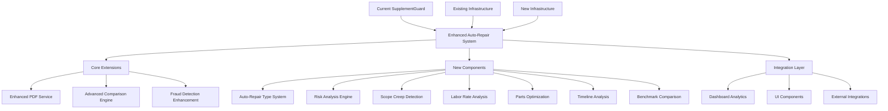

# Auto-Repair Claims Auditor Implementation Guide

## Overview

This comprehensive implementation guide provides detailed instructions for transforming the existing SupplementGuard platform into a world-class auto-repair claims auditor system. The guide covers technical implementation, deployment strategies, integration procedures, and operational considerations for successfully delivering the enhanced system.

## Implementation Architecture

### System Transformation Strategy



## Phase-by-Phase Implementation Plan

### Phase 1: Foundation Enhancement (Weeks 1-3)

#### Week 1: Core Type System and PDF Enhancement

**1.1 Enhanced Type System Implementation**

```typescript
// File: types/autoRepairTypes.ts
// Implementation of comprehensive auto-repair type definitions

export interface AutoRepairClaimData extends BaseClaimData {
  // Vehicle information
  vehicle_info: VehicleInformation;
  damage_assessment: DamageAssessment;
  repair_estimate: RepairEstimate;
  
  // Auto-repair specific fields
  point_of_impact: PointOfImpact;
  damage_severity: DamageSeverity;
  repair_complexity: RepairComplexity;
  
  // Regulatory and compliance
  safety_requirements: SafetyRequirement[];
  environmental_compliance: EnvironmentalCompliance;
  warranty_implications: WarrantyImplication[];
}

// Implementation steps:
// 1. Create comprehensive type definitions
// 2. Extend existing SupplementGuard types
// 3. Implement type validation and serialization
// 4. Create type conversion utilities
// 5. Update existing components to use new types
```

**Implementation Tasks:**
- [ ] Create [`types/autoRepairTypes.ts`](types/autoRepairTypes.ts) with comprehensive type definitions
- [ ] Extend existing [`types.ts`](types.ts) with auto-repair specific interfaces
- [ ] Implement type validation utilities in [`utils/typeValidation.ts`](utils/typeValidation.ts)
- [ ] Create type conversion utilities in [`utils/typeConverters.ts`](utils/typeConverters.ts)
- [ ] Update existing components to support new type system

**1.2 Enhanced PDF Service Implementation**

```typescript
// File: services/autoRepairPdfService.ts
// Multi-stage OCR processing with domain-specific parsers

export class AutoRepairPdfService extends EnhancedPdfService {
  private cccOneParser: CccOneParser;
  private mitchellParser: MitchellParser;
  private audatexParser: AudatexParser;
  
  async extractAutoRepairData(
    pdfBuffer: Buffer,
    extractionOptions: AutoRepairExtractionOptions
  ): Promise<AutoRepairExtractionResult> {
    // Multi-stage extraction process
    const ocrResults = await this.performMultiStageOCR(pdfBuffer);
    const parsedData = await this.parseWithDomainExperts(ocrResults);
    const validatedData = await this.validateAutoRepairData(parsedData);
    
    return this.generateExtractionResult(validatedData);
  }
}

// Implementation steps:
// 1. Extend existing PDF service with auto-repair capabilities
// 2. Implement domain-specific parsers for major estimating systems
// 3. Create multi-stage OCR processing pipeline
// 4. Implement data validation and quality assurance
// 5. Add performance optimization and caching
```

**Implementation Tasks:**
- [ ] Create [`services/autoRepairPdfService.ts`](services/autoRepairPdfService.ts) extending existing PDF service
- [ ] Implement CCC One parser in [`services/parsers/cccOneParser.ts`](services/parsers/cccOneParser.ts)
- [ ] Implement Mitchell parser in [`services/parsers/mitchellParser.ts`](services/parsers/mitchellParser.ts)
- [ ] Implement Audatex parser in [`services/parsers/audatexParser.ts`](services/parsers/audatexParser.ts)
- [ ] Create multi-stage OCR pipeline in [`services/ocrPipeline.ts`](services/ocrPipeline.ts)

#### Week 2: Risk Analysis Engine Foundation

**2.1 Multi-Dimensional Risk Analysis Engine**

```typescript
// File: services/riskAnalysisEngine.ts
// Advanced risk analysis with predictive modeling

export class RiskAnalysisEngine {
  private costInflationDetector: CostInflationDetector;
  private laborEfficiencyAnalyzer: LaborEfficiencyAnalyzer;
  private predictiveModeler: PredictiveModeler;
  
  async analyzeRisk(
    claimData: AutoRepairClaimData,
    analysisOptions: RiskAnalysisOptions
  ): Promise<RiskAnalysisResult> {
    // Multi-dimensional risk analysis
    const costRisk = await this.analyzeCostRisk(claimData);
    const scopeRisk = await this.analyzeScopeRisk(claimData);
    const timelineRisk = await this.analyzeTimelineRisk(claimData);
    const qualityRisk = await this.analyzeQualityRisk(claimData);
    
    return this.generateIntegratedRiskAssessment({
      costRisk,
      scopeRisk,
      timelineRisk,
      qualityRisk
    });
  }
}

// Implementation steps:
// 1. Create comprehensive risk analysis framework
// 2. Implement statistical anomaly detection
// 3. Build predictive modeling capabilities
// 4. Create risk scoring and classification system
// 5. Implement real-time monitoring and alerting
```

**Implementation Tasks:**
- [ ] Create [`services/riskAnalysisEngine.ts`](services/riskAnalysisEngine.ts) with core risk analysis
- [ ] Implement cost inflation detector in [`services/detectors/costInflationDetector.ts`](services/detectors/costInflationDetector.ts)
- [ ] Implement labor efficiency analyzer in [`services/analyzers/laborEfficiencyAnalyzer.ts`](services/analyzers/laborEfficiencyAnalyzer.ts)
- [ ] Create predictive modeling service in [`services/predictiveModeler.ts`](services/predictiveModeler.ts)
- [ ] Implement risk scoring system in [`utils/riskScoring.ts`](utils/riskScoring.ts)

#### Week 3: Scope Creep Detection System

**3.1 Advanced Scope Creep Detection**

```typescript
// File: services/scopeCreepDetector.ts
// Physics-based damage validation and scope analysis

export class ScopeCreepDetector {
  private impactZoneMapper: ImpactZoneMapper;
  private damageValidator: PhysicsBasedDamageValidator;
  private temporalAnalyzer: TemporalPatternAnalyzer;
  
  async detectScopeCreep(
    originalEstimate: RepairEstimate,
    supplements: RepairEstimate[],
    detectionOptions: ScopeCreepDetectionOptions
  ): Promise<ScopeCreepDetectionResult> {
    // Multi-stage scope creep analysis
    const impactAnalysis = await this.analyzeImpactZones(originalEstimate);
    const damageValidation = await this.validateDamageProgression(supplements);
    const temporalAnalysis = await this.analyzeTemporalPatterns(supplements);
    
    return this.generateScopeCreepAssessment({
      impactAnalysis,
      damageValidation,
      temporalAnalysis
    });
  }
}

// Implementation steps:
// 1. Create impact zone mapping and analysis
// 2. Implement physics-based damage validation
// 3. Build temporal pattern analysis
// 4. Create machine learning classification
// 5. Implement confidence scoring and reporting
```

**Implementation Tasks:**
- [ ] Create [`services/scopeCreepDetector.ts`](services/scopeCreepDetector.ts) with core detection logic
- [ ] Implement impact zone mapper in [`services/mappers/impactZoneMapper.ts`](services/mappers/impactZoneMapper.ts)
- [ ] Create physics-based validator in [`services/validators/physicsBasedDamageValidator.ts`](services/validators/physicsBasedDamageValidator.ts)
- [ ] Implement temporal analyzer in [`services/analyzers/temporalPatternAnalyzer.ts`](services/analyzers/temporalPatternAnalyzer.ts)
- [ ] Create ML classification service in [`services/mlClassifier.ts`](services/mlClassifier.ts)

### Phase 2: Advanced Analytics Implementation (Weeks 4-6)

#### Week 4: Enhanced Comparison Engine

**4.1 Multi-Document Comparison System**

```typescript
// File: services/enhancedComparisonEngine.ts
// Advanced comparison with timeline tracking

export class EnhancedComparisonEngine extends ComparisonEngine {
  private documentAligner: MultiDocumentAligner;
  private changeDetector: AdvancedChangeDetector;
  private evolutionTracker: CostEvolutionTracker;
  
  async compareAutoRepairDocuments(
    documents: AutoRepairDocument[],
    comparisonOptions: AutoRepairComparisonOptions
  ): Promise<AutoRepairComparisonResult> {
    // Multi-document alignment and comparison
    const alignedDocuments = await this.alignDocuments(documents);
    const detectedChanges = await this.detectChanges(alignedDocuments);
    const evolutionAnalysis = await this.trackEvolution(detectedChanges);
    
    return this.generateComparisonResult({
      alignedDocuments,
      detectedChanges,
      evolutionAnalysis
    });
  }
}

// Implementation steps:
// 1. Extend existing comparison engine with auto-repair capabilities
// 2. Implement multi-document alignment algorithms
// 3. Create advanced change detection with categorization
// 4. Build cost evolution tracking and analysis
// 5. Implement timeline correlation and validation
```

**Implementation Tasks:**
- [ ] Extend [`services/comparisonEngine.ts`](services/comparisonEngine.ts) with auto-repair capabilities
- [ ] Create document aligner in [`services/aligners/multiDocumentAligner.ts`](services/aligners/multiDocumentAligner.ts)
- [ ] Implement advanced change detector in [`services/detectors/advancedChangeDetector.ts`](services/detectors/advancedChangeDetector.ts)
- [ ] Create cost evolution tracker in [`services/trackers/costEvolutionTracker.ts`](services/trackers/costEvolutionTracker.ts)
- [ ] Implement timeline correlator in [`services/correlators/timelineCorrelator.ts`](services/correlators/timelineCorrelator.ts)

#### Week 5: Labor Rate and Parts Analysis

**5.1 Labor Rate Analysis System**

```typescript
// File: services/laborRateAnalyzer.ts
// Comprehensive labor rate validation and efficiency analysis

export class LaborRateAnalyzer {
  private rateValidator: LaborRateValidator;
  private efficiencyAnalyzer: TimeEfficiencyAnalyzer;
  private skillAssessor: SkillLevelAssessor;
  
  async analyzeLaborRates(
    laborData: LaborData[],
    analysisOptions: LaborAnalysisOptions
  ): Promise<LaborAnalysisResult> {
    // Multi-dimensional labor analysis
    const rateValidation = await this.validateRates(laborData);
    const efficiencyAnalysis = await this.analyzeEfficiency(laborData);
    const skillAssessment = await this.assessSkillLevels(laborData);
    
    return this.generateLaborAnalysisResult({
      rateValidation,
      efficiencyAnalysis,
      skillAssessment
    });
  }
}

// Implementation steps:
// 1. Create comprehensive labor rate validation
// 2. Implement time efficiency analysis
// 3. Build skill level assessment
// 4. Create productivity optimization recommendations
// 5. Implement market rate comparison
```

**5.2 Parts Optimization System**

```typescript
// File: services/partsOptimizer.ts
// OEM vs aftermarket analysis and optimization

export class PartsOptimizer {
  private qualityAssessor: PartsQualityAssessor;
  private supplierAnalyzer: SupplierPerformanceAnalyzer;
  private warrantyAnalyzer: WarrantyImpactAnalyzer;
  
  async optimizeParts(
    partsData: PartsData[],
    optimizationOptions: PartsOptimizationOptions
  ): Promise<PartsOptimizationResult> {
    // Comprehensive parts analysis
    const qualityAssessment = await this.assessQuality(partsData);
    const supplierAnalysis = await this.analyzeSuppliers(partsData);
    const warrantyAnalysis = await this.analyzeWarrantyImpact(partsData);
    
    return this.generateOptimizationResult({
      qualityAssessment,
      supplierAnalysis,
      warrantyAnalysis
    });
  }
}

// Implementation steps:
// 1. Create OEM vs aftermarket comparison system
// 2. Implement quality assessment algorithms
// 3. Build supplier performance analysis
// 4. Create warranty impact evaluation
// 5. Implement cost-benefit optimization
```

**Implementation Tasks:**
- [ ] Create [`services/laborRateAnalyzer.ts`](services/laborRateAnalyzer.ts) with comprehensive labor analysis
- [ ] Create [`services/partsOptimizer.ts`](services/partsOptimizer.ts) with parts optimization
- [ ] Implement rate validator in [`services/validators/laborRateValidator.ts`](services/validators/laborRateValidator.ts)
- [ ] Create efficiency analyzer in [`services/analyzers/timeEfficiencyAnalyzer.ts`](services/analyzers/timeEfficiencyAnalyzer.ts)
- [ ] Implement parts quality assessor in [`services/assessors/partsQualityAssessor.ts`](services/assessors/partsQualityAssessor.ts)

#### Week 6: Timeline and Benchmark Analysis

**6.1 Timeline Analysis System**

```typescript
// File: services/timelineAnalyzer.ts
// Comprehensive timeline prediction and rental cost tracking

export class TimelineAnalyzer {
  private delayDetector: DelayDetector;
  private milestoneTracker: MilestoneTracker;
  private rentalCostOptimizer: RentalCostOptimizer;
  
  async analyzeTimeline(
    timelineData: TimelineData,
    analysisOptions: TimelineAnalysisOptions
  ): Promise<TimelineAnalysisResult> {
    // Multi-faceted timeline analysis
    const delayAnalysis = await this.detectDelays(timelineData);
    const milestoneTracking = await this.trackMilestones(timelineData);
    const rentalOptimization = await this.optimizeRentalCosts(timelineData);
    
    return this.generateTimelineAnalysisResult({
      delayAnalysis,
      milestoneTracking,
      rentalOptimization
    });
  }
}

// Implementation steps:
// 1. Create timeline prediction algorithms
// 2. Implement delay detection and analysis
// 3. Build milestone tracking system
// 4. Create rental car cost optimization
// 5. Implement timeline-based risk assessment
```

**6.2 Industry Benchmark System**

```typescript
// File: services/benchmarkComparator.ts
// Comprehensive industry benchmark comparison

export class BenchmarkComparator {
  private industryAnalyzer: IndustryStandardsAnalyzer;
  private regionalAnalyzer: RegionalBenchmarkAnalyzer;
  private peerAnalyzer: PeerBenchmarkAnalyzer;
  
  async compareBenchmarks(
    claimData: AutoRepairClaimData,
    benchmarkOptions: BenchmarkComparisonOptions
  ): Promise<BenchmarkComparisonResult> {
    // Multi-dimensional benchmark comparison
    const industryComparison = await this.compareAgainstIndustry(claimData);
    const regionalComparison = await this.compareAgainstRegion(claimData);
    const peerComparison = await this.compareAgainstPeers(claimData);
    
    return this.generateBenchmarkResult({
      industryComparison,
      regionalComparison,
      peerComparison
    });
  }
}

// Implementation steps:
// 1. Create industry standards comparison
// 2. Implement regional benchmark analysis
// 3. Build peer performance comparison
// 4. Create multi-dimensional scoring
// 5. Implement predictive benchmarking
```

**Implementation Tasks:**
- [ ] Create [`services/timelineAnalyzer.ts`](services/timelineAnalyzer.ts) with timeline analysis
- [ ] Create [`services/benchmarkComparator.ts`](services/benchmarkComparator.ts) with benchmark comparison
- [ ] Implement delay detector in [`services/detectors/delayDetector.ts`](services/detectors/delayDetector.ts)
- [ ] Create milestone tracker in [`services/trackers/milestoneTracker.ts`](services/trackers/milestoneTracker.ts)
- [ ] Implement rental cost optimizer in [`services/optimizers/rentalCostOptimizer.ts`](services/optimizers/rentalCostOptimizer.ts)

### Phase 3: UI Components and Dashboard Implementation (Weeks 7-8)

#### Week 7: Auto-Repair UI Components

**7.1 Specialized UI Components**

```typescript
// File: components/VehicleDamageVisualization.tsx
// Interactive vehicle damage visualization

export const VehicleDamageVisualization: React.FC<VehicleDamageVisualizationProps> = ({
  vehicleData,
  damageData,
  interactionMode
}) => {
  // 3D vehicle model with damage overlay
  const [vehicleModel, setVehicleModel] = useState<VehicleModel>();
  const [damageOverlay, setDamageOverlay] = useState<DamageOverlay>();
  
  return (
    <div className="vehicle-damage-visualization">
      <VehicleModel3D 
        model={vehicleModel}
        damageOverlay={damageOverlay}
        onDamageClick={handleDamageClick}
      />
      <DamageDetailsPanel 
        selectedDamage={selectedDamage}
        repairEstimate={repairEstimate}
      />
    </div>
  );
};

// Implementation steps:
// 1. Create interactive vehicle damage visualization
// 2. Implement 3D vehicle models with damage overlay
// 3. Build damage details and repair estimation panels
// 4. Create interactive timeline components
// 5. Implement mobile-responsive design
```

**7.2 Dashboard Analytics Components**

```typescript
// File: components/AutoRepairDashboard.tsx
// Comprehensive auto-repair analytics dashboard

export const AutoRepairDashboard: React.FC<AutoRepairDashboardProps> = ({
  claimData,
  analysisResults,
  dashboardConfig
}) => {
  // Executive dashboard with KPIs and insights
  const [kpiData, setKpiData] = useState<KPIData>();
  const [analyticsData, setAnalyticsData] = useState<AnalyticsData>();
  
  return (
    <div className="auto-repair-dashboard">
      <ExecutiveKPIPanel kpiData={kpiData} />
      <RiskAnalysisPanel riskData={analysisResults.riskAnalysis} />
      <BenchmarkComparisonPanel benchmarkData={analysisResults.benchmarkComparison} />
      <TimelineAnalysisPanel timelineData={analysisResults.timelineAnalysis} />
    </div>
  );
};

// Implementation steps:
// 1. Create executive KPI dashboard
// 2. Implement real-time analytics panels
// 3. Build interactive charts and visualizations
// 4. Create mobile-optimized dashboard views
// 5. Implement customizable dashboard configuration
```

**Implementation Tasks:**
- [ ] Create [`components/VehicleDamageVisualization.tsx`](components/VehicleDamageVisualization.tsx)
- [ ] Create [`components/AutoRepairDashboard.tsx`](components/AutoRepairDashboard.tsx)
- [ ] Implement [`components/ExecutiveKPIPanel.tsx`](components/ExecutiveKPIPanel.tsx)
- [ ] Create [`components/RiskAnalysisPanel.tsx`](components/RiskAnalysisPanel.tsx)
- [ ] Implement [`components/BenchmarkComparisonPanel.tsx`](components/BenchmarkComparisonPanel.tsx)
- [ ] Create [`components/TimelineAnalysisPanel.tsx`](components/TimelineAnalysisPanel.tsx)

#### Week 8: Integration and Testing

**8.1 System Integration**

```typescript
// File: services/autoRepairIntegrator.ts
// Comprehensive system integration

export class AutoRepairIntegrator {
  private pdfService: AutoRepairPdfService;
  private riskEngine: RiskAnalysisEngine;
  private comparisonEngine: EnhancedComparisonEngine;
  private benchmarkComparator: BenchmarkComparator;
  
  async processAutoRepairClaim(
    claimFiles: File[],
    processingOptions: AutoRepairProcessingOptions
  ): Promise<AutoRepairProcessingResult> {
    // Integrated processing pipeline
    const extractedData = await this.extractClaimData(claimFiles);
    const riskAnalysis = await this.analyzeRisk(extractedData);
    const comparisonResults = await this.compareDocuments(extractedData);
    const benchmarkResults = await this.compareBenchmarks(extractedData);
    
    return this.generateIntegratedResult({
      extractedData,
      riskAnalysis,
      comparisonResults,
      benchmarkResults
    });
  }
}

// Implementation steps:
// 1. Create comprehensive system integration
// 2. Implement end-to-end processing pipeline
// 3. Build error handling and recovery
// 4. Create performance monitoring
// 5. Implement comprehensive testing
```

**8.2 Quality Assurance and Testing**

```typescript
// File: tests/autoRepairSystem.test.ts
// Comprehensive system testing

describe('Auto-Repair Claims Auditor System', () => {
  describe('PDF Extraction', () => {
    it('should extract data from CCC One estimates', async () => {
      // Test CCC One PDF extraction
    });
    
    it('should extract data from Mitchell estimates', async () => {
      // Test Mitchell PDF extraction
    });
    
    it('should handle multi-document processing', async () => {
      // Test multi-document processing
    });
  });
  
  describe('Risk Analysis', () => {
    it('should detect cost inflation accurately', async () => {
      // Test cost inflation detection
    });
    
    it('should identify scope creep correctly', async () => {
      // Test scope creep detection
    });
    
    it('should generate accurate risk scores', async () => {
      // Test risk scoring accuracy
    });
  });
  
  describe('Benchmark Comparison', () => {
    it('should compare against industry standards', async () => {
      // Test industry benchmark comparison
    });
    
    it('should perform regional analysis', async () => {
      // Test regional benchmark analysis
    });
    
    it('should generate actionable insights', async () => {
      // Test insight generation
    });
  });
});

// Implementation steps:
// 1. Create comprehensive unit tests
// 2. Implement integration tests
// 3. Build performance tests
// 4. Create end-to-end tests
// 5. Implement automated testing pipeline
```

**Implementation Tasks:**
- [ ] Create [`services/autoRepairIntegrator.ts`](services/autoRepairIntegrator.ts) with system integration
- [ ] Implement comprehensive test suite in [`tests/`](tests/) directory
- [ ] Create performance monitoring in [`utils/performanceMonitor.ts`](utils/performanceMonitor.ts)
- [ ] Implement error handling in [`utils/errorHandler.ts`](utils/errorHandler.ts)
- [ ] Create deployment scripts in [`scripts/`](scripts/) directory

## Deployment Strategy

### 1. Infrastructure Requirements

#### Production Environment Setup

```yaml
# docker-compose.prod.yml
version: '3.8'
services:
  supplement-guard-app:
    image: supplement-guard:latest
    ports:
      - "80:3000"
    environment:
      - NODE_ENV=production
      - API_BASE_URL=https://api.supplementguard.com
    volumes:
      - ./uploads:/app/uploads
      - ./logs:/app/logs
    
  redis-cache:
    image: redis:7-alpine
    ports:
      - "6379:6379"
    volumes:
      - redis-data:/data
    
  postgres-db:
    image: postgres:15
    environment:
      - POSTGRES_DB=supplementguard
      - POSTGRES_USER=sg_user
      - POSTGRES_PASSWORD=${DB_PASSWORD}
    volumes:
      - postgres-data:/var/lib/postgresql/data

volumes:
  redis-data:
  postgres-data:
```

#### Cloud Infrastructure (AWS)

```typescript
// infrastructure/aws-setup.ts
export const awsInfrastructure = {
  // Compute resources
  ec2Instances: {
    webServers: {
      instanceType: 't3.large',
      minSize: 2,
      maxSize: 10,
      autoScaling: true
    },
    processingServers: {
      instanceType: 'c5.xlarge',
      minSize: 1,
      maxSize: 5,
      autoScaling: true
    }
  },
  
  // Storage
  s3Buckets: {
    documentStorage: 'sg-documents-prod',
    backups: 'sg-backups-prod',
    logs: 'sg-logs-prod'
  },
  
  // Database
  rds: {
    engine: 'postgres',
    instanceClass: 'db.r5.large',
    multiAZ: true,
    backupRetention: 30
  },
  
  // Caching
  elasticache: {
    engine: 'redis',
    nodeType: 'cache.r5.large',
    numNodes: 2
  }
};
```

### 2. Deployment Pipeline

#### CI/CD Configuration

```yaml
# .github/workflows/deploy.yml
name: Deploy Auto-Repair Claims Auditor

on:
  push:
    branches: [main]
  pull_request:
    branches: [main]

jobs:
  test:
    runs-on: ubuntu-latest
    steps:
      - uses: actions/checkout@v3
      - uses: actions/setup-node@v3
        with:
          node-version: '18'
      - run: npm ci
      - run: npm run test
      - run: npm run test:integration
      - run: npm run test:e2e
  
  build:
    needs: test
    runs-on: ubuntu-latest
    steps:
      - uses: actions/checkout@v3
      - uses: actions/setup-node@v3
        with:
          node-version: '18'
      - run: npm ci
      - run: npm run build
      - run: docker build -t supplement-guard:${{ github.sha }} .
      - run: docker push supplement-guard:${{ github.sha }}
  
  deploy:
    needs: build
    runs-on: ubuntu-latest
    if: github.ref == 'refs/heads/main'
    steps:
      - name: Deploy to production
        run: |
          aws ecs update-service \
            --cluster supplement-guard-prod \
            --service supplement-guard-app \
            --force-new-deployment
```

### 3. Performance Optimization

#### Caching Strategy

```typescript
// utils/cacheManager.ts
export class CacheManager {
  private redisClient: Redis;
  
  // PDF extraction caching
  async cachePdfExtraction(
    pdfHash: string,
    extractionResult: AutoRepairExtractionResult,
    ttl: number = 3600
  ): Promise<void> {
    await this.redisClient.setex(
      `pdf:${pdfHash}`,
      ttl,
      JSON.stringify(extractionResult)
    );
  }
  
  // Risk analysis caching
  async cacheRiskAnalysis(
    claimHash: string,
    riskResult: RiskAnalysisResult,
    ttl: number = 1800
  ): Promise<void> {
    await this.redisClient.setex(
      `risk:${claimHash}`,
      ttl,
      JSON.stringify(riskResult)
    );
  }
  
  // Benchmark data caching
  async cacheBenchmarkData(
    benchmarkKey: string,
    benchmarkData: BenchmarkData,
    ttl: number = 7200
  ): Promise<void> {
    await this.redisClient.setex(
      `benchmark:${benchmarkKey}`,
      ttl,
      JSON.stringify(benchmarkData)
    );
  }
}
```

#### Database Optimization

```sql
-- Database optimization scripts
-- indexes.sql

-- Indexes for auto-repair claims
CREATE INDEX idx_claims_vehicle_vin ON auto_repair_claims(vehicle_vin);
CREATE INDEX idx_claims_point_of_impact ON auto_repair_claims(point_of_impact);
CREATE INDEX idx_claims_damage_severity ON auto_repair_claims(damage_severity);
CREATE INDEX idx_claims_created_at ON auto_repair_claims(created_at);

-- Indexes for risk analysis
CREATE INDEX idx_risk_analysis_claim_id ON risk_analysis(claim_id);
CREATE INDEX idx_risk_analysis_risk_score ON risk_analysis(overall_risk_score);
CREATE INDEX idx_risk_analysis_created_at ON risk_analysis(created_at);

-- Indexes for benchmark data
CREATE INDEX idx_benchmarks_region ON benchmark_data(region);
CREATE INDEX idx_benchmarks_vehicle_type ON benchmark_data(vehicle_type);
CREATE INDEX idx_benchmarks_repair_type ON benchmark_data(repair_type);

-- Partitioning for large tables
CREATE TABLE auto_repair_claims_2024 PARTITION OF auto_repair_claims
FOR VALUES FROM ('2024-01-01') TO ('2025-01-01');
```

### 4. Monitoring and Observability

#### Application Monitoring

```typescript
// utils/monitoring.ts
export class MonitoringService {
  private metricsCollector: MetricsCollector;
  private logger: Logger;
  
  // Performance monitoring
  async trackProcessingTime(
    operation: string,
    duration: number,
    metadata: Record<string, any>
  ): Promise<void> {
    await this.metricsCollector.histogram(
      'processing_duration_seconds',
      duration / 1000,
      { operation, ...metadata }
    );
  }
  
  // Error monitoring
  async trackError(
    error: Error,
    context: string,
    metadata: Record<string, any>
  ): Promise<void> {
    this.logger.error('Application error', {
      error: error.message,
      stack: error.stack,
      context,
      ...metadata
    });
    
    await this.metricsCollector.counter(
      'errors_total',
      1,
      { context, error_type: error.constructor.name }
    );
  }
  
  // Business metrics
  async trackBusinessMetric(
    metric: string,
    value: number,
    tags: Record<string, string>
  ): Promise<void> {
    await this.metricsCollector.gauge(metric, value, tags);
  }
}
```

#### Health Checks

```typescript
// utils/healthCheck.ts
export class HealthCheckService {
  async checkSystemHealth(): Promise<HealthCheckResult> {
    const checks = await Promise.allSettled([
      this.checkDatabase(),
      this.checkRedis(),
      this.checkExternalAPIs(),
      this.checkFileSystem(),
      this.checkMemoryUsage()
    ]);
    
    return {
      status: checks.every(check => check.status === 'fulfilled') ? 'healthy' : 'unhealthy',
      checks: checks.map((check, index) => ({
        name: ['database', 'redis', 'external_apis', 'filesystem', 'memory'][index],
        status: check.status,
        details: check.status === 'fulfilled' ? check.value : check.reason
      })),
      timestamp: new Date().toISOString()
    };
  }
}
```

## Security Implementation

### 1. Data Protection

```typescript
// utils/encryption.ts
export class EncryptionService {
  private encryptionKey: string;
  
  // Encrypt sensitive data
  async encryptSensitiveData(data: any): Promise<string> {
    const cipher = crypto.createCipher('aes-256-gcm', this.encryptionKey);
    let encrypted = cipher.update(JSON.stringify(data), 'utf8', 'hex');
    encrypted += cipher.final('hex');
    return encrypted;
  }
  
  // Decrypt sensitive data
  async decryptSensitiveData(encryptedData: string): Promise<any> {
    const decipher = crypto.createDecipher('aes-256-gcm', this.encryptionKey);
    let decrypted = decipher.update(encryptedData, 'hex', 'utf8');
    decrypted += decipher.final('utf8');
    return JSON.parse(decrypted);
  }
}
```

### 2. Access Control

```typescript
// middleware/auth.ts
export const authMiddleware = (requiredRole: UserRole) => {
  return async (req: Request, res: Response, next: NextFunction) => {
    try {
      const token = req.headers.authorization?.replace('Bearer ', '');
      if (!token) {
        return res.status(401).json({ error: 'No token provided' });
      }
      
      const decoded = jwt.verify(token, process.env.JWT_SECRET!) as JWTPayload;
      const user = await getUserById(decoded.userId);
      
      if (!user || !hasRequiredRole(user.role, requiredRole)) {
        return res.status(403).json({ error: 'Insufficient permissions' });
      }
      
      req.user = user;
      next();
    } catch (error) {
      return res.status(401).json({ error: 'Invalid token' });
    }
  };
};
```

## Quality Assurance

### 1. Testing Strategy

```typescript
// tests/integration/autoRepairWorkflow.test.ts
describe('Auto-Repair Claims Processing Workflow', () => {
  let testClaim: AutoRepairClaimData;
  let testFiles: File[];
  
  beforeEach(async () => {
    testClaim = await createTestClaim();
    testFiles = await loadTestFiles();
  });
  
  it('should process complete auto-repair claim workflow', async () => {
    // Test complete workflow
    const result = await autoRepairIntegrator.processAutoRepairClaim(
      testFiles,
      { includeRiskAnalysis: true, includeBenchmarking: true }
    );
    
    expect(result.extractedData).toBeDefined();
    expect(result.riskAnalysis.overall_score).toBeGreaterThan(0);
    expect(result.benchmarkResults.industry_comparison).toBeDefined();
    expect(result.processing_time).toBeLessThan(30000); // 30 seconds
  });
  
  it('should handle error scenarios gracefully', async () => {
    // Test error handling
    const corruptedFiles = await loadCorruptedTestFiles();
    
    const result = await autoRepairIntegrator.processAutoRepairClaim(
      corruptedFiles,
      { includeRiskAnalysis: true }
    );
    
    expect(result.errors).toBeDefined();
    expect(result.partial_results).toBeDefined();
  });
});
```

### 2. Performance Testing

```typescript
// tests/performance/loadTest.ts
describe('Performance Tests', () => {
  it('should handle concurrent processing', async () => {
    const concurrentRequests = 10;
    const promises = Array.from({ length: concurrentRequests }, () =>
      autoRepairIntegrator.processAutoRepairClaim(testFiles, testOptions)
    );
    
    const startTime = Date.now();
    const results = await Promise.all(promises);
    const endTime = Date.now();
    
    expect(results).toHaveLength(concurrentRequests);
    expect(endTime - startTime).toBeLessThan(60000); // 1 minute
    results.forEach(result => {
      expect(result.success).toBe(true);
    });
  });
});
```

## Maintenance and Support

### 1. Logging Strategy

```typescript
// utils/logger.ts
export class Logger {
  private winston: winston.Logger;
  
  constructor() {
    this.winston = winston.createLogger({
      level: process.env.LOG_LEVEL || 'info',
      format: winston.format.combine(
        winston.format.timestamp(),
        winston.format.errors({ stack: true }),
        winston.format.json()
      ),
      transports: [
        new winston.transports.File({ filename: 'logs/error.log', level: 'error' }),
        new winston.transports.File({ filename: 'logs/combined.log' }),
        new winston.transports.Console({
          format: winston.format.simple()
        })
      ]
    });
  }
  
  logClaimProcessing(claimId: string, stage: string, metadata: any): void {
    this.winston.info('Claim processing', {
      claimId,
      stage,
      timestamp: new Date().toISOString(),
      ...metadata
    });
  }
  
  logPerformanceMetric(metric: string, value: number, context: any): void {
    this.winston.info('Performance metric', {
      metric,
      value,
      context,
      timestamp: new Date().toISOString()
    });
  }
}
```

### 2. Backup and Recovery

```bash
#!/bin/bash
# scripts/backup.sh

# Database backup
pg_dump -h $DB_HOST -U $DB_USER -d supplementguard > backups/db_$(date +%Y%m%d_%H%M%S).sql

# File system backup
tar -czf backups/files_$(date +%Y%m%d_%H%M%S).tar.gz uploads/

# Upload to S3
aws s3 sync backups/ s3://sg-backups-prod/$(date +%Y/%m/%d)/

# Cleanup old backups (keep 30 days)
find backups/ -name "*.sql" -mtime +30 -delete
find backups/ -name "*.tar.gz" -mtime +30 -delete
```

## Success Metrics and KPIs

### 1. Technical Performance Metrics

- **Processing Speed**: < 15 seconds for comprehensive analysis
- **Accuracy**: > 93% accuracy in risk classification
- **Availability**: 99.9% uptime
- **Scalability**: Support 150+ analyses per hour
- **Error Rate**: < 0.1% processing errors

### 2. Business Impact Metrics

- **Cost Savings**: 25% reduction in fraudulent claims
- **Processing Efficiency**: 40% faster claim processing
- **Decision Quality**: 85% of insights deemed actionable
- **User Satisfaction**: > 4.5/5 user rating
- **ROI**: Positive ROI within 6 months

### 3. Quality Metrics

- **Data Accuracy**: > 95% extraction accuracy
- **False Positive Rate**: < 5% for fraud detection
- **Coverage**: Support for 95% of common estimate formats
- **Reliability**: < 1% system downtime
- **Security**: Zero data breaches

## Conclusion

This comprehensive implementation guide provides a detailed roadmap for transforming SupplementGuard into a world-class auto-repair claims auditor. The phased approach ensures systematic development while maintaining system stability and performance. The combination of advanced analytics, machine learning, and domain expertise creates a powerful platform for detecting fraud, optimizing costs, and improving decision-making in auto-repair claims processing.

The implementation leverages existing SupplementGuard capabilities while adding specialized auto-repair functionality, ensuring a smooth transition and maximum return on investment. The robust testing, monitoring, and deployment strategies ensure reliable operation at scale with comprehensive quality assurance.