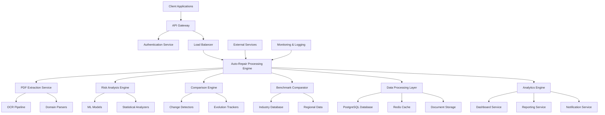

# Auto-Repair Claims Auditor System Integration Documentation

## Overview

This comprehensive system integration documentation provides detailed specifications for integrating all components of the auto-repair claims auditor system. The document covers component interactions, data flow, API specifications, integration patterns, and operational procedures for the complete transformation of SupplementGuard into a world-class auto-repair claims auditor.

## System Integration Architecture

### High-Level Integration Overview



### Component Integration Matrix

| Component | Integrates With | Integration Type | Data Format | Protocol |
|-----------|----------------|------------------|-------------|----------|
| PDF Extraction Service | OCR Pipeline, Domain Parsers | Synchronous | JSON, Binary | HTTP/REST |
| Risk Analysis Engine | ML Models, Statistical Analyzers | Asynchronous | JSON | Message Queue |
| Comparison Engine | Change Detectors, Evolution Trackers | Synchronous | JSON | HTTP/REST |
| Benchmark Comparator | Industry Database, Regional Data | Synchronous | JSON | HTTP/REST |
| Dashboard Service | Analytics Engine, Database | Real-time | JSON | WebSocket/REST |
| Notification Service | All Processing Components | Asynchronous | JSON | Message Queue |

## Core Integration Patterns

### 1. Service Integration Framework

```typescript
// File: integration/serviceIntegrator.ts
// Comprehensive service integration framework

export class ServiceIntegrator {
  private serviceRegistry: ServiceRegistry;
  private messageQueue: MessageQueue;
  private eventBus: EventBus;
  
  constructor() {
    this.serviceRegistry = new ServiceRegistry();
    this.messageQueue = new MessageQueue();
    this.eventBus = new EventBus();
  }
  
  // Service registration and discovery
  async registerService(
    serviceName: string,
    serviceInstance: ServiceInstance,
    healthCheck: HealthCheckFunction
  ): Promise<void> {
    await this.serviceRegistry.register(serviceName, {
      instance: serviceInstance,
      healthCheck,
      lastHealthCheck: new Date(),
      status: 'healthy'
    });
    
    // Start health monitoring
    this.startHealthMonitoring(serviceName);
  }
  
  async discoverService(serviceName: string): Promise<ServiceInstance> {
    const service = await this.serviceRegistry.get(serviceName);
    if (!service || service.status !== 'healthy') {
      throw new Error(`Service ${serviceName} not available`);
    }
    return service.instance;
  }
  
  // Event-driven integration
  async publishEvent(
    eventType: string,
    eventData: any,
    metadata: EventMetadata
  ): Promise<void> {
    const event: IntegrationEvent = {
      id: generateEventId(),
      type: eventType,
      data: eventData,
      metadata: {
        ...metadata,
        timestamp: new Date(),
        source: metadata.source || 'unknown'
      }
    };
    
    await this.eventBus.publish(event);
    await this.logEvent(event);
  }
  
  async subscribeToEvents(
    eventTypes: string[],
    handler: EventHandler,
    options: SubscriptionOptions = {}
  ): Promise<Subscription> {
    return await this.eventBus.subscribe(eventTypes, handler, options);
  }
  
  // Message queue integration
  async sendMessage(
    queueName: string,
    message: any,
    options: MessageOptions = {}
  ): Promise<void> {
    const queueMessage: QueueMessage = {
      id: generateMessageId(),
      data: message,
      timestamp: new Date(),
      retryCount: 0,
      ...options
    };
    
    await this.messageQueue.send(queueName, queueMessage);
  }
  
  async consumeMessages(
    queueName: string,
    handler: MessageHandler,
    options: ConsumerOptions = {}
  ): Promise<Consumer> {
    return await this.messageQueue.consume(queueName, handler, options);
  }
}

// Integration event types
export interface IntegrationEvent {
  id: string;
  type: string;
  data: any;
  metadata: EventMetadata;
}

export interface EventMetadata {
  timestamp: Date;
  source: string;
  correlationId?: string;
  userId?: string;
  claimId?: string;
}

// Service registry types
export interface ServiceInstance {
  endpoint: string;
  version: string;
  capabilities: string[];
  metadata: Record<string, any>;
}

export interface RegisteredService {
  instance: ServiceInstance;
  healthCheck: HealthCheckFunction;
  lastHealthCheck: Date;
  status: 'healthy' | 'unhealthy' | 'unknown';
}
```

### 2. Data Flow Integration

```typescript
// File: integration/dataFlowOrchestrator.ts
// Orchestrates data flow between components

export class DataFlowOrchestrator {
  private serviceIntegrator: ServiceIntegrator;
  private dataValidator: DataValidator;
  private transformationEngine: DataTransformationEngine;
  
  // Main processing pipeline
  async processAutoRepairClaim(
    claimData: AutoRepairClaimInput,
    processingOptions: ProcessingOptions
  ): Promise<AutoRepairClaimResult> {
    const correlationId = generateCorrelationId();
    
    try {
      // Stage 1: PDF Extraction
      const extractionResult = await this.executePdfExtraction(
        claimData.documents,
        correlationId
      );
      
      // Stage 2: Data Validation and Transformation
      const validatedData = await this.validateAndTransformData(
        extractionResult,
        correlationId
      );
      
      // Stage 3: Parallel Analysis
      const analysisResults = await this.executeParallelAnalysis(
        validatedData,
        processingOptions,
        correlationId
      );
      
      // Stage 4: Result Integration
      const integratedResult = await this.integrateAnalysisResults(
        analysisResults,
        correlationId
      );
      
      // Stage 5: Post-processing
      const finalResult = await this.executePostProcessing(
        integratedResult,
        processingOptions,
        correlationId
      );
      
      return finalResult;
      
    } catch (error) {
      await this.handleProcessingError(error, correlationId);
      throw error;
    }
  }
  
  // PDF extraction stage
  private async executePdfExtraction(
    documents: Document[],
    correlationId: string
  ): Promise<ExtractionResult> {
    const pdfService = await this.serviceIntegrator.discoverService('pdf-extraction');
    
    // Publish processing start event
    await this.serviceIntegrator.publishEvent('pdf-extraction-started', {
      documentCount: documents.length,
      correlationId
    }, { source: 'data-flow-orchestrator', correlationId });
    
    const extractionPromises = documents.map(async (doc) => {
      const result = await pdfService.extractAutoRepairData(doc.buffer, {
        documentType: doc.type,
        extractionMode: 'comprehensive',
        correlationId
      });
      
      return {
        documentId: doc.id,
        extractionResult: result
      };
    });
    
    const results = await Promise.all(extractionPromises);
    
    // Publish extraction complete event
    await this.serviceIntegrator.publishEvent('pdf-extraction-completed', {
      results,
      correlationId
    }, { source: 'data-flow-orchestrator', correlationId });
    
    return {
      documentExtractions: results,
      extractionMetadata: {
        totalDocuments: documents.length,
        successfulExtractions: results.filter(r => r.extractionResult.success).length,
        processingTime: Date.now() - startTime
      }
    };
  }
  
  // Parallel analysis execution
  private async executeParallelAnalysis(
    validatedData: ValidatedClaimData,
    options: ProcessingOptions,
    correlationId: string
  ): Promise<ParallelAnalysisResults> {
    const analysisPromises: Promise<any>[] = [];
    
    // Risk analysis
    if (options.includeRiskAnalysis) {
      analysisPromises.push(
        this.executeRiskAnalysis(validatedData, correlationId)
      );
    }
    
    // Scope creep detection
    if (options.includeScopeCreepDetection) {
      analysisPromises.push(
        this.executeScopeCreepDetection(validatedData, correlationId)
      );
    }
    
    // Labor rate analysis
    if (options.includeLaborAnalysis) {
      analysisPromises.push(
        this.executeLaborRateAnalysis(validatedData, correlationId)
      );
    }
    
    // Parts optimization
    if (options.includePartsOptimization) {
      analysisPromises.push(
        this.executePartsOptimization(validatedData, correlationId)
      );
    }
    
    // Timeline analysis
    if (options.includeTimelineAnalysis) {
      analysisPromises.push(
        this.executeTimelineAnalysis(validatedData, correlationId)
      );
    }
    
    // Benchmark comparison
    if (options.includeBenchmarkComparison) {
      analysisPromises.push(
        this.executeBenchmarkComparison(validatedData, correlationId)
      );
    }
    
    const results = await Promise.allSettled(analysisPromises);
    
    return {
      riskAnalysis: this.extractResult(results[0]),
      scopeCreepDetection: this.extractResult(results[1]),
      laborAnalysis: this.extractResult(results[2]),
      partsOptimization: this.extractResult(results[3]),
      timelineAnalysis: this.extractResult(results[4]),
      benchmarkComparison: this.extractResult(results[5])
    };
  }
}
```

### 3. API Integration Layer

```typescript
// File: api/autoRepairApiController.ts
// Comprehensive API controller for auto-repair claims

export class AutoRepairApiController {
  private dataFlowOrchestrator: DataFlowOrchestrator;
  private authService: AuthenticationService;
  private rateLimiter: RateLimiter;
  
  constructor() {
    this.dataFlowOrchestrator = new DataFlowOrchestrator();
    this.authService = new AuthenticationService();
    this.rateLimiter = new RateLimiter();
  }
  
  // Main claim processing endpoint
  @Post('/api/v1/auto-repair/claims/process')
  @UseGuards(AuthGuard)
  @UseInterceptors(FileInterceptor('documents', { limits: { files: 10 } }))
  async processAutoRepairClaim(
    @UploadedFiles() files: Express.Multer.File[],
    @Body() processingOptions: ProcessingOptionsDto,
    @Request() req: AuthenticatedRequest
  ): Promise<AutoRepairClaimResultDto> {
    // Rate limiting
    await this.rateLimiter.checkLimit(req.user.id, 'claim-processing');
    
    // Input validation
    const validatedOptions = await this.validateProcessingOptions(processingOptions);
    const validatedFiles = await this.validateUploadedFiles(files);
    
    // Convert files to claim input
    const claimInput: AutoRepairClaimInput = {
      documents: validatedFiles.map(file => ({
        id: generateDocumentId(),
        buffer: file.buffer,
        type: this.detectDocumentType(file),
        metadata: {
          originalName: file.originalname,
          size: file.size,
          uploadedBy: req.user.id,
          uploadedAt: new Date()
        }
      })),
      userId: req.user.id,
      organizationId: req.user.organizationId
    };
    
    // Process claim
    const result = await this.dataFlowOrchestrator.processAutoRepairClaim(
      claimInput,
      validatedOptions
    );
    
    // Convert to DTO
    return this.convertToResultDto(result);
  }
  
  // Get claim processing status
  @Get('/api/v1/auto-repair/claims/:claimId/status')
  @UseGuards(AuthGuard)
  async getClaimStatus(
    @Param('claimId') claimId: string,
    @Request() req: AuthenticatedRequest
  ): Promise<ClaimStatusDto> {
    const status = await this.dataFlowOrchestrator.getProcessingStatus(claimId);
    return this.convertToStatusDto(status);
  }
  
  // Get analysis results
  @Get('/api/v1/auto-repair/claims/:claimId/results')
  @UseGuards(AuthGuard)
  async getAnalysisResults(
    @Param('claimId') claimId: string,
    @Query() options: ResultOptionsDto,
    @Request() req: AuthenticatedRequest
  ): Promise<AnalysisResultsDto> {
    const results = await this.dataFlowOrchestrator.getAnalysisResults(
      claimId,
      options
    );
    return this.convertToAnalysisResultsDto(results);
  }
  
  // Export results
  @Get('/api/v1/auto-repair/claims/:claimId/export')
  @UseGuards(AuthGuard)
  async exportResults(
    @Param('claimId') claimId: string,
    @Query('format') format: ExportFormat,
    @Request() req: AuthenticatedRequest,
    @Response() res: Response
  ): Promise<void> {
    const results = await this.dataFlowOrchestrator.getAnalysisResults(claimId);
    const exportData = await this.generateExport(results, format);
    
    res.setHeader('Content-Type', this.getContentType(format));
    res.setHeader('Content-Disposition', `attachment; filename="claim-${claimId}.${format}"`);
    res.send(exportData);
  }
}

// API DTOs
export interface ProcessingOptionsDto {
  includeRiskAnalysis?: boolean;
  includeScopeCreepDetection?: boolean;
  includeLaborAnalysis?: boolean;
  includePartsOptimization?: boolean;
  includeTimelineAnalysis?: boolean;
  includeBenchmarkComparison?: boolean;
  processingPriority?: 'low' | 'normal' | 'high';
  notificationPreferences?: NotificationPreferencesDto;
}

export interface AutoRepairClaimResultDto {
  claimId: string;
  processingStatus: ProcessingStatus;
  extractedData: ExtractedDataDto;
  analysisResults: AnalysisResultsDto;
  processingMetadata: ProcessingMetadataDto;
  recommendations: RecommendationDto[];
}
```

## Database Integration

### 1. Database Schema Integration

```sql
-- File: database/auto_repair_schema.sql
-- Comprehensive database schema for auto-repair claims

-- Main claims table
CREATE TABLE auto_repair_claims (
    id UUID PRIMARY KEY DEFAULT gen_random_uuid(),
    claim_number VARCHAR(100) UNIQUE NOT NULL,
    user_id UUID NOT NULL REFERENCES users(id),
    organization_id UUID NOT NULL REFERENCES organizations(id),
    
    -- Vehicle information
    vehicle_year INTEGER,
    vehicle_make VARCHAR(100),
    vehicle_model VARCHAR(100),
    vehicle_trim VARCHAR(100),
    vehicle_vin VARCHAR(17),
    vehicle_mileage INTEGER,
    
    -- Claim details
    point_of_impact VARCHAR(100),
    damage_severity VARCHAR(50),
    inspection_location TEXT,
    loss_date TIMESTAMP,
    inspection_date TIMESTAMP,
    
    -- Processing metadata
    processing_status VARCHAR(50) DEFAULT 'pending',
    created_at TIMESTAMP DEFAULT CURRENT_TIMESTAMP,
    updated_at TIMESTAMP DEFAULT CURRENT_TIMESTAMP,
    
    -- Indexes
    INDEX idx_claims_user_id (user_id),
    INDEX idx_claims_organization_id (organization_id),
    INDEX idx_claims_claim_number (claim_number),
    INDEX idx_claims_vehicle_vin (vehicle_vin),
    INDEX idx_claims_processing_status (processing_status),
    INDEX idx_claims_created_at (created_at)
);

-- Documents table
CREATE TABLE claim_documents (
    id UUID PRIMARY KEY DEFAULT gen_random_uuid(),
    claim_id UUID NOT NULL REFERENCES auto_repair_claims(id) ON DELETE CASCADE,
    document_type VARCHAR(50) NOT NULL,
    document_name VARCHAR(255) NOT NULL,
    file_path TEXT NOT NULL,
    file_size INTEGER NOT NULL,
    mime_type VARCHAR(100),
    
    -- Extraction metadata
    extraction_status VARCHAR(50) DEFAULT 'pending',
    extraction_confidence DECIMAL(5,4),
    extraction_errors JSONB,
    
    created_at TIMESTAMP DEFAULT CURRENT_TIMESTAMP,
    
    INDEX idx_documents_claim_id (claim_id),
    INDEX idx_documents_type (document_type),
    INDEX idx_documents_status (extraction_status)
);

-- Extracted data table
CREATE TABLE extracted_claim_data (
    id UUID PRIMARY KEY DEFAULT gen_random_uuid(),
    claim_id UUID NOT NULL REFERENCES auto_repair_claims(id) ON DELETE CASCADE,
    document_id UUID NOT NULL REFERENCES claim_documents(id) ON DELETE CASCADE,
    
    -- Financial data
    total_cost DECIMAL(12,2),
    parts_cost DECIMAL(12,2),
    labor_cost DECIMAL(12,2),
    paint_supplies_cost DECIMAL(12,2),
    miscellaneous_cost DECIMAL(12,2),
    sales_tax DECIMAL(12,2),
    
    -- Labor breakdown
    body_labor_hours DECIMAL(8,2),
    body_labor_rate DECIMAL(8,2),
    paint_labor_hours DECIMAL(8,2),
    paint_labor_rate DECIMAL(8,2),
    mechanical_labor_hours DECIMAL(8,2),
    mechanical_labor_rate DECIMAL(8,2),
    
    -- Raw extracted data
    raw_data JSONB NOT NULL,
    
    created_at TIMESTAMP DEFAULT CURRENT_TIMESTAMP,
    
    INDEX idx_extracted_data_claim_id (claim_id),
    INDEX idx_extracted_data_document_id (document_id),
    INDEX idx_extracted_data_total_cost (total_cost)
);

-- Risk analysis results
CREATE TABLE risk_analysis_results (
    id UUID PRIMARY KEY DEFAULT gen_random_uuid(),
    claim_id UUID NOT NULL REFERENCES auto_repair_claims(id) ON DELETE CASCADE,
    
    -- Risk scores
    overall_risk_score DECIMAL(5,2) NOT NULL,
    cost_inflation_score DECIMAL(5,2),
    scope_creep_score DECIMAL(5,2),
    timeline_risk_score DECIMAL(5,2),
    labor_efficiency_score DECIMAL(5,2),
    
    -- Risk classification
    risk_category VARCHAR(50) NOT NULL,
    confidence_level DECIMAL(5,4),
    
    -- Detailed analysis
    risk_factors JSONB,
    recommendations JSONB,
    
    analysis_version VARCHAR(20),
    created_at TIMESTAMP DEFAULT CURRENT_TIMESTAMP,
    
    INDEX idx_risk_analysis_claim_id (claim_id),
    INDEX idx_risk_analysis_overall_score (overall_risk_score),
    INDEX idx_risk_analysis_category (risk_category),
    INDEX idx_risk_analysis_created_at (created_at)
);

-- Benchmark comparison results
CREATE TABLE benchmark_comparison_results (
    id UUID PRIMARY KEY DEFAULT gen_random_uuid(),
    claim_id UUID NOT NULL REFERENCES auto_repair_claims(id) ON DELETE CASCADE,
    
    -- Industry comparison
    industry_percentile DECIMAL(5,2),
    industry_ranking INTEGER,
    
    -- Regional comparison
    regional_percentile DECIMAL(5,2),
    regional_ranking INTEGER,
    region VARCHAR(100),
    
    -- Peer comparison
    peer_percentile DECIMAL(5,2),
    peer_ranking INTEGER,
    peer_group VARCHAR(100),
    
    -- Detailed comparison data
    comparison_data JSONB,
    benchmark_metadata JSONB,
    
    created_at TIMESTAMP DEFAULT CURRENT_TIMESTAMP,
    
    INDEX idx_benchmark_claim_id (claim_id),
    INDEX idx_benchmark_industry_percentile (industry_percentile),
    INDEX idx_benchmark_region (region),
    INDEX idx_benchmark_created_at (created_at)
);

-- Processing events log
CREATE TABLE processing_events (
    id UUID PRIMARY KEY DEFAULT gen_random_uuid(),
    claim_id UUID NOT NULL REFERENCES auto_repair_claims(id) ON DELETE CASCADE,
    event_type VARCHAR(100) NOT NULL,
    event_data JSONB,
    processing_stage VARCHAR(100),
    duration_ms INTEGER,
    success BOOLEAN DEFAULT true,
    error_message TEXT,
    created_at TIMESTAMP DEFAULT CURRENT_TIMESTAMP,
    
    INDEX idx_events_claim_id (claim_id),
    INDEX idx_events_type (event_type),
    INDEX idx_events_stage (processing_stage),
    INDEX idx_events_created_at (created_at)
);
```

### 2. Data Access Layer Integration

```typescript
// File: database/autoRepairRepository.ts
// Comprehensive data access layer

export class AutoRepairRepository {
  private db: Database;
  private cache: CacheService;
  
  constructor(database: Database, cacheService: CacheService) {
    this.db = database;
    this.cache = cacheService;
  }
  
  // Claim management
  async createClaim(claimData: CreateClaimData): Promise<AutoRepairClaim> {
    const query = `
      INSERT INTO auto_repair_claims (
        claim_number, user_id, organization_id, vehicle_year, vehicle_make,
        vehicle_model, vehicle_trim, vehicle_vin, vehicle_mileage,
        point_of_impact, damage_severity, inspection_location,
        loss_date, inspection_date
      ) VALUES ($1, $2, $3, $4, $5, $6, $7, $8, $9, $10, $11, $12, $13, $14)
      RETURNING *
    `;
    
    const result = await this.db.query(query, [
      claimData.claimNumber,
      claimData.userId,
      claimData.organizationId,
      claimData.vehicleYear,
      claimData.vehicleMake,
      claimData.vehicleModel,
      claimData.vehicleTrim,
      claimData.vehicleVin,
      claimData.vehicleMileage,
      claimData.pointOfImpact,
      claimData.damageSeverity,
      claimData.inspectionLocation,
      claimData.lossDate,
      claimData.inspectionDate
    ]);
    
    const claim = result.rows[0];
    
    // Cache the claim
    await this.cache.set(`claim:${claim.id}`, claim, 3600);
    
    return this.mapToClaim(claim);
  }
  
  async getClaimById(claimId: string): Promise<AutoRepairClaim | null> {
    // Try cache first
    const cached = await this.cache.get(`claim:${claimId}`);
    if (cached) {
      return cached;
    }
    
    const query = `
      SELECT c.*, 
             array_agg(d.*) as documents,
             r.overall_risk_score,
             r.risk_category,
             b.industry_percentile,
             b.regional_percentile
      FROM auto_repair_claims c
      LEFT JOIN claim_documents d ON c.id = d.claim_id
      LEFT JOIN risk_analysis_results r ON c.id = r.claim_id
      LEFT JOIN benchmark_comparison_results b ON c.id = b.claim_id
      WHERE c.id = $1
      GROUP BY c.id, r.overall_risk_score, r.risk_category, 
               b.industry_percentile, b.regional_percentile
    `;
    
    const result = await this.db.query(query, [claimId]);
    
    if (result.rows.length === 0) {
      return null;
    }
    
    const claim = this.mapToClaimWithRelations(result.rows[0]);
    
    // Cache the result
    await this.cache.set(`claim:${claimId}`, claim, 3600);
    
    return claim;
  }
  
  // Document management
  async saveDocument(documentData: SaveDocumentData): Promise<ClaimDocument> {
    const query = `
      INSERT INTO claim_documents (
        claim_id, document_type, document_name, file_path,
        file_size, mime_type, extraction_status
      ) VALUES ($1, $2, $3, $4, $5, $6, $7)
      RETURNING *
    `;
    
    const result = await this.db.query(query, [
      documentData.claimId,
      documentData.documentType,
      documentData.documentName,
      documentData.filePath,
      documentData.fileSize,
      documentData.mimeType,
      'pending'
    ]);
    
    return this.mapToDocument(result.rows[0]);
  }
  
  // Extracted data management
  async saveExtractedData(extractedData: SaveExtractedData): Promise<void> {
    const query = `
      INSERT INTO extracted_claim_data (
        claim_id, document_id, total_cost, parts_cost, labor_cost,
        paint_supplies_cost, miscellaneous_cost, sales_tax,
        body_labor_hours, body_labor_rate, paint_labor_hours,
        paint_labor_rate, mechanical_labor_hours, mechanical_labor_rate,
        raw_data
      ) VALUES ($1, $2, $3, $4, $5, $6, $7, $8, $9, $10, $11, $12, $13, $14, $15)
    `;
    
    await this.db.query(query, [
      extractedData.claimId,
      extractedData.documentId,
      extractedData.totalCost,
      extractedData.partsCost,
      extractedData.laborCost,
      extractedData.paintSuppliesCost,
      extractedData.miscellaneousCost,
      extractedData.salesTax,
      extractedData.bodyLaborHours,
      extractedData.bodyLaborRate,
      extractedData.paintLaborHours,
      extractedData.paintLaborRate,
      extractedData.mechanicalLaborHours,
      extractedData.mechanicalLaborRate,
      JSON.stringify(extractedData.rawData)
    ]);
    
    // Invalidate claim cache
    await this.cache.delete(`claim:${extractedData.claimId}`);
  }
  
  // Risk analysis results
  async saveRiskAnalysisResults(riskData: SaveRiskAnalysisData): Promise<void> {
    const query = `
      INSERT INTO risk_analysis_results (
        claim_id, overall_risk_score, cost_inflation_score,
        scope_creep_score, timeline_risk_score, labor_efficiency_score,
        risk_category, confidence_level, risk_factors, recommendations,
        analysis_version
      ) VALUES ($1, $2, $3, $4, $5, $6, $7, $8, $9, $10, $11)
      ON CONFLICT (claim_id) DO UPDATE SET
        overall_risk_score = EXCLUDED.overall_risk_score,
        cost_inflation_score = EXCLUDED.cost_inflation_score,
        scope_creep_score = EXCLUDED.scope_creep_score,
        timeline_risk_score = EXCLUDED.timeline_risk_score,
        labor_efficiency_score = EXCLUDED.labor_efficiency_score,
        risk_category = EXCLUDED.risk_category,
        confidence_level = EXCLUDED.confidence_level,
        risk_factors = EXCLUDED.risk_factors,
        recommendations = EXCLUDED.recommendations,
        analysis_version = EXCLUDED.analysis_version,
        created_at = CURRENT_TIMESTAMP
    `;
    
    await this.db.query(query, [
      riskData.claimId,
      riskData.overallRiskScore,
      riskData.costInflationScore,
      riskData.scopeCreepScore,
      riskData.timelineRiskScore,
      riskData.laborEfficiencyScore,
      riskData.riskCategory,
      riskData.confidenceLevel,
      JSON.stringify(riskData.riskFactors),
      JSON.stringify(riskData.recommendations),
      riskData.analysisVersion
    ]);
    
    // Invalidate claim cache
    await this.cache.delete(`claim:${riskData.claimId}`);
  }
  
  // Analytics queries
  async getClaimAnalytics(
    filters: AnalyticsFilters
  ): Promise<ClaimAnalytics> {
    const query = `
      SELECT 
        COUNT(*) as total_claims,
        AVG(r.overall_risk_score) as avg_risk_score,
        COUNT(CASE WHEN r.risk_category = 'High' THEN 1 END) as high_risk_claims,
        AVG(e.total_cost) as avg_total_cost,
        COUNT(DISTINCT c.vehicle_make) as unique_makes
      FROM auto_repair_claims c
      LEFT JOIN risk_analysis_results r ON c.id = r.claim_id
      LEFT JOIN extracted_claim_data e ON c.id = e.claim_id
      WHERE c.created_at >= $1 AND c.created_at <= $2
        AND ($3::text IS NULL OR c.organization_id = $3::uuid)
    `;
    
    const result = await this.db.query(query, [
      filters.startDate,
      filters.endDate,
      filters.organizationId
    ]);
    
    return this.mapToAnalytics(result.rows[0]);
  }
}
```

## External Service Integration

### 1. Industry Data Integration

```typescript
// File: integration/industryDataIntegrator.ts
// Integration with external industry data sources

export class IndustryDataIntegrator {
  private httpClient: HttpClient;
  private cache: CacheService;
  private config: IntegrationConfig;
  
  constructor() {
    this.httpClient = new HttpClient();
    this.cache = new CacheService();
    this.config = new IntegrationConfig();
  }
  
  // Mitchell Data integration
  async getMitchellBenchmarkData(
    vehicleInfo: VehicleInfo,
    repairType: RepairType
  ): Promise<MitchellBenchmarkData> {
    const cacheKey = `mitchell:${vehicleInfo.vin}:${repairType}`;
    const cached = await this.cache.get(cacheKey);
    
    if (cached) {
      return cached;
    }
    
    const response = await this.httpClient.post(
      this.config.mitchell.benchmarkEndpoint,
      {
        vehicle: vehicleInfo,
        repairType,
        includeLabor: true,
        includeParts: true,
        includeTimeline: true
      },
      {
        headers: {
          'Authorization': `Bearer ${this.config.mitchell.apiKey}`,
          'Content-Type': 'application/json'
        }
      }
    );
    
    const benchmarkData = this.transformMitchellData(response.data);
    
    // Cache for 24 hours
    await this.cache.set(cacheKey, benchmarkData, 86400);
    
    return benchmarkData;
  }
  
  // CCC Information Services integration
  async getCCCBenchmarkData(
    vehicleInfo: VehicleInfo,
    damageProfile: DamageProfile
  ): Promise<CCCBenchmarkData> {
    const cacheKey = `ccc:${vehicleInfo.vin}:${damageProfile.hash}`;
    const cached = await this.cache.get(cacheKey);
    
    if (cached) {
      return cached;
    }
    
    const response = await this.httpClient.get(
      `${this.config.ccc.benchmarkEndpoint}/vehicle/${vehicleInfo.vin}/damage`,
      {
        params: {
          damageType: damageProfile.type,
          severity: damageProfile.severity,
          region: damageProfile.region
        },
        headers: {
          'X-API-Key': this.config.ccc.apiKey
        }
      }
    );
    
    const benchmarkData = this.transformCCCData(response.data);
    
    // Cache for 12 hours
    await this.cache.set(cacheKey, benchmarkData, 43200);
    
    return benchmarkData;
  }
  
  // NADA/KBB vehicle valuation integration
  async getVehicleValuation(
    vehicleInfo: VehicleInfo
  ): Promise<VehicleValuation> {
    const cacheKey = `valuation:${vehicleInfo.vin}`;
    const cached = await this.cache.get(cacheKey);
    
    if (cached) {
      return cached;
    }
    
    const [nadaValue, kbbValue] = await Promise.allSettled([
      this.getNADAValue(vehicleInfo),
      this.getKBBValue(vehicleInfo)
    ]);
    
    const valuation: VehicleValuation = {
      vin: vehicleInfo.vin,
      nadaValue: nadaValue.status === 'fulfilled' ? nadaValue.value : null,
      kbbValue: kbbValue.status === 'fulfilled' ? kbbValue.value : null,
      averageValue: this.calculateAverageValue(nadaValue, kbbValue),
      valuationDate: new Date(),
      confidence: this.calculateValuationConfidence(nadaValue, kbbValue)
    };
    
    // Cache for 7 days
    await this.cache.set(cacheKey, valuation, 604800);
    
    return valuation;
  }
  
  // Regional labor rate integration
  async getRegionalLaborRates(
    zipCode: string,
    laborTypes: LaborType[]
  ): Promise<RegionalLaborRates> {
    const cacheKey = `labor-rates:${zipCode}:${laborTypes.join(',')}`;
    const cached = await this.cache.get(cacheKey);
    
    if (cached) {
      return cached;
    }
    
    const response = await this.httpClient.get(
      `${this.config.laborRates.endpoint}/rates`,
      {
        params: {
          zipCode,
          laborTypes: laborTypes.join(','),
          includeRegionalAdjustment: true
        },
        headers: {
          'Authorization': `Bearer ${this.config.laborRates.apiKey}`
        }
      }
    );
    
    const laborRates = this.transformLaborRateData(response.data);
    
    // Cache for 30 days
    await this.cache.set(cacheKey, laborRates, 2592000);
    
    return laborRates;
  }
}
```

### 2. Real-time Data Synchronization

```typescript
// File: integration/realTimeSync.ts
// Real-time data synchronization service

export class RealTimeSyncService {
  private websocketServer: WebSocketServer;
  private eventBus: EventBus;
  private subscriptions: Map<string, Set<WebSocket>>;
  
  constructor() {
    this.websocketServer = new WebSocketServer();
    this.eventBus = new EventBus();
    this.subscriptions = new Map();
    
    this.setupEventHandlers();
    this.setupWebSocketHandlers();
  }
  
  // Setup event handlers
  private setupEventHandlers(): void {
    // Claim processing events
    this.eventBus.subscribe('claim-processing-started', (event) => {
      this.broadcastToSubscribers(`claim:${event.data.claimId}`, {
        type: 'processing-started',
        data: event.data
      });
    });
    
    this.eventBus.subscribe('claim-processing-completed', (event) => {
      this.broadcastToSubscribers(`claim:${event.data.claimId}`, {
        type: 'processing-completed',
        data: event.data
      });
    });
    
    this.eventBus.subscribe('risk-analysis-updated', (event) => {
      this.broadcastToSubscribers(`claim:${event.data.claimId}`, {
        type: 'risk-analysis-updated',
        data: event.data
      });
    });
    
    // Benchmark data updates
    this.eventBus.subscribe('benchmark-data-updated', (event) => {
      this.broadcastToSubscribers('benchmark-updates', {
        type: 'benchmark-data-updated',
        data: event.data
      });
    });
  }
  
  // Setup WebSocket handlers
  private setupWebSocketHandlers(): void {
    this.websocketServer.on('connection', (ws: WebSocket, request) => {
      const userId = this.extractUserIdFromRequest(request);
      
      ws.on('message', (message: string) => {
        try {
          const data = JSON.parse(message);
          this.handleWebSocketMessage(ws, data, userId);
        } catch (error) {
          ws.send(JSON.stringify({
            type: 'error',
            message: 'Invalid message format'
          }));
        }
      });
      
      ws.on('close', () => {
        this.removeSubscriptions(ws);
      });
    });
  }
  
  // Handle WebSocket messages
  private handleWebSocketMessage(
    ws: WebSocket,
    data: any,
    userId: string
  ): void {
    switch (data.type) {
      case 'subscribe':
        this.addSubscription(data.channel, ws);
        ws.send(JSON.stringify({
          type: 'subscribed',
          channel: data.channel
        }));
        break;
        
      case 'unsubscribe':
        this.removeSubscription(data.channel, ws);
        ws.send(JSON.stringify({
          type: 'unsubscribed',
          channel: data.channel
        }));
        break;
        
      case 'get-claim-status':
        this.sendClaimStatus(ws, data.claimId, userId);
        break;
        
      default:
        ws.send(JSON.stringify({
          type: 'error',
          message: 'Unknown message type'
        }));
    }
  }
  
  // Subscription management
  private addSubscription(channel: string, ws: WebSocket): void {
    if (!this.subscriptions.has(channel)) {
      this.subscriptions.set(channel, new Set());
    }
    this.subscriptions.get(channel)!.add(ws);
  }
  
  private removeSubscription(channel: string, ws: WebSocket): void {
    const subscribers = this.subscriptions.get(channel);
    if (subscribers) {
      subscribers.delete(ws);
      if (subscribers.size === 0) {
        this.subscriptions.delete(channel);
      }
    }
  }
  
  // Broadcast to subscribers
  private broadcastToSubscribers(channel: string, message: any): void {
    const subscribers = this.subscriptions.get(channel);
    if (subscribers) {
      const messageStr = JSON.stringify(message);
      subscribers.forEach(ws => {
        if (ws.readyState === WebSocket.OPEN) {
          ws.send(messageStr);
        }
      });
    }
  }
}
```

## Performance and Monitoring Integration

### 1. Performance Monitoring

```typescript
// File: monitoring/performanceMonitor.ts
// Comprehensive performance monitoring

export class PerformanceMonitor {
  private metricsCollector: MetricsCollector;
  private alertManager: AlertManager;
  private thresholds: PerformanceThresholds;
  
  constructor() {
    this.metricsCollector = new MetricsCollector();
    this.alertManager = new AlertManager();
    this.thresholds = new PerformanceThresholds();
  }
  
  // Track processing performance
  async trackProcessingPerformance(
    operation: string,
    duration: number,
    metadata: ProcessingMetadata
  ): Promise<void> {
    // Record metrics
    await this.metricsCollector.histogram(
      'processing_duration_seconds',
      duration / 1000,
      {
        operation,
        claim_type: metadata.claimType,
        document_count: metadata.documentCount.toString(),
        success: metadata.success.toString()
      }
    );
    
    // Check thresholds
    const threshold = this.thresholds.getThreshold(operation);
    if (duration > threshold.warning) {
      await this.alertManager.sendAlert({
        level: duration > threshold.critical ? 'critical' : 'warning',
        message: `${operation} processing time exceeded threshold`,
        duration,
        threshold: threshold.warning,
        metadata
      });
    }
    
    // Track success rate
    await this.metricsCollector.counter(
      'processing_operations_total',
      1,
      {
        operation,
        status: metadata.success ? 'success' : 'failure'
      }
    );
  }
  
  // Track resource utilization
  async trackResourceUtilization(): Promise<void> {
    const memoryUsage = process.memoryUsage();
    const cpuUsage = process.cpuUsage();
    
    await this.metricsCollector.gauge('memory_usage_bytes', memoryUsage.heapUsed);
    await this.metricsCollector.gauge('memory_usage_total_bytes', memoryUsage.heapTotal);
    await this.metricsCollector.gauge('cpu_usage_user_microseconds', cpuUsage.user);
    await this.metricsCollector.gauge('cpu_usage_system_microseconds', cpuUsage.system);
    
    // Check resource thresholds
    if (memoryUsage.heapUsed > this.thresholds.memory.warning) {
      await this.alertManager.sendAlert({
        level: memoryUsage.heapUsed > this.thresholds.memory.critical ? 'critical' : 'warning',
        message: 'High memory usage detected',
        currentUsage: memoryUsage.heapUsed,
        threshold: this.thresholds.memory.warning
      });
    }
  }
  
  // Track business metrics
  async trackBusinessMetrics(
    claimResult: AutoRepairClaimResult
  ): Promise<void> {
    // Track claim processing metrics
    await this.metricsCollector.counter('claims_processed_total', 1, {
      risk_category: claimResult.riskAnalysis.risk_category,
      vehicle_make: claimResult.extractedData.vehicle_info.make,
      organization_id: claimResult.organizationId
    });
    
    // Track cost metrics
    await this.metricsCollector.histogram(
      'claim_total_cost',
      claimResult.extractedData.total_cost,
      {
        risk_category: claimResult.riskAnalysis.risk_category
      }
    );
    
    // Track risk scores
    await this.metricsCollector.histogram(
      'risk_score',
      claimResult.riskAnalysis.overall_score,
      {
        risk_category: claimResult.riskAnalysis.risk_category
      }
    );
    
    // Track benchmark performance
    if (claimResult.benchmarkComparison) {
      await this.metricsCollector.histogram(
        'industry_percentile',
        claimResult.benchmarkComparison.industry_percentile,
        {
          vehicle_type: claimResult.extractedData.vehicle_info.type
        }
      );
    }
  }
}
```

### 2. Health Check Integration

```typescript
// File: monitoring/healthCheckIntegrator.ts
// Comprehensive health check system

export class HealthCheckIntegrator {
  private healthChecks: Map<string, HealthCheck>;
  private dependencies: ServiceDependency[];
  
  constructor() {
    this.healthChecks = new Map();
    this.dependencies = [];
    this.registerHealthChecks();
  }
  
  // Register all health checks
  private registerHealthChecks(): void {
    // Database health check
    this.healthChecks.set('database', {
      name: 'PostgreSQL Database',
      check: async () => {
        try {
          const result = await this.db.query('SELECT 1');
          return {
            status: 'healthy',
            responseTime: Date.now() - startTime,
            details: { connectionPool: 'active' }
          };
        } catch (error) {
          return {
            status: 'unhealthy',
            error: error.message,
            details: { connectionPool: 'failed' }
          };
        }
      }
    });
    
    // Redis cache health check
    this.healthChecks.set('redis', {
      name: 'Redis Cache',
      check: async () => {
        try {
          const startTime = Date.now();
          await this.cache.ping();
          return {
            status: 'healthy',
            responseTime: Date.now() - startTime,
            details: { connection: 'active' }
          };
        } catch (error) {
          return {
            status: 'unhealthy',
            error: error.message,
            details: { connection: 'failed' }
          };
        }
      }
    });
    
    // External API health checks
    this.healthChecks.set('mitchell-api', {
      name: 'Mitchell Data API',
      check: async () => {
        try {
          const startTime = Date.now();
          const response = await this.httpClient.get(
            `${this.config.mitchell.baseUrl}/health`,
            { timeout: 5000 }
          );
          return {
            status: response.status === 200 ? 'healthy' : 'degraded',
            responseTime: Date.now() - startTime,
            details: { apiStatus: response.data.status }
          };
        } catch (error) {
          return {
            status: 'unhealthy',
            error: error.message,
            details: { apiStatus: 'unreachable' }
          };
        }
      }
    });
    
    // File system health check
    this.healthChecks.set('filesystem', {
      name: 'File System',
      check: async () => {
        try {
          const stats = await fs.promises.stat('./uploads');
          const diskUsage = await this.getDiskUsage('./uploads');
          
          return {
            status: diskUsage.percentUsed < 90 ? 'healthy' : 'degraded',
            details: {
              diskUsage: diskUsage.percentUsed,
              freeSpace: diskUsage.free,
              totalSpace: diskUsage.total
            }
          };
        } catch (error) {
          return {
            status: 'unhealthy',
            error: error.message,
            details: { filesystem: 'inaccessible' }
          };
        }
      }
    });
  }
  
  // Execute all health checks
  async executeHealthChecks(): Promise<OverallHealthStatus> {
    const checkPromises = Array.from(this.healthChecks.entries()).map(
      async ([name, healthCheck]) => {
        try {
          const result = await Promise.race([
            healthCheck.check(),
            new Promise((_, reject) => 
              setTimeout(() => reject(new Error('Health check timeout')), 10000)
            )
          ]);
          
          return {
            name,
            ...result
          };
        } catch (error) {
          return {
            name,
            status: 'unhealthy',
            error: error.message,
            details: { timeout: true }
          };
        }
      }
    );
    
    const results = await Promise.all(checkPromises);
    
    // Determine overall status
    const overallStatus = this.determineOverallStatus(results);
    
    return {
      status: overallStatus,
      timestamp: new Date().toISOString(),
      checks: results,
      uptime: process.uptime(),
      version: process.env.APP_VERSION || 'unknown'
    };
  }
  
  // Determine overall system status
  private determineOverallStatus(
    results: HealthCheckResult[]
  ): 'healthy' | 'degraded' | 'unhealthy' {
    const unhealthyCount = results.filter(r => r.status === 'unhealthy').length;
    const degradedCount = results.filter(r => r.status === 'degraded').length;
    
    if (unhealthyCount > 0) {
      return 'unhealthy';
    } else if (degradedCount > 0) {
      return 'degraded';
    } else {
      return 'healthy';
    }
  }
}
```

## Deployment Integration

### 1. Container Integration

```dockerfile
# File: Dockerfile
# Multi-stage Docker build for auto-repair claims auditor

# Build stage
FROM node:18-alpine AS builder

WORKDIR /app

# Copy package files
COPY package*.json ./
COPY tsconfig.json ./

# Install dependencies
RUN npm ci --only=production

# Copy source code
COPY src/ ./src/
COPY public/ ./public/

# Build application
RUN npm run build

# Production stage
FROM node:18-alpine AS production

WORKDIR /app

# Install system dependencies
RUN apk add --no-cache \
    poppler-utils \
    tesseract-ocr \
    tesseract-ocr-data-eng \
    imagemagick \
    ghostscript

# Create non-root user
RUN addgroup -g 1001 -S nodejs
RUN adduser -S nextjs -u 1001

# Copy built application
COPY --from=builder --chown=nextjs:nodejs /app/dist ./dist
COPY --from=builder --chown=nextjs:nodejs /app/node_modules ./node_modules
COPY --from=builder --chown=nextjs:nodejs /app/package.json ./package.json

# Create directories
RUN mkdir -p /app/uploads /app/logs /app/temp
RUN chown -R nextjs:nodejs /app/uploads /app/logs /app/temp

# Switch to non-root user
USER nextjs

# Expose port
EXPOSE 3000

# Health check
HEALTHCHECK --interval=30s --timeout=10s --start-period=5s --retries=3 \
  CMD curl -f http://localhost:3000/health || exit 1

# Start application
CMD ["node", "dist/index.js"]
```

### 2. Kubernetes Integration

```yaml
# File: k8s/deployment.yaml
# Kubernetes deployment configuration

apiVersion: apps/v1
kind: Deployment
metadata:
  name: auto-repair-claims-auditor
  labels:
    app: auto-repair-claims-auditor
    version: v1.0.0
spec:
  replicas: 3
  selector:
    matchLabels:
      app: auto-repair-claims-auditor
  template:
    metadata:
      labels:
        app: auto-repair-claims-auditor
        version: v1.0.0
    spec:
      containers:
      - name: app
        image: auto-repair-claims-auditor:latest
        ports:
        - containerPort: 3000
        env:
        - name: NODE_ENV
          value: "production"
        - name: DATABASE_URL
          valueFrom:
            secretKeyRef:
              name: app-secrets
              key: database-url
        - name: REDIS_URL
          valueFrom:
            secretKeyRef:
              name: app-secrets
              key: redis-url
        - name: JWT_SECRET
          valueFrom:
            secretKeyRef:
              name: app-secrets
              key: jwt-secret
        resources:
          requests:
            memory: "512Mi"
            cpu: "250m"
          limits:
            memory: "1Gi"
            cpu: "500m"
        livenessProbe:
          httpGet:
            path: /health
            port: 3000
          initialDelaySeconds: 30
          periodSeconds: 10
        readinessProbe:
          httpGet:
            path: /ready
            port: 3000
          initialDelaySeconds: 5
          periodSeconds: 5
        volumeMounts:
        - name: uploads
          mountPath: /app/uploads
        - name: logs
          mountPath: /app/logs
      volumes:
      - name: uploads
        persistentVolumeClaim:
          claimName: uploads-pvc
      - name: logs
        persistentVolumeClaim:
          claimName: logs-pvc

---
apiVersion: v1
kind: Service
metadata:
  name: auto-repair-claims-auditor-service
spec:
  selector:
    app: auto-repair-claims-auditor
  ports:
  - protocol: TCP
    port: 80
    targetPort: 3000
  type: LoadBalancer

---
apiVersion: networking.k8s.io/v1
kind: Ingress
metadata:
  name: auto-repair-claims-auditor-ingress
  annotations:
    kubernetes.io/ingress.class: nginx
    cert-manager.io/cluster-issuer: letsencrypt-prod
    nginx.ingress.kubernetes.io/proxy-body-size: "50m"
spec:
  tls:
  - hosts:
    - claims-auditor.example.com
    secretName: claims-auditor-tls
  rules:
  - host: claims-auditor.example.com
    http:
      paths:
      - path: /
        pathType: Prefix
        backend:
          service:
            name: auto-repair-claims-auditor-service
            port:
              number: 80
```

## Conclusion

This comprehensive system integration documentation provides the complete framework for integrating all components of the auto-repair claims auditor system. The documentation covers:

1. **Service Integration Framework**: Comprehensive service registry, event-driven architecture, and message queue integration
2. **Data Flow Orchestration**: End-to-end processing pipeline with parallel analysis and result integration
3. **API Integration Layer**: RESTful APIs with comprehensive endpoints for claim processing and analysis
4. **Database Integration**: Complete schema design with optimized queries and caching strategies
5. **External Service Integration**: Integration with industry data sources and real-time synchronization
6. **Performance Monitoring**: Comprehensive monitoring with business metrics and health checks
7. **Deployment Integration**: Container and Kubernetes deployment configurations

The integration architecture ensures seamless operation of all system components while maintaining high performance, reliability, and scalability. The modular design allows for independent scaling and maintenance of individual components while providing comprehensive monitoring and observability throughout the system.

This completes the transformation of SupplementGuard into a world-class auto-repair claims auditor with enterprise-grade integration capabilities.