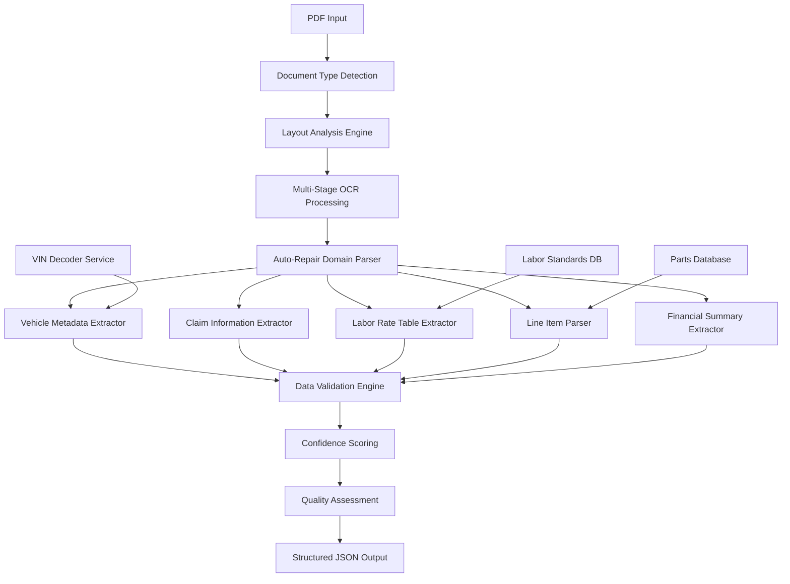

# Auto-Repair PDF Extraction Service Specification

## Overview

This document specifies the comprehensive PDF extraction service for auto-repair estimates, designed to extract structured data from various auto-repair estimate formats and convert them into the standardized JSON output format. The service extends the existing Gemini-based PDF processing with specialized auto-repair domain knowledge and advanced OCR capabilities.

## Service Architecture

### High-Level Architecture



### Core Components

#### 1. Enhanced PDF Processing Pipeline

```typescript
export class AutoRepairPdfExtractionService {
  // Core extraction pipeline
  async extractAutoRepairClaim(pdfBuffer: Buffer): Promise<AutoRepairClaimData>;
  
  // Specialized extraction methods
  async extractClaimMetadata(pdfBuffer: Buffer): Promise<ClaimMetadata>;
  async extractVehicleInfo(pdfBuffer: Buffer): Promise<VehicleInfo>;
  async extractLaborRates(pdfBuffer: Buffer): Promise<LaborRateTable>;
  async extractLineItems(pdfBuffer: Buffer): Promise<AutoRepairLineItem[]>;
  async extractFinancialSummary(pdfBuffer: Buffer): Promise<FinancialSummary>;
  
  // Advanced analysis
  async analyzeDocumentStructure(pdfBuffer: Buffer): Promise<DocumentStructure>;
  async detectDocumentType(pdfBuffer: Buffer): Promise<DocumentTypeResult>;
  async extractTimestamps(pdfBuffer: Buffer): Promise<ClaimDates>;
  
  // Quality assurance
  async validateExtraction(extractedData: AutoRepairClaimData): Promise<ValidationResult>;
  async calculateExtractionConfidence(pdfBuffer: Buffer): Promise<ConfidenceMetrics>;
}
```

## Document Type Detection

### 1. Supported Document Formats

```typescript
export enum AutoRepairDocumentFormat {
  // Major estimating systems
  CCC_ONE = 'ccc_one',
  MITCHELL = 'mitchell',
  AUDATEX = 'audatex',
  
  // Insurance company formats
  STATE_FARM = 'state_farm',
  GEICO = 'geico',
  PROGRESSIVE = 'progressive',
  ALLSTATE = 'allstate',
  USAA = 'usaa',
  
  // Shop management systems
  SHOP_KEY = 'shop_key',
  BODY_SHOP_PRO = 'body_shop_pro',
  COLLISION_PLUS = 'collision_plus',
  
  // Generic formats
  GENERIC_ESTIMATE = 'generic_estimate',
  HANDWRITTEN = 'handwritten',
  UNKNOWN = 'unknown'
}

export interface DocumentTypeResult {
  format: AutoRepairDocumentFormat;
  confidence: number;
  layout_characteristics: LayoutCharacteristics;
  extraction_strategy: ExtractionStrategy;
  known_limitations: string[];
}

export interface LayoutCharacteristics {
  has_header_logo: boolean;
  has_tabular_data: boolean;
  has_line_item_section: boolean;
  has_totals_section: boolean;
  text_density: TextDensity;
  image_elements: ImageElement[];
  table_structures: TableStructure[];
}
```

### 2. Document Analysis Engine

```typescript
export class DocumentAnalysisEngine {
  // Layout detection
  async analyzeLayout(pdfBuffer: Buffer): Promise<LayoutAnalysis>;
  async detectTables(pdfBuffer: Buffer): Promise<TableDetectionResult[]>;
  async identifyTextRegions(pdfBuffer: Buffer): Promise<TextRegion[]>;
  async locateKeyFields(pdfBuffer: Buffer): Promise<KeyFieldLocation[]>;
  
  // Content analysis
  async analyzeTextPatterns(text: string): Promise<TextPatternAnalysis>;
  async detectCurrencyValues(text: string): Promise<CurrencyValue[]>;
  async identifyDates(text: string): Promise<DateValue[]>;
  async extractVINPatterns(text: string): Promise<VINCandidate[]>;
  
  // Quality assessment
  async assessImageQuality(pdfBuffer: Buffer): Promise<ImageQualityMetrics>;
  async detectOCRChallenges(pdfBuffer: Buffer): Promise<OCRChallenge[]>;
}
```

## Multi-Stage OCR Processing

### 1. OCR Strategy Selection

```typescript
export interface OCRStrategy {
  primary_engine: OCREngine;
  fallback_engines: OCREngine[];
  preprocessing_steps: PreprocessingStep[];
  confidence_threshold: number;
  validation_rules: ValidationRule[];
}

export enum OCREngine {
  TESSERACT = 'tesseract',
  GOOGLE_VISION = 'google_vision',
  AWS_TEXTRACT = 'aws_textract',
  AZURE_COGNITIVE = 'azure_cognitive',
  GEMINI_VISION = 'gemini_vision'
}

export interface PreprocessingStep {
  step_type: PreprocessingType;
  parameters: Record<string, any>;
  target_regions?: BoundingBox[];
}

export enum PreprocessingType {
  DESKEW = 'deskew',
  NOISE_REDUCTION = 'noise_reduction',
  CONTRAST_ENHANCEMENT = 'contrast_enhancement',
  BINARIZATION = 'binarization',
  SCALE_NORMALIZATION = 'scale_normalization'
}
```

### 2. Advanced OCR Processing

```typescript
export class AdvancedOCRProcessor {
  // Multi-engine OCR
  async processWithMultipleEngines(
    pdfBuffer: Buffer, 
    strategy: OCRStrategy
  ): Promise<OCRResult[]>;
  
  // Specialized processing
  async processTabularData(
    region: BoundingBox, 
    pdfBuffer: Buffer
  ): Promise<TabularOCRResult>;
  
  async processHandwrittenText(
    region: BoundingBox, 
    pdfBuffer: Buffer
  ): Promise<HandwrittenOCRResult>;
  
  async processNumericFields(
    regions: BoundingBox[], 
    pdfBuffer: Buffer
  ): Promise<NumericOCRResult[]>;
  
  // Quality enhancement
  async enhanceImageQuality(
    pdfBuffer: Buffer, 
    enhancements: ImageEnhancement[]
  ): Promise<Buffer>;
  
  async validateOCRResults(
    results: OCRResult[], 
    validationRules: ValidationRule[]
  ): Promise<ValidationResult>;
}
```

## Auto-Repair Domain Parser

### 1. Vehicle Information Extraction

```typescript
export class VehicleInfoExtractor {
  // Core vehicle data
  async extractVIN(text: string): Promise<VINExtractionResult>;
  async extractYearMakeModel(text: string): Promise<YearMakeModelResult>;
  async extractMileage(text: string): Promise<MileageResult>;
  
  // Enhanced vehicle data
  async extractTrimLevel(text: string, ymm: YearMakeModelResult): Promise<TrimResult>;
  async extractEngineInfo(text: string): Promise<EngineInfoResult>;
  async extractTransmissionInfo(text: string): Promise<TransmissionResult>;
  
  // Validation and enrichment
  async validateVIN(vin: string): Promise<VINValidationResult>;
  async enrichVehicleData(basicInfo: VehicleInfo): Promise<EnrichedVehicleInfo>;
  async lookupVehicleSpecs(vin: string): Promise<VehicleSpecifications>;
}

export interface VINExtractionResult {
  vin: string;
  confidence: number;
  location: TextLocation;
  validation_result: VINValidationResult;
  decoded_info: VINDecodedInfo;
}

export interface VINDecodedInfo {
  manufacturer: string;
  brand: string;
  model: string;
  year: number;
  engine: string;
  transmission: string;
  body_style: string;
  country_of_origin: string;
  plant_code: string;
}
```

### 2. Claim Information Extraction

```typescript
export class ClaimInfoExtractor {
  // Basic claim data
  async extractClaimNumber(text: string): Promise<ClaimNumberResult>;
  async extractPolicyNumber(text: string): Promise<PolicyNumberResult>;
  async extractDateOfLoss(text: string): Promise<DateResult>;
  async extractPointOfImpact(text: string): Promise<PointOfImpactResult>;
  
  // Location and contact info
  async extractInspectionLocation(text: string): Promise<LocationResult>;
  async extractShopInfo(text: string): Promise<ShopInfoResult>;
  async extractAdjusterInfo(text: string): Promise<AdjusterInfoResult>;
  
  // Advanced extraction
  async extractAccidentDescription(text: string): Promise<AccidentDescriptionResult>;
  async extractDamageDescription(text: string): Promise<DamageDescriptionResult>;
  async extractRepairInstructions(text: string): Promise<RepairInstructionsResult>;
}

export interface PointOfImpactResult {
  impact_zone: ImpactZone;
  confidence: number;
  raw_text: string;
  standardized_description: string;
  damage_severity_indicators: string[];
}
```

### 3. Labor Rate Table Extraction

```typescript
export class LaborRateExtractor {
  // Rate extraction
  async extractLaborRates(text: string): Promise<LaborRateExtractionResult>;
  async extractRateEffectiveDate(text: string): Promise<DateResult>;
  async extractRateJustification(text: string): Promise<RateJustificationResult>;
  
  // Rate validation
  async validateRatesAgainstMarket(
    rates: LaborRateTable, 
    location: string
  ): Promise<RateValidationResult>;
  
  async compareToIndustryStandards(
    rates: LaborRateTable
  ): Promise<IndustryComparisonResult>;
  
  // Rate analysis
  async analyzeRateProgression(
    historicalRates: LaborRateTable[]
  ): Promise<RateProgressionAnalysis>;
}

export interface LaborRateExtractionResult {
  rates: LaborRateTable;
  confidence: ConfidenceMetrics;
  extraction_method: ExtractionMethod;
  validation_results: RateValidationResult[];
  market_comparison: MarketRateComparison;
}
```

### 4. Line Item Parser

```typescript
export class LineItemParser {
  // Core parsing
  async parseLineItems(
    tabularData: TabularOCRResult
  ): Promise<LineItemParsingResult>;
  
  async classifyLineItem(
    item: RawLineItem
  ): Promise<LineItemClassificationResult>;
  
  async extractPartNumbers(text: string): Promise<PartNumberResult[]>;
  async extractLaborOperations(text: string): Promise<LaborOperationResult[]>;
  
  // Enhanced parsing
  async identifyOEMAftermarket(
    partDescription: string
  ): Promise<OEMAftermarketResult>;
  
  async extractSupplierInfo(text: string): Promise<SupplierInfoResult>;
  async calculateLaborHours(
    operation: string, 
    vehicleInfo: VehicleInfo
  ): Promise<LaborHoursResult>;
  
  // Validation and enrichment
  async validateLineItemCalculations(
    item: AutoRepairLineItem
  ): Promise<CalculationValidationResult>;
  
  async enrichWithIndustryData(
    item: AutoRepairLineItem
  ): Promise<EnrichedLineItem>;
}

export interface LineItemParsingResult {
  parsed_items: AutoRepairLineItem[];
  parsing_confidence: number;
  classification_results: LineItemClassificationResult[];
  validation_issues: ValidationIssue[];
  enrichment_data: EnrichmentData[];
}
```

## Data Validation Engine

### 1. Multi-Level Validation

```typescript
export class DataValidationEngine {
  // Structural validation
  async validateDocumentStructure(
    extractedData: AutoRepairClaimData
  ): Promise<StructuralValidationResult>;
  
  // Business rule validation
  async validateBusinessRules(
    extractedData: AutoRepairClaimData
  ): Promise<BusinessRuleValidationResult>;
  
  // Cross-field validation
  async validateCrossFieldConsistency(
    extractedData: AutoRepairClaimData
  ): Promise<ConsistencyValidationResult>;
  
  // Industry standard validation
  async validateAgainstIndustryStandards(
    extractedData: AutoRepairClaimData
  ): Promise<IndustryValidationResult>;
  
  // Mathematical validation
  async validateCalculations(
    lineItems: AutoRepairLineItem[]
  ): Promise<CalculationValidationResult>;
}

export interface ValidationResult {
  is_valid: boolean;
  confidence_score: number;
  validation_issues: ValidationIssue[];
  warnings: ValidationWarning[];
  recommendations: ValidationRecommendation[];
}

export interface ValidationIssue {
  issue_type: ValidationIssueType;
  severity: SeverityLevel;
  field_path: string;
  description: string;
  suggested_fix: string;
  confidence: number;
}

export enum ValidationIssueType {
  MISSING_REQUIRED_FIELD = 'missing_required_field',
  INVALID_FORMAT = 'invalid_format',
  OUT_OF_RANGE = 'out_of_range',
  CALCULATION_ERROR = 'calculation_error',
  INCONSISTENT_DATA = 'inconsistent_data',
  BUSINESS_RULE_VIOLATION = 'business_rule_violation'
}
```

### 2. Confidence Scoring System

```typescript
export class ConfidenceScoringEngine {
  // Overall confidence calculation
  async calculateOverallConfidence(
    extractedData: AutoRepairClaimData,
    ocrResults: OCRResult[],
    validationResults: ValidationResult[]
  ): Promise<OverallConfidenceScore>;
  
  // Field-level confidence
  async calculateFieldConfidence(
    fieldValue: any,
    extractionContext: ExtractionContext
  ): Promise<FieldConfidenceScore>;
  
  // Confidence factors
  async analyzeOCRQuality(ocrResults: OCRResult[]): Promise<OCRQualityScore>;
  async analyzeDocumentQuality(pdfBuffer: Buffer): Promise<DocumentQualityScore>;
  async analyzeDataConsistency(data: AutoRepairClaimData): Promise<ConsistencyScore>;
  
  // Confidence reporting
  async generateConfidenceReport(
    confidenceScores: ConfidenceScore[]
  ): Promise<ConfidenceReport>;
}

export interface OverallConfidenceScore {
  overall_score: number;
  component_scores: {
    ocr_quality: number;
    data_completeness: number;
    validation_success: number;
    business_rule_compliance: number;
    calculation_accuracy: number;
  };
  confidence_factors: ConfidenceFactor[];
  reliability_indicators: ReliabilityIndicator[];
}
```

## Integration with Existing Services

### 1. Gemini Service Enhancement

```typescript
// Enhanced Gemini prompts for auto-repair specific analysis
export class EnhancedGeminiService extends GeminiService {
  // Auto-repair specific prompts
  async analyzeAutoRepairEstimate(
    pdfFiles: File[]
  ): Promise<AutoRepairClaimData>;
  
  async extractVehicleInformation(
    pdfContent: string
  ): Promise<VehicleInfo>;
  
  async analyzeLaborRates(
    pdfContent: string,
    location: string
  ): Promise<LaborRateAnalysis>;
  
  async detectScopeCreep(
    originalEstimate: string,
    supplementEstimate: string
  ): Promise<ScopeCreepAnalysis>;
  
  // Enhanced validation
  async validateExtractionResults(
    extractedData: AutoRepairClaimData,
    originalPdfContent: string
  ): Promise<ValidationResult>;
}
```

### 2. External Service Integration

```typescript
export class ExternalServiceIntegrator {
  // VIN decoding services
  async decodeVIN(vin: string): Promise<VINDecodingResult>;
  
  // Parts pricing services
  async lookupPartPricing(
    partNumber: string,
    vehicleInfo: VehicleInfo
  ): Promise<PartPricingResult>;
  
  // Labor time standards
  async lookupLaborTimes(
    operation: string,
    vehicleInfo: VehicleInfo
  ): Promise<LaborTimeResult>;
  
  // Market rate data
  async getMarketRates(
    location: string,
    shopType: string
  ): Promise<MarketRateData>;
  
  // Industry benchmarks
  async getIndustryBenchmarks(
    repairType: string,
    vehicleCategory: string
  ): Promise<IndustryBenchmarkData>;
}
```

## Error Handling and Recovery

### 1. Extraction Error Handling

```typescript
export class ExtractionErrorHandler {
  // Error recovery strategies
  async handleOCRFailure(
    pdfBuffer: Buffer,
    failedRegions: BoundingBox[]
  ): Promise<RecoveryResult>;
  
  async handleParsingErrors(
    rawText: string,
    parsingErrors: ParsingError[]
  ): Promise<RecoveryResult>;
  
  async handleValidationFailures(
    extractedData: AutoRepairClaimData,
    validationIssues: ValidationIssue[]
  ): Promise<RecoveryResult>;
  
  // Fallback mechanisms
  async attemptManualExtraction(
    pdfBuffer: Buffer,
    failedFields: string[]
  ): Promise<ManualExtractionResult>;
  
  async useAlternativeExtractionMethod(
    pdfBuffer: Buffer,
    primaryMethod: ExtractionMethod
  ): Promise<AlternativeExtractionResult>;
}

export interface RecoveryResult {
  recovery_successful: boolean;
  recovered_data: Partial<AutoRepairClaimData>;
  remaining_issues: ValidationIssue[];
  confidence_impact: number;
  recovery_method: RecoveryMethod;
}
```

### 2. Quality Assurance Pipeline

```typescript
export class QualityAssurancePipeline {
  // Quality gates
  async checkMinimumDataRequirements(
    extractedData: AutoRepairClaimData
  ): Promise<QualityGateResult>;
  
  async validateCriticalFields(
    extractedData: AutoRepairClaimData
  ): Promise<CriticalFieldValidationResult>;
  
  async assessDataReliability(
    extractedData: AutoRepairClaimData,
    extractionMetadata: ExtractionMetadata
  ): Promise<ReliabilityAssessment>;
  
  // Quality improvement
  async suggestDataImprovements(
    extractedData: AutoRepairClaimData,
    qualityIssues: QualityIssue[]
  ): Promise<ImprovementSuggestion[]>;
  
  async generateQualityReport(
    extractedData: AutoRepairClaimData,
    qualityMetrics: QualityMetrics
  ): Promise<QualityReport>;
}
```

## Performance Optimization

### 1. Processing Optimization

```typescript
export interface ProcessingOptimization {
  // Parallel processing
  parallel_ocr_engines: boolean;
  concurrent_field_extraction: boolean;
  batch_validation: boolean;
  
  // Caching strategies
  ocr_result_caching: boolean;
  validation_rule_caching: boolean;
  industry_data_caching: boolean;
  
  // Resource management
  memory_optimization: boolean;
  cpu_optimization: boolean;
  network_optimization: boolean;
}

export class PerformanceOptimizer {
  // Processing optimization
  async optimizeOCRProcessing(
    pdfBuffer: Buffer,
    requirements: ProcessingRequirements
  ): Promise<OptimizedOCRStrategy>;
  
  async optimizeExtractionPipeline(
    documentType: AutoRepairDocumentFormat
  ): Promise<OptimizedExtractionPipeline>;
  
  // Resource management
  async manageMemoryUsage(
    processingSteps: ProcessingStep[]
  ): Promise<MemoryOptimizationResult>;
  
  async optimizeNetworkCalls(
    externalServiceCalls: ExternalServiceCall[]
  ): Promise<NetworkOptimizationResult>;
}
```

### 2. Scalability Considerations

```typescript
export interface ScalabilityMetrics {
  max_concurrent_extractions: number;
  average_processing_time: number;
  memory_usage_per_extraction: number;
  cpu_utilization: number;
  error_rate: number;
  throughput: number;
}

export class ScalabilityManager {
  // Load management
  async manageExtractionQueue(
    queuedExtractions: ExtractionRequest[]
  ): Promise<QueueManagementResult>;
  
  async balanceProcessingLoad(
    activeExtractions: ActiveExtraction[]
  ): Promise<LoadBalancingResult>;
  
  // Performance monitoring
  async monitorPerformanceMetrics(): Promise<PerformanceMetrics>;
  async detectPerformanceBottlenecks(): Promise<BottleneckAnalysis>;
  
  // Auto-scaling
  async adjustProcessingCapacity(
    currentLoad: number,
    projectedLoad: number
  ): Promise<CapacityAdjustmentResult>;
}
```

## Testing and Validation Framework

### 1. Test Data Management

```typescript
export class TestDataManager {
  // Test document library
  async loadTestDocuments(
    documentType: AutoRepairDocumentFormat
  ): Promise<TestDocument[]>;
  
  async generateSyntheticTestData(
    specifications: TestDataSpecification
  ): Promise<SyntheticTestDocument[]>;
  
  // Ground truth management
  async loadGroundTruthData(
    testDocumentId: string
  ): Promise<GroundTruthData>;
  
  async validateGroundTruth(
    groundTruth: GroundTruthData
  ): Promise<GroundTruthValidationResult>;
  
  // Test result analysis
  async compareExtractionResults(
    extractedData: AutoRepairClaimData,
    groundTruth: GroundTruthData
  ): Promise<ComparisonResult>;
}
```

### 2. Accuracy Testing

```typescript
export class AccuracyTestingSuite {
  // Field-level accuracy testing
  async testFieldExtractionAccuracy(
    testCases: FieldExtractionTestCase[]
  ): Promise<FieldAccuracyResults>;
  
  // End-to-end accuracy testing
  async testCompleteExtractionAccuracy(
    testDocuments: TestDocument[]
  ): Promise<CompleteAccuracyResults>;
  
  // Regression testing
  async runRegressionTests(
    testSuite: TestSuite
  ): Promise<RegressionTestResults>;
  
  // Performance testing
  async testExtractionPerformance(
    performanceTestCases: PerformanceTestCase[]
  ): Promise<PerformanceTestResults>;
}
```

## Implementation Roadmap

### Phase 1: Core Infrastructure (Weeks 1-2)
1. **Document Type Detection**: Implement format recognition for major estimating systems
2. **Basic OCR Pipeline**: Set up multi-engine OCR processing with Tesseract and Gemini Vision
3. **Vehicle Info Extraction**: Implement VIN decoding and basic vehicle information extraction
4. **Data Validation Framework**: Build core validation engine with business rules

### Phase 2: Advanced Extraction (Weeks 3-4)
1. **Labor Rate Extraction**: Implement comprehensive labor rate table parsing
2. **Line Item Parser**: Build advanced line item classification and parsing
3. **Financial Summary Extraction**: Implement totals and financial data extraction
4. **Quality Assurance Pipeline**: Build confidence scoring and quality assessment

### Phase 3: Integration & Enhancement (Weeks 5-6)
1. **External Service Integration**: Connect VIN decoding, parts pricing, and labor standards
2. **Advanced Validation**: Implement cross-field validation and industry standard checks
3. **Error Handling**: Build comprehensive error recovery and fallback mechanisms
4. **Performance Optimization**: Implement caching, parallel processing, and resource management

### Phase 4: Testing & Deployment (Weeks 7-8)
1. **Comprehensive Testing**: Build test data library and accuracy testing suite
2. **Performance Testing**: Validate scalability and performance requirements
3. **Integration Testing**: Test with existing SupplementGuard components
4. **Documentation**: Complete technical documentation and user guides

## Success Metrics

### Accuracy Requirements
- **Overall Extraction Accuracy**: > 95% for structured documents
- **VIN Extraction Accuracy**: > 99% for clear, undamaged VINs
- **Financial Data Accuracy**: > 98% for totals and calculations
- **Line Item Classification**: > 90% correct category assignment
- **Labor Rate Extraction**: > 95% accuracy for standard rate tables

### Performance Requirements
- **Processing Time**: < 10 seconds for typical auto-repair estimates
- **Memory Usage**: < 200MB per extraction session
- **Concurrent Processing**: Support 10+ simultaneous extractions
- **Error Rate**: < 5% unrecoverable extraction failures
- **Confidence Scoring**: Accurate confidence assessment with < 10% variance

### Quality Requirements
- **Data Completeness**: > 90% of critical fields extracted successfully
- **Validation Success**: > 95% of extracted data passes business rule validation
- **Recovery Rate**: > 80% of failed extractions recoverable through fallback methods
- **User Satisfaction**: Clear error messages and actionable recommendations

## Conclusion

This comprehensive PDF extraction service specification provides the foundation for accurate, reliable, and scalable auto-repair estimate processing. The service leverages advanced OCR technologies, domain-specific knowledge, and robust validation frameworks to deliver high-quality structured data extraction that meets the demanding requirements of professional claims analysis.

The modular architecture ensures maintainability and extensibility while the comprehensive testing framework guarantees accuracy and reliability in production environments.