# Auto-Repair Specific UI Components and Dashboards Specification

## Overview

This document specifies comprehensive UI components and dashboard interfaces designed specifically for auto-repair claims auditing. The system extends the existing SupplementGuard UI framework with specialized components for vehicle damage visualization, repair timeline tracking, parts analysis, labor efficiency monitoring, and executive-level auto-repair insights while maintaining the professional design standards and responsive architecture.

## UI Architecture and Design System

### High-Level UI Architecture

```mermaid
graph TB
    A[Auto-Repair UI Framework] --> B[Component Library]
    A --> C[Dashboard System]
    A --> D[Visualization Engine]
    A --> E[Interaction System]
    
    B --> F[Vehicle Components]
    B --> G[Damage Visualization]
    B --> H[Labor Analysis Components]
    B --> I[Parts Analysis Components]
    B --> J[Timeline Components]
    
    C --> K[Executive Dashboard]
    C --> L[Claims Analyst Dashboard]
    C --> M[Adjuster Dashboard]
    C --> N[Shop Manager Dashboard]
    
    D --> O[3D Vehicle Models]
    D --> P[Damage Heat Maps]
    D --> Q[Cost Evolution Charts]
    D --> R[Timeline Gantt Charts]
    
    E --> S[Touch Interactions]
    E --> T[Voice Commands]
    E --> U[Gesture Controls]
    E --> V[Keyboard Shortcuts]
```



### Design System Foundation

```typescript
export interface AutoRepairDesignSystem {
  // Color palette
  colors: {
    // Vehicle damage severity
    damage_critical: '#FF4444';
    damage_major: '#FF8800';
    damage_moderate: '#FFAA00';
    damage_minor: '#FFDD00';
    damage_cosmetic: '#88DD00';
    
    // Cost indicators
    cost_high: '#FF6B6B';
    cost_medium: '#FFE66D';
    cost_low: '#4ECDC4';
    cost_savings: '#45B7D1';
    
    // Risk levels
    risk_critical: '#E74C3C';
    risk_high: '#F39C12';
    risk_medium: '#F1C40F';
    risk_low: '#27AE60';
    
    // Status indicators
    status_approved: '#2ECC71';
    status_pending: '#F39C12';
    status_rejected: '#E74C3C';
    status_review: '#9B59B6';
  };
  
  // Typography
  typography: {
    // Headers
    header_primary: 'Inter, -apple-system, BlinkMacSystemFont, sans-serif';
    header_secondary: 'Inter, -apple-system, BlinkMacSystemFont, sans-serif';
    
    // Body text
    body_primary: 'Inter, -apple-system, BlinkMacSystemFont, sans-serif';
    body_secondary: 'Inter, -apple-system, BlinkMacSystemFont, sans-serif';
    
    // Monospace for data
    data_display: 'JetBrains Mono, Consolas, Monaco, monospace';
  };
  
  // Spacing system
  spacing: {
    xs: '4px';
    sm: '8px';
    md: '16px';
    lg: '24px';
    xl: '32px';
    xxl: '48px';
  };
  
  // Component sizing
  sizing: {
    // Dashboard cards
    card_small: { width: '300px', height: '200px' };
    card_medium: { width: '400px', height: '300px' };
    card_large: { width: '600px', height: '400px' };
    
    // Vehicle diagrams
    vehicle_thumbnail: { width: '150px', height: '100px' };
    vehicle_detail: { width: '400px', height: '300px' };
    vehicle_fullscreen: { width: '100%', height: '600px' };
  };
}
```

## Vehicle Visualization Components

### 1. Interactive Vehicle Damage Diagram

```typescript
export interface VehicleDamageDiagramProps {
  // Vehicle data
  vehicleInfo: VehicleInformation;
  damageData: DamageData[];
  repairData: RepairData[];
  
  // Visualization options
  viewMode: 'top' | 'side' | 'front' | 'rear' | '3d';
  showDamageHeatMap: boolean;
  showRepairAreas: boolean;
  showCostOverlay: boolean;
  
  // Interaction options
  enableZoom: boolean;
  enablePan: boolean;
  enableSelection: boolean;
  enableAnnotations: boolean;
  
  // Event handlers
  onDamageAreaClick: (damageArea: DamageArea) => void;
  onRepairAreaHover: (repairArea: RepairArea) => void;
  onAnnotationAdd: (annotation: Annotation) => void;
}

export const VehicleDamageDiagram: React.FC<VehicleDamageDiagramProps> = ({
  vehicleInfo,
  damageData,
  repairData,
  viewMode,
  showDamageHeatMap,
  showRepairAreas,
  showCostOverlay,
  enableZoom,
  enablePan,
  enableSelection,
  enableAnnotations,
  onDamageAreaClick,
  onRepairAreaHover,
  onAnnotationAdd
}) => {
  // Component implementation
  return (
    <div className="vehicle-damage-diagram">
      <VehicleCanvas
        vehicle={vehicleInfo}
        viewMode={viewMode}
        enableZoom={enableZoom}
        enablePan={enablePan}
      />
      
      {showDamageHeatMap && (
        <DamageHeatMapOverlay
          damageData={damageData}
          onAreaClick={onDamageAreaClick}
        />
      )}
      
      {showRepairAreas && (
        <RepairAreasOverlay
          repairData={repairData}
          onAreaHover={onRepairAreaHover}
        />
      )}
      
      {showCostOverlay && (
        <CostOverlay
          costData={calculateCostByArea(damageData, repairData)}
        />
      )}
      
      {enableAnnotations && (
        <AnnotationLayer
          onAnnotationAdd={onAnnotationAdd}
        />
      )}
      
      <VehicleDiagramControls
        viewMode={viewMode}
        onViewModeChange={setViewMode}
        overlayControls={{
          damageHeatMap: showDamageHeatMap,
          repairAreas: showRepairAreas,
          costOverlay: showCostOverlay
        }}
      />
    </div>
  );
};
```

### 2. 3D Vehicle Model Viewer

```typescript
export interface Vehicle3DViewerProps {
  // 3D model data
  vehicleModel: Vehicle3DModel;
  damagePoints: DamagePoint3D[];
  repairAreas: RepairArea3D[];
  
  // Rendering options
  renderQuality: 'low' | 'medium' | 'high';
  enableLighting: boolean;
  enableShadows: boolean;
  enableReflections: boolean;
  
  // Camera controls
  enableOrbitControls: boolean;
  enableZoom: boolean;
  initialCameraPosition: CameraPosition;
  
  // Interaction features
  enableDamageInspection: boolean;
  enableMeasurements: boolean;
  enableCrossSections: boolean;
  
  // Event handlers
  onDamagePointClick: (damagePoint: DamagePoint3D) => void;
  onMeasurementComplete: (measurement: Measurement3D) => void;
}

export const Vehicle3DViewer: React.FC<Vehicle3DViewerProps> = ({
  vehicleModel,
  damagePoints,
  repairAreas,
  renderQuality,
  enableLighting,
  enableShadows,
  enableReflections,
  enableOrbitControls,
  enableZoom,
  initialCameraPosition,
  enableDamageInspection,
  enableMeasurements,
  enableCrossSections,
  onDamagePointClick,
  onMeasurementComplete
}) => {
  // 3D rendering implementation using Three.js or similar
  return (
    <div className="vehicle-3d-viewer">
      <Canvas3D
        model={vehicleModel}
        quality={renderQuality}
        lighting={enableLighting}
        shadows={enableShadows}
        reflections={enableReflections}
        cameraPosition={initialCameraPosition}
      />
      
      <DamagePoints3D
        points={damagePoints}
        onClick={onDamagePointClick}
        inspectionMode={enableDamageInspection}
      />
      
      <RepairAreas3D
        areas={repairAreas}
        highlightMode="outline"
      />
      
      {enableMeasurements && (
        <MeasurementTools3D
          onMeasurementComplete={onMeasurementComplete}
        />
      )}
      
      {enableCrossSections && (
        <CrossSectionControls
          onCrossSectionChange={handleCrossSectionChange}
        />
      )}
      
      <Camera3DControls
        enableOrbit={enableOrbitControls}
        enableZoom={enableZoom}
      />
    </div>
  );
};
```

## Claims Analysis Dashboard Components

### 1. Comprehensive Claims Overview Dashboard

```typescript
export interface ClaimsOverviewDashboardProps {
  // Claims data
  claimData: AutoRepairClaimData;
  analysisResults: ClaimAnalysisResult[];
  riskAssessment: RiskAssessmentResult;
  
  // Display preferences
  timeRange: TimeRange;
  detailLevel: 'summary' | 'detailed' | 'comprehensive';
  focusAreas: FocusArea[];
  
  // Interactive features
  enableDrillDown: boolean;
  enableExport: boolean;
  enableRealTimeUpdates: boolean;
  
  // Event handlers
  onClaimSelect: (claimId: string) => void;
  onAnalysisUpdate: (analysisId: string) => void;
  onRiskAlertClick: (alert: RiskAlert) => void;
}

export const ClaimsOverviewDashboard: React.FC<ClaimsOverviewDashboardProps> = ({
  claimData,
  analysisResults,
  riskAssessment,
  timeRange,
  detailLevel,
  focusAreas,
  enableDrillDown,
  enableExport,
  enableRealTimeUpdates,
  onClaimSelect,
  onAnalysisUpdate,
  onRiskAlertClick
}) => {
  return (
    <div className="claims-overview-dashboard">
      {/* Header with key metrics */}
      <DashboardHeader>
        <ClaimSummaryCards
          totalClaims={claimData.totalClaims}
          totalValue={claimData.totalValue}
          averageValue={claimData.averageValue}
          riskLevel={riskAssessment.overallRiskLevel}
        />
      </DashboardHeader>
      
      {/* Main content area */}
      <DashboardGrid>
        {/* Vehicle damage visualization */}
        <GridItem span={2}>
          <VehicleDamageOverview
            vehicleInfo={claimData.vehicleInfo}
            damageData={claimData.damageData}
            onDamageAreaClick={handleDamageAreaClick}
          />
        </GridItem>
        
        {/* Cost evolution chart */}
        <GridItem span={2}>
          <CostEvolutionChart
            costHistory={claimData.costHistory}
            timeRange={timeRange}
            enableDrillDown={enableDrillDown}
          />
        </GridItem>
        
        {/* Risk assessment panel */}
        <GridItem span={1}>
          <RiskAssessmentPanel
            riskAssessment={riskAssessment}
            onAlertClick={onRiskAlertClick}
          />
        </GridItem>
        
        {/* Timeline visualization */}
        <GridItem span={3}>
          <RepairTimelineVisualization
            timelineData={claimData.timelineData}
            milestones={claimData.milestones}
            enableInteraction={true}
          />
        </GridItem>
        
        {/* Parts analysis */}
        <GridItem span={2}>
          <PartsAnalysisOverview
            partsData={claimData.partsData}
            optimizationOpportunities={analysisResults.partsOptimization}
          />
        </GridItem>
        
        {/* Labor analysis */}
        <GridItem span={2}>
          <LaborAnalysisOverview
            laborData={claimData.laborData}
            efficiencyMetrics={analysisResults.laborEfficiency}
          />
        </GridItem>
      </DashboardGrid>
      
      {/* Footer with actions */}
      <DashboardFooter>
        <ActionButtons
          enableExport={enableExport}
          onExport={handleExport}
          onRefresh={handleRefresh}
        />
      </DashboardFooter>
    </div>
  );
};
```

### 2. Risk Assessment Visualization Components

```typescript
export interface RiskAssessmentPanelProps {
  riskAssessment: RiskAssessmentResult;
  displayMode: 'gauge' | 'chart' | 'heatmap';
  showDetails: boolean;
  enableAlerts: boolean;
  onAlertClick: (alert: RiskAlert) => void;
  onRiskFactorClick: (factor: RiskFactor) => void;
}

export const RiskAssessmentPanel: React.FC<RiskAssessmentPanelProps> = ({
  riskAssessment,
  displayMode,
  showDetails,
  enableAlerts,
  onAlertClick,
  onRiskFactorClick
}) => {
  return (
    <div className="risk-assessment-panel">
      <PanelHeader>
        <h3>Risk Assessment</h3>
        <RiskLevelIndicator level={riskAssessment.overallRiskLevel} />
      </PanelHeader>
      
      <PanelContent>
        {displayMode === 'gauge' && (
          <RiskGauge
            riskScore={riskAssessment.overallRiskScore}
            maxScore={100}
            thresholds={riskAssessment.riskThresholds}
          />
        )}
        
        {displayMode === 'chart' && (
          <RiskFactorsChart
            riskFactors={riskAssessment.riskFactors}
            onFactorClick={onRiskFactorClick}
          />
        )}
        
        {displayMode === 'heatmap' && (
          <RiskHeatMap
            riskData={riskAssessment.riskByCategory}
            categories={riskAssessment.categories}
          />
        )}
        
        {showDetails && (
          <RiskDetailsPanel>
            <RiskFactorsList
              factors={riskAssessment.riskFactors}
              onFactorClick={onRiskFactorClick}
            />
            
            <RiskTrendChart
              trendData={riskAssessment.riskTrend}
              timeRange="30d"
            />
          </RiskDetailsPanel>
        )}
        
        {enableAlerts && riskAssessment.activeAlerts.length > 0 && (
          <RiskAlertsSection>
            {riskAssessment.activeAlerts.map(alert => (
              <RiskAlert
                key={alert.id}
                alert={alert}
                onClick={() => onAlertClick(alert)}
              />
            ))}
          </RiskAlertsSection>
        )}
      </PanelContent>
    </div>
  );
};
```

## Labor Analysis Components

### 1. Labor Efficiency Dashboard

```typescript
export interface LaborEfficiencyDashboardProps {
  laborData: LaborAnalysisData;
  efficiencyMetrics: LaborEfficiencyMetrics;
  benchmarkData: LaborBenchmarkData;
  timeRange: TimeRange;
  
  // Display options
  showBenchmarks: boolean;
  showTrends: boolean;
  showDetails: boolean;
  
  // Interaction options
  enableDrillDown: boolean;
  enableComparison: boolean;
  
  // Event handlers
  onOperationClick: (operation: LaborOperation) => void;
  onBenchmarkToggle: (benchmark: BenchmarkType) => void;
}

export const LaborEfficiencyDashboard: React.FC<LaborEfficiencyDashboardProps> = ({
  laborData,
  efficiencyMetrics,
  benchmarkData,
  timeRange,
  showBenchmarks,
  showTrends,
  showDetails,
  enableDrillDown,
  enableComparison,
  onOperationClick,
  onBenchmarkToggle
}) => {
  return (
    <div className="labor-efficiency-dashboard">
      {/* Efficiency overview */}
      <EfficiencyOverviewSection>
        <EfficiencyScoreCard
          score={efficiencyMetrics.overallEfficiencyScore}
          trend={efficiencyMetrics.efficiencyTrend}
          benchmark={benchmarkData.industryAverage}
        />
        
        <LaborCostSummary
          totalLaborCost={laborData.totalLaborCost}
          costPerHour={laborData.averageLaborRate}
          totalHours={laborData.totalLaborHours}
        />
        
        <EfficiencyTrendChart
          trendData={efficiencyMetrics.efficiencyHistory}
          timeRange={timeRange}
          showBenchmarks={showBenchmarks}
        />
      </EfficiencyOverviewSection>
      
      {/* Labor breakdown by category */}
      <LaborBreakdownSection>
        <LaborCategoryChart
          categories={laborData.laborCategories}
          onCategoryClick={handleCategoryClick}
        />
        
        <LaborOperationsTable
          operations={laborData.laborOperations}
          efficiencyMetrics={efficiencyMetrics.operationEfficiency}
          onOperationClick={onOperationClick}
          enableDrillDown={enableDrillDown}
        />
      </LaborBreakdownSection>
      
      {/* Efficiency analysis */}
      <EfficiencyAnalysisSection>
        <EfficiencyHeatMap
          operationData={laborData.laborOperations}
          efficiencyData={efficiencyMetrics.operationEfficiency}
        />
        
        {showBenchmarks && (
          <BenchmarkComparison
            currentData={efficiencyMetrics}
            benchmarkData={benchmarkData}
            onBenchmarkToggle={onBenchmarkToggle}
          />
        )}
        
        {showDetails && (
          <DetailedAnalysisPanel>
            <TimeVarianceAnalysis
              timeData={laborData.timeVariances}
            />
            
            <SkillLevelAnalysis
              skillData={laborData.skillLevelData}
            />
            
            <ProductivityAnalysis
              productivityData={efficiencyMetrics.productivityMetrics}
            />
          </DetailedAnalysisPanel>
        )}
      </EfficiencyAnalysisSection>
    </div>
  );
};
```

### 2. Labor Operations Detail Component

```typescript
export interface LaborOperationDetailProps {
  operation: LaborOperation;
  efficiencyData: OperationEfficiencyData;
  benchmarkData: OperationBenchmarkData;
  historicalData: OperationHistoricalData[];
  
  // Display options
  showTimeBreakdown: boolean;
  showCostAnalysis: boolean;
  showEfficiencyTrends: boolean;
  
  // Event handlers
  onTimeAdjustment: (adjustment: TimeAdjustment) => void;
  onCostOptimization: (optimization: CostOptimization) => void;
}

export const LaborOperationDetail: React.FC<LaborOperationDetailProps> = ({
  operation,
  efficiencyData,
  benchmarkData,
  historicalData,
  showTimeBreakdown,
  showCostAnalysis,
  showEfficiencyTrends,
  onTimeAdjustment,
  onCostOptimization
}) => {
  return (
    <div className="labor-operation-detail">
      <OperationHeader>
        <OperationTitle>{operation.description}</OperationTitle>
        <OperationCode>{operation.operationCode}</OperationCode>
        <EfficiencyBadge efficiency={efficiencyData.efficiencyRatio} />
      </OperationHeader>
      
      <OperationMetrics>
        <MetricCard
          title="Claimed Hours"
          value={operation.claimedHours}
          benchmark={benchmarkData.standardHours}
          variance={efficiencyData.timeVariance}
        />
        
        <MetricCard
          title="Labor Rate"
          value={operation.laborRate}
          benchmark={benchmarkData.marketRate}
          variance={efficiencyData.rateVariance}
        />
        
        <MetricCard
          title="Total Cost"
          value={operation.totalCost}
          benchmark={benchmarkData.benchmarkCost}
          variance={efficiencyData.costVariance}
        />
      </OperationMetrics>
      
      {showTimeBreakdown && (
        <TimeBreakdownSection>
          <TimeBreakdownChart
            timeData={operation.timeBreakdown}
            standardTime={benchmarkData.standardTime}
          />
          
          <TimeAdjustmentControls
            currentTime={operation.claimedHours}
            recommendedTime={efficiencyData.recommendedHours}
            onAdjustment={onTimeAdjustment}
          />
        </TimeBreakdownSection>
      )}
      
      {showCostAnalysis && (
        <CostAnalysisSection>
          <CostBreakdownChart
            costData={operation.costBreakdown}
            benchmarkCost={benchmarkData.benchmarkCost}
          />
          
          <CostOptimizationSuggestions
            suggestions={efficiencyData.optimizationSuggestions}
            onOptimization={onCostOptimization}
          />
        </CostAnalysisSection>
      )}
      
      {showEfficiencyTrends && (
        <EfficiencyTrendsSection>
          <EfficiencyTrendChart
            historicalData={historicalData}
            currentEfficiency={efficiencyData.efficiencyRatio}
          />
          
          <PerformanceIndicators
            indicators={efficiencyData.performanceIndicators}
          />
        </EfficiencyTrendsSection>
      )}
    </div>
  );
};
```

## Parts Analysis Components

### 1. Parts Optimization Dashboard

```typescript
export interface PartsOptimizationDashboardProps {
  partsData: PartsAnalysisData;
  optimizationData: PartsOptimizationData;
  marketData: PartsMarketData;
  
  // Display options
  showOEMvsAftermarket: boolean;
  showSupplierAnalysis: boolean;
  showCostOptimization: boolean;
  
  // Interaction options
  enablePartSelection: boolean;
  enableSupplierComparison: boolean;
  
  // Event handlers
  onPartClick: (part: PartData) => void;
  onOptimizationApply: (optimization: PartsOptimization) => void;
  onSupplierChange: (part: PartData, supplier: Supplier) => void;
}

export const PartsOptimizationDashboard: React.FC<PartsOptimizationDashboardProps> = ({
  partsData,
  optimizationData,
  marketData,
  showOEMvsAftermarket,
  showSupplierAnalysis,
  showCostOptimization,
  enablePartSelection,
  enableSupplierComparison,
  onPartClick,
  onOptimizationApply,
  onSupplierChange
}) => {
  return (
    <div className="parts-optimization-dashboard">
      {/* Parts overview */}
      <PartsOverviewSection>
        <PartsSummaryCards
          totalParts={partsData.totalParts}
          totalCost={partsData.totalCost}
          optimizationPotential={optimizationData.totalSavingsPotential}
        />
        
        <PartsDistributionChart
          partsData={partsData.partsByCategory}
          costData={partsData.costByCategory}
        />
      </PartsOverviewSection>
      
      {/* OEM vs Aftermarket analysis */}
      {showOEMvsAftermarket && (
        <OEMAftermarketSection>
          <OEMAftermarketComparison
            oemData={partsData.oemParts}
            aftermarketData={partsData.aftermarketParts}
            qualityMetrics={optimizationData.qualityMetrics}
          />
          
          <CostQualityMatrix
            partsData={partsData.allParts}
            qualityScores={optimizationData.qualityScores}
            onPartClick={onPartClick}
          />
        </OEMAftermarketSection>
      )}
      
      {/* Parts list with optimization suggestions */}
      <PartsListSection>
        <PartsOptimizationTable
          parts={partsData.allParts}
          optimizations={optimizationData.partOptimizations}
          marketPrices={marketData.marketPrices}
          onPartClick={onPartClick}
          onOptimizationApply={onOptimizationApply}
          enableSelection={enablePartSelection}
        />
      </PartsListSection>
      
      {/* Supplier analysis */}
      {showSupplierAnalysis && (
        <SupplierAnalysisSection>
          <SupplierPerformanceChart
            suppliers={partsData.suppliers}
            performanceMetrics={optimizationData.supplierMetrics}
          />
          
          <SupplierComparisonTable
            suppliers={partsData.suppliers}
            comparisonMetrics={optimizationData.supplierComparison}
            onSupplierChange={onSupplierChange}
            enableComparison={enableSupplierComparison}
          />
        </SupplierAnalysisSection>
      )}
      
      {/* Cost optimization summary */}
      {showCostOptimization && (
        <CostOptimizationSection>
          <OptimizationSummaryCard
            totalSavings={optimizationData.totalSavingsPotential}
            implementationEffort={optimizationData.implementationEffort}
            riskAssessment={optimizationData.riskAssessment}
          />
          
          <OptimizationRecommendations
            recommendations={optimizationData.recommendations}
            onOptimizationApply={onOptimizationApply}
          />
        </CostOptimizationSection>
      )}
    </div>
  );
};
```

### 2. Parts Detail and Comparison Component

```typescript
export interface PartsDetailComparisonProps {
  selectedParts: PartData[];
  alternativeParts: AlternativePartData[];
  marketData: PartMarketData[];
  qualityData: PartQualityData[];
  
  // Comparison options
  comparisonCriteria: ComparisonCriteria[];
  showQualityMetrics: boolean;
  showWarrantyInfo: boolean;
  showAvailability: boolean;
  
  // Event handlers
  onPartSelect: (part: PartData) => void;
  onAlternativeSelect: (alternative: AlternativePartData) => void;
  onCriteriaChange: (criteria: ComparisonCriteria[]) => void;
}

export const PartsDetailComparison: React.FC<PartsDetailComparisonProps> = ({
  selectedParts,
  alternativeParts,
  marketData,
  qualityData,
  comparisonCriteria,
  showQualityMetrics,
  showWarrantyInfo,
  showAvailability,
  onPartSelect,
  onAlternativeSelect,
  onCriteriaChange
}) => {
  return (
    <div className="parts-detail-comparison">
      {/* Comparison controls */}
      <ComparisonControls>
        <CriteriaSelector
          criteria={comparisonCriteria}
          onChange={onCriteriaChange}
        />
        
        <DisplayOptions>
          <ToggleSwitch
            label="Quality Metrics"
            checked={showQualityMetrics}
            onChange={setShowQualityMetrics}
          />
          <ToggleSwitch
            label="Warranty Info"
            checked={showWarrantyInfo}
            onChange={setShowWarrantyInfo}
          />
          <ToggleSwitch
            label="Availability"
            checked={showAvailability}
            onChange={setShowAvailability}
          />
        </DisplayOptions>
      </ComparisonControls>
      
      {/* Parts comparison table */}
      <ComparisonTable>
        <ComparisonHeader>
          <HeaderCell>Part Details</HeaderCell>
          {selectedParts.map(part => (
            <HeaderCell key={part.id}>
              <PartThumbnail part={part} />
              <PartName>{part.name}</PartName>
            </HeaderCell>
          ))}
        </ComparisonHeader>
        
        <ComparisonBody>
          {/* Basic information */}
          <ComparisonRow label="Part Number">
            {selectedParts.map(part => (
              <Cell key={part.id}>{part.partNumber}</Cell>
            ))}
          </ComparisonRow>
          
          <ComparisonRow label="Price">
            {selectedParts.map(part => (
              <Cell key={part.id}>
                <PriceDisplay
                  price={part.price}
                  marketPrice={getMarketPrice(part.id, marketData)}
                  showVariance={true}
                />
              </Cell>
            ))}
          </ComparisonRow>
          
          <ComparisonRow label="Type">
            {selectedParts.map(part => (
              <Cell key={part.id}>
                <PartTypeIndicator type={part.type} />
              </Cell>
            ))}
          </ComparisonRow>
          
          {/* Quality metrics */}
          {showQualityMetrics && (
            <>
              <ComparisonRow label="Quality Score">
                {selectedParts.map(part => (
                  <Cell key={part.id}>
                    <QualityScore
                      score={getQualityScore(part.id, qualityData)}
                    />
                  </Cell>
                ))}
              </ComparisonRow>
              
              <ComparisonRow label="Durability Rating">
                {selectedParts.map(part => (
                  <Cell key={part.id}>
                    <DurabilityRating
                      rating={getDurabilityRating(part.id, qualityData)}
                    />
                  </Cell>
                ))}
              </ComparisonRow>
            </>
          )}
          
          {/* Warranty information */}
          {showWarrantyInfo && (
            <ComparisonRow label="Warranty">
              {selectedParts.map(part => (
                <Cell key={part.id}>
                  <WarrantyInfo warranty={part.warranty} />
                </Cell>
              ))}
            </ComparisonRow>
          )}
          
          {/* Availability */}
          {showAvailability && (
            <ComparisonRow label="Availability">
              {selectedParts.map(part => (
                <Cell key={part.id}>
                  <AvailabilityIndicator
                    availability={part.availability}
                    leadTime={part.leadTime}
                  />
                </Cell>
              ))}
            </ComparisonRow>
          )}
        </ComparisonBody>
      </ComparisonTable>
      
      {/* Alternative parts suggestions */}
      <AlternativePartsSection>
        <SectionHeader>Alternative Parts</SectionHeader>
        <AlternativePartsList
          alternatives={alternativeParts}
          onAlternativeSelect={onAlternativeSelect}
        />
      </AlternativePartsSection>
    </div>
  );
};
```

## Timeline and Progress Components

### 1. Interactive Repair Timeline

```typescript
export interface RepairTimelineProps {
  timelineData: RepairTimelineData;
  milestones: Milestone[];
  dependencies: TaskDependency[];
  
  // Display options
  viewMode: 'gantt' | 'calendar' | 'list';
  timeScale: 'days' | 'weeks' | 'months';
  showCriticalPath: boolean;
  showDependencies: boolean;
  
  // Interaction options
  enableTaskEditing: boolean;
  enableDragAndDrop: boolean;
  enableZoom: boolean;
  
  // Event handlers
  onTaskClick: (task: RepairTask) => void;
  onTaskUpdate: (task: RepairTask, updates: TaskUpdate) => void;
  onMilestoneClick: (milestone: Milestone) => void;
}

export const RepairTimeline: React.FC<RepairTimelineProps> = ({
  timelineData,
  milestones,
  dependencies,
  viewMode,
  timeScale,
  showCriticalPath,
  showDependencies,
  enableTaskEditing,
  enableDragAndDrop,
  enableZoom,
  onTaskClick,
  onTaskUpdate,
  onMilestoneClick
}) => {
  return (
    <div className="repair-timeline">
      {/* Timeline controls */}
      <TimelineControls>
        <ViewModeSelector
          currentMode={viewMode}
          onModeChange={setViewMode}
        />
        
        <TimeScaleSelector
          currentScale={timeScale}
          onScaleChange={setTimeScale}
        />
        
        <TimelineOptions>
          <ToggleSwitch
            label="Critical Path"
            checked={showCriticalPath}
            onChange={setShowCriticalPath}
          />
          <ToggleSwitch
            label="Dependencies"
            checked={showDependencies}
            onChange={setShowDependencies}
          />
        </TimelineOptions>
        
        {enableZoom && (
          <ZoomControls
            onZoomIn={handleZoomIn}
            onZoomOut={handleZoomOut}
            onZoomReset={handleZoomReset}
          />
        )}
      </TimelineControls>
      
      {/* Timeline visualization */}
      {viewMode === 'gantt' && (
        <GanttChart
          tasks={timelineData.tasks}
          milestones={milestones}
          dependencies={dependencies}
          timeScale={timeScale}
          showCriticalPath={showCriticalPath}
          showDependencies={showDependencies}
          enableDragAndDrop={enableDragAndDrop}
          onTaskClick={onTaskClick}
          onTaskUpdate={onTaskUpdate}
          onMilestoneClick={onMilestoneClick}
        />
      )}
      
      {viewMode === 'calendar' && (
        <CalendarView
          tasks={timelineData.tasks}
          milestones={milestones}
          onTaskClick={onTaskClick}
          onMilestoneClick={onMilestoneClick}
        />
      )}
      
      {viewMode === 'list' && (
        <TaskListView
          tasks={timelineData.tasks}
          milestones={milestones}
          enableEditing={enableTaskEditing}
          onTaskClick={onTaskClick}
          onTaskUpdate={onTaskUpdate}
        />
      )}
      
      {/* Timeline summary */}
      <TimelineSummary>
        <SummaryMetrics
          totalDuration={timelineData.totalDuration}
          completedTasks={timelineData.completedTasks}
          remainingTasks={timelineData.remainingTasks}
          criticalPathDuration={timelineData.criticalPathDuration}
        />
        
        <ProgressIndicator
          progress={timelineData.overallProgress}
          onTrack={timelineData.onTrack}
        />
      </TimelineSummary>
    </div>
  );
};
```

### 2. Progress Tracking Components

```typescript
export interface ProgressTrackingDashboardProps {
  progressData: ProgressTrackingData;
  performanceMetrics: PerformanceMetrics;
  predictiveData: PredictiveProgressData;
  
  // Display options
  showPredictions: boolean;
  showBottlenecks: boolean;
  showResourceUtilization: boolean;
  
  // Event handlers
  onTaskStatusUpdate: (taskId: string, status: TaskStatus) => void;
  onBottleneckClick: (bottleneck: Bottleneck) => void;
  onResourceClick: (resource: Resource) => void;
}

export const ProgressTrackingDashboard: React.FC<ProgressTrackingDashboardProps> = ({
  progressData,
  performanceMetrics,
  predictiveData,
  showPredictions,
  showBottlenecks,
  showResourceUtilization,
  onTaskStatusUpdate,
  onBottleneckClick,
  onResourceClick
}) => {
  return (
    <div className="progress-tracking-dashboard">
      {/* Overall progress overview */}
      <ProgressOverviewSection>
        <OverallProgressCard
          progress={progressData.overallProgress}
          estimatedCompletion={progressData.estimatedCompletion}
          onTrack={progressData.onTrack}
        />
        
        <ProgressByPhase
          phases={progressData.phases}
          currentPhase={progressData.currentPhase}
        />
        
        <PerformanceMetricsCard
          metrics={performanceMetrics}
          trends={performanceMetrics.trends}
        />
      </ProgressOverviewSection>
      
      {/* Task progress details */}
      <TaskProgressSection>
        <TaskProgressTable
          tasks={progressData.tasks}
          onStatusUpdate={onTaskStatusUpdate}
        />
        
        <TaskProgressChart
          taskData={progressData.tasks}
          timelineData={progressData.timeline}
        />
      </TaskProgressSection>
      
      {/* Bottleneck analysis */}
      {showBottlenecks && (
        <BottleneckAnalysisSection>
          <BottleneckIdentification
            bottlenecks={progressData.bottlenecks}
            onBottleneckClick={onBottleneckClick}
          />
          
          <BottleneckImpactAnalysis
            impactData={progressData.bottleneckImpacts}
          />
        </BottleneckAnalysisSection>
      )}
      
      {/* Resource utilization */}
      {showResourceUtilization && (
        <ResourceUtilizationSection>
          <ResourceUtilizationChart
            resources={progressData.resources}
            utilization={progressData.resourceUtilization}
            onResourceClick={onResourceClick}
          />
          
          <ResourceAllocationTable
            allocations={progressData.resourceAllocations}
          />
        </ResourceUtilizationSection>
      )}
      
      {/* Predictive analysis */}
      {showPredictions && (
        <PredictiveAnalysisSection>
          <CompletionPrediction
            predictiveData={predictiveData}
            confidence={predictiveData.confidence}
          />
          
          <RiskPrediction
            riskData={predictiveData.risks}
            mitigationStrategies={predictiveData.mitigationStrategies}
          />
        </PredictiveAnalysisSection>
      )}
    </div>
  );
};
```

## Executive Dashboard Components

### 1. Executive Summary Dashboard

```typescript
export interface ExecutiveSummaryDashboardProps {
  executiveData: ExecutiveDashboardData;
  kpiMetrics: ExecutiveKPIMetrics;
  trendData: ExecutiveTrendData;
  
  // Display preferences
  timeRange: TimeRange;
  focusMetrics: FocusMetric[];
  comparisonPeriod: ComparisonPeriod;
  
  // Interactive features
  enableDrillDown: boolean;
  enableExport: boolean;
  
  // Event handlers
  onKPIClick: (kpi: KPIMetric) => void;
  onTrendClick: (trend: TrendData) => void;
  onAlertClick: (alert: ExecutiveAlert) => void;
}

export const ExecutiveSummaryDashboard: React.FC<ExecutiveSummaryDashboardProps> = ({
  executiveData,
  kpiMetrics,
  trendData,
  timeRange,
  focusMetrics,
  comparisonPeriod,
  enableDrillDown,
  enableExport,
  onKPIClick,
  onTrendClick,
  onAlertClick
}) => {
  return (
    <div className="executive-summary-dashboard">
      {/* Key performance indicators */}
      <KPISection>
        <KPIGrid>
          <KPICard
            title="Total Claims Value"
            value={kpiMetrics.totalClaimsValue}
            trend={kpiMetrics.claimsValueTrend}
            comparison={kpiMetrics.claimsValueComparison}
            onClick={() => onKPIClick(kpiMetrics.totalClaimsValue)}
          />
          
          <KPICard
            title="Cost Savings"
            value={kpiMetrics.costSavings}
            trend={kpiMetrics.costSavingsTrend}
            comparison={kpiMetrics.costSavingsComparison}
            onClick={() => onKPIClick(kpiMetrics.costSavings)}
          />
          
          <KPICard
            title="Risk Score"
            value={kpiMetrics.averageRiskScore}
            trend={kpiMetrics.riskScoreTrend}
            comparison={kpiMetrics.riskScoreComparison}
            onClick={() => onKPIClick(kpiMetrics.averageRiskScore)}
          />
          
          <KPICard
            title="Processing Efficiency"
            value={kpiMetrics.processingEfficiency}
            trend={kpiMetrics.efficiencyTrend}
            comparison={kpiMetrics.efficiencyComparison}
            onClick={() => onKPIClick(kpiMetrics.processingEfficiency)}
          />
        </KPIGrid>
      </KPISection>
      
      {/* Trend analysis */}
      <TrendAnalysisSection>
        <CostTrendChart
          trendData={trendData.costTrends}
          timeRange={timeRange}
          onTrendClick={onTrendClick}
        />
        
        <VolumeAndValueChart
          volumeData={trendData.claimsVolume}
          valueData={trendData.claimsValue}
          timeRange={timeRange}
        />
        
        <RiskTrendChart
          riskData={trendData.riskTrends}
          timeRange={timeRange}
        />
      </TrendAnalysisSection>
      
      {/* Performance summary */}
      <PerformanceSummarySection>
        <PerformanceMetricsTable
          metrics={executiveData.performanceMetrics}
          benchmarks={executiveData.industryBenchmarks}
        />
        
        <TopPerformersChart
          performers={executiveData.topPerformers}
          metric="cost_savings"
        />
        
        <ImprovementOpportunities
          opportunities={executiveData.improvementOpportunities}
          prioritization={executiveData.opportunityPrioritization}
        />
      </PerformanceSummarySection>
      
      {/* Alerts and notifications */}
      <AlertsSection>
        <ExecutiveAlerts
          alerts={executiveData.executiveAlerts}
          onAlertClick={onAlertClick}
        />
        
        <ActionItems
          actionItems={executiveData.actionItems}
          priorities={executiveData.actionPriorities}
        />
      </AlertsSection>
    </div>
  );
};
```

## Mobile-Responsive Components

### 1. Mobile Dashboard Adaptation

```typescript
export interface MobileDashboardProps {
  dashboardData: DashboardData;
  userRole: UserRole;
  deviceInfo: DeviceInfo;
  
  // Mobile-specific options
  enableOfflineMode: boolean;
  enablePushNotifications: boolean;
  enableLocationServices: boolean;
  
  // Event handlers
  onNotificationClick: (notification: Notification) => void;
  onOfflineSync: () => void;
}

export const MobileDashboard: React.FC<MobileDashboardProps> = ({
  dashboardData,
  userRole,
  deviceInfo,
  enableOfflineMode,
  enablePushNotifications,
  enableLocationServices,
  onNotificationClick,
  onOfflineSync
}) => {
  const isMobile = deviceInfo.screenSize === 'mobile';
  const isTablet = deviceInfo.screenSize === 'tablet';
  
  return (
    <div className={`mobile-dashboard ${isMobile ? 'mobile' : 'tablet'}`}>
      {/* Mobile header */}
      <MobileHeader>
        <AppLogo />
        <NotificationBadge
          count={dashboardData.unreadNotifications}
          onClick={handleNotificationsClick}
        />
        <UserMenu userRole={userRole} />
      </MobileHeader>
      
      {/* Quick actions */}
      <QuickActionsBar>
        <QuickAction
          icon="scan"
          label="Scan Document"
          onClick={handleDocumentScan}
        />
        <QuickAction
          icon="voice"
          label="Voice Note"
          onClick={handleVoiceNote}
        />
        <QuickAction
          icon="camera"
          label="Photo"
          onClick={handlePhotoCapture}
        />
        <QuickAction
          icon="location"
          label="Location"
          onClick={handleLocationTag}
          enabled={enableLocationServices}
        />
      </QuickActionsBar>
      
      {/* Dashboard content - adapted for mobile */}
      <MobileDashboardContent>
        {isMobile ? (
          <MobileCardStack>
            <SummaryCard data={dashboardData.summary} />
            <RecentClaimsCard claims={dashboardData.recentClaims} />
            <AlertsCard alerts={dashboardData.alerts} />
            <QuickStatsCard stats={dashboardData.quickStats} />
          </MobileCardStack>
        ) : (
          <TabletGrid>
            <GridItem span={2}>
              <SummaryCard data={dashboardData.summary} />
            </GridItem>
            <GridItem span={1}>
              <AlertsCard alerts={dashboardData.alerts} />
            </GridItem>
            <GridItem span={3}>
              <RecentClaimsTable claims={dashboardData.recentClaims} />
            </GridItem>
          </TabletGrid>
        )}
      </MobileDashboardContent>
      
      {/* Mobile navigation */}
      <MobileNavigation>
        <NavItem icon="dashboard" label="Dashboard" active />
        <NavItem icon="claims" label="Claims" />
        <NavItem icon="analytics" label="Analytics" />
        <NavItem icon="settings" label="Settings" />
      </MobileNavigation>
      
      {/* Offline indicator */}
      {enableOfflineMode && (
        <OfflineIndicator
          isOffline={!navigator.onLine}
          onSync={onOfflineSync}
        />
      )}
    </div>
  );
};
```

## Implementation Roadmap

### Phase 1: Core UI Components (Weeks 1-2)
1. **Design System Setup**: Implement auto-repair specific design system and component library
2. **Vehicle Visualization**: Build interactive vehicle damage diagram and 3D viewer components
3. **Basic Dashboard Layout**: Create responsive dashboard grid system and layout components
4. **Claims Overview**: Implement comprehensive claims overview dashboard

### Phase 2: Specialized Analysis Components (Weeks 3-4)
1. **Labor Analysis UI**: Build labor efficiency dashboard and operation detail components
2. **Parts Analysis UI**: Create parts optimization dashboard and comparison components
3. **Risk Assessment UI**: Implement risk visualization and assessment panel components
4. **Timeline Components**: Build interactive repair timeline and progress tracking components

### Phase 3: Advanced Features and Integration (Weeks 5-6)
1. **Executive Dashboard**: Create executive-level summary dashboard and KPI components
2. **Mobile Adaptation**: Implement mobile-responsive components and touch interactions
3. **Advanced Visualizations**: Build 3D models, heat maps, and interactive charts
4. **Export and Reporting**: Create comprehensive export and reporting UI components

### Phase 4: Polish and Optimization (Weeks 7-8)
1. **Performance Optimization**: Optimize component rendering and interaction performance
2. **Accessibility**: Implement comprehensive accessibility features and WCAG compliance
3. **User Testing**: Conduct user testing and implement feedback improvements
4. **Documentation**: Create comprehensive component documentation and usage guides

## Success Metrics

### User Experience Requirements
- **Load Time**: < 2 seconds for dashboard initial load
- **Interaction Response**: < 200ms for component interactions
- **Mobile Performance**: < 3 seconds load time on mobile devices
- **Accessibility**: WCAG 2.1 AA compliance
- **User Satisfaction**: > 85% user satisfaction rating

### Component Performance Requirements
- **Rendering Performance**: 60fps for animations and interactions
- **Memory Usage**: < 100MB for dashboard components
- **Bundle Size**: < 2MB for component library
- **Component Reusability**: > 80% component reuse across dashboards
- **Responsive Design**: 100% functionality across all device sizes

### Business Impact Requirements
- **User Adoption**: > 90% user adoption rate within 3 months
- **Task Completion**: 40% improvement in task completion speed
- **Error Reduction**: 50% reduction in user errors
- **Training Time**: 60% reduction in user training time
- **Decision Speed**: 35% improvement in decision-making speed

## Conclusion

This comprehensive UI components and dashboards specification provides a complete framework for building sophisticated, user-friendly interfaces for auto-repair claims auditing. The system combines professional design standards with specialized auto-repair domain functionality to deliver intuitive, powerful tools for claims analysis and decision-making.

The modular component architecture ensures consistency, reusability, and maintainability while the responsive design system provides optimal user experiences across all devices and screen sizes. Integration with the existing SupplementGuard design language ensures a seamless user experience while adding specialized auto-repair capabilities.