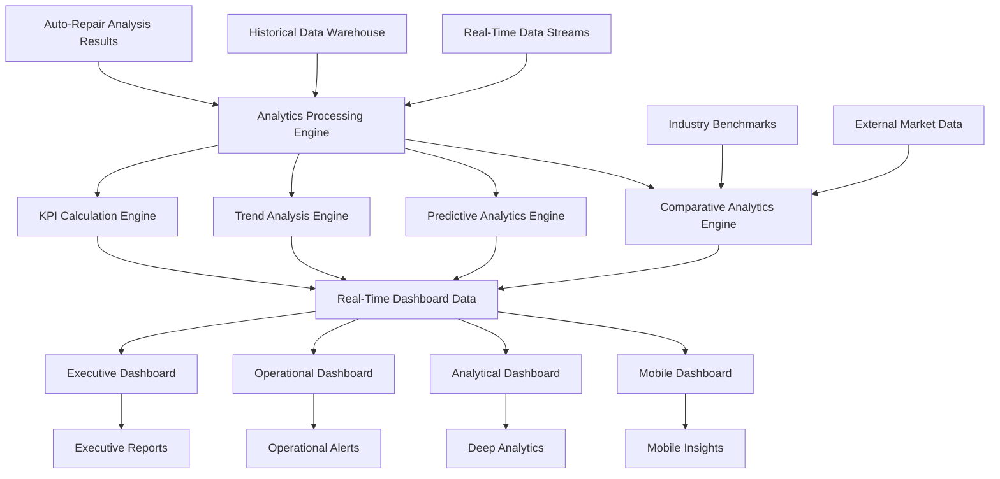

# Dashboard Analytics & KPI Generation System Specification

## Overview

This document specifies a comprehensive dashboard analytics and KPI generation system for auto-repair claims auditing. The system transforms complex multi-dimensional risk analysis, scope creep detection, and predictive modeling results into executive-ready dashboards, real-time monitoring interfaces, and actionable business intelligence optimized for decision-making and operational excellence.

## Dashboard Analytics Architecture

### High-Level Architecture



### Core Analytics Components

#### 1. Comprehensive Analytics Processing Engine

```typescript
export class DashboardAnalyticsEngine {
  // Core analytics processing
  async processClaimAnalytics(
    claimAnalysisResults: ClaimAnalysisResult[]
  ): Promise<ProcessedAnalytics>;
  
  async generateKPIMetrics(
    analyticsData: ProcessedAnalytics
  ): Promise<KPIMetricsSet>;
  
  async calculateTrendAnalytics(
    historicalData: HistoricalAnalyticsData[],
    currentData: CurrentAnalyticsData
  ): Promise<TrendAnalytics>;
  
  async generatePredictiveInsights(
    analyticsData: ProcessedAnalytics,
    predictiveModels: PredictiveModel[]
  ): Promise<PredictiveInsights>;
  
  // Real-time processing
  async processRealTimeAnalytics(
    realTimeData: RealTimeAnalyticsData
  ): Promise<RealTimeAnalytics>;
  
  async updateDashboardMetrics(
    newAnalytics: ProcessedAnalytics
  ): Promise<DashboardMetricsUpdate>;
  
  // Comparative analytics
  async generateComparativeAnalytics(
    claimData: ClaimAnalyticsData[],
    benchmarkData: BenchmarkData[]
  ): Promise<ComparativeAnalytics>;
  
  async calculatePerformanceMetrics(
    operationalData: OperationalData[]
  ): Promise<PerformanceMetrics>;
}
```

## Executive Dashboard System

### 1. Executive-Level KPIs and Metrics

```typescript
export interface ExecutiveDashboardMetrics {
  // High-level financial KPIs
  cost_containment_metrics: CostContainmentMetrics;
  savings_achievement_metrics: SavingsAchievementMetrics;
  roi_metrics: ROIMetrics;
  
  // Risk management KPIs
  risk_exposure_metrics: RiskExposureMetrics;
  risk_mitigation_effectiveness: RiskMitigationEffectiveness;
  predictive_accuracy_metrics: PredictiveAccuracyMetrics;
  
  // Operational efficiency KPIs
  processing_efficiency_metrics: ProcessingEfficiencyMetrics;
  automation_effectiveness: AutomationEffectiveness;
  expert_productivity_metrics: ExpertProductivityMetrics;
  
  // Quality and compliance KPIs
  detection_accuracy_metrics: DetectionAccuracyMetrics;
  compliance_metrics: ComplianceMetrics;
  audit_quality_metrics: AuditQualityMetrics;
  
  // Strategic performance indicators
  market_position_metrics: MarketPositionMetrics;
  competitive_advantage_metrics: CompetitiveAdvantageMetrics;
  innovation_metrics: InnovationMetrics;
}

export interface CostContainmentMetrics {
  // Primary cost metrics
  total_cost_savings: CostSavingsMetric;
  cost_avoidance: CostAvoidanceMetric;
  cost_reduction_percentage: CostReductionPercentage;
  
  // Trend analysis
  monthly_savings_trend: MonthlySavingsTrend;
  quarterly_performance: QuarterlyPerformance;
  year_over_year_comparison: YearOverYearComparison;
  
  // Breakdown by category
  scope_creep_savings: ScopeCreepSavings;
  labor_optimization_savings: LaborOptimizationSavings;
  parts_optimization_savings: PartsOptimizationSavings;
  timeline_optimization_savings: TimelineOptimizationSavings;
  
  // Predictive projections
  projected_annual_savings: ProjectedAnnualSavings;
  savings_trajectory: SavingsTrajectory;
  optimization_potential: OptimizationPotential;
}

export interface RiskExposureMetrics {
  // Current risk exposure
  total_risk_exposure: TotalRiskExposure;
  high_risk_claims_count: HighRiskClaimsCount;
  risk_concentration_analysis: RiskConcentrationAnalysis;
  
  // Risk trend analysis
  risk_trend_direction: RiskTrendDirection;
  emerging_risk_patterns: EmergingRiskPattern[];
  risk_velocity_metrics: RiskVelocityMetrics;
  
  // Risk mitigation effectiveness
  risk_reduction_achieved: RiskReductionAchieved;
  mitigation_success_rate: MitigationSuccessRate;
  preventive_action_effectiveness: PreventiveActionEffectiveness;
  
  // Early warning indicators
  early_warning_alerts: EarlyWarningAlert[];
  threshold_breach_indicators: ThresholdBreachIndicator[];
  predictive_risk_alerts: PredictiveRiskAlert[];
}
```

### 2. Executive Dashboard Visualization Components

```typescript
export class ExecutiveDashboardGenerator {
  // Dashboard generation
  async generateExecutiveDashboard(
    executiveMetrics: ExecutiveDashboardMetrics,
    timeRange: TimeRange
  ): Promise<ExecutiveDashboard>;
  
  async generateExecutiveSummary(
    dashboardData: ExecutiveDashboard
  ): Promise<ExecutiveSummary>;
  
  async generateActionableInsights(
    executiveMetrics: ExecutiveDashboardMetrics
  ): Promise<ActionableInsight[]>;
  
  // Visualization components
  async generateKPICards(
    kpiMetrics: KPIMetric[]
  ): Promise<KPICard[]>;
  
  async generateTrendCharts(
    trendData: TrendData[]
  ): Promise<TrendChart[]>;
  
  async generateRiskHeatMaps(
    riskData: RiskData[]
  ): Promise<RiskHeatMap[]>;
  
  async generatePerformanceGauges(
    performanceMetrics: PerformanceMetric[]
  ): Promise<PerformanceGauge[]>;
  
  // Interactive elements
  async generateDrillDownCapabilities(
    summaryData: SummaryData
  ): Promise<DrillDownCapability[]>;
  
  async generateFilterOptions(
    dashboardData: ExecutiveDashboard
  ): Promise<FilterOption[]>;
}

export interface ExecutiveDashboard {
  // Dashboard metadata
  dashboard_id: string;
  generation_timestamp: string;
  data_freshness: DataFreshness;
  
  // Key performance indicators
  primary_kpis: PrimaryKPI[];
  secondary_kpis: SecondaryKPI[];
  trend_indicators: TrendIndicator[];
  
  // Visual components
  summary_cards: SummaryCard[];
  trend_charts: TrendChart[];
  risk_visualizations: RiskVisualization[];
  performance_gauges: PerformanceGauge[];
  
  // Actionable insights
  key_insights: KeyInsight[];
  recommended_actions: RecommendedAction[];
  priority_alerts: PriorityAlert[];
  
  // Interactive features
  drill_down_options: DrillDownOption[];
  filter_configurations: FilterConfiguration[];
  export_options: ExportOption[];
}
```

## Operational Dashboard System

### 1. Real-Time Operational Metrics

```typescript
export interface OperationalDashboardMetrics {
  // Real-time processing metrics
  claim_processing_metrics: ClaimProcessingMetrics;
  analysis_performance_metrics: AnalysisPerformanceMetrics;
  system_health_metrics: SystemHealthMetrics;
  
  // Queue and workflow metrics
  processing_queue_metrics: ProcessingQueueMetrics;
  workflow_efficiency_metrics: WorkflowEfficiencyMetrics;
  bottleneck_identification: BottleneckIdentification[];
  
  // Quality assurance metrics
  accuracy_metrics: AccuracyMetrics;
  error_rate_metrics: ErrorRateMetrics;
  validation_metrics: ValidationMetrics;
  
  // Resource utilization metrics
  system_resource_metrics: SystemResourceMetrics;
  human_resource_metrics: HumanResourceMetrics;
  capacity_utilization_metrics: CapacityUtilizationMetrics;
  
  // Alert and notification metrics
  active_alerts: ActiveAlert[];
  alert_resolution_metrics: AlertResolutionMetrics;
  escalation_metrics: EscalationMetrics;
}

export interface ClaimProcessingMetrics {
  // Volume metrics
  claims_processed_today: number;
  claims_in_queue: number;
  average_processing_time: number;
  
  // Throughput metrics
  hourly_processing_rate: HourlyProcessingRate[];
  daily_processing_volume: DailyProcessingVolume[];
  processing_capacity_utilization: number;
  
  // Quality metrics
  processing_accuracy_rate: number;
  error_rate: number;
  rework_percentage: number;
  
  // Performance trends
  processing_time_trend: ProcessingTimeTrend;
  volume_trend: VolumeTrend;
  quality_trend: QualityTrend;
}

export interface RealTimeAlertSystem {
  // Alert categories
  critical_alerts: CriticalAlert[];
  warning_alerts: WarningAlert[];
  informational_alerts: InformationalAlert[];
  
  // Alert management
  alert_prioritization: AlertPrioritization;
  alert_routing: AlertRouting;
  alert_escalation: AlertEscalation;
  
  // Response tracking
  alert_response_times: AlertResponseTime[];
  resolution_effectiveness: ResolutionEffectiveness;
  alert_trend_analysis: AlertTrendAnalysis;
}
```

### 2. Operational Dashboard Components

```typescript
export class OperationalDashboardGenerator {
  // Real-time dashboard generation
  async generateOperationalDashboard(
    operationalMetrics: OperationalDashboardMetrics
  ): Promise<OperationalDashboard>;
  
  async generateRealTimeMonitoring(
    realTimeData: RealTimeData
  ): Promise<RealTimeMonitoringDashboard>;
  
  async generateAlertDashboard(
    alertData: AlertData[]
  ): Promise<AlertDashboard>;
  
  // Performance monitoring
  async generatePerformanceMonitoring(
    performanceData: PerformanceData[]
  ): Promise<PerformanceMonitoringDashboard>;
  
  async generateCapacityMonitoring(
    capacityData: CapacityData
  ): Promise<CapacityMonitoringDashboard>;
  
  // Quality monitoring
  async generateQualityMonitoring(
    qualityMetrics: QualityMetrics[]
  ): Promise<QualityMonitoringDashboard>;
  
  async generateAccuracyMonitoring(
    accuracyData: AccuracyData[]
  ): Promise<AccuracyMonitoringDashboard>;
}
```

## Analytical Dashboard System

### 1. Deep Analytics and Investigation Tools

```typescript
export interface AnalyticalDashboardMetrics {
  // Advanced analytics
  statistical_analysis: StatisticalAnalysis;
  pattern_recognition_results: PatternRecognitionResult[];
  anomaly_detection_results: AnomalyDetectionResult[];
  
  // Predictive analytics
  predictive_models_performance: PredictiveModelPerformance[];
  forecast_accuracy: ForecastAccuracy[];
  trend_predictions: TrendPrediction[];
  
  // Comparative analytics
  benchmark_comparisons: BenchmarkComparison[];
  peer_analysis: PeerAnalysis[];
  market_position_analysis: MarketPositionAnalysis;
  
  // Investigation tools
  drill_down_analytics: DrillDownAnalytics[];
  root_cause_analysis: RootCauseAnalysis[];
  correlation_analysis: CorrelationAnalysis[];
  
  // Custom analytics
  custom_metric_definitions: CustomMetricDefinition[];
  user_defined_analytics: UserDefinedAnalytic[];
  advanced_filtering: AdvancedFiltering[];
}

export class AnalyticalDashboardGenerator {
  // Advanced analytics generation
  async generateAnalyticalDashboard(
    analyticalMetrics: AnalyticalDashboardMetrics,
    userPreferences: UserPreferences
  ): Promise<AnalyticalDashboard>;
  
  async generateStatisticalAnalysis(
    dataSet: AnalyticalDataSet
  ): Promise<StatisticalAnalysisDashboard>;
  
  async generatePredictiveAnalytics(
    predictiveData: PredictiveData[]
  ): Promise<PredictiveAnalyticsDashboard>;
  
  // Investigation tools
  async generateInvestigationWorkspace(
    investigationContext: InvestigationContext
  ): Promise<InvestigationWorkspace>;
  
  async generateRootCauseAnalysis(
    problemContext: ProblemContext
  ): Promise<RootCauseAnalysisDashboard>;
  
  // Custom analytics
  async generateCustomAnalytics(
    customDefinitions: CustomAnalyticDefinition[]
  ): Promise<CustomAnalyticsDashboard>;
  
  async generateAdHocAnalysis(
    analysisRequest: AdHocAnalysisRequest
  ): Promise<AdHocAnalysisDashboard>;
}
```

### 2. Advanced Visualization Components

```typescript
export interface AdvancedVisualizationComponents {
  // Statistical visualizations
  distribution_charts: DistributionChart[];
  correlation_matrices: CorrelationMatrix[];
  regression_analysis_charts: RegressionAnalysisChart[];
  
  // Time series visualizations
  time_series_charts: TimeSeriesChart[];
  seasonal_decomposition: SeasonalDecomposition[];
  trend_analysis_charts: TrendAnalysisChart[];
  
  // Multidimensional visualizations
  scatter_plot_matrices: ScatterPlotMatrix[];
  parallel_coordinates: ParallelCoordinates[];
  radar_charts: RadarChart[];
  
  // Network and relationship visualizations
  network_diagrams: NetworkDiagram[];
  sankey_diagrams: SankeyDiagram[];
  tree_maps: TreeMap[];
  
  // Geographic visualizations
  geographic_heat_maps: GeographicHeatMap[];
  choropleth_maps: ChoroplethMap[];
  bubble_maps: BubbleMap[];
}

export class AdvancedVisualizationEngine {
  // Visualization generation
  async generateAdvancedVisualization(
    data: VisualizationData,
    visualizationType: VisualizationType
  ): Promise<AdvancedVisualization>;
  
  async generateInteractiveVisualization(
    data: InteractiveData,
    interactionOptions: InteractionOption[]
  ): Promise<InteractiveVisualization>;
  
  async generateCustomVisualization(
    data: CustomVisualizationData,
    customConfig: CustomVisualizationConfig
  ): Promise<CustomVisualization>;
  
  // Visualization optimization
  async optimizeVisualizationPerformance(
    visualization: Visualization
  ): Promise<OptimizedVisualization>;
  
  async adaptVisualizationForDevice(
    visualization: Visualization,
    deviceType: DeviceType
  ): Promise<AdaptedVisualization>;
}
```

## KPI Calculation and Management System

### 1. Comprehensive KPI Calculation Engine

```typescript
export class KPICalculationEngine {
  // Core KPI calculations
  async calculateFinancialKPIs(
    financialData: FinancialData[]
  ): Promise<FinancialKPI[]>;
  
  async calculateOperationalKPIs(
    operationalData: OperationalData[]
  ): Promise<OperationalKPI[]>;
  
  async calculateQualityKPIs(
    qualityData: QualityData[]
  ): Promise<QualityKPI[]>;
  
  async calculateRiskKPIs(
    riskData: RiskData[]
  ): Promise<RiskKPI[]>;
  
  // Advanced KPI calculations
  async calculateCompositeKPIs(
    componentKPIs: ComponentKPI[],
    weightingScheme: WeightingScheme
  ): Promise<CompositeKPI[]>;
  
  async calculateTrendKPIs(
    historicalKPIs: HistoricalKPI[],
    currentKPIs: CurrentKPI[]
  ): Promise<TrendKPI[]>;
  
  async calculateBenchmarkKPIs(
    performanceData: PerformanceData[],
    benchmarkData: BenchmarkData[]
  ): Promise<BenchmarkKPI[]>;
  
  // KPI validation and quality assurance
  async validateKPICalculations(
    calculatedKPIs: CalculatedKPI[]
  ): Promise<KPIValidationResult>;
  
  async auditKPIAccuracy(
    kpiResults: KPIResult[],
    sourceData: SourceData[]
  ): Promise<KPIAccuracyAudit>;
}

export interface KPIDefinition {
  // KPI metadata
  kpi_id: string;
  kpi_name: string;
  kpi_description: string;
  kpi_category: KPICategory;
  
  // Calculation specification
  calculation_formula: CalculationFormula;
  data_sources: DataSource[];
  calculation_frequency: CalculationFrequency;
  
  // Performance targets
  target_value: TargetValue;
  threshold_values: ThresholdValue[];
  benchmark_values: BenchmarkValue[];
  
  // Visualization preferences
  visualization_type: VisualizationType;
  display_format: DisplayFormat;
  color_coding: ColorCoding;
  
  // Business context
  business_importance: BusinessImportance;
  stakeholder_relevance: StakeholderRelevance[];
  action_triggers: ActionTrigger[];
}

export interface KPIResult {
  // Result metadata
  kpi_id: string;
  calculation_timestamp: string;
  data_period: DataPeriod;
  
  // Calculated values
  current_value: number;
  previous_value: number;
  change_value: number;
  change_percentage: number;
  
  // Performance assessment
  performance_status: PerformanceStatus;
  target_achievement: TargetAchievement;
  benchmark_comparison: BenchmarkComparison;
  
  // Trend analysis
  trend_direction: TrendDirection;
  trend_strength: TrendStrength;
  trend_confidence: TrendConfidence;
  
  // Quality indicators
  data_quality_score: DataQualityScore;
  calculation_confidence: CalculationConfidence;
  result_reliability: ResultReliability;
}
```

### 2. KPI Management and Governance

```typescript
export class KPIManagementSystem {
  // KPI lifecycle management
  async createKPIDefinition(
    kpiSpecification: KPISpecification
  ): Promise<KPIDefinition>;
  
  async updateKPIDefinition(
    kpiId: string,
    updates: KPIDefinitionUpdate
  ): Promise<UpdatedKPIDefinition>;
  
  async retireKPIDefinition(
    kpiId: string,
    retirementReason: RetirementReason
  ): Promise<KPIRetirementResult>;
  
  // KPI governance
  async validateKPIDefinition(
    kpiDefinition: KPIDefinition
  ): Promise<KPIValidationResult>;
  
  async auditKPIUsage(
    kpiId: string,
    auditPeriod: AuditPeriod
  ): Promise<KPIUsageAudit>;
  
  async reviewKPIPerformance(
    kpiResults: KPIResult[],
    reviewCriteria: ReviewCriteria
  ): Promise<KPIPerformanceReview>;
  
  // KPI optimization
  async optimizeKPICalculation(
    kpiDefinition: KPIDefinition,
    performanceData: PerformanceData
  ): Promise<OptimizedKPIDefinition>;
  
  async recommendKPIImprovements(
    kpiAnalysis: KPIAnalysis
  ): Promise<KPIImprovementRecommendation[]>;
}
```

## Real-Time Data Processing and Streaming

### 1. Real-Time Analytics Pipeline

```typescript
export class RealTimeAnalyticsPipeline {
  // Stream processing
  async processRealTimeClaimData(
    claimDataStream: ClaimDataStream
  ): Promise<ProcessedClaimStream>;
  
  async calculateRealTimeKPIs(
    processedDataStream: ProcessedDataStream
  ): Promise<RealTimeKPIStream>;
  
  async detectRealTimeAnomalies(
    kpiStream: RealTimeKPIStream
  ): Promise<AnomalyAlertStream>;
  
  // Stream aggregation
  async aggregateStreamingData(
    dataStreams: DataStream[],
    aggregationRules: AggregationRule[]
  ): Promise<AggregatedDataStream>;
  
  async calculateRollingMetrics(
    dataStream: DataStream,
    windowSize: WindowSize
  ): Promise<RollingMetricsStream>;
  
  // Real-time alerting
  async processRealTimeAlerts(
    alertStream: AlertStream
  ): Promise<ProcessedAlertStream>;
  
  async routeRealTimeAlerts(
    processedAlerts: ProcessedAlert[],
    routingRules: AlertRoutingRule[]
  ): Promise<RoutedAlertStream>;
}

export interface RealTimeDataProcessor {
  // Data ingestion
  ingestClaimData(claimData: ClaimData): Promise<void>;
  ingestAnalysisResults(analysisResults: AnalysisResult[]): Promise<void>;
  ingestExternalData(externalData: ExternalData): Promise<void>;
  
  // Stream processing
  processDataStream(dataStream: DataStream): Promise<ProcessedStream>;
  transformStreamData(streamData: StreamData): Promise<TransformedStreamData>;
  enrichStreamData(streamData: StreamData): Promise<EnrichedStreamData>;
  
  // Real-time calculations
  calculateStreamingMetrics(streamData: StreamData): Promise<StreamingMetrics>;
  updateRealTimeDashboards(metrics: StreamingMetrics): Promise<void>;
  triggerRealTimeAlerts(alertConditions: AlertCondition[]): Promise<void>;
}
```

### 2. Event-Driven Dashboard Updates

```typescript
export class EventDrivenDashboardSystem {
  // Event processing
  async processAnalyticsEvents(
    analyticsEvents: AnalyticsEvent[]
  ): Promise<ProcessedAnalyticsEvent[]>;
  
  async routeEventsToComponents(
    events: ProcessedAnalyticsEvent[],
    routingConfig: EventRoutingConfig
  ): Promise<RoutedEvent[]>;
  
  // Dashboard updates
  async updateDashboardComponents(
    componentUpdates: ComponentUpdate[]
  ): Promise<DashboardUpdateResult>;
  
  async refreshDashboardData(
    dashboardId: string,
    refreshScope: RefreshScope
  ): Promise<DashboardRefreshResult>;
  
  // Event-driven notifications
  async processNotificationEvents(
    notificationEvents: NotificationEvent[]
  ): Promise<ProcessedNotification[]>;
  
  async deliverNotifications(
    notifications: ProcessedNotification[]
  ): Promise<NotificationDeliveryResult>;
}
```

## Mobile and Responsive Dashboard System

### 1. Mobile-Optimized Dashboard Components

```typescript
export interface MobileDashboardMetrics {
  // Mobile-optimized KPIs
  essential_kpis: EssentialKPI[];
  summary_metrics: SummaryMetric[];
  alert_notifications: AlertNotification[];
  
  // Mobile-friendly visualizations
  simplified_charts: SimplifiedChart[];
  summary_cards: SummaryCard[];
  progress_indicators: ProgressIndicator[];
  
  // Touch-optimized interactions
  swipe_navigation: SwipeNavigation[];
  tap_actions: TapAction[];
  gesture_controls: GestureControl[];
  
  // Offline capabilities
  cached_data: CachedData[];
  offline_metrics: OfflineMetric[];
  sync_indicators: SyncIndicator[];
}

export class MobileDashboardGenerator {
  // Mobile dashboard generation
  async generateMobileDashboard(
    dashboardData: DashboardData,
    deviceSpecs: DeviceSpecification
  ): Promise<MobileDashboard>;
  
  async optimizeForMobile(
    desktopDashboard: DesktopDashboard
  ): Promise<MobileDashboard>;
  
  async generateResponsiveLayout(
    dashboardComponents: DashboardComponent[],
    screenSizes: ScreenSize[]
  ): Promise<ResponsiveLayout>;
  
  // Mobile-specific features
  async generatePushNotifications(
    alertData: AlertData[]
  ): Promise<PushNotification[]>;
  
  async generateOfflineCapabilities(
    criticalData: CriticalData[]
  ): Promise<OfflineCapabilities>;
  
  async generateLocationAwareFeatures(
    locationData: LocationData
  ): Promise<LocationAwareFeature[]>;
}
```

## Export and Reporting System

### 1. Comprehensive Export Capabilities

```typescript
export class DashboardExportSystem {
  // Report generation
  async generateExecutiveReport(
    dashboardData: ExecutiveDashboard,
    reportTemplate: ReportTemplate
  ): Promise<ExecutiveReport>;
  
  async generateOperationalReport(
    operationalData: OperationalDashboard,
    reportFormat: ReportFormat
  ): Promise<OperationalReport>;
  
  async generateAnalyticalReport(
    analyticalData: AnalyticalDashboard,
    customizations: ReportCustomization[]
  ): Promise<AnalyticalReport>;
  
  // Export formats
  async exportToPDF(
    dashboardData: DashboardData,
    pdfOptions: PDFExportOptions
  ): Promise<PDFExport>;
  
  async exportToExcel(
    dashboardData: DashboardData,
    excelOptions: ExcelExportOptions
  ): Promise<ExcelExport>;
  
  async exportToPowerBI(
    dashboardData: DashboardData,
    powerBIConfig: PowerBIConfiguration
  ): Promise<PowerBIExport>;
  
  // Scheduled reporting
  async scheduleReports(
    reportSchedule: ReportSchedule[]
  ): Promise<ScheduledReportResult>;
  
  async generateScheduledReports(
    scheduledReports: ScheduledReport[]
  ): Promise<GeneratedReport[]>;
}

export interface ReportTemplate {
  // Template metadata
  template_id: string;
  template_name: string;
  template_type: ReportTemplateType;
  
  // Layout configuration
  page_layout: PageLayout;
  section_definitions: SectionDefinition[];
  visualization_placements: VisualizationPlacement[];
  
  // Content configuration
  included_metrics: IncludedMetric[];
  data_filters: DataFilter[];
  time_range_settings: TimeRangeSettings;
  
  // Formatting options
  styling_options: StylingOption[];
  branding_elements: BrandingElement[];
  color_schemes: ColorScheme[];
}
```

## Performance Optimization and Scalability

### 1. Dashboard Performance Optimization

```typescript
export class DashboardPerformanceOptimizer {
  // Performance optimization
  async optimizeDashboardPerformance(
    dashboard: Dashboard
  ): Promise<OptimizedDashboard>;
  
  async implementCachingStrategies(
    dashboardData: DashboardData
  ): Promise<CachedDashboardData>;
  
  async optimizeDataQueries(
    dataQueries: DataQuery[]
  ): Promise<OptimizedDataQuery[]>;
  
  // Scalability management
  async scaleForHighVolume(
    dashboardSystem: DashboardSystem,
    volumeProjections: VolumeProjection[]
  ): Promise<ScaledDashboardSystem>;
  
  async implementLoadBalancing(
    dashboardServices: DashboardService[]
  ): Promise<LoadBalancedServices>;
  
  // Performance monitoring
  async monitorDashboardPerformance(
    dashboards: Dashboard[]
  ): Promise<PerformanceMonitoringResult>;
  
  async identifyPerformanceBottlenecks(
    performanceData: PerformanceData[]
  ): Promise<BottleneckAnalysis>;
}

export interface PerformanceOptimizationConfig {
  // Caching configuration
  cache_strategies: CacheStrategy[];
  cache_expiration_policies: CacheExpirationPolicy[];
  cache_invalidation_rules: CacheInvalidationRule[];
  
  // Query optimization
  query_optimization_rules: QueryOptimizationRule[];
  index_strategies: IndexStrategy[];
  data_partitioning: DataPartitioning[];
  
  // Resource management
  resource_allocation: ResourceAllocation[];
  connection_pooling: ConnectionPooling;
  memory_management: MemoryManagement;
  
  // Scalability settings
  auto_scaling_rules: AutoScalingRule[];
  load_balancing_config: LoadBalancingConfig;
  failover_strategies: FailoverStrategy[];
}
```

## Implementation Roadmap

### Phase 1: Core Dashboard Framework (Weeks 1-2)
1. **Analytics Processing Engine**: Build core analytics processing and KPI calculation engine
2. **Executive Dashboard**: Implement executive-level dashboard with key financial and risk KPIs
3. **Real-Time Data Pipeline**: Create real-time data processing and streaming capabilities
4. **Basic Visualization Components**: Build essential charts, gauges, and summary cards

### Phase 2: Operational and Analytical Dashboards (Weeks 3-4)
1. **Operational Dashboard**: Build real-time operational monitoring and alert systems
2. **Analytical Dashboard**: Implement deep analytics and investigation tools
3. **Advanced Visualizations**: Create sophisticated visualization components
4. **KPI Management System**: Build comprehensive KPI definition and governance system

### Phase 3: Advanced Features and Optimization (Weeks 5-6)
1. **Mobile Dashboard**: Implement mobile-optimized dashboard components
2. **Export and Reporting**: Build comprehensive export and scheduled reporting capabilities
3. **Performance Optimization**: Implement caching, query optimization, and scalability features
4. **Event-Driven Updates**: Create real-time dashboard update system

### Phase 4: Integration and Enhancement (Weeks 7-8)
1. **System Integration**: Integrate with existing SupplementGuard components
2. **Advanced Analytics**: Implement predictive analytics and machine learning insights
3. **Custom Analytics**: Build user-defined analytics and custom dashboard capabilities
4. **Quality Assurance**: Implement comprehensive testing and performance monitoring

## Success Metrics

### Dashboard Performance Requirements
- **Load Time**: < 3 seconds for executive dashboard initial load
- **Real-Time Updates**: < 1 second for real-time metric updates
- **Concurrent Users**: Support 100+ concurrent dashboard users
- **Data Freshness**: < 5 minutes for operational metrics, < 1 hour for analytical metrics
- **Mobile Performance**: < 2 seconds load time on mobile devices

### User Experience Requirements
- **Dashboard Responsiveness**: 95% of interactions complete within 2 seconds
- **Visualization Clarity**: 90% user satisfaction with visualization clarity and usefulness
- **Mobile Usability**: 85% user satisfaction with mobile dashboard experience
- **Export Quality**: 95% accuracy in exported reports and data
- **Customization Flexibility**: Support for 20+ customizable dashboard configurations

### Business Impact Requirements
- **Decision Speed**: 40% improvement in executive decision-making speed
- **Operational Efficiency**: 35% improvement in operational monitoring efficiency
- **Cost Visibility**: 90% improvement in cost trend visibility and understanding
- **Risk Awareness**: 50% improvement in risk identification and response time
- **ROI Demonstration**: Clear ROI demonstration within 6 months of implementation

## Conclusion

This comprehensive dashboard analytics and KPI generation system specification provides a robust framework for transforming complex auto-repair claims analysis into actionable business intelligence. The system delivers executive-ready insights, real-time operational monitoring, and deep analytical capabilities while maintaining high performance and scalability.

The multi-tiered dashboard architecture ensures that stakeholders at all levels receive relevant, timely, and actionable information optimized for their specific needs and decision-making requirements. Integration with existing SupplementGuard components provides a seamless enhancement that leverages existing investments while adding powerful analytics and visualization capabilities.