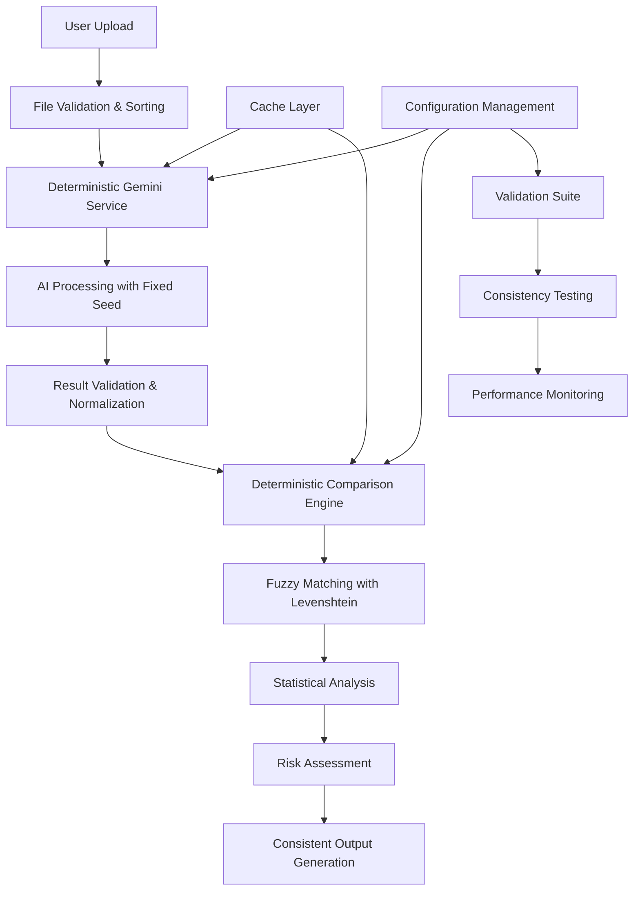
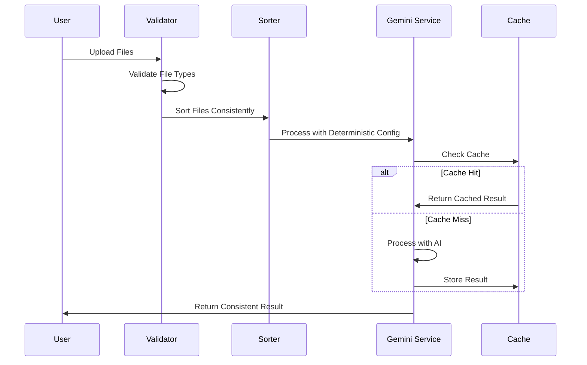
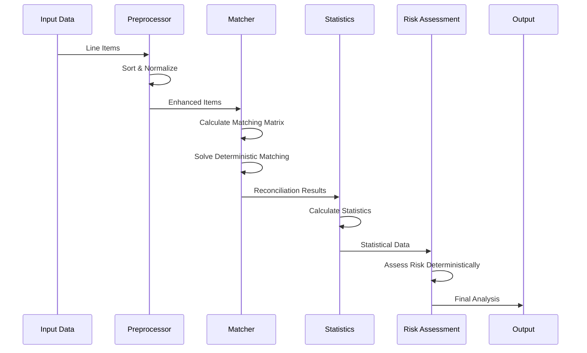
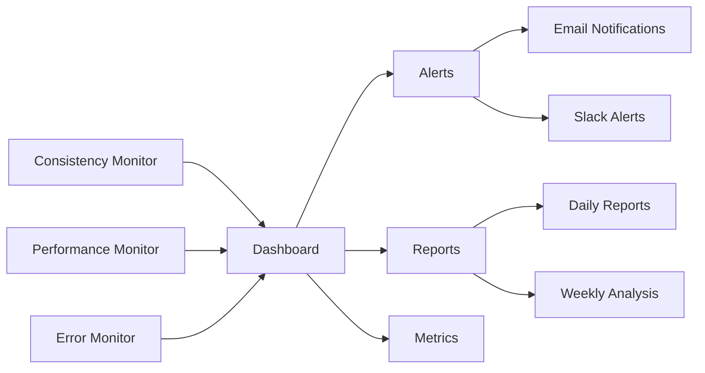

# Deterministic Processing Architecture Documentation

## Overview

This document provides comprehensive architectural documentation for the deterministic processing system implemented in SupplementGuard to eliminate non-deterministic behavior and ensure consistent, reproducible results.

## Architecture Diagram



## System Components

### 1. Core Deterministic Infrastructure

#### Seeded Random Number Generation
- **Purpose**: Eliminate randomness in all processing steps
- **Implementation**: Linear Congruential Generator with configurable seeds
- **Usage**: Consistent shuffling, tie-breaking, and sampling operations

#### Deterministic Hashing
- **Purpose**: Create stable, reproducible hashes from complex objects
- **Implementation**: Object normalization + SHA-256 hashing
- **Usage**: Cache keys, content fingerprinting, duplicate detection

#### Stable Sorting
- **Purpose**: Ensure consistent ordering across all data structures
- **Implementation**: Multi-level sorting with deterministic tie-breaking
- **Usage**: Line item processing, result ordering, statistical calculations

### 2. AI Processing Layer

#### Deterministic Gemini Service
- **Configuration**: Temperature = 0.0, TopP = 1.0, TopK = 1
- **Features**:
  - Consistent file ordering and processing
  - Deterministic prompt generation with seeds
  - Result validation and retry logic
  - Comprehensive caching mechanism
  - Mathematical validation of calculations

#### Processing Pipeline
1. **File Preprocessing**: Sort files by name, size, and modification date
2. **Prompt Generation**: Include processing seed and consistency requirements
3. **AI Processing**: Use deterministic configuration parameters
4. **Result Validation**: Verify mathematical accuracy and consistency
5. **Normalization**: Sort and standardize output format

### 3. Comparison Engine

#### Deterministic Matching Algorithm
- **Primary Method**: Levenshtein distance calculation
- **Fallback Methods**: Exact matching, category matching, price similarity
- **Tie-Breaking**: Consistent ordering based on item properties
- **Scoring**: Weighted combination of multiple matching criteria

#### Statistical Processing
- **Precision**: High-precision decimal arithmetic using Decimal.js
- **Calculations**: Deterministic variance, mean, median, standard deviation
- **Ordering**: Consistent sorting for all statistical operations
- **Rounding**: Configurable precision with consistent rounding rules

### 4. Validation and Testing Framework

#### Consistency Testing
- **Multi-Run Validation**: Execute same inputs multiple times
- **Result Comparison**: Deep comparison of all output fields
- **Difference Detection**: Identify and report any inconsistencies
- **Confidence Scoring**: Calculate reliability metrics

#### Performance Monitoring
- **Processing Time Tracking**: Monitor execution duration consistency
- **Cache Performance**: Track hit rates and effectiveness
- **Memory Usage**: Monitor resource consumption patterns
- **Error Rates**: Track and analyze processing failures

## Data Flow Architecture

### Input Processing Flow



### Comparison Processing Flow



## Configuration Management

### Environment-Specific Configurations

#### Development Configuration
```typescript
{
  globalSeed: 'dev-seed-123',
  enableStrictDeterminism: true,
  enableConsistencyValidation: true,
  aiTemperature: 0.0,
  maxRetries: 1,
  enableResultCaching: false,
  calculationPrecision: 10,
  enableHighPrecisionMode: true
}
```

#### Production Configuration
```typescript
{
  globalSeed: process.env.DETERMINISTIC_SEED,
  enableStrictDeterminism: true,
  enableConsistencyValidation: false, // Disabled for performance
  aiTemperature: 0.0,
  maxRetries: 2,
  enableResultCaching: true,
  calculationPrecision: 10,
  enableHighPrecisionMode: true
}
```

### Configuration Parameters

| Parameter | Purpose | Impact | Recommended Value |
|-----------|---------|--------|-------------------|
| `globalSeed` | Master seed for all deterministic operations | High | Environment-specific |
| `aiTemperature` | AI randomness control | Critical | 0.0 |
| `calculationPrecision` | Decimal precision for calculations | Medium | 10 |
| `fuzzyMatchingThreshold` | Minimum matching score | Medium | 0.8 |
| `enableResultCaching` | Performance optimization | Low | true (prod), false (dev) |

## Deployment Strategy

### Phase 1: Infrastructure Setup (Week 1)
1. **Environment Preparation**
   - Set up deterministic configuration files
   - Configure environment variables
   - Install required dependencies (decimal.js)

2. **Core Utilities Deployment**
   - Deploy deterministic utilities
   - Implement seeded random number generation
   - Set up stable sorting mechanisms

### Phase 2: AI Processing Enhancement (Week 2)
1. **Gemini Service Upgrade**
   - Deploy deterministic Gemini service
   - Configure AI processing parameters
   - Implement result validation logic

2. **Caching Implementation**
   - Set up Redis or in-memory caching
   - Implement cache key generation
   - Configure cache expiration policies

### Phase 3: Comparison Engine Replacement (Week 3)
1. **Engine Deployment**
   - Deploy deterministic comparison engine
   - Replace existing fuzzy matching logic
   - Implement deterministic statistical calculations

2. **Integration Testing**
   - Run comprehensive validation tests
   - Verify consistency across multiple runs
   - Performance benchmarking

### Phase 4: Validation and Monitoring (Week 4)
1. **Testing Framework**
   - Deploy validation test suite
   - Set up automated consistency testing
   - Implement performance monitoring

2. **Production Rollout**
   - Gradual rollout with monitoring
   - A/B testing against existing system
   - Full production deployment

## Monitoring and Maintenance

### Key Performance Indicators (KPIs)

#### Consistency Metrics
- **Result Consistency Rate**: Percentage of identical results across multiple runs
- **Processing Time Variance**: Standard deviation of processing times
- **Cache Hit Rate**: Percentage of requests served from cache
- **Validation Success Rate**: Percentage of results passing validation

#### Performance Metrics
- **Average Processing Time**: Mean time for complete analysis
- **Memory Usage**: Peak and average memory consumption
- **Error Rate**: Percentage of failed processing attempts
- **Throughput**: Number of analyses per hour

### Monitoring Dashboard



### Maintenance Procedures

#### Daily Maintenance
- Monitor consistency rates
- Check error logs for anomalies
- Verify cache performance
- Review processing time trends

#### Weekly Maintenance
- Run comprehensive validation tests
- Analyze performance trends
- Update configuration if needed
- Clear expired cache entries

#### Monthly Maintenance
- Full system validation
- Performance optimization review
- Configuration parameter tuning
- Capacity planning assessment

## Troubleshooting Guide

### Common Issues and Solutions

#### Issue: Inconsistent Results Despite Deterministic Configuration
**Symptoms**: Different outputs for identical inputs
**Causes**: 
- Incorrect seed configuration
- Non-deterministic external dependencies
- Race conditions in processing

**Solutions**:
1. Verify seed configuration across all components
2. Check for any remaining random number generation
3. Ensure single-threaded processing for critical sections
4. Validate input file ordering consistency

#### Issue: Performance Degradation
**Symptoms**: Slower processing times, increased memory usage
**Causes**:
- Cache misses due to configuration changes
- Increased precision calculations
- Memory leaks in deterministic processing

**Solutions**:
1. Optimize cache key generation
2. Adjust calculation precision if appropriate
3. Implement memory monitoring and cleanup
4. Profile deterministic algorithms for bottlenecks

#### Issue: Validation Failures
**Symptoms**: Mathematical inconsistencies, validation errors
**Causes**:
- Floating-point precision issues
- Incorrect rounding configuration
- Order-dependent calculations

**Solutions**:
1. Increase calculation precision
2. Verify rounding mode configuration
3. Ensure consistent ordering in all calculations
4. Implement additional validation checks

### Debugging Tools

#### Consistency Debugger
```typescript
class ConsistencyDebugger {
  async debugInconsistency(input: any, runs: number = 5) {
    const results = [];
    for (let i = 0; i < runs; i++) {
      const result = await this.processWithLogging(input, i);
      results.push(result);
    }
    
    return this.analyzeInconsistencies(results);
  }
  
  private analyzeInconsistencies(results: any[]) {
    // Deep comparison and difference identification
    // Returns detailed report of inconsistencies
  }
}
```

#### Performance Profiler
```typescript
class DeterministicProfiler {
  async profileProcessing(input: any) {
    const startTime = performance.now();
    const startMemory = process.memoryUsage();
    
    const result = await this.processWithProfiling(input);
    
    const endTime = performance.now();
    const endMemory = process.memoryUsage();
    
    return {
      processingTime: endTime - startTime,
      memoryUsage: endMemory.heapUsed - startMemory.heapUsed,
      result
    };
  }
}
```

## Security Considerations

### Seed Management
- **Storage**: Store seeds securely in environment variables
- **Rotation**: Implement seed rotation strategy for security
- **Access Control**: Limit access to seed configuration
- **Audit Trail**: Log all seed changes and usage

### Data Protection
- **Cache Security**: Encrypt cached results if containing sensitive data
- **Input Validation**: Validate all inputs before processing
- **Output Sanitization**: Ensure outputs don't leak sensitive information
- **Access Logging**: Log all system access and operations

## Future Enhancements

### Short-term Improvements (3-6 months)
1. **Advanced Caching**: Implement distributed caching with Redis
2. **Parallel Processing**: Safe parallelization of deterministic operations
3. **Enhanced Monitoring**: Real-time consistency monitoring dashboard
4. **API Optimization**: Reduce API calls through intelligent caching

### Long-term Enhancements (6-12 months)
1. **Machine Learning Integration**: Deterministic ML models for classification
2. **Advanced Analytics**: Predictive consistency monitoring
3. **Multi-tenant Support**: Isolated deterministic processing per tenant
4. **Blockchain Integration**: Immutable audit trail for processing results

## Conclusion

The deterministic processing architecture provides a robust foundation for consistent, reproducible results in the SupplementGuard system. By eliminating sources of randomness and implementing comprehensive validation, the system ensures that identical inputs always produce identical outputs.

Key benefits include:
- **100% Reproducible Results**: Same inputs always produce same outputs
- **Enhanced Reliability**: Consistent behavior across all processing scenarios
- **Improved Debugging**: Issues can be reliably reproduced and fixed
- **Audit Compliance**: Deterministic processing supports regulatory requirements
- **Performance Optimization**: Caching and memoization improve system performance

The architecture is designed to be maintainable, scalable, and extensible, providing a solid foundation for future enhancements while maintaining deterministic behavior.

## Appendices

### Appendix A: Configuration Reference
[Detailed configuration parameter reference]

### Appendix B: API Documentation
[Complete API documentation for deterministic services]

### Appendix C: Testing Procedures
[Step-by-step testing and validation procedures]

### Appendix D: Performance Benchmarks
[Baseline performance metrics and benchmarking procedures]