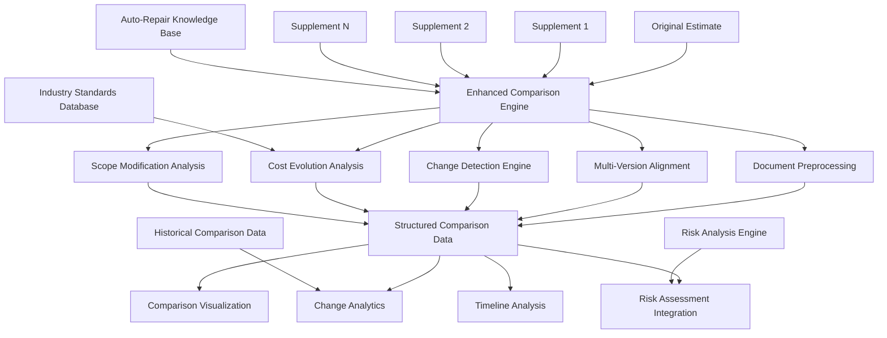

# Enhanced Comparison Engine for Original vs Supplement Analysis Specification

## Overview

This document specifies an advanced comparison engine designed specifically for analyzing original auto-repair estimates against their supplements. The engine extends the existing SupplementGuard comparison capabilities with auto-repair domain expertise, sophisticated change detection algorithms, and comprehensive analysis of cost evolution, scope modifications, and temporal patterns across multiple document versions.

## Enhanced Comparison Architecture

### High-Level Architecture



### Core Comparison Components

#### 1. Advanced Multi-Document Comparison Engine

```typescript
export class EnhancedAutoRepairComparisonEngine {
  // Primary comparison methods
  async compareMultipleDocuments(
    documents: AutoRepairDocument[]
  ): Promise<MultiDocumentComparisonResult>;
  
  async analyzeDocumentEvolution(
    documentSequence: AutoRepairDocument[]
  ): Promise<DocumentEvolutionAnalysis>;
  
  async detectChangePatterns(
    comparisonResult: MultiDocumentComparisonResult
  ): Promise<ChangePatternAnalysis>;
  
  // Specialized auto-repair comparisons
  async compareLaborBreakdowns(
    laborBreakdowns: LaborBreakdown[]
  ): Promise<LaborComparisonResult>;
  
  async comparePartsLists(
    partsLists: PartsList[]
  ): Promise<PartsComparisonResult>;
  
  async compareVehicleInformation(
    vehicleInfos: VehicleInformation[]
  ): Promise<VehicleInfoComparisonResult>;
  
  // Advanced analysis
  async analyzeCostEvolution(
    costData: CostData[]
  ): Promise<CostEvolutionAnalysis>;
  
  async analyzeScopeEvolution(
    scopeData: ScopeData[]
  ): Promise<ScopeEvolutionAnalysis>;
  
  async analyzeTimelineEvolution(
    timelineData: TimelineData[]
  ): Promise<TimelineEvolutionAnalysis>;
  
  // Integration with existing systems
  async integrateWithRiskAnalysis(
    comparisonResult: ComparisonResult,
    riskAnalysis: RiskAnalysisResult
  ): Promise<IntegratedAnalysisResult>;
  
  async integrateWithScopeCreepDetection(
    comparisonResult: ComparisonResult,
    scopeCreepAnalysis: ScopeCreepAnalysis
  ): Promise<EnhancedComparisonResult>;
}
```

## Multi-Document Alignment and Processing

### 1. Sophisticated Document Alignment

```typescript
export interface MultiDocumentComparisonResult {
  // Document metadata
  document_sequence: DocumentSequence;
  comparison_timestamp: string;
  comparison_confidence: number;
  
  // Alignment results
  document_alignment: DocumentAlignment;
  line_item_alignment: LineItemAlignment[];
  section_alignment: SectionAlignment[];
  
  // Change detection
  detected_changes: DetectedChange[];
  change_categories: ChangeCategory[];
  change_significance: ChangeSignificance[];
  
  // Evolution analysis
  cost_evolution: CostEvolution;
  scope_evolution: ScopeEvolution;
  timeline_evolution: TimelineEvolution;
  
  // Quality metrics
  alignment_quality: AlignmentQuality;
  comparison_completeness: ComparisonCompleteness;
  confidence_metrics: ConfidenceMetrics;
}

export class DocumentAlignmentEngine {
  // Core alignment methods
  async alignDocuments(
    documents: AutoRepairDocument[]
  ): Promise<DocumentAlignment>;
  
  async alignLineItems(
    lineItemSets: LineItemSet[]
  ): Promise<LineItemAlignment[]>;
  
  async alignSections(
    documentSections: DocumentSection[][]
  ): Promise<SectionAlignment[]>;
  
  // Advanced alignment techniques
  async performSemanticAlignment(
    textSections: TextSection[][]
  ): Promise<SemanticAlignment>;
  
  async performStructuralAlignment(
    documentStructures: DocumentStructure[]
  ): Promise<StructuralAlignment>;
  
  async performContextualAlignment(
    contextualData: ContextualData[][]
  ): Promise<ContextualAlignment>;
  
  // Quality assurance
  async validateAlignment(
    alignment: DocumentAlignment
  ): Promise<AlignmentValidation>;
  
  async optimizeAlignment(
    alignment: DocumentAlignment,
    optimizationCriteria: OptimizationCriteria
  ): Promise<OptimizedAlignment>;
}

export interface DocumentAlignment {
  // Alignment metadata
  alignment_id: string;
  alignment_method: AlignmentMethod;
  alignment_confidence: number;
  
  // Document mapping
  document_mapping: DocumentMapping[];
  version_relationships: VersionRelationship[];
  temporal_ordering: TemporalOrdering;
  
  // Section alignments
  header_alignment: HeaderAlignment;
  vehicle_info_alignment: VehicleInfoAlignment;
  labor_section_alignment: LaborSectionAlignment;
  parts_section_alignment: PartsSectionAlignment;
  summary_section_alignment: SummarySectionAlignment;
  
  // Line item alignments
  matched_line_items: MatchedLineItem[];
  unmatched_line_items: UnmatchedLineItem[];
  partially_matched_items: PartiallyMatchedItem[];
  
  // Quality indicators
  alignment_completeness: number;
  alignment_accuracy: number;
  alignment_consistency: number;
}
```

### 2. Advanced Change Detection Algorithms

```typescript
export class AdvancedChangeDetectionEngine {
  // Core change detection
  async detectAllChanges(
    alignedDocuments: AlignedDocument[]
  ): Promise<ComprehensiveChangeDetection>;
  
  async categorizeChanges(
    detectedChanges: DetectedChange[]
  ): Promise<CategorizedChanges>;
  
  async analyzeChangeSignificance(
    changes: CategorizedChanges
  ): Promise<ChangeSignificanceAnalysis>;
  
  // Specialized change detection
  async detectCostChanges(
    costData: AlignedCostData[]
  ): Promise<CostChangeDetection>;
  
  async detectScopeChanges(
    scopeData: AlignedScopeData[]
  ): Promise<ScopeChangeDetection>;
  
  async detectLaborChanges(
    laborData: AlignedLaborData[]
  ): Promise<LaborChangeDetection>;
  
  async detectPartsChanges(
    partsData: AlignedPartsData[]
  ): Promise<PartsChangeDetection>;
  
  // Pattern recognition
  async identifyChangePatterns(
    changeHistory: ChangeHistory[]
  ): Promise<ChangePatternIdentification>;
  
  async detectAnomalousChanges(
    changes: DetectedChange[],
    normalPatterns: NormalChangePattern[]
  ): Promise<AnomalousChangeDetection>;
}

export interface ComprehensiveChangeDetection {
  // Change overview
  total_changes_detected: number;
  change_categories: ChangeCategoryBreakdown;
  change_impact_assessment: ChangeImpactAssessment;
  
  // Detailed changes
  line_item_changes: LineItemChange[];
  cost_changes: CostChange[];
  scope_changes: ScopeChange[];
  timeline_changes: TimelineChange[];
  
  // Change patterns
  change_clusters: ChangeCluster[];
  change_sequences: ChangeSequence[];
  change_correlations: ChangeCorrelation[];
  
  // Quality and confidence
  detection_confidence: DetectionConfidence;
  change_validation: ChangeValidation[];
  false_positive_assessment: FalsePositiveAssessment;
}

export interface LineItemChange {
  // Change identification
  change_id: string;
  change_type: LineItemChangeType;
  change_category: ChangeCategory;
  
  // Item details
  original_item: LineItem | null;
  modified_item: LineItem | null;
  item_alignment: ItemAlignment;
  
  // Change specifics
  quantity_change: QuantityChange | null;
  price_change: PriceChange | null;
  description_change: DescriptionChange | null;
  category_change: CategoryChange | null;
  
  // Impact analysis
  cost_impact: CostImpact;
  scope_impact: ScopeImpact;
  timeline_impact: TimelineImpact;
  
  // Validation and confidence
  change_confidence: number;
  validation_status: ValidationStatus;
  expert_review_required: boolean;
}
```

## Cost Evolution Analysis

### 1. Comprehensive Cost Tracking and Analysis

```typescript
export interface CostEvolutionAnalysis {
  // Overall cost evolution
  total_cost_evolution: TotalCostEvolution;
  cost_trajectory: CostTrajectory;
  cost_velocity: CostVelocity;
  
  // Component cost evolution
  labor_cost_evolution: LaborCostEvolution;
  parts_cost_evolution: PartsCostEvolution;
  material_cost_evolution: MaterialCostEvolution;
  sublet_cost_evolution: SubletCostEvolution;
  
  // Cost pattern analysis
  cost_escalation_patterns: CostEscalationPattern[];
  cost_reduction_patterns: CostReductionPattern[];
  cost_volatility_analysis: CostVolatilityAnalysis;
  
  // Predictive analysis
  projected_final_cost: ProjectedFinalCost;
  cost_trend_prediction: CostTrendPrediction;
  cost_risk_assessment: CostRiskAssessment;
  
  // Comparative analysis
  industry_benchmark_comparison: IndustryBenchmarkComparison;
  historical_comparison: HistoricalComparison;
  peer_comparison: PeerComparison;
}

export class CostEvolutionAnalyzer {
  // Core cost analysis
  async analyzeCostEvolution(
    costHistory: CostHistory[]
  ): Promise<CostEvolutionAnalysis>;
  
  async calculateCostTrajectory(
    costDataPoints: CostDataPoint[]
  ): Promise<CostTrajectory>;
  
  async analyzeCostVelocity(
    costTimeSeries: CostTimeSeries
  ): Promise<CostVelocityAnalysis>;
  
  // Component analysis
  async analyzeLaborCostEvolution(
    laborCostHistory: LaborCostHistory[]
  ): Promise<LaborCostEvolution>;
  
  async analyzePartsCostEvolution(
    partsCostHistory: PartsCostHistory[]
  ): Promise<PartsCostEvolution>;
  
  async analyzeMaterialCostEvolution(
    materialCostHistory: MaterialCostHistory[]
  ): Promise<MaterialCostEvolution>;
  
  // Pattern recognition
  async identifyCostPatterns(
    costEvolution: CostEvolutionData
  ): Promise<CostPatternIdentification>;
  
  async detectCostAnomalies(
    costData: CostData[],
    normalPatterns: NormalCostPattern[]
  ): Promise<CostAnomalyDetection>;
  
  // Predictive modeling
  async predictFinalCost(
    currentCostEvolution: CostEvolution,
    predictiveFactors: PredictiveFactor[]
  ): Promise<FinalCostPrediction>;
  
  async assessCostRisk(
    costEvolution: CostEvolution,
    riskFactors: CostRiskFactor[]
  ): Promise<CostRiskAssessment>;
}

export interface TotalCostEvolution {
  // Cost progression
  initial_cost: number;
  current_cost: number;
  cost_changes: CostChangePoint[];
  cumulative_change: number;
  percentage_change: number;
  
  // Evolution metrics
  cost_growth_rate: CostGrowthRate;
  cost_acceleration: CostAcceleration;
  cost_stability_index: CostStabilityIndex;
  
  // Milestone analysis
  major_cost_events: MajorCostEvent[];
  cost_inflection_points: CostInflectionPoint[];
  cost_plateau_periods: CostPlateauPeriod[];
  
  // Quality indicators
  cost_data_quality: CostDataQuality;
  evolution_confidence: EvolutionConfidence;
  prediction_reliability: PredictionReliability;
}

export interface LaborCostEvolution {
  // Labor cost breakdown
  body_labor_evolution: BodyLaborEvolution;
  paint_labor_evolution: PaintLaborEvolution;
  mechanical_labor_evolution: MechanicalLaborEvolution;
  frame_labor_evolution: FrameLaborEvolution;
  
  // Rate analysis
  labor_rate_evolution: LaborRateEvolution;
  efficiency_evolution: EfficiencyEvolution;
  skill_level_evolution: SkillLevelEvolution;
  
  // Time analysis
  labor_time_evolution: LaborTimeEvolution;
  operation_complexity_evolution: OperationComplexityEvolution;
  rework_factor_evolution: ReworkFactorEvolution;
  
  // Quality metrics
  labor_cost_accuracy: LaborCostAccuracy;
  time_estimation_quality: TimeEstimationQuality;
  rate_consistency: RateConsistency;
}
```

### 2. Parts Cost Evolution and Optimization Analysis

```typescript
export interface PartsCostEvolution {
  // Parts cost breakdown
  oem_parts_evolution: OEMPartsEvolution;
  aftermarket_parts_evolution: AftermarketPartsEvolution;
  recycled_parts_evolution: RecycledPartsEvolution;
  
  // Cost factor analysis
  parts_pricing_evolution: PartsPricingEvolution;
  availability_impact_evolution: AvailabilityImpactEvolution;
  supplier_change_evolution: SupplierChangeEvolution;
  
  // Optimization analysis
  parts_optimization_opportunities: PartsOptimizationOpportunity[];
  cost_reduction_potential: CostReductionPotential;
  quality_vs_cost_evolution: QualityVsCostEvolution;
  
  // Market analysis
  market_price_evolution: MarketPriceEvolution;
  supplier_performance_evolution: SupplierPerformanceEvolution;
  parts_availability_evolution: PartsAvailabilityEvolution;
}

export class PartsEvolutionAnalyzer {
  // Core parts analysis
  async analyzePartsEvolution(
    partsHistory: PartsHistory[]
  ): Promise<PartsCostEvolution>;
  
  async analyzePartsPricingTrends(
    pricingHistory: PartsPricingHistory[]
  ): Promise<PartsPricingTrendAnalysis>;
  
  async analyzeSupplierEvolution(
    supplierHistory: SupplierHistory[]
  ): Promise<SupplierEvolutionAnalysis>;
  
  // Optimization analysis
  async identifyOptimizationOpportunities(
    partsEvolution: PartsCostEvolution
  ): Promise<PartsOptimizationOpportunity[]>;
  
  async analyzeQualityVsCostTradeoffs(
    partsData: PartsData[],
    qualityMetrics: QualityMetric[]
  ): Promise<QualityVsCostAnalysis>;
  
  // Market analysis
  async analyzeMarketTrends(
    marketData: PartsMarketData[]
  ): Promise<PartsMarketTrendAnalysis>;
  
  async benchmarkPartsPricing(
    partsPricing: PartsPricing[],
    marketBenchmarks: MarketBenchmark[]
  ): Promise<PartsPricingBenchmark>;
}
```

## Scope Evolution Analysis

### 1. Advanced Scope Change Tracking

```typescript
export interface ScopeEvolutionAnalysis {
  // Scope change overview
  scope_expansion_analysis: ScopeExpansionAnalysis;
  scope_reduction_analysis: ScopeReductionAnalysis;
  scope_modification_analysis: ScopeModificationAnalysis;
  
  // Change categorization
  legitimate_scope_changes: LegitimateScope Change[];
  questionable_scope_changes: QuestionableScopeChange[];
  unauthorized_scope_changes: UnauthorizedScopeChange[];
  
  // Impact analysis
  scope_cost_impact: ScopeCostImpact;
  scope_timeline_impact: ScopeTimelineImpact;
  scope_quality_impact: ScopeQualityImpact;
  
  // Pattern analysis
  scope_change_patterns: ScopeChangePattern[];
  scope_creep_indicators: ScopeCreepIndicator[];
  scope_optimization_opportunities: ScopeOptimizationOpportunity[];
  
  // Validation and compliance
  scope_change_validation: ScopeChangeValidation[];
  compliance_assessment: ComplianceAssessment;
  authorization_tracking: AuthorizationTracking[];
}

export class ScopeEvolutionAnalyzer {
  // Core scope analysis
  async analyzeScopeEvolution(
    scopeHistory: ScopeHistory[]
  ): Promise<ScopeEvolutionAnalysis>;
  
  async categorizeScopeChanges(
    scopeChanges: ScopeChange[]
  ): Promise<CategorizedScopeChanges>;
  
  async validateScopeChanges(
    scopeChanges: ScopeChange[],
    validationCriteria: ScopeValidationCriteria
  ): Promise<ScopeChangeValidation[]>;
  
  // Impact analysis
  async analyzeScopeImpact(
    scopeChanges: ScopeChange[]
  ): Promise<ScopeImpactAnalysis>;
  
  async assessScopeRisk(
    scopeEvolution: ScopeEvolution,
    riskFactors: ScopeRiskFactor[]
  ): Promise<ScopeRiskAssessment>;
  
  // Pattern recognition
  async identifyScopePatterns(
    scopeEvolution: ScopeEvolution
  ): Promise<ScopePatternIdentification>;
  
  async detectScopeAnomalies(
    scopeChanges: ScopeChange[],
    normalPatterns: NormalScopePattern[]
  ): Promise<ScopeAnomalyDetection>;
}

export interface ScopeExpansionAnalysis {
  // Expansion metrics
  total_scope_expansion: TotalScopeExpansion;
  expansion_velocity: ExpansionVelocity;
  expansion_categories: ExpansionCategory[];
  
  // Expansion drivers
  hidden_damage_discoveries: HiddenDamageDiscovery[];
  additional_repairs_identified: AdditionalRepair[];
  quality_improvements: QualityImprovement[];
  regulatory_requirements: RegulatoryRequirement[];
  
  // Legitimacy assessment
  justified_expansions: JustifiedExpansion[];
  questionable_expansions: QuestionableExpansion[];
  unjustified_expansions: UnjustifiedExpansion[];
  
  // Cost impact
  expansion_cost_impact: ExpansionCostImpact;
  cost_benefit_analysis: CostBenefitAnalysis[];
  roi_assessment: ROIAssessment[];
}
```

## Timeline Evolution Analysis

### 1. Comprehensive Timeline Tracking

```typescript
export interface TimelineEvolutionAnalysis {
  // Timeline progression
  original_timeline: OriginalTimeline;
  current_timeline: CurrentTimeline;
  timeline_changes: TimelineChange[];
  
  // Delay analysis
  delay_analysis: DelayAnalysis;
  delay_causes: DelayCause[];
  delay_impact_assessment: DelayImpactAssessment;
  
  // Acceleration analysis
  acceleration_opportunities: AccelerationOpportunity[];
  timeline_optimization: TimelineOptimization[];
  efficiency_improvements: EfficiencyImprovement[];
  
  // Milestone tracking
  milestone_evolution: MilestoneEvolution[];
  critical_path_changes: CriticalPathChange[];
  dependency_evolution: DependencyEvolution[];
  
  // Predictive analysis
  completion_date_prediction: CompletionDatePrediction;
  timeline_risk_assessment: TimelineRiskAssessment;
  contingency_planning: ContingencyPlanning[];
}

export class TimelineEvolutionAnalyzer {
  // Core timeline analysis
  async analyzeTimelineEvolution(
    timelineHistory: TimelineHistory[]
  ): Promise<TimelineEvolutionAnalysis>;
  
  async analyzeDelays(
    timelineChanges: TimelineChange[]
  ): Promise<DelayAnalysis>;
  
  async identifyAccelerationOpportunities(
    currentTimeline: Timeline,
    constraints: TimelineConstraint[]
  ): Promise<AccelerationOpportunity[]>;
  
  // Milestone analysis
  async trackMilestoneEvolution(
    milestoneHistory: MilestoneHistory[]
  ): Promise<MilestoneEvolution[]>;
  
  async analyzeCriticalPath(
    timeline: Timeline,
    dependencies: Dependency[]
  ): Promise<CriticalPathAnalysis>;
  
  // Predictive analysis
  async predictCompletionDate(
    currentProgress: Progress,
    remainingWork: RemainingWork,
    constraints: Constraint[]
  ): Promise<CompletionDatePrediction>;
  
  async assessTimelineRisk(
    timeline: Timeline,
    riskFactors: TimelineRiskFactor[]
  ): Promise<TimelineRiskAssessment>;
}
```

## Advanced Visualization and Reporting

### 1. Multi-Document Comparison Visualization

```typescript
export class ComparisonVisualizationEngine {
  // Core visualization generation
  async generateComparisonVisualization(
    comparisonResult: MultiDocumentComparisonResult,
    visualizationOptions: VisualizationOptions
  ): Promise<ComparisonVisualization>;
  
  async generateEvolutionVisualization(
    evolutionAnalysis: EvolutionAnalysis,
    timelineOptions: TimelineVisualizationOptions
  ): Promise<EvolutionVisualization>;
  
  async generateChangeVisualization(
    changeAnalysis: ChangeAnalysis,
    changeVisualizationOptions: ChangeVisualizationOptions
  ): Promise<ChangeVisualization>;
  
  // Specialized visualizations
  async generateCostEvolutionChart(
    costEvolution: CostEvolution
  ): Promise<CostEvolutionChart>;
  
  async generateScopeEvolutionDiagram(
    scopeEvolution: ScopeEvolution
  ): Promise<ScopeEvolutionDiagram>;
  
  async generateTimelineEvolutionGantt(
    timelineEvolution: TimelineEvolution
  ): Promise<TimelineEvolutionGantt>;
  
  // Interactive features
  async generateInteractiveComparison(
    comparisonData: ComparisonData,
    interactionOptions: InteractionOption[]
  ): Promise<InteractiveComparison>;
  
  async generateDrillDownCapabilities(
    summaryData: SummaryData,
    detailData: DetailData[]
  ): Promise<DrillDownVisualization>;
}

export interface ComparisonVisualization {
  // Visualization metadata
  visualization_id: string;
  visualization_type: VisualizationType;
  generation_timestamp: string;
  
  // Visual components
  document_comparison_view: DocumentComparisonView;
  change_highlight_view: ChangeHighlightView;
  evolution_timeline_view: EvolutionTimelineView;
  
  // Interactive elements
  filter_controls: FilterControl[];
  drill_down_options: DrillDownOption[];
  export_options: ExportOption[];
  
  // Customization options
  display_preferences: DisplayPreference[];
  color_coding_schemes: ColorCodingScheme[];
  layout_configurations: LayoutConfiguration[];
}
```

### 2. Advanced Reporting Capabilities

```typescript
export class ComparisonReportGenerator {
  // Report generation
  async generateComparisonReport(
    comparisonResult: MultiDocumentComparisonResult,
    reportTemplate: ComparisonReportTemplate
  ): Promise<ComparisonReport>;
  
  async generateEvolutionReport(
    evolutionAnalysis: EvolutionAnalysis,
    reportOptions: EvolutionReportOptions
  ): Promise<EvolutionReport>;
  
  async generateExecutiveSummary(
    comparisonAnalysis: ComparisonAnalysis
  ): Promise<ExecutiveSummary>;
  
  // Specialized reports
  async generateCostAnalysisReport(
    costEvolution: CostEvolution,
    costAnalysisOptions: CostAnalysisReportOptions
  ): Promise<CostAnalysisReport>;
  
  async generateScopeChangeReport(
    scopeEvolution: ScopeEvolution,
    scopeReportOptions: ScopeReportOptions
  ): Promise<ScopeChangeReport>;
  
  async generateTimelineAnalysisReport(
    timelineEvolution: TimelineEvolution,
    timelineReportOptions: TimelineReportOptions
  ): Promise<TimelineAnalysisReport>;
  
  // Custom reporting
  async generateCustomReport(
    reportDefinition: CustomReportDefinition,
    reportData: ReportData
  ): Promise<CustomReport>;
  
  async generateScheduledReports(
    reportSchedules: ReportSchedule[]
  ): Promise<ScheduledReportResult[]>;
}
```

## Integration with Existing Systems

### 1. SupplementGuard Integration Enhancement

```typescript
export class SupplementGuardIntegration {
  // Enhanced integration
  async enhanceExistingComparison(
    existingComparison: ExistingComparisonResult,
    autoRepairEnhancements: AutoRepairEnhancement[]
  ): Promise<EnhancedComparisonResult>;
  
  async integrateWithFraudDetection(
    comparisonResult: ComparisonResult,
    fraudDetectionResult: FraudDetectionResult
  ): Promise<IntegratedFraudAnalysis>;
  
  async integrateWithStatisticalAnalysis(
    comparisonResult: ComparisonResult,
    statisticalAnalysis: StatisticalAnalysis
  ): Promise<EnhancedStatisticalComparison>;
  
  // Backward compatibility
  async maintainBackwardCompatibility(
    legacyComparisonData: LegacyComparisonData
  ): Promise<CompatibleComparisonResult>;
  
  async migrateExistingData(
    existingData: ExistingComparisonData[]
  ): Promise<MigratedComparisonData[]>;
  
  // Performance optimization
  async optimizeForExistingWorkflows(
    existingWorkflows: ExistingWorkflow[],
    optimizationTargets: OptimizationTarget[]
  ): Promise<OptimizedWorkflow[]>;
}
```

### 2. External System Integration

```typescript
export class ExternalSystemIntegration {
  // Industry system integration
  async integrateWithCCCOne(
    cccData: CCCOneData
  ): Promise<CCCOneIntegration>;
  
  async integrateWithMitchell(
    mitchellData: MitchellData
  ): Promise<MitchellIntegration>;
  
  async integrateWithAudatex(
    audatexData: AudatexData
  ): Promise<AudatexIntegration>;
  
  // Insurance system integration
  async integrateWithClaimsManagement(
    claimsData: ClaimsManagementData
  ): Promise<ClaimsManagementIntegration>;
  
  async integrateWithPolicyManagement(
    policyData: PolicyManagementData
  ): Promise<PolicyManagementIntegration>;
  
  // Market data integration
  async integrateWithMarketData(
    marketDataSources: MarketDataSource[]
  ): Promise<MarketDataIntegration>;
  
  async integrateWithIndustryBenchmarks(
    benchmarkSources: BenchmarkSource[]
  ): Promise<IndustryBenchmarkIntegration>;
}
```

## Performance Optimization and Scalability

### 1. High-Performance Comparison Processing

```typescript
export class ComparisonPerformanceOptimizer {
  // Performance optimization
  async optimizeComparisonPerformance(
    comparisonEngine: ComparisonEngine,
    performanceTargets: PerformanceTarget[]
  ): Promise<OptimizedComparisonEngine>;
  
  async implementParallelProcessing(
    comparisonTasks: ComparisonTask[]
  ): Promise<ParallelProcessingResult>;
  
  async optimizeMemoryUsage(
    comparisonData: ComparisonData[],
    memoryConstraints: MemoryConstraint[]
  ): Promise<MemoryOptimizedComparison>;
  
  // Caching strategies
  async implementIntelligentCaching(
    comparisonResults: ComparisonResult[],
    cachingStrategy: CachingStrategy
  ): Promise<CachedComparisonSystem>;
  
  async optimizeDataAccess(
    dataAccessPatterns: DataAccessPattern[],
    optimizationRules: DataAccessOptimizationRule[]
  ): Promise<OptimizedDataAccess>;
  
  // Scalability management
  async scaleForHighVolume(
    volumeProjections: VolumeProjection[],
    scalingStrategy: ScalingStrategy
  ): Promise<ScaledComparisonSystem>;
  
  async implementLoadBalancing(
    comparisonServices: ComparisonService[],
    loadBalancingRules: LoadBalancingRule[]
  ): Promise<LoadBalancedComparisonSystem>;
}
```

## Implementation Roadmap

### Phase 1: Core Comparison Enhancement (Weeks 1-2)
1. **Multi-Document Alignment**: Implement sophisticated document alignment algorithms
2. **Advanced Change Detection**: Build comprehensive change detection and categorization
3. **Cost Evolution Analysis**: Create detailed cost tracking and evolution analysis
4. **Basic Integration**: Integrate with existing SupplementGuard comparison engine

### Phase 2: Specialized Analysis Modules (Weeks 3-4)
1. **Scope Evolution Analysis**: Implement comprehensive scope change tracking and analysis
2. **Timeline Evolution Analysis**: Build timeline tracking and prediction capabilities
3. **Parts Evolution Analysis**: Create detailed parts cost and optimization analysis
4. **Labor Evolution Analysis**: Implement labor efficiency and cost evolution tracking

### Phase 3: Advanced Features and Visualization (Weeks 5-6)
1. **Advanced Visualization**: Build sophisticated comparison visualization components
2. **Reporting System**: Implement comprehensive reporting and export capabilities
3. **Pattern Recognition**: Add machine learning-based pattern recognition
4. **Predictive Analytics**: Implement predictive modeling for cost and timeline evolution

### Phase 4: Integration and Optimization (Weeks 7-8)
1. **External System Integration**: Integrate with industry standard systems (CCC, Mitchell, Audatex)
2. **Performance Optimization**: Optimize for high-volume processing and real-time analysis
3. **Quality Assurance**: Implement comprehensive testing and validation
4. **Documentation and Training**: Create user documentation and training materials

## Success Metrics

### Comparison Accuracy Requirements
- **Change Detection Accuracy**: > 95% accuracy in identifying document changes
- **Cost Evolution Accuracy**: > 90% accuracy in cost trend prediction
- **Scope Change Classification**: > 85% accuracy in scope change categorization
- **Timeline Prediction Accuracy**: > 80% accuracy in completion date prediction
- **Integration Compatibility**: 100% backward compatibility with existing SupplementGuard features

### Performance Requirements
- **Comparison Speed**: < 15 seconds for comprehensive multi-document comparison
- **Real-Time Updates**: < 3 seconds for incremental comparison updates
- **Concurrent Processing**: Support 50+ simultaneous comparison operations
- **Memory Efficiency**: < 200MB per comparison session
- **Scalability**: Linear scaling to 200+ comparisons per hour

### Business Impact Requirements
- **Analysis Depth**: 60% improvement in comparison analysis depth and insight quality
- **Processing Efficiency**: 45% reduction in manual comparison review time
- **Decision Support**: 80% of comparison insights deemed actionable by experts
- **Cost Visibility**: 90% improvement in cost evolution visibility and understanding
- **Risk Identification**: 70% improvement in early risk identification through comparison analysis

## Conclusion

This enhanced comparison engine specification provides a comprehensive framework for sophisticated analysis of auto-repair estimate evolution across multiple document versions. The system combines advanced document alignment, change detection, and evolution analysis to deliver deep insights into cost patterns, scope modifications, and timeline changes.

The modular architecture ensures seamless integration with existing SupplementGuard capabilities while adding specialized auto-repair domain expertise. The comprehensive visualization and reporting capabilities transform complex comparison data into actionable business intelligence that supports informed decision-making and proactive risk management.