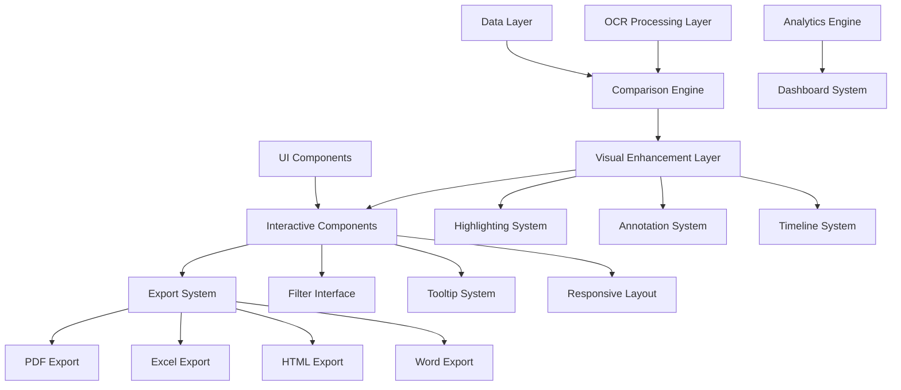

# Enhanced Visual Comparison System - Complete Documentation

## Executive Summary

This document provides comprehensive documentation for the Enhanced Visual Comparison System, a sophisticated OCR-based solution that transforms how users analyze and understand modifications between original claim packages and supplement packages. The system delivers detailed side-by-side analysis with advanced visual indicators, interactive annotations, chronological tracking, and comprehensive export capabilities.

## System Overview

### Core Capabilities

The Enhanced Visual Comparison System provides:

- **Multi-Level Visual Highlighting**: Intensity-based highlighting system with accessibility-compliant color schemes
- **Interactive Annotation System**: Collaborative annotation capabilities with threading and real-time collaboration
- **Chronological Change Tracking**: Complete audit trail with timeline visualization and temporal analytics
- **Advanced Visual Diff Indicators**: Multiple visualization modes including side-by-side, overlay, and animated transitions
- **Intelligent Filtering Interface**: Smart filtering with visual change type indicators and natural language queries
- **Comprehensive Statistics Dashboard**: Real-time analytics with customizable widgets and drill-down capabilities
- **Multi-Format Export System**: Preservation of annotations and visual formatting across PDF, Excel, Word, and HTML formats
- **Responsive Design**: Mobile-optimized interface with touch-friendly interactions and adaptive layouts
- **Advanced Tooltips and Hover States**: Context-aware information delivery with progressive disclosure

### Technical Architecture



## Feature Documentation

### 1. Enhanced Visual Highlighting System

#### Overview
The enhanced highlighting system provides multi-level visual indicators that help users quickly identify and understand different types of changes between documents.

#### Key Features
- **Four Intensity Levels**: Subtle, Moderate, Strong, and Critical highlighting based on change magnitude
- **Accessibility Compliance**: WCAG 2.1 AA compliant color schemes with alternative indicators
- **Contextual Highlighting**: Smart highlighting that adapts based on change type and business impact
- **Animation Support**: Smooth transitions and attention-drawing animations for critical changes

#### Implementation Details
```typescript
// Highlight intensity configuration
enum HighlightIntensity {
  SUBTLE = 'subtle',      // 10-20% opacity, minimal visual impact
  MODERATE = 'moderate',  // 30-50% opacity, noticeable but not distracting
  STRONG = 'strong',      // 60-80% opacity, clear visual emphasis
  CRITICAL = 'critical'   // 90-100% opacity, maximum attention
}

// Color scheme for different change types
interface HighlightColorScheme {
  added: ColorConfig;      // Green variants for new items
  removed: ColorConfig;    // Red variants for deleted items
  modified: ColorConfig;   // Blue variants for changed items
  moved: ColorConfig;      // Purple variants for repositioned items
}
```

#### Usage Guidelines
- **Subtle**: Use for minor formatting changes or non-critical updates
- **Moderate**: Apply to standard price changes or quantity adjustments
- **Strong**: Highlight significant cost impacts or important modifications
- **Critical**: Reserve for major changes requiring immediate attention

### 2. Interactive Annotation System

#### Overview
A comprehensive annotation system that enables collaborative review and documentation of changes with rich text support and threading capabilities.

#### Key Features
- **Multiple Annotation Types**: Comments, highlights, stamps, drawings, and attachments
- **Real-Time Collaboration**: Live updates and conflict resolution for team reviews
- **Threading System**: Organized discussions with reply chains and resolution tracking
- **Smart Suggestions**: AI-powered annotation recommendations based on change patterns
- **Version Control**: Complete history of annotation changes with rollback capabilities

#### Annotation Types
```typescript
enum AnnotationType {
  COMMENT = 'comment',           // Text-based observations
  HIGHLIGHT = 'highlight',       // Visual emphasis markers
  STAMP = 'stamp',              // Approval/rejection stamps
  DRAWING = 'drawing',          // Freehand annotations
  ATTACHMENT = 'attachment',     // File attachments
  LINK = 'link',                // Cross-references
  QUESTION = 'question',        // Inquiry annotations
  SUGGESTION = 'suggestion',    // Improvement recommendations
  APPROVAL = 'approval',        // Formal approvals
  REJECTION = 'rejection'       // Formal rejections
}
```

#### Collaboration Features
- **User Presence**: Real-time indication of active reviewers
- **Conflict Resolution**: Automatic handling of simultaneous edits
- **Notification System**: Alerts for new annotations and responses
- **Permission Management**: Role-based access control for annotations

### 3. Chronological Change Tracking

#### Overview
Complete temporal tracking of all modifications with interactive timeline visualization and comprehensive audit trails.

#### Key Features
- **Timeline Visualization**: Interactive timeline showing change progression over time
- **Change Events**: Detailed logging of all modifications with context and metadata
- **Temporal Analytics**: Trend analysis and pattern recognition in change history
- **Audit Compliance**: Complete audit trail meeting regulatory requirements
- **Change Correlation**: Identification of related changes and their dependencies

#### Change Event Structure
```typescript
interface ChangeEvent {
  id: string;
  timestamp: Date;
  type: ChangeEventType;
  source: ChangeSource;
  target: ChangeTarget;
  details: ChangeDetails;
  impact: ChangeImpact;
  metadata: ChangeMetadata;
  relationships: ChangeRelationship[];
}

enum ChangeEventType {
  ITEM_ADDED = 'item-added',
  ITEM_REMOVED = 'item-removed',
  ITEM_MODIFIED = 'item-modified',
  PRICE_CHANGED = 'price-changed',
  QUANTITY_CHANGED = 'quantity-changed',
  DESCRIPTION_UPDATED = 'description-updated',
  CATEGORY_CHANGED = 'category-changed',
  DOCUMENT_UPLOADED = 'document-uploaded',
  REVIEW_COMPLETED = 'review-completed'
}
```

#### Timeline Features
- **Interactive Navigation**: Click and drag timeline navigation with zoom capabilities
- **Event Filtering**: Filter timeline by change type, user, or impact level
- **Milestone Markers**: Important events highlighted with special indicators
- **Playback Mode**: Animated replay of changes over time

### 4. Visual Diff Indicators

#### Overview
Sophisticated visual comparison tools that provide clear before/after state visualization with multiple viewing modes.

#### Diff Modes
```typescript
enum DiffMode {
  SIDE_BY_SIDE = 'side-by-side',     // Original | Supplement comparison
  OVERLAY = 'overlay',               // Transparent overlay showing changes
  INLINE = 'inline',                 // GitHub-style inline differences
  ANIMATED = 'animated',             // Smooth transitions between states
  SPLIT_VIEW = 'split-view',         // Vertical split comparison
  UNIFIED = 'unified',               // Single view with change indicators
  HEATMAP = 'heatmap',              // Color intensity based on change magnitude
  TIMELINE = 'timeline'              // Temporal progression of changes
}
```

#### Key Features
- **Multiple Visualization Modes**: Eight different ways to view and understand changes
- **Synchronized Navigation**: Coordinated scrolling and selection across comparison panes
- **Change Connectors**: Visual lines connecting related changes between documents
- **Morphing Animations**: Smooth transitions showing how items transform
- **Interactive Reveal**: Slider controls for progressive change revelation

### 5. Enhanced Filtering Interface

#### Overview
Intelligent filtering system with visual indicators and natural language query support for efficient change analysis.

#### Filter Categories
```typescript
enum FilterType {
  CHANGE_TYPE = 'change-type',       // Added, removed, modified
  MAGNITUDE = 'magnitude',           // Financial impact ranges
  SIGNIFICANCE = 'significance',     // Trivial to critical
  CATEGORY = 'category',            // Parts, labor, materials
  FIELD = 'field',                  // Specific field types
  TEMPORAL = 'temporal',            // Time-based filters
  RISK = 'risk',                    // Risk assessment levels
  STATUS = 'status',                // Review status
  CONFIDENCE = 'confidence',        // OCR confidence levels
  CUSTOM = 'custom'                 // User-defined filters
}
```

#### Advanced Features
- **Smart Suggestions**: AI-powered filter recommendations based on data patterns
- **Natural Language Queries**: Plain English filter expressions
- **Filter Presets**: Saved filter combinations for common analysis scenarios
- **Real-Time Preview**: Immediate feedback on filter impact and results
- **Cross-Filtering**: Interactive filtering across multiple data dimensions

### 6. Summary Statistics Dashboard

#### Overview
Comprehensive analytics dashboard providing visual metrics and insights about comparison results and trends.

#### Widget Types
- **KPI Cards**: Key performance indicators with trend analysis
- **Interactive Charts**: Bar, line, pie, and specialized chart types
- **Comparison Visualizations**: Before/after comparisons with difference highlighting
- **Risk Assessment Matrices**: Visual risk evaluation and mitigation tracking
- **Trend Analysis**: Time-series analysis with forecasting capabilities

#### Dashboard Features
```typescript
interface DashboardWidget {
  id: string;
  type: WidgetType;
  title: string;
  data: WidgetData;
  visualization: WidgetVisualization;
  interactions: WidgetInteraction[];
  customization: WidgetCustomization;
}

enum WidgetType {
  METRIC_CARD = 'metric-card',
  CHART = 'chart',
  TABLE = 'table',
  HEATMAP = 'heatmap',
  GAUGE = 'gauge',
  PROGRESS = 'progress',
  TIMELINE = 'timeline',
  CUSTOM = 'custom'
}
```

#### Analytics Capabilities
- **Real-Time Updates**: Live data refresh with configurable intervals
- **Drill-Down Analysis**: Multi-level data exploration with context preservation
- **Export Integration**: Direct export of dashboard views and data
- **Personalization**: User-specific dashboard layouts and preferences

### 7. Multi-Format Export System

#### Overview
Comprehensive export functionality that preserves annotations, visual formatting, and interactive elements across multiple output formats.

#### Supported Formats
- **PDF**: Full annotation preservation with interactive elements
- **Excel**: Data export with formatting and conditional highlighting
- **Word**: Rich document export with embedded charts and tables
- **HTML**: Interactive web format with full functionality preservation
- **CSV**: Raw data export for further analysis
- **JSON**: Structured data export for system integration

#### Export Features
```typescript
interface ExportConfig {
  format: ExportFormatType;
  template: ExportTemplate;
  content: ContentSelection;
  quality: ExportQuality;
  security: SecuritySettings;
  customization: ExportCustomization;
}

enum ExportFormatType {
  PDF = 'pdf',
  EXCEL = 'excel',
  WORD = 'word',
  HTML = 'html',
  CSV = 'csv',
  JSON = 'json',
  POWERPOINT = 'powerpoint'
}
```

#### Advanced Export Capabilities
- **Template System**: Customizable export templates for different use cases
- **Batch Processing**: Multiple document export with scheduling
- **Quality Control**: Validation and verification of export integrity
- **Security Features**: Encryption, watermarking, and access control

### 8. Responsive Design System

#### Overview
Mobile-first responsive design ensuring optimal user experience across all device types and screen sizes.

#### Breakpoint System
```typescript
interface ResponsiveBreakpoints {
  mobile: { minWidth: 320, maxWidth: 767 };
  tablet: { minWidth: 768, maxWidth: 1023 };
  desktop: { minWidth: 1024, maxWidth: 1439 };
  largeDesktop: { minWidth: 1440, maxWidth: 1919 };
  ultraWide: { minWidth: 1920 };
}
```

#### Mobile Optimizations
- **Touch-Friendly Interface**: Optimized touch targets and gesture support
- **Adaptive Navigation**: Context-aware navigation patterns for different screen sizes
- **Performance Optimization**: Reduced resource usage and faster loading on mobile devices
- **Accessibility Enhancement**: Mobile-specific accessibility features and screen reader support

### 9. Interactive Tooltips and Hover System

#### Overview
Context-aware tooltip system providing progressive information disclosure with smart positioning and rich content support.

#### Tooltip Types
- **Basic Tooltips**: Simple text information on hover
- **Rich Tooltips**: HTML content with formatting and media
- **Interactive Tooltips**: Clickable content with actions and links
- **Progressive Tooltips**: Multi-level information disclosure
- **Contextual Tooltips**: Content that adapts based on user context and data

#### Features
```typescript
interface TooltipConfig {
  content: TooltipContent;
  positioning: TooltipPositioning;
  timing: TooltipTiming;
  styling: TooltipStyling;
  interactions: TooltipInteraction[];
  accessibility: TooltipAccessibility;
}

enum TooltipTrigger {
  HOVER = 'hover',
  CLICK = 'click',
  FOCUS = 'focus',
  LONG_PRESS = 'long-press',
  KEYBOARD = 'keyboard'
}
```

## Implementation Architecture

### Technology Stack

#### Frontend Technologies
- **React 18**: Modern React with concurrent features and Suspense
- **TypeScript**: Full type safety and enhanced developer experience
- **Tailwind CSS**: Utility-first CSS framework with custom design system
- **Framer Motion**: Advanced animations and transitions
- **React Query**: Data fetching and state management
- **Zustand**: Lightweight state management for UI state

#### Backend Integration
- **Google Gemini AI**: Advanced OCR and document analysis
- **RESTful APIs**: Standard HTTP APIs for data exchange
- **WebSocket**: Real-time collaboration and updates
- **File Processing**: Multi-format document handling and conversion

#### Development Tools
- **Vite**: Fast build tool and development server
- **ESLint/Prettier**: Code quality and formatting
- **Husky**: Git hooks for quality assurance
- **Jest/Testing Library**: Comprehensive testing framework
- **Storybook**: Component development and documentation

### Performance Considerations

#### Optimization Strategies
- **Code Splitting**: Dynamic imports for reduced bundle sizes
- **Lazy Loading**: On-demand component and data loading
- **Virtualization**: Efficient rendering of large datasets
- **Memoization**: React.memo and useMemo for performance optimization
- **Web Workers**: Background processing for heavy computations

#### Performance Metrics
- **First Contentful Paint**: <1.5s on 3G networks
- **Largest Contentful Paint**: <2.5s on 3G networks
- **Cumulative Layout Shift**: <0.1 for visual stability
- **First Input Delay**: <100ms for interaction responsiveness

### Security Implementation

#### Data Protection
- **Encryption**: End-to-end encryption for sensitive data
- **Access Control**: Role-based permissions and authentication
- **Audit Logging**: Comprehensive activity tracking
- **Data Validation**: Input sanitization and validation
- **Privacy Compliance**: GDPR and CCPA compliance features

#### Security Measures
- **Content Security Policy**: XSS protection and resource control
- **HTTPS Enforcement**: Secure communication protocols
- **Session Management**: Secure session handling and timeout
- **File Upload Security**: Malware scanning and file type validation

## User Guide

### Getting Started

#### Initial Setup
1. **Document Upload**: Upload original and supplement documents
2. **OCR Processing**: Automatic text extraction and analysis
3. **Comparison Generation**: Automated change detection and analysis
4. **Review Interface**: Access to enhanced visual comparison tools

#### Basic Navigation
- **Comparison View**: Main interface showing side-by-side document comparison
- **Filter Panel**: Left sidebar with filtering and search options
- **Statistics Dashboard**: Top section with key metrics and insights
- **Annotation Tools**: Right sidebar with annotation and collaboration features

### Feature Usage

#### Visual Highlighting
1. **Automatic Highlighting**: Changes automatically highlighted based on type and magnitude
2. **Manual Highlighting**: Add custom highlights using the annotation tools
3. **Intensity Adjustment**: Modify highlight intensity using the settings panel
4. **Color Customization**: Choose from accessibility-compliant color schemes

#### Annotation Workflow
1. **Create Annotation**: Click on any item to add comments or highlights
2. **Collaborate**: Share annotations with team members for review
3. **Thread Discussions**: Reply to annotations to create discussion threads
4. **Resolve Issues**: Mark annotations as resolved when addressed

#### Filtering and Search
1. **Quick Filters**: Use predefined filter buttons for common scenarios
2. **Advanced Filtering**: Combine multiple filter criteria for precise results
3. **Natural Language**: Type queries in plain English for intelligent filtering
4. **Save Presets**: Save frequently used filter combinations

#### Export Process
1. **Select Content**: Choose which sections and data to include
2. **Choose Format**: Select from PDF, Excel, Word, or HTML formats
3. **Customize Template**: Apply formatting and branding options
4. **Generate Export**: Process and download the formatted document

### Best Practices

#### Effective Review Process
1. **Start with Overview**: Use the statistics dashboard to understand overall changes
2. **Filter Strategically**: Focus on high-impact changes first
3. **Collaborate Early**: Involve stakeholders in the annotation process
4. **Document Decisions**: Use annotations to record review decisions and rationale
5. **Export Results**: Generate formal reports for documentation and approval

#### Performance Optimization
1. **Use Filters**: Reduce data volume for better performance
2. **Close Unused Features**: Minimize resource usage by closing unnecessary panels
3. **Regular Cleanup**: Clear browser cache and temporary data periodically
4. **Update Browser**: Use modern browsers for optimal performance

## API Documentation

### Core APIs

#### Comparison API
```typescript
// Generate comparison between documents
POST /api/comparison/generate
{
  originalDocument: File,
  supplementDocument: File,
  options: ComparisonOptions
}

// Get comparison results
GET /api/comparison/{id}
Response: ComparisonResult

// Update comparison settings
PUT /api/comparison/{id}/settings
{
  highlighting: HighlightingConfig,
  filtering: FilteringConfig,
  display: DisplayConfig
}
```

#### Annotation API
```typescript
// Create annotation
POST /api/annotations
{
  comparisonId: string,
  type: AnnotationType,
  content: AnnotationContent,
  position: AnnotationPosition
}

// Get annotations for comparison
GET /api/annotations?comparisonId={id}
Response: Annotation[]

// Update annotation
PUT /api/annotations/{id}
{
  content: AnnotationContent,
  status: AnnotationStatus
}
```

#### Export API
```typescript
// Generate export
POST /api/export/generate
{
  comparisonId: string,
  format: ExportFormat,
  template: ExportTemplate,
  options: ExportOptions
}

// Get export status
GET /api/export/{id}/status
Response: ExportStatus

// Download export
GET /api/export/{id}/download
Response: File
```

### WebSocket Events

#### Real-Time Collaboration
```typescript
// Annotation events
'annotation:created' | 'annotation:updated' | 'annotation:deleted'
'annotation:thread:reply' | 'annotation:resolved'

// User presence events
'user:joined' | 'user:left' | 'user:active'

// Comparison events
'comparison:updated' | 'comparison:settings:changed'

// Export events
'export:started' | 'export:completed' | 'export:failed'
```

## Troubleshooting Guide

### Common Issues

#### Performance Issues
**Problem**: Slow loading or rendering
**Solutions**:
- Clear browser cache and cookies
- Reduce the number of active filters
- Close unnecessary browser tabs
- Update to the latest browser version
- Check network connectivity

#### OCR Accuracy Issues
**Problem**: Incorrect text recognition
**Solutions**:
- Ensure document quality is high (300+ DPI)
- Check for proper document orientation
- Verify document format compatibility
- Review OCR confidence scores
- Manual correction of recognized text

#### Export Problems
**Problem**: Export fails or produces incorrect results
**Solutions**:
- Verify export format compatibility
- Check file size limitations
- Ensure sufficient browser memory
- Try alternative export formats
- Contact support for complex documents

#### Collaboration Issues
**Problem**: Annotations not syncing or conflicts
**Solutions**:
- Refresh the browser page
- Check network connectivity
- Verify user permissions
- Clear browser storage
- Restart collaboration session

### Error Codes

#### System Error Codes
- **E001**: Document upload failed
- **E002**: OCR processing error
- **E003**: Comparison generation failed
- **E004**: Export processing error
- **E005**: Authentication failure
- **E006**: Permission denied
- **E007**: Network connectivity issue
- **E008**: Storage quota exceeded

#### Resolution Steps
1. **Check Error Details**: Review the specific error message and code
2. **Verify Prerequisites**: Ensure all requirements are met
3. **Retry Operation**: Many errors are transient and resolve on retry
4. **Check System Status**: Verify service availability
5. **Contact Support**: Provide error code and context for assistance

## Maintenance and Updates

### Regular Maintenance

#### System Health Monitoring
- **Performance Metrics**: Monitor response times and resource usage
- **Error Tracking**: Log and analyze system errors and failures
- **User Feedback**: Collect and analyze user experience feedback
- **Security Audits**: Regular security assessments and updates

#### Update Process
1. **Backup Data**: Ensure all user data is safely backed up
2. **Test Updates**: Validate updates in staging environment
3. **Deploy Updates**: Apply updates during maintenance windows
4. **Verify Functionality**: Confirm all features work correctly
5. **Monitor Performance**: Watch for any performance degradation

### Version History

#### Current Version: 2.0.0
- Enhanced visual highlighting system
- Interactive annotation capabilities
- Chronological change tracking
- Advanced export functionality
- Responsive design implementation
- Comprehensive testing framework

#### Previous Versions
- **1.5.0**: Basic comparison functionality with simple highlighting
- **1.0.0**: Initial OCR-based document comparison system

## Support and Resources

### Documentation Resources
- **User Guide**: Comprehensive user documentation with tutorials
- **API Reference**: Complete API documentation with examples
- **Developer Guide**: Technical implementation details and best practices
- **Video Tutorials**: Step-by-step video guides for common tasks

### Support Channels
- **Help Desk**: Technical support for system issues
- **User Community**: Community forum for user discussions
- **Training Resources**: Online training materials and workshops
- **Feature Requests**: Process for requesting new features and enhancements

### Contact Information
- **Technical Support**: support@supplementguard.com
- **Sales Inquiries**: sales@supplementguard.com
- **General Information**: info@supplementguard.com
- **Emergency Support**: Available 24/7 for critical issues

## Conclusion

The Enhanced Visual Comparison System represents a significant advancement in OCR-based document analysis and comparison technology. By combining sophisticated visual indicators, interactive collaboration tools, comprehensive analytics, and flexible export capabilities, the system empowers users to efficiently and accurately analyze changes between document versions.

The system's architecture prioritizes performance, accessibility, and user experience while maintaining the flexibility to adapt to diverse use cases and requirements. With comprehensive testing, security measures, and ongoing support, the Enhanced Visual Comparison System provides a robust foundation for critical document analysis workflows.

This documentation serves as a complete reference for users, developers, and administrators, providing the information needed to effectively utilize and maintain the system. Regular updates to this documentation ensure that it remains current with system enhancements and user needs.