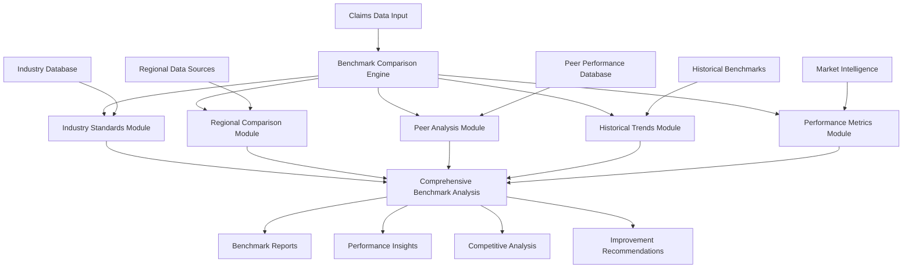

# Industry Benchmark Comparison System Specification

## Overview

This document specifies a comprehensive industry benchmark comparison system for auto-repair claims auditing. The system provides sophisticated benchmarking capabilities across multiple dimensions including costs, timelines, quality metrics, and performance indicators while enabling comparative analysis against industry standards, regional variations, and peer performance through advanced analytics and machine learning techniques.

## Benchmark Comparison Architecture

### High-Level Architecture



### Core Benchmark Comparison Components

#### 1. Comprehensive Benchmark Comparison Engine

```typescript
export class BenchmarkComparisonEngine {
  // Primary comparison methods
  async compareAgainstIndustryStandards(
    claimData: AutoRepairClaimData,
    industryStandards: IndustryStandard[]
  ): Promise<IndustryBenchmarkComparisonResult>;
  
  async compareAgainstRegionalBenchmarks(
    claimData: AutoRepairClaimData,
    regionalData: RegionalBenchmarkData[]
  ): Promise<RegionalBenchmarkComparisonResult>;
  
  async compareAgainstPeers(
    claimData: AutoRepairClaimData,
    peerData: PeerBenchmarkData[]
  ): Promise<PeerBenchmarkComparisonResult>;
  
  async analyzeHistoricalTrends(
    claimData: AutoRepairClaimData,
    historicalBenchmarks: HistoricalBenchmarkData[]
  ): Promise<HistoricalTrendAnalysisResult>;
  
  // Advanced benchmarking
  async performMultiDimensionalBenchmarking(
    claimData: AutoRepairClaimData,
    benchmarkDimensions: BenchmarkDimension[]
  ): Promise<MultiDimensionalBenchmarkResult>;
  
  async generateBenchmarkScorecard(
    comparisonResults: BenchmarkComparisonResult[]
  ): Promise<BenchmarkScorecard>;
  
  async identifyPerformanceGaps(
    actualPerformance: PerformanceData,
    benchmarkPerformance: BenchmarkPerformanceData
  ): Promise<PerformanceGapAnalysis>;
  
  // Predictive benchmarking
  async predictFutureBenchmarks(
    historicalBenchmarks: HistoricalBenchmarkData[],
    trendFactors: TrendFactor[]
  ): Promise<FutureBenchmarkPrediction>;
  
  async generateImprovementRecommendations(
    gapAnalysis: PerformanceGapAnalysis,
    bestPractices: BestPractice[]
  ): Promise<ImprovementRecommendation[]>;
}
```

## Industry Standards Comparison

### 1. Comprehensive Industry Standards Analysis

```typescript
export interface IndustryBenchmarkComparisonResult {
  // Comparison overview
  comparison_summary: IndustryComparisonSummary;
  performance_positioning: IndustryPerformancePositioning;
  benchmark_metrics: IndustryBenchmarkMetrics;
  
  // Cost benchmarking
  cost_benchmarking: IndustryCostBenchmarking;
  labor_rate_benchmarking: LaborRateBenchmarking;
  parts_cost_benchmarking: PartsCostBenchmarking;
  
  // Timeline benchmarking
  timeline_benchmarking: TimelineBenchmarking;
  efficiency_benchmarking: EfficiencyBenchmarking;
  productivity_benchmarking: ProductivityBenchmarking;
  
  // Quality benchmarking
  quality_benchmarking: QualityBenchmarking;
  customer_satisfaction_benchmarking: CustomerSatisfactionBenchmarking;
  defect_rate_benchmarking: DefectRateBenchmarking;
  
  // Performance analysis
  performance_percentiles: PerformancePercentile[];
  competitive_positioning: CompetitivePositioning;
  market_share_analysis: MarketShareAnalysis;
  
  // Gap analysis
  performance_gaps: PerformanceGap[];
  improvement_opportunities: ImprovementOpportunity[];
  best_practice_recommendations: BestPracticeRecommendation[];
}

export class IndustryStandardsAnalyzer {
  // Core industry comparison
  async compareAgainstIndustryStandards(
    claimData: AutoRepairClaimData,
    industryStandards: IndustryStandard[]
  ): Promise<IndustryBenchmarkComparisonResult>;
  
  async analyzeCostBenchmarks(
    costData: CostData[],
    industryCostBenchmarks: IndustryCostBenchmark[]
  ): Promise<IndustryCostBenchmarkingResult>;
  
  async analyzeTimelineBenchmarks(
    timelineData: TimelineData[],
    industryTimelineBenchmarks: IndustryTimelineBenchmark[]
  ): Promise<IndustryTimelineBenchmarkingResult>;
  
  // Performance positioning
  async calculatePerformancePercentiles(
    performanceData: PerformanceData[],
    industryDistribution: IndustryPerformanceDistribution
  ): Promise<PerformancePercentileCalculation>;
  
  async analyzeCompetitivePositioning(
    performanceMetrics: PerformanceMetric[],
    competitorData: CompetitorData[]
  ): Promise<CompetitivePositioningAnalysis>;
  
  async assessMarketPosition(
    marketData: MarketData[],
    industryMetrics: IndustryMetric[]
  ): Promise<MarketPositionAssessment>;
  
  // Gap analysis
  async identifyPerformanceGaps(
    actualPerformance: ActualPerformance[],
    industryBenchmarks: IndustryBenchmark[]
  ): Promise<PerformanceGapIdentification>;
  
  async prioritizeImprovementOpportunities(
    performanceGaps: PerformanceGap[],
    impactFactors: ImpactFactor[]
  ): Promise<PrioritizedImprovementOpportunity[]>;
  
  // Best practices analysis
  async identifyBestPractices(
    topPerformers: TopPerformer[],
    performanceFactors: PerformanceFactor[]
  ): Promise<BestPracticeIdentification>;
  
  async recommendBestPractices(
    performanceGaps: PerformanceGap[],
    availableBestPractices: BestPractice[]
  ): Promise<BestPracticeRecommendation[]>;
}

export interface IndustryComparisonSummary {
  // Overall performance
  overall_industry_ranking: IndustryRanking;
  performance_percentile: PerformancePercentile;
  competitive_position: CompetitivePosition;
  
  // Key metrics comparison
  cost_performance_vs_industry: CostPerformanceComparison;
  timeline_performance_vs_industry: TimelinePerformanceComparison;
  quality_performance_vs_industry: QualityPerformanceComparison;
  
  // Performance trends
  performance_trend_vs_industry: PerformanceTrendComparison;
  improvement_rate_vs_industry: ImprovementRateComparison;
  market_share_trend: MarketShareTrend;
  
  // Strengths and weaknesses
  competitive_strengths: CompetitiveStrength[];
  performance_weaknesses: PerformanceWeakness[];
  improvement_priorities: ImprovementPriority[];
  
  // Industry insights
  industry_trends: IndustryTrend[];
  market_dynamics: MarketDynamic[];
  regulatory_impacts: RegulatoryImpact[];
}

export interface IndustryCostBenchmarking {
  // Cost positioning
  cost_percentile_ranking: CostPercentileRanking;
  cost_competitiveness_score: CostCompetitivenessScore;
  cost_efficiency_rating: CostEfficiencyRating;
  
  // Cost component analysis
  labor_cost_benchmarking: LaborCostBenchmarking;
  parts_cost_benchmarking: PartsCostBenchmarking;
  overhead_cost_benchmarking: OverheadCostBenchmarking;
  
  // Cost trends
  cost_trend_vs_industry: CostTrendComparison;
  cost_inflation_vs_industry: CostInflationComparison;
  cost_optimization_vs_industry: CostOptimizationComparison;
  
  // Cost drivers analysis
  cost_driver_analysis: CostDriverAnalysis;
  cost_structure_comparison: CostStructureComparison;
  cost_variability_analysis: CostVariabilityAnalysis;
  
  // Optimization opportunities
  cost_reduction_opportunities: CostReductionOpportunity[];
  cost_optimization_strategies: CostOptimizationStrategy[];
  cost_management_best_practices: CostManagementBestPractice[];
}
```

### 2. Advanced Regional Benchmarking System

```typescript
export interface RegionalBenchmarkComparisonResult {
  // Regional overview
  regional_comparison_summary: RegionalComparisonSummary;
  regional_performance_positioning: RegionalPerformancePositioning;
  geographic_analysis: GeographicAnalysis;
  
  // Regional cost analysis
  regional_cost_benchmarking: RegionalCostBenchmarking;
  cost_of_living_adjustments: CostOfLivingAdjustment[];
  regional_pricing_variations: RegionalPricingVariation[];
  
  // Regional market analysis
  regional_market_dynamics: RegionalMarketDynamic[];
  local_competition_analysis: LocalCompetitionAnalysis;
  regional_demand_patterns: RegionalDemandPattern[];
  
  // Regulatory environment
  regional_regulatory_differences: RegionalRegulatoryDifference[];
  compliance_cost_variations: ComplianceCostVariation[];
  regulatory_impact_analysis: RegulatoryImpactAnalysis;
  
  // Economic factors
  regional_economic_indicators: RegionalEconomicIndicator[];
  economic_impact_on_performance: EconomicImpactOnPerformance;
  regional_growth_opportunities: RegionalGrowthOpportunity[];
  
  // Best practices by region
  regional_best_practices: RegionalBestPractice[];
  cross_regional_learning_opportunities: CrossRegionalLearningOpportunity[];
  regional_optimization_strategies: RegionalOptimizationStrategy[];
}

export class RegionalBenchmarkAnalyzer {
  // Core regional comparison
  async compareAgainstRegionalBenchmarks(
    claimData: AutoRepairClaimData,
    regionalData: RegionalBenchmarkData[]
  ): Promise<RegionalBenchmarkComparisonResult>;
  
  async analyzeRegionalCostVariations(
    costData: CostData[],
    regionalCostData: RegionalCostData[]
  ): Promise<RegionalCostVariationAnalysis>;
  
  async analyzeRegionalMarketDynamics(
    marketData: MarketData[],
    regionalMarketData: RegionalMarketData[]
  ): Promise<RegionalMarketDynamicsAnalysis>;
  
  // Geographic analysis
  async performGeographicAnalysis(
    performanceData: PerformanceData[],
    geographicData: GeographicData[]
  ): Promise<GeographicAnalysisResult>;
  
  async analyzeUrbanVsRuralPerformance(
    performanceData: PerformanceData[],
    locationData: LocationData[]
  ): Promise<UrbanRuralPerformanceAnalysis>;
  
  // Economic factor analysis
  async analyzeEconomicFactorImpact(
    performanceData: PerformanceData[],
    economicIndicators: EconomicIndicator[]
  ): Promise<EconomicFactorImpactAnalysis>;
  
  async adjustForCostOfLiving(
    costData: CostData[],
    costOfLivingIndices: CostOfLivingIndex[]
  ): Promise<CostOfLivingAdjustedData>;
  
  // Regional optimization
  async identifyRegionalOptimizationOpportunities(
    regionalAnalysis: RegionalBenchmarkComparisonResult
  ): Promise<RegionalOptimizationOpportunity[]>;
  
  async recommendRegionalStrategies(
    regionalPerformance: RegionalPerformanceData[],
    regionalFactors: RegionalFactor[]
  ): Promise<RegionalStrategyRecommendation[]>;
}

export interface RegionalComparisonSummary {
  // Regional positioning
  regional_ranking: RegionalRanking;
  regional_percentile: RegionalPercentile;
  regional_market_share: RegionalMarketShare;
  
  // Performance vs regional average
  cost_performance_vs_regional: RegionalCostPerformanceComparison;
  timeline_performance_vs_regional: RegionalTimelinePerformanceComparison;
  quality_performance_vs_regional: RegionalQualityPerformanceComparison;
  
  // Regional characteristics
  regional_cost_factors: RegionalCostFactor[];
  regional_market_characteristics: RegionalMarketCharacteristic[];
  regional_competitive_landscape: RegionalCompetitiveLandscape;
  
  // Regional opportunities
  regional_growth_potential: RegionalGrowthPotential;
  regional_expansion_opportunities: RegionalExpansionOpportunity[];
  regional_partnership_opportunities: RegionalPartnershipOpportunity[];
  
  // Regional challenges
  regional_challenges: RegionalChallenge[];
  regulatory_compliance_requirements: RegulatoryComplianceRequirement[];
  regional_risk_factors: RegionalRiskFactor[];
}
```

## Peer Performance Analysis

### 1. Comprehensive Peer Benchmarking System

```typescript
export interface PeerBenchmarkComparisonResult {
  // Peer comparison overview
  peer_comparison_summary: PeerComparisonSummary;
  peer_performance_ranking: PeerPerformanceRanking;
  competitive_analysis: CompetitiveAnalysis;
  
  // Peer segmentation
  peer_group_analysis: PeerGroupAnalysis;
  similar_size_peer_comparison: SimilarSizePeerComparison;
  market_segment_peer_comparison: MarketSegmentPeerComparison;
  
  // Performance comparison
  peer_cost_performance: PeerCostPerformance;
  peer_operational_performance: PeerOperationalPerformance;
  peer_quality_performance: PeerQualityPerformance;
  
  // Best performer analysis
  top_performer_analysis: TopPerformerAnalysis;
  best_practice_identification: BestPracticeIdentification;
  performance_driver_analysis: PerformanceDriverAnalysis;
  
  // Competitive intelligence
  competitive_positioning: CompetitivePositioning;
  market_share_analysis: MarketShareAnalysis;
  competitive_advantage_analysis: CompetitiveAdvantageAnalysis;
  
  // Improvement insights
  peer_learning_opportunities: PeerLearningOpportunity[];
  competitive_gap_analysis: CompetitiveGapAnalysis;
  strategic_recommendations: StrategicRecommendation[];
}

export class PeerBenchmarkAnalyzer {
  // Core peer comparison
  async compareAgainstPeers(
    claimData: AutoRepairClaimData,
    peerData: PeerBenchmarkData[]
  ): Promise<PeerBenchmarkComparisonResult>;
  
  async segmentPeerGroups(
    peerData: PeerData[],
    segmentationCriteria: SegmentationCriteria[]
  ): Promise<PeerGroupSegmentation>;
  
  async analyzePeerPerformance(
    performanceData: PerformanceData[],
    peerPerformanceData: PeerPerformanceData[]
  ): Promise<PeerPerformanceAnalysisResult>;
  
  // Top performer analysis
  async identifyTopPerformers(
    peerData: PeerData[],
    performanceMetrics: PerformanceMetric[]
  ): Promise<TopPerformerIdentification>;
  
  async analyzeBestPractices(
    topPerformers: TopPerformer[],
    practiceData: PracticeData[]
  ): Promise<BestPracticeAnalysisResult>;
  
  async identifyPerformanceDrivers(
    topPerformers: TopPerformer[],
    performanceFactors: PerformanceFactor[]
  ): Promise<PerformanceDriverIdentification>;
  
  // Competitive analysis
  async analyzeCompetitivePositioning(
    competitiveData: CompetitiveData[],
    marketData: MarketData[]
  ): Promise<CompetitivePositioningAnalysisResult>;
  
  async assessCompetitiveAdvantages(
    competitiveFactors: CompetitiveFactor[],
    advantageMetrics: AdvantageMetric[]
  ): Promise<CompetitiveAdvantageAssessment>;
  
  // Learning and improvement
  async identifyLearningOpportunities(
    peerComparison: PeerBenchmarkComparisonResult
  ): Promise<LearningOpportunityIdentification>;
  
  async generateStrategicRecommendations(
    competitiveAnalysis: CompetitiveAnalysis,
    strategicGoals: StrategicGoal[]
  ): Promise<StrategicRecommendationGeneration>;
}

export interface PeerComparisonSummary {
  // Peer group characteristics
  peer_group_size: number;
  peer_group_characteristics: PeerGroupCharacteristic[];
  peer_selection_criteria: PeerSelectionCriteria[];
  
  // Performance ranking
  overall_peer_ranking: PeerRanking;
  peer_percentile_position: PeerPercentilePosition;
  performance_quartile: PerformanceQuartile;
  
  // Key performance comparisons
  cost_performance_vs_peers: PeerCostPerformanceComparison;
  operational_performance_vs_peers: PeerOperationalPerformanceComparison;
  quality_performance_vs_peers: PeerQualityPerformanceComparison;
  
  // Competitive insights
  competitive_strengths_vs_peers: CompetitiveStrengthVsPeers[];
  competitive_weaknesses_vs_peers: CompetitiveWeaknessVsPeers[];
  differentiation_opportunities: DifferentiationOpportunity[];
  
  // Performance gaps
  performance_gaps_vs_top_quartile: PerformanceGapVsTopQuartile[];
  improvement_potential: ImprovementPotential;
  catch_up_requirements: CatchUpRequirement[];
}
```

### 2. Advanced Historical Trend Analysis

```typescript
export interface HistoricalTrendAnalysisResult {
  // Trend overview
  historical_trend_summary: HistoricalTrendSummary;
  performance_evolution: PerformanceEvolution;
  trend_analysis: TrendAnalysis;
  
  // Performance trends
  cost_trend_analysis: CostTrendAnalysis;
  efficiency_trend_analysis: EfficiencyTrendAnalysis;
  quality_trend_analysis: QualityTrendAnalysis;
  
  // Comparative trends
  performance_vs_industry_trends: PerformanceVsIndustryTrends;
  performance_vs_peer_trends: PerformanceVsPeerTrends;
  market_position_evolution: MarketPositionEvolution;
  
  // Cyclical analysis
  seasonal_pattern_analysis: SeasonalPatternAnalysis;
  cyclical_trend_analysis: CyclicalTrendAnalysis;
  economic_cycle_correlation: EconomicCycleCorrelation;
  
  // Future projections
  trend_extrapolation: TrendExtrapolation;
  performance_forecasts: PerformanceForecast[];
  scenario_analysis: ScenarioAnalysis;
  
  // Insights and recommendations
  trend_insights: TrendInsight[];
  strategic_implications: StrategicImplication[];
  trend_based_recommendations: TrendBasedRecommendation[];
}

export class HistoricalTrendAnalyzer {
  // Core trend analysis
  async analyzeHistoricalTrends(
    claimData: AutoRepairClaimData,
    historicalBenchmarks: HistoricalBenchmarkData[]
  ): Promise<HistoricalTrendAnalysisResult>;
  
  async analyzePerformanceEvolution(
    historicalPerformance: HistoricalPerformanceData[],
    timeHorizons: TimeHorizon[]
  ): Promise<PerformanceEvolutionAnalysis>;
  
  async identifyTrendPatterns(
    trendData: TrendData[],
    patternTypes: TrendPatternType[]
  ): Promise<TrendPatternIdentification>;
  
  // Comparative trend analysis
  async comparePerformanceTrends(
    performanceTrends: PerformanceTrend[],
    benchmarkTrends: BenchmarkTrend[]
  ): Promise<ComparativeTrendAnalysis>;
  
  async analyzeMarketPositionEvolution(
    marketPositionHistory: MarketPositionHistory[],
    competitiveHistory: CompetitiveHistory[]
  ): Promise<MarketPositionEvolutionAnalysis>;
  
  // Cyclical and seasonal analysis
  async analyzeSeasonalPatterns(
    seasonalData: SeasonalData[],
    seasonalFactors: SeasonalFactor[]
  ): Promise<SeasonalPatternAnalysisResult>;
  
  async analyzeCyclicalTrends(
    cyclicalData: CyclicalData[],
    economicCycles: EconomicCycle[]
  ): Promise<CyclicalTrendAnalysisResult>;
  
  // Predictive analysis
  async extrapolateTrends(
    historicalTrends: HistoricalTrend[],
    extrapolationModels: ExtrapolationModel[]
  ): Promise<TrendExtrapolationResult>;
  
  async generatePerformanceForecasts(
    trendAnalysis: HistoricalTrendAnalysisResult,
    forecastHorizons: ForecastHorizon[]
  ): Promise<PerformanceForecastResult>;
}
```

## Multi-Dimensional Benchmarking

### 1. Comprehensive Multi-Dimensional Analysis

```typescript
export interface MultiDimensionalBenchmarkResult {
  // Multi-dimensional overview
  multidimensional_summary: MultiDimensionalSummary;
  dimension_performance_matrix: DimensionPerformanceMatrix;
  integrated_performance_score: IntegratedPerformanceScore;
  
  // Dimension analysis
  cost_dimension_analysis: CostDimensionAnalysis;
  quality_dimension_analysis: QualityDimensionAnalysis;
  efficiency_dimension_analysis: EfficiencyDimensionAnalysis;
  customer_dimension_analysis: CustomerDimensionAnalysis;
  
  // Cross-dimensional analysis
  dimension_correlation_analysis: DimensionCorrelationAnalysis;
  trade_off_analysis: TradeOffAnalysis;
  optimization_frontier_analysis: OptimizationFrontierAnalysis;
  
  // Performance clustering
  performance_cluster_analysis: PerformanceClusterAnalysis;
  peer_group_identification: PeerGroupIdentification;
  best_practice_clusters: BestPracticeCluster[];
  
  // Strategic insights
  strategic_positioning_analysis: StrategicPositioningAnalysis;
  competitive_advantage_identification: CompetitiveAdvantageIdentification;
  improvement_pathway_analysis: ImprovementPathwayAnalysis;
  
  // Recommendations
  multidimensional_recommendations: MultiDimensionalRecommendation[];
  balanced_improvement_strategies: BalancedImprovementStrategy[];
  strategic_focus_recommendations: StrategicFocusRecommendation[];
}

export class MultiDimensionalBenchmarkAnalyzer {
  // Core multi-dimensional analysis
  async performMultiDimensionalBenchmarking(
    claimData: AutoRepairClaimData,
    benchmarkDimensions: BenchmarkDimension[]
  ): Promise<MultiDimensionalBenchmarkResult>;
  
  async calculateIntegratedPerformanceScore(
    dimensionScores: DimensionScore[],
    weightingScheme: WeightingScheme
  ): Promise<IntegratedPerformanceScoreCalculation>;
  
  async analyzeDimensionCorrelations(
    dimensionData: DimensionData[],
    correlationMethods: CorrelationMethod[]
  ): Promise<DimensionCorrelationAnalysisResult>;
  
  // Trade-off analysis
  async analyzePerformanceTradeOffs(
    performanceData: MultiDimensionalPerformanceData,
    tradeOffFactors: TradeOffFactor[]
  ): Promise<TradeOffAnalysisResult>;
  
  async identifyOptimizationFrontier(
    performanceData: MultiDimensionalPerformanceData,
    optimizationCriteria: OptimizationCriteria[]
  ): Promise<OptimizationFrontierIdentification>;
  
  // Clustering analysis
  async performPerformanceClusterAnalysis(
    performanceData: MultiDimensionalPerformanceData,
    clusteringAlgorithms: ClusteringAlgorithm[]
  ): Promise<PerformanceClusterAnalysisResult>;
  
  async identifyBestPracticeClusters(
    clusterAnalysis: PerformanceClusterAnalysisResult,
    bestPracticeCriteria: BestPracticeCriteria[]
  ): Promise<BestPracticeClusterIdentification>;
  
  // Strategic analysis
  async analyzeStrategicPositioning(
    multidimensionalResults: MultiDimensionalBenchmarkResult,
    strategicFrameworks: StrategicFramework[]
  ): Promise<StrategicPositioningAnalysisResult>;
  
  async generateBalancedImprovementStrategies(
    performanceGaps: MultiDimensionalPerformanceGap[],
    resourceConstraints: ResourceConstraint[]
  ): Promise<BalancedImprovementStrategyGeneration>;
}
```

### 2. Advanced Benchmark Scorecard System

```typescript
export interface BenchmarkScorecard {
  // Scorecard overview
  scorecard_summary: ScorecardSummary;
  overall_benchmark_score: OverallBenchmarkScore;
  performance_grade: PerformanceGrade;
  
  // Category scores
  cost_performance_score: CategoryPerformanceScore;
  quality_performance_score: CategoryPerformanceScore;
  efficiency_performance_score: CategoryPerformanceScore;
  customer_performance_score: CategoryPerformanceScore;
  
  // Benchmark comparisons
  industry_benchmark_comparison: IndustryBenchmarkComparison;
  regional_benchmark_comparison: RegionalBenchmarkComparison;
  peer_benchmark_comparison: PeerBenchmarkComparison;
  
  // Performance indicators
  key_performance_indicators: KeyPerformanceIndicator[];
  performance_trends: PerformanceTrend[];
  performance_alerts: PerformanceAlert[];
  
  // Improvement tracking
  improvement_progress: ImprovementProgress[];
  goal_achievement: GoalAchievement[];
  milestone_tracking: MilestoneTracking[];
  
  // Action items
  priority_action_items: PriorityActionItem[];
  improvement_recommendations: ImprovementRecommendation[];
  best_practice_adoption: BestPracticeAdoption[];
}

export class BenchmarkScorecardGenerator {
  // Core scorecard generation
  async generateBenchmarkScorecard(
    comparisonResults: BenchmarkComparisonResult[]
  ): Promise<BenchmarkScorecard>;
  
  async calculateOverallBenchmarkScore(
    categoryScores: CategoryScore[],
    scoringWeights: ScoringWeight[]
  ): Promise<OverallBenchmarkScoreCalculation>;
  
  async assignPerformanceGrade(
    benchmarkScore: BenchmarkScore,
    gradingCriteria: GradingCriteria
  ): Promise<PerformanceGradeAssignment>;
  
  // Category scoring
  async calculateCategoryScores(
    performanceData: PerformanceData[],
    categoryDefinitions: CategoryDefinition[]
  ): Promise<CategoryScoreCalculation>;
  
  async benchmarkCategoryPerformance(
    categoryScores: CategoryScore[],
    categoryBenchmarks: CategoryBenchmark[]
  ): Promise<CategoryBenchmarkComparison>;
  
  // KPI management
  async defineKeyPerformanceIndicators(
    performanceObjectives: PerformanceObjective[],
    measurementCriteria: MeasurementCriteria[]
  ): Promise<KPIDefinition>;
  
  async trackKPIPerformance(
    kpiDefinitions: KPIDefinition[],
    performanceData: PerformanceData[]
  ): Promise<KPIPerformanceTracking>;
  
  // Improvement tracking
  async trackImprovementProgress(
    improvementInitiatives: ImprovementInitiative[],
    progressData: ProgressData[]
  ): Promise<ImprovementProgressTracking>;
  
  async generateActionItems(
    performanceGaps: PerformanceGap[],
    improvementOpportunities: ImprovementOpportunity[]
  ): Promise<ActionItemGeneration>;
}
```

## Machine Learning and Predictive Analytics

### 1. Advanced ML-Based Benchmark Analysis

```typescript
export class MLBenchmarkAnalysisEngine {
  // Model training and inference
  async trainBenchmarkModels(
    trainingData: BenchmarkTrainingData[]
  ): Promise<BenchmarkAnalysisModel[]>;
  
  async predictPerformanceBenchmarks(
    performanceData: PerformanceData[],
    benchmarkModels: BenchmarkPredictionModel[]
  ): Promise<BenchmarkPrediction[]>;
  
  async classifyPerformanceCategories(
    performanceData: PerformanceData[],
    classificationModels: PerformanceClassificationModel[]
  ): Promise<PerformanceCategoryClassification[]>;
  
  // Anomaly detection
  async detectBenchmarkAnomalies(
    benchmarkData: BenchmarkData[],
    anomalyModels: BenchmarkAnomalyModel[]
  ): Promise<BenchmarkAnomalyDetection[]>;
  
  async identifyOutlierPerformance(
    performanceData: PerformanceData[],
    outlierDetectionModels: OutlierDetectionModel[]
  ): Promise<OutlierPerformanceIdentification[]>;
  
  // Pattern recognition
  async recognizeBenchmarkPatterns(
    historicalBenchmarks: HistoricalBenchmarkData[],
    patternModels: BenchmarkPatternModel[]
  ): Promise<BenchmarkPatternRecognition[]>;
  
  async identifyPerformanceDrivers(
    performanceData: PerformanceData[],
    driverAnalysisModels: DriverAnalysisModel[]
  ): Promise<PerformanceDriverIdentification[]>;
  
  // Optimization modeling
  async optimizeBenchmarkTargets(
    currentPerformance: CurrentPerformanceData,
    optimizationModels: BenchmarkOptimizationModel[]
  ): Promise<OptimizedBenchmarkTarget[]>;
  
  async recommendImprovementStrategies(
    performanceGaps: PerformanceGap[],
    strategyRecommendationModels: StrategyRecommendationModel[]
  ): Promise<ImprovementStrategyRecommendation[]>;
  
  // Model validation and improvement
  async validateBenchmarkModels(
    models: BenchmarkAnalysisModel[],
    validationData: BenchmarkValidationData[]
  ): Promise<BenchmarkModelValidationResult[]>;
  
  async improveBenchmarkModels(
    models: BenchmarkAnalysisModel[],
    performanceData: ModelPerformanceData[]
  ): Promise<ImprovedBenchmarkModel[]>;
}

export interface BenchmarkAnalysisModel {
  // Model metadata
  model_id: string;
  model_type: BenchmarkModelType;
  model_version: string;
  training_date: string;
  
  // Model configuration
  algorithm_type: AlgorithmType;
  feature_engineering: BenchmarkFeatureEngineering;
  hyperparameters: ModelHyperparameter[];
  
  // Performance metrics
  accuracy_metrics: BenchmarkAccuracyMetric[];
  validation_scores: ValidationScore[];
  cross_validation_results: CrossValidationResult[];
  
  // Model interpretation
  feature_importance: FeatureImportanceScore[];
  model_explainability: ModelExplainability;
  benchmark_insights: BenchmarkInsight[];
}
```

### 2. Predictive Benchmark Analytics

```typescript
export interface PredictiveBenchmarkAnalytics {
  // Performance predictions
  performance_forecasts: PerformanceForecast[];
  benchmark_evolution_predictions: BenchmarkEvolutionPrediction[];
  competitive_position_forecasts: CompetitivePositionForecast[];
  
  // Market predictions
  market_trend_predictions: MarketTrendPrediction[];
  industry_evolution_forecasts: IndustryEvolutionForecast[];
  regulatory_impact_predictions: RegulatoryImpactPrediction[];
  
  // Improvement predictions
  improvement_outcome_predictions: ImprovementOutcomePrediction[];
  strategy_effectiveness_forecasts: StrategyEffectivenessForecast[];
  roi_projections: ROIProjection[];
  
  // Risk predictions
  performance_risk_forecasts: PerformanceRiskForecast[];
  competitive_threat_predictions: CompetitiveThreatPrediction[];
  market_disruption_forecasts: MarketDisruptionForecast[];
  
  // Opportunity predictions
  growth_opportunity_forecasts: GrowthOpportunityForecast[];
  market_expansion_predictions: MarketExpansionPrediction[];
  innovation_opportunity_forecasts: InnovationOpportunityForecast[];
}

export class PredictiveBenchmarkAnalyzer {
  // Predictive modeling
  async generatePerformanceForecasts(
    historicalPerformance: HistoricalPerformanceData[],
    forecastFactors: ForecastFactor[]
  ): Promise<PerformanceForecastResult>;
  
  async predictBenchmarkEvolution(
    benchmarkHistory: BenchmarkHistory[],
    evolutionFactors: EvolutionFactor[]
  ): Promise<BenchmarkEvolutionPredictionResult>;
  
  async forecastCompetitivePosition(
    competitiveHistory: CompetitiveHistory[],
    marketFactors: MarketFactor[]
  ): Promise<CompetitivePositionForecastResult>;
  
  // Market prediction
  async predictMarketTrends(
    marketData: MarketData[],
    trendFactors: TrendFactor[]
  ): Promise<MarketTrendPredictionResult>;
  
  async forecastIndustryEvolution(
    industryData: IndustryData[],
    evolutionDrivers: EvolutionDriver[]
  ): Promise<IndustryEvolutionForecastResult>;
  
  // Improvement prediction
  async predictImprovementOutcomes(
    improvementPlans: ImprovementPlan[],
    outcomeFactors: OutcomeFactor[]
  ): Promise<ImprovementOutcomePredictionResult>;
  
  async forecastStrategyEffectiveness(
    strategies: ImprovementStrategy[],
    effectivenessFactors: EffectivenessFactor[]
  ): Promise<StrategyEffectivenessForecastResult>;
}
```

## Integration and Implementation

### 1. System Integration Architecture

```typescript
export class BenchmarkComparisonIntegrator {
  // Core integration
  async integrateWithRiskAnalysis(
    benchmarkResults: BenchmarkComparisonResult,
    riskAnalysis: RiskAnalysisResult
  ): Promise<IntegratedBenchmarkRiskAnalysis>;
  
  async integrateWithPerformanceManagement(
    benchmarkResults: BenchmarkComparisonResult,
    performanceData: PerformanceManagementData
  ): Promise<IntegratedPerformanceBenchmarkAnalysis>;
  
  async integrateWithStrategicPlanning(
    benchmarkResults: BenchmarkComparisonResult,
    strategicPlans: StrategicPlan[]
  ): Promise<IntegratedStrategicBenchmarkAnalysis>;
  
  // External data integration
  async integrateIndustryData(
    industryDataSources: IndustryDataSource[]
  ): Promise<IndustryDataIntegration>;
  
  async integrateMarketIntelligence(
    marketIntelligenceSources: MarketIntelligenceSource[]
  ): Promise<MarketIntelligenceIntegration>;
  
  async integrateCompetitiveIntelligence(
    competitiveIntelligenceSources: CompetitiveIntelligenceSource[]
  ): Promise<CompetitiveIntelligenceIntegration>;
  
  // Data synchronization
  async synchronizeBenchmarkData(
    dataSources: BenchmarkDataSource[]
  ): Promise<SynchronizedBenchmarkData>;
  
  async validateDataConsistency(
    benchmarkData: BenchmarkData[]
  ): Promise<DataConsistencyValidation>;
}
```

### 2. Performance Optimization

```typescript
export class BenchmarkAnalysisOptimizer {
  // Performance optimization
  async optimizeAnalysisPerformance(
    analysisEngine: BenchmarkComparisonEngine,
    performanceTargets: PerformanceTarget[]
  ): Promise<OptimizedBenchmarkAnalysisEngine>;
  
  async implementCaching(
    benchmarkResults: BenchmarkComparisonResult[],
    cachingStrategy: CachingStrategy
  ): Promise<CachedBenchmarkSystem>;
  
  async optimizeDataProcessing(
    dataProcessingPipeline: BenchmarkDataProcessingPipeline,
    optimizationRules: OptimizationRule[]
  ): Promise<OptimizedBenchmarkDataProcessing>;
  
  // Scalability management
  async scaleForHighVolume(
    benchmarkSystem: BenchmarkComparisonSystem,
    volumeProjections: VolumeProjection[]
  ): Promise<ScaledBenchmarkSystem>;
  
  async implementLoadBalancing(
    benchmarkServices: BenchmarkAnalysisService[],
    loadBalancingConfig: LoadBalancingConfiguration
  ): Promise<LoadBalancedBenchmarkSystem>;
}
```

## Implementation Roadmap

### Phase 1: Core Benchmark Framework (Weeks 1-2)
1. **Industry Standards Integration**: Implement comprehensive industry benchmark data integration
2. **Regional Benchmarking**: Build regional comparison and geographic analysis capabilities
3. **Basic Peer Analysis**: Create peer group identification and comparison framework
4. **Integration Foundation**: Establish integration with existing SupplementGuard components

### Phase 2: Advanced Analytics (Weeks 3-4)
1. **Multi-Dimensional Analysis**: Implement comprehensive multi-dimensional benchmarking
2. **Historical Trend Analysis**: Build trend analysis and performance evolution tracking
3. **Benchmark Scorecard**: Create comprehensive benchmark scorecard and KPI system
4. **Performance Gap Analysis**: Implement detailed gap analysis and improvement identification

### Phase 3: Machine Learning Enhancement (Weeks 5-6)
1. **ML Benchmark Models**: Implement machine learning models for benchmark prediction
2. **Predictive Analytics**: Build predictive modeling for performance and market trends
3. **Pattern Recognition**: Create advanced pattern recognition for benchmark insights
4. **Optimization Intelligence**: Implement AI-driven benchmark optimization recommendations

### Phase 4: Integration and Optimization (Weeks 7-8)
1. **System Integration**: Complete integration with all SupplementGuard components
2. **External Data Integration**: Integrate with industry databases and market intelligence
3. **Performance Optimization**: Optimize for high-volume processing and real-time analysis
4. **Quality Assurance**: Implement comprehensive testing and validation

## Success Metrics

### Analysis Accuracy Requirements
- **Benchmark Classification Accuracy**: > 93% accuracy in performance category classification
- **Trend Prediction Accuracy**: > 87% accuracy in performance trend forecasting
- **Gap Analysis Accuracy**: > 90% accuracy in identifying improvement opportunities
- **Peer Group Identification**: > 88% accuracy in peer group classification
- **Best Practice Identification**: > 85% accuracy in best practice recognition

### Performance Requirements
- **Analysis Speed**: < 15 seconds for comprehensive benchmark analysis
- **Real-Time Processing**: < 3 seconds for real-time benchmark updates
- **Concurrent Analysis**: Support 15+ simultaneous benchmark analyses
- **Memory Efficiency**: < 250MB per analysis session
- **Scalability**: Linear scaling to 150+ analyses per hour

### Business Impact Requirements
- **Performance Improvement**: 28% improvement in benchmark-driven performance optimization
- **Strategic Insight Quality**: 85% of insights deemed actionable by executives
- **Competitive Intelligence**: 40% improvement in competitive positioning understanding
- **Decision Support**: 90% of recommendations aligned with strategic objectives
- **ROI Achievement**: Clear ROI demonstration within 6 months

## Conclusion

This comprehensive industry benchmark comparison system specification provides a robust framework for sophisticated benchmarking analysis across multiple dimensions of auto-repair claims performance. The system combines advanced analytics, machine learning, and comprehensive data integration to deliver accurate, actionable insights that enable strategic decision-making and continuous performance improvement.

The modular architecture ensures seamless integration with existing SupplementGuard capabilities while the predictive analytics and multi-dimensional analysis provide forward-looking insights that support strategic planning and competitive positioning. The system transforms complex benchmark data into clear, actionable intelligence that drives performance excellence and competitive advantage.