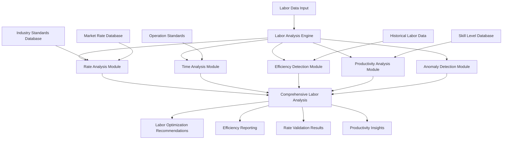

# Labor Rate Analysis and Efficiency Detection Specification

## Overview

This document specifies a comprehensive labor rate analysis and efficiency detection system for auto-repair claims auditing. The system provides sophisticated analysis of labor rates, time estimates, efficiency patterns, and productivity metrics while detecting anomalies, inefficiencies, and optimization opportunities through advanced statistical analysis and machine learning techniques.

## Labor Analysis Architecture

### High-Level Architecture



### Core Labor Analysis Components

#### 1. Comprehensive Labor Analysis Engine

```typescript
export class LaborAnalysisEngine {
  // Primary analysis methods
  async analyzeLaborRates(
    laborData: LaborData[]
  ): Promise<LaborRateAnalysisResult>;
  
  async analyzeTimeEfficiency(
    timeData: LaborTimeData[]
  ): Promise<TimeEfficiencyAnalysisResult>;
  
  async detectLaborAnomalies(
    laborData: LaborData[],
    benchmarkData: LaborBenchmarkData
  ): Promise<LaborAnomalyDetectionResult>;
  
  async analyzeProductivity(
    productivityData: ProductivityData[]
  ): Promise<ProductivityAnalysisResult>;
  
  // Advanced analysis
  async performSkillLevelAnalysis(
    laborData: LaborData[],
    skillRequirements: SkillRequirement[]
  ): Promise<SkillLevelAnalysisResult>;
  
  async analyzeOperationComplexity(
    operations: LaborOperation[],
    complexityFactors: ComplexityFactor[]
  ): Promise<OperationComplexityAnalysisResult>;
  
  async generateEfficiencyRecommendations(
    analysisResults: LaborAnalysisResult[]
  ): Promise<EfficiencyRecommendation[]>;
  
  // Benchmarking and validation
  async validateLaborRates(
    laborRates: LaborRate[],
    marketData: MarketRateData[]
  ): Promise<LaborRateValidationResult>;
  
  async benchmarkPerformance(
    performanceData: PerformanceData[],
    industryBenchmarks: IndustryBenchmark[]
  ): Promise<PerformanceBenchmarkResult>;
}
```

## Labor Rate Analysis

### 1. Comprehensive Rate Analysis System

```typescript
export interface LaborRateAnalysisResult {
  // Rate overview
  rate_analysis_summary: RateAnalysisSummary;
  rate_distribution: RateDistribution;
  rate_trends: RateTrend[];
  
  // Rate validation
  rate_validation_results: RateValidationResult[];
  market_comparison: MarketRateComparison;
  geographic_analysis: GeographicRateAnalysis;
  
  // Rate anomalies
  rate_anomalies: RateAnomaly[];
  outlier_detection: OutlierDetectionResult;
  suspicious_patterns: SuspiciousRatePattern[];
  
  // Optimization opportunities
  rate_optimization_opportunities: RateOptimizationOpportunity[];
  cost_reduction_potential: CostReductionPotential;
  negotiation_recommendations: NegotiationRecommendation[];
  
  // Quality metrics
  analysis_confidence: number;
  data_quality_score: DataQualityScore;
  validation_completeness: ValidationCompleteness;
}

export class LaborRateAnalyzer {
  // Core rate analysis
  async analyzeLaborRates(
    laborData: LaborData[]
  ): Promise<LaborRateAnalysisResult>;
  
  async analyzeRateDistribution(
    rateData: RateData[]
  ): Promise<RateDistributionAnalysis>;
  
  async analyzeRateTrends(
    historicalRates: HistoricalRateData[]
  ): Promise<RateTrendAnalysis>;
  
  // Rate validation
  async validateRatesAgainstMarket(
    laborRates: LaborRate[],
    marketData: MarketRateData[]
  ): Promise<MarketValidationResult>;
  
  async validateRatesBySkillLevel(
    laborRates: LaborRate[],
    skillLevels: SkillLevel[]
  ): Promise<SkillLevelValidationResult>;
  
  async validateRatesByOperation(
    laborRates: LaborRate[],
    operations: LaborOperation[]
  ): Promise<OperationValidationResult>;
  
  // Anomaly detection
  async detectRateAnomalies(
    rateData: RateData[],
    normalPatterns: NormalRatePattern[]
  ): Promise<RateAnomalyDetection>;
  
  async identifyOutliers(
    rateData: RateData[],
    outlierThresholds: OutlierThreshold[]
  ): Promise<OutlierIdentification>;
  
  // Optimization analysis
  async identifyOptimizationOpportunities(
    rateAnalysis: LaborRateAnalysis
  ): Promise<RateOptimizationOpportunity[]>;
  
  async calculateCostReductionPotential(
    currentRates: LaborRate[],
    optimizedRates: OptimizedRate[]
  ): Promise<CostReductionCalculation>;
}

export interface RateAnalysisSummary {
  // Overall metrics
  total_labor_operations: number;
  average_labor_rate: number;
  rate_variance: number;
  rate_standard_deviation: number;
  
  // Rate categories
  body_labor_rates: BodyLaborRateAnalysis;
  paint_labor_rates: PaintLaborRateAnalysis;
  mechanical_labor_rates: MechanicalLaborRateAnalysis;
  frame_labor_rates: FrameLaborRateAnalysis;
  
  // Market positioning
  market_position: MarketPosition;
  competitive_analysis: CompetitiveAnalysis;
  pricing_strategy_assessment: PricingStrategyAssessment;
  
  // Quality indicators
  rate_consistency: RateConsistency;
  rate_reliability: RateReliability;
  rate_transparency: RateTransparency;
}

export interface MarketRateComparison {
  // Market benchmarks
  regional_market_rates: RegionalMarketRate[];
  national_market_rates: NationalMarketRate[];
  industry_segment_rates: IndustrySegmentRate[];
  
  // Comparison metrics
  rate_deviation_from_market: RateDeviation[];
  market_percentile_ranking: MarketPercentileRanking;
  competitive_positioning: CompetitivePositioning;
  
  // Market trends
  market_rate_trends: MarketRateTrend[];
  seasonal_variations: SeasonalVariation[];
  economic_impact_analysis: EconomicImpactAnalysis;
  
  // Recommendations
  market_alignment_recommendations: MarketAlignmentRecommendation[];
  pricing_strategy_suggestions: PricingStrategySuggestion[];
  competitive_response_options: CompetitiveResponseOption[];
}
```

### 2. Advanced Rate Validation System

```typescript
export interface RateValidationResult {
  // Validation overview
  validation_summary: ValidationSummary;
  validation_score: number;
  validation_confidence: number;
  
  // Validation categories
  market_validation: MarketValidation;
  skill_level_validation: SkillLevelValidation;
  operation_validation: OperationValidation;
  geographic_validation: GeographicValidation;
  
  // Validation flags
  validation_warnings: ValidationWarning[];
  validation_errors: ValidationError[];
  validation_recommendations: ValidationRecommendation[];
  
  // Supporting data
  validation_evidence: ValidationEvidence[];
  benchmark_references: BenchmarkReference[];
  expert_opinions: ExpertOpinion[];
}

export class RateValidationEngine {
  // Core validation methods
  async validateLaborRates(
    laborRates: LaborRate[],
    validationCriteria: ValidationCriteria[]
  ): Promise<RateValidationResult>;
  
  async validateAgainstMarketStandards(
    rates: LaborRate[],
    marketStandards: MarketStandard[]
  ): Promise<MarketStandardValidation>;
  
  async validateSkillLevelAppropriate(
    rates: LaborRate[],
    skillRequirements: SkillRequirement[]
  ): Promise<SkillLevelValidation>;
  
  // Advanced validation
  async performStatisticalValidation(
    rateData: RateData[],
    statisticalModels: StatisticalModel[]
  ): Promise<StatisticalValidationResult>;
  
  async performCrossReferenceValidation(
    rates: LaborRate[],
    referenceData: ReferenceData[]
  ): Promise<CrossReferenceValidationResult>;
  
  async performTemporalValidation(
    rateHistory: RateHistory[],
    temporalPatterns: TemporalPattern[]
  ): Promise<TemporalValidationResult>;
  
  // Quality assurance
  async assessValidationQuality(
    validationResults: RateValidationResult[]
  ): Promise<ValidationQualityAssessment>;
  
  async generateValidationReport(
    validationResults: RateValidationResult[]
  ): Promise<ValidationReport>;
}

export interface MarketValidation {
  // Market comparison
  market_rate_comparison: MarketRateComparison;
  market_deviation_analysis: MarketDeviationAnalysis;
  market_positioning_assessment: MarketPositioningAssessment;
  
  // Validation results
  market_alignment_score: number;
  market_competitiveness_score: number;
  market_reasonableness_score: number;
  
  // Market insights
  market_trends_impact: MarketTrendsImpact;
  competitive_landscape_analysis: CompetitiveLandscapeAnalysis;
  market_opportunity_assessment: MarketOpportunityAssessment;
  
  // Recommendations
  market_alignment_actions: MarketAlignmentAction[];
  pricing_adjustments: PricingAdjustment[];
  competitive_responses: CompetitiveResponse[];
}
```

## Time Efficiency Analysis

### 1. Comprehensive Time Analysis System

```typescript
export interface TimeEfficiencyAnalysisResult {
  // Time overview
  time_analysis_summary: TimeAnalysisSummary;
  time_distribution: TimeDistribution;
  efficiency_metrics: EfficiencyMetrics;
  
  // Operation analysis
  operation_time_analysis: OperationTimeAnalysis[];
  time_variance_analysis: TimeVarianceAnalysis;
  complexity_adjustment_analysis: ComplexityAdjustmentAnalysis;
  
  // Efficiency patterns
  efficiency_patterns: EfficiencyPattern[];
  productivity_trends: ProductivityTrend[];
  performance_indicators: PerformanceIndicator[];
  
  // Anomaly detection
  time_anomalies: TimeAnomaly[];
  efficiency_outliers: EfficiencyOutlier[];
  suspicious_time_patterns: SuspiciousTimePattern[];
  
  // Optimization opportunities
  time_optimization_opportunities: TimeOptimizationOpportunity[];
  efficiency_improvement_recommendations: EfficiencyImprovementRecommendation[];
  productivity_enhancement_suggestions: ProductivityEnhancementSuggestion[];
}

export class TimeEfficiencyAnalyzer {
  // Core time analysis
  async analyzeTimeEfficiency(
    timeData: LaborTimeData[]
  ): Promise<TimeEfficiencyAnalysisResult>;
  
  async analyzeOperationTimes(
    operations: LaborOperation[]
  ): Promise<OperationTimeAnalysis[]>;
  
  async analyzeTimeVariances(
    timeData: TimeData[],
    standardTimes: StandardTime[]
  ): Promise<TimeVarianceAnalysis>;
  
  // Efficiency analysis
  async calculateEfficiencyMetrics(
    actualTimes: ActualTime[],
    standardTimes: StandardTime[]
  ): Promise<EfficiencyMetrics>;
  
  async analyzeProductivityTrends(
    productivityData: ProductivityData[]
  ): Promise<ProductivityTrendAnalysis>;
  
  async identifyEfficiencyPatterns(
    efficiencyData: EfficiencyData[]
  ): Promise<EfficiencyPatternIdentification>;
  
  // Anomaly detection
  async detectTimeAnomalies(
    timeData: TimeData[],
    normalPatterns: NormalTimePattern[]
  ): Promise<TimeAnomalyDetection>;
  
  async identifyEfficiencyOutliers(
    efficiencyData: EfficiencyData[],
    outlierThresholds: OutlierThreshold[]
  ): Promise<EfficiencyOutlierIdentification>;
  
  // Optimization analysis
  async identifyTimeOptimizationOpportunities(
    timeAnalysis: TimeEfficiencyAnalysis
  ): Promise<TimeOptimizationOpportunity[]>;
  
  async generateEfficiencyRecommendations(
    efficiencyAnalysis: EfficiencyAnalysis
  ): Promise<EfficiencyRecommendation[]>;
}

export interface TimeAnalysisSummary {
  // Overall metrics
  total_labor_hours: number;
  average_operation_time: number;
  time_efficiency_score: number;
  productivity_index: number;
  
  // Time breakdown
  productive_time: ProductiveTime;
  non_productive_time: NonProductiveTime;
  setup_time: SetupTime;
  rework_time: ReworkTime;
  
  // Efficiency indicators
  overall_efficiency_ratio: number;
  operation_efficiency_ratios: OperationEfficiencyRatio[];
  skill_level_efficiency: SkillLevelEfficiency[];
  
  // Performance metrics
  throughput_metrics: ThroughputMetrics;
  quality_metrics: QualityMetrics;
  consistency_metrics: ConsistencyMetrics;
}

export interface OperationTimeAnalysis {
  // Operation details
  operation_code: string;
  operation_description: string;
  operation_category: OperationCategory;
  
  // Time metrics
  claimed_time: number;
  standard_time: number;
  actual_time: number;
  time_variance: number;
  time_variance_percentage: number;
  
  // Efficiency analysis
  efficiency_ratio: number;
  productivity_score: number;
  performance_rating: PerformanceRating;
  
  // Complexity factors
  complexity_score: ComplexityScore;
  difficulty_adjustments: DifficultyAdjustment[];
  environmental_factors: EnvironmentalFactor[];
  
  // Quality indicators
  time_accuracy: TimeAccuracy;
  estimation_quality: EstimationQuality;
  consistency_score: ConsistencyScore;
  
  // Recommendations
  time_optimization_suggestions: TimeOptimizationSuggestion[];
  efficiency_improvement_actions: EfficiencyImprovementAction[];
  training_recommendations: TrainingRecommendation[];
}
```

### 2. Advanced Efficiency Detection System

```typescript
export interface EfficiencyDetectionResult {
  // Detection overview
  efficiency_detection_summary: EfficiencyDetectionSummary;
  efficiency_classification: EfficiencyClassification;
  efficiency_confidence: EfficiencyConfidence;
  
  // Efficiency categories
  high_efficiency_operations: HighEfficiencyOperation[];
  low_efficiency_operations: LowEfficiencyOperation[];
  variable_efficiency_operations: VariableEfficiencyOperation[];
  
  // Pattern analysis
  efficiency_patterns: EfficiencyPattern[];
  seasonal_efficiency_variations: SeasonalEfficiencyVariation[];
  skill_level_efficiency_correlation: SkillLevelEfficiencyCorrelation;
  
  // Root cause analysis
  efficiency_drivers: EfficiencyDriver[];
  inefficiency_causes: InefficiencyCause[];
  performance_bottlenecks: PerformanceBottleneck[];
  
  // Improvement opportunities
  efficiency_improvement_opportunities: EfficiencyImprovementOpportunity[];
  quick_wins: QuickWin[];
  long_term_improvements: LongTermImprovement[];
}

export class EfficiencyDetectionEngine {
  // Core detection methods
  async detectEfficiencyPatterns(
    efficiencyData: EfficiencyData[]
  ): Promise<EfficiencyPatternDetection>;
  
  async classifyEfficiencyLevels(
    operationData: OperationData[]
  ): Promise<EfficiencyClassification>;
  
  async identifyEfficiencyDrivers(
    efficiencyData: EfficiencyData[],
    contextualFactors: ContextualFactor[]
  ): Promise<EfficiencyDriverIdentification>;
  
  // Advanced analysis
  async performRootCauseAnalysis(
    inefficiencyData: InefficiencyData[]
  ): Promise<RootCauseAnalysisResult>;
  
  async analyzeSkillLevelImpact(
    efficiencyData: EfficiencyData[],
    skillLevelData: SkillLevelData[]
  ): Promise<SkillLevelImpactAnalysis>;
  
  async analyzeEnvironmentalFactors(
    efficiencyData: EfficiencyData[],
    environmentalData: EnvironmentalData[]
  ): Promise<EnvironmentalFactorAnalysis>;
  
  // Machine learning detection
  async trainEfficiencyModels(
    trainingData: EfficiencyTrainingData[]
  ): Promise<EfficiencyModel[]>;
  
  async predictEfficiency(
    operationData: OperationData[],
    efficiencyModels: EfficiencyModel[]
  ): Promise<EfficiencyPrediction[]>;
  
  // Improvement analysis
  async identifyImprovementOpportunities(
    efficiencyAnalysis: EfficiencyAnalysis
  ): Promise<ImprovementOpportunity[]>;
  
  async prioritizeImprovements(
    improvements: ImprovementOpportunity[],
    prioritizationCriteria: PrioritizationCriteria
  ): Promise<PrioritizedImprovement[]>;
}

export interface EfficiencyPattern {
  // Pattern identification
  pattern_id: string;
  pattern_type: EfficiencyPatternType;
  pattern_description: string;
  pattern_frequency: number;
  
  // Pattern characteristics
  efficiency_range: EfficiencyRange;
  operation_types: OperationType[];
  skill_level_correlation: SkillLevelCorrelation;
  time_period_correlation: TimePeriodCorrelation;
  
  // Pattern analysis
  pattern_strength: PatternStrength;
  pattern_consistency: PatternConsistency;
  pattern_predictability: PatternPredictability;
  
  // Impact assessment
  efficiency_impact: EfficiencyImpact;
  cost_impact: CostImpact;
  quality_impact: QualityImpact;
  
  // Actionable insights
  pattern_insights: PatternInsight[];
  improvement_recommendations: ImprovementRecommendation[];
  monitoring_suggestions: MonitoringSuggestion[];
}
```

## Productivity Analysis

### 1. Comprehensive Productivity Assessment

```typescript
export interface ProductivityAnalysisResult {
  // Productivity overview
  productivity_summary: ProductivitySummary;
  productivity_metrics: ProductivityMetrics;
  productivity_trends: ProductivityTrend[];
  
  // Individual analysis
  technician_productivity: TechnicianProductivity[];
  team_productivity: TeamProductivity[];
  department_productivity: DepartmentProductivity[];
  
  // Comparative analysis
  productivity_benchmarks: ProductivityBenchmark[];
  peer_comparisons: PeerComparison[];
  industry_comparisons: IndustryComparison[];
  
  // Factor analysis
  productivity_factors: ProductivityFactor[];
  productivity_drivers: ProductivityDriver[];
  productivity_barriers: ProductivityBarrier[];
  
  // Optimization insights
  productivity_optimization_opportunities: ProductivityOptimizationOpportunity[];
  resource_allocation_recommendations: ResourceAllocationRecommendation[];
  training_needs_assessment: TrainingNeedsAssessment[];
}

export class ProductivityAnalyzer {
  // Core productivity analysis
  async analyzeProductivity(
    productivityData: ProductivityData[]
  ): Promise<ProductivityAnalysisResult>;
  
  async calculateProductivityMetrics(
    laborData: LaborData[],
    outputData: OutputData[]
  ): Promise<ProductivityMetrics>;
  
  async analyzeProductivityTrends(
    historicalProductivity: HistoricalProductivityData[]
  ): Promise<ProductivityTrendAnalysis>;
  
  // Individual analysis
  async analyzeTechnicianProductivity(
    technicianData: TechnicianData[]
  ): Promise<TechnicianProductivityAnalysis[]>;
  
  async analyzeTeamProductivity(
    teamData: TeamData[]
  ): Promise<TeamProductivityAnalysis[]>;
  
  async analyzeDepartmentProductivity(
    departmentData: DepartmentData[]
  ): Promise<DepartmentProductivityAnalysis[]>;
  
  // Factor analysis
  async identifyProductivityFactors(
    productivityData: ProductivityData[],
    contextualData: ContextualData[]
  ): Promise<ProductivityFactorIdentification>;
  
  async analyzeProductivityDrivers(
    productivityData: ProductivityData[],
    driverData: DriverData[]
  ): Promise<ProductivityDriverAnalysis>;
  
  async identifyProductivityBarriers(
    productivityData: ProductivityData[],
    barrierData: BarrierData[]
  ): Promise<ProductivityBarrierIdentification>;
  
  // Optimization analysis
  async identifyOptimizationOpportunities(
    productivityAnalysis: ProductivityAnalysis
  ): Promise<ProductivityOptimizationOpportunity[]>;
  
  async generateResourceAllocationRecommendations(
    productivityData: ProductivityData[],
    resourceData: ResourceData[]
  ): Promise<ResourceAllocationRecommendation[]>;
}

export interface ProductivityMetrics {
  // Core metrics
  overall_productivity_score: number;
  labor_productivity_ratio: number;
  output_per_hour: number;
  efficiency_index: number;
  
  // Quality-adjusted metrics
  quality_adjusted_productivity: number;
  defect_rate_impact: DefectRateImpact;
  rework_productivity_impact: ReworkProductivityImpact;
  
  // Time-based metrics
  productive_time_percentage: number;
  utilization_rate: number;
  downtime_percentage: number;
  setup_time_efficiency: SetupTimeEfficiency;
  
  // Value-based metrics
  value_added_productivity: ValueAddedProductivity;
  cost_per_unit_output: CostPerUnitOutput;
  revenue_per_labor_hour: RevenuePerLaborHour;
  
  // Comparative metrics
  productivity_vs_benchmark: ProductivityVsBenchmark;
  productivity_vs_target: ProductivityVsTarget;
  productivity_improvement_rate: ProductivityImprovementRate;
}
```

### 2. Advanced Skill Level Analysis

```typescript
export interface SkillLevelAnalysisResult {
  // Skill assessment overview
  skill_assessment_summary: SkillAssessmentSummary;
  skill_level_distribution: SkillLevelDistribution;
  skill_gap_analysis: SkillGapAnalysis;
  
  // Individual skill analysis
  technician_skill_profiles: TechnicianSkillProfile[];
  skill_level_productivity_correlation: SkillLevelProductivityCorrelation;
  skill_development_tracking: SkillDevelopmentTracking[];
  
  // Skill-based efficiency
  skill_efficiency_mapping: SkillEfficiencyMapping;
  skill_level_rate_appropriateness: SkillLevelRateAppropriateness;
  skill_utilization_analysis: SkillUtilizationAnalysis;
  
  // Training and development
  training_needs_identification: TrainingNeedsIdentification[];
  skill_development_recommendations: SkillDevelopmentRecommendation[];
  certification_requirements: CertificationRequirement[];
  
  // Optimization opportunities
  skill_optimization_opportunities: SkillOptimizationOpportunity[];
  resource_reallocation_suggestions: ResourceReallocationSuggestion[];
  career_development_paths: CareerDevelopmentPath[];
}

export class SkillLevelAnalyzer {
  // Core skill analysis
  async analyzeSkillLevels(
    skillData: SkillData[]
  ): Promise<SkillLevelAnalysisResult>;
  
  async assessSkillProficiency(
    technicianData: TechnicianData[],
    skillRequirements: SkillRequirement[]
  ): Promise<SkillProficiencyAssessment[]>;
  
  async analyzeSkillGaps(
    currentSkills: CurrentSkill[],
    requiredSkills: RequiredSkill[]
  ): Promise<SkillGapAnalysis>;
  
  // Skill-performance correlation
  async correlateSkillsWithPerformance(
    skillData: SkillData[],
    performanceData: PerformanceData[]
  ): Promise<SkillPerformanceCorrelation>;
  
  async analyzeSkillEfficiencyImpact(
    skillLevels: SkillLevel[],
    efficiencyData: EfficiencyData[]
  ): Promise<SkillEfficiencyImpactAnalysis>;
  
  async validateSkillLevelRates(
    skillLevels: SkillLevel[],
    laborRates: LaborRate[]
  ): Promise<SkillLevelRateValidation>;
  
  // Training analysis
  async identifyTrainingNeeds(
    skillGaps: SkillGap[],
    performanceTargets: PerformanceTarget[]
  ): Promise<TrainingNeedsIdentification[]>;
  
  async recommendSkillDevelopment(
    skillAnalysis: SkillLevelAnalysis
  ): Promise<SkillDevelopmentRecommendation[]>;
  
  async planCareerDevelopment(
    technicianProfiles: TechnicianProfile[],
    careerPaths: CareerPath[]
  ): Promise<CareerDevelopmentPlan[]>;
}
```

## Machine Learning and Predictive Analytics

### 1. Advanced ML-Based Labor Analysis

```typescript
export class MLLaborAnalysisEngine {
  // Model training and inference
  async trainLaborAnalysisModels(
    trainingData: LaborTrainingData[]
  ): Promise<LaborAnalysisModel[]>;
  
  async predictLaborEfficiency(
    operationData: OperationData[],
    models: LaborAnalysisModel[]
  ): Promise<EfficiencyPrediction[]>;
  
  async predictLaborCosts(
    laborRequirements: LaborRequirement[],
    costModels: CostPredictionModel[]
  ): Promise<CostPrediction[]>;
  
  // Anomaly detection
  async detectLaborAnomalies(
    laborData: LaborData[],
    anomalyModels: AnomalyDetectionModel[]
  ): Promise<LaborAnomalyDetection[]>;
  
  async identifyFraudulentPatterns(
    laborData: LaborData[],
    fraudDetectionModels: FraudDetectionModel[]
  ): Promise<FraudPatternDetection[]>;
  
  // Pattern recognition
  async recognizeEfficiencyPatterns(
    efficiencyData: EfficiencyData[],
    patternModels: PatternRecognitionModel[]
  ): Promise<EfficiencyPatternRecognition[]>;
  
  async identifyOptimizationOpportunities(
    laborData: LaborData[],
    optimizationModels: OptimizationModel[]
  ): Promise<OptimizationOpportunityIdentification[]>;
  
  // Model validation and improvement
  async validateModelAccuracy(
    models: LaborAnalysisModel[],
    testData: TestData[]
  ): Promise<ModelValidationResult[]>;
  
  async improveModelPerformance(
    models: LaborAnalysisModel[],
    feedbackData: FeedbackData[]
  ): Promise<ImprovedModel[]>;
}

export interface LaborAnalysisModel {
  // Model metadata
  model_id: string;
  model_type: ModelType;
  model_version: string;
  training_date: string;
  
  // Model configuration
  algorithm_type: AlgorithmType;
  feature_set: FeatureSet;
  hyperparameters: Hyperparameter[];
  
  // Performance metrics
  accuracy_metrics: AccuracyMetric[];
  validation_scores: ValidationScore[];
  confidence_intervals: ConfidenceInterval[];
  
  // Model interpretation
  feature_importance: FeatureImportance[];
  model_explanation: ModelExplanation;
  decision_boundaries: DecisionBoundary[];
}
```

### 2. Predictive Labor Analytics

```typescript
export interface PredictiveLaborAnalytics {
  // Efficiency predictions
  efficiency_predictions: EfficiencyPrediction[];
  productivity_forecasts: ProductivityForecast[];
  performance_projections: PerformanceProjection[];
  
  // Cost predictions
  labor_cost_forecasts: LaborCostForecast[];
  rate_trend_predictions: RateTrendPrediction[];
  budget_variance_predictions: BudgetVariancePrediction[];
  
  // Risk predictions
  efficiency_risk_predictions: EfficiencyRiskPrediction[];
  quality_risk_forecasts: QualityRiskForecast[];
  timeline_risk_assessments: TimelineRiskAssessment[];
  
  // Optimization predictions
  optimization_impact_predictions: OptimizationImpactPrediction[];
  improvement_outcome_forecasts: ImprovementOutcomeForecast[];
  roi_predictions: ROIPrediction[];
  
  // Confidence and uncertainty
  prediction_confidence: PredictionConfidence[];
  uncertainty_quantification: UncertaintyQuantification[];
  sensitivity_analysis: SensitivityAnalysis[];
}

export class PredictiveLaborAnalyzer {
  // Predictive modeling
  async generateEfficiencyPredictions(
    currentData: CurrentLaborData,
    historicalTrends: HistoricalTrend[]
  ): Promise<EfficiencyPrediction[]>;
  
  async forecastProductivity(
    productivityData: ProductivityData[],
    forecastHorizon: ForecastHorizon
  ): Promise<ProductivityForecast>;
  
  async predictCostTrends(
    costData: CostData[],
    marketFactors: MarketFactor[]
  ): Promise<CostTrendPrediction>;
  
  // Risk prediction
  async predictEfficiencyRisks(
    riskFactors: RiskFactor[],
    riskModels: RiskPredictionModel[]
  ): Promise<EfficiencyRiskPrediction[]>;
  
  async assessTimelineRisks(
    projectData: ProjectData[],
    riskAssessmentModels: RiskAssessmentModel[]
  ): Promise<TimelineRiskAssessment[]>;
  
  // Optimization prediction
  async predictOptimizationImpact(
    optimizationScenarios: OptimizationScenario[],
    impactModels: ImpactPredictionModel[]
  ): Promise<OptimizationImpactPrediction[]>;
  
  async forecastImprovementOutcomes(
    improvementPlans: ImprovementPlan[],
    outcomeModels: OutcomePredictionModel[]
  ): Promise<ImprovementOutcomeForecast[]>;
}
```

## Integration and Implementation

### 1. System Integration Architecture

```typescript
export class LaborAnalysisIntegrator {
  // Core integration
  async integrateWithRiskAnalysis(
    laborAnalysis: LaborAnalysisResult,
    riskAnalysis: RiskAnalysisResult
  ): Promise<IntegratedLaborRiskAnalysis>;
  
  async integrateWithComparisonEngine(
    laborAnalysis: LaborAnalysisResult,
    comparisonResults: ComparisonResult[]
  ): Promise<IntegratedLaborComparison>;
  
  async integrateWithDashboardSystem(
    laborAnalysis: LaborAnalysisResult,
    dashboardConfig: DashboardConfiguration
  ): Promise<LaborAnalyticsDashboard>;
  
  // External system integration
  async integrateWithPayrollSystems(
    laborData: LaborData[],
    payrollSystems: PayrollSystem[]
  ): Promise<PayrollIntegration>;
  
  async integrateWithTimeTrackingSystems(
    timeData: TimeData[],
    timeTrackingSystems: TimeTrackingSystem[]
  ): Promise<TimeTrackingIntegration>;
  
  async integrateWithHRSystems(
    skillData: SkillData[],
    hrSystems: HRSystem[]
  ): Promise<HRIntegration>;
  
  // Data synchronization
  async synchronizeLaborData(
    dataSources: LaborDataSource[]
  ): Promise<SynchronizedLaborData>;
  
  async validateDataConsistency(
    laborData: LaborData[]
  ): Promise<DataConsistencyValidation>;
}
```

### 2. Performance Optimization

```typescript
export class LaborAnalysisOptimizer {
  // Performance optimization
  async optimizeAnalysisPerformance(
    analysisEngine: LaborAnalysisEngine,
    performanceTargets: PerformanceTarget[]
  ): Promise<OptimizedLaborAnalysisEngine>;
  
  async implementCaching(
    analysisResults: LaborAnalysisResult[],
    cachingStrategy: CachingStrategy
  ): Promise<CachedAnalysisSystem>;
  
  async optimizeDataProcessing(
    dataProcessingPipeline: DataProcessingPipeline,
    optimizationRules: OptimizationRule[]
  ): Promise<OptimizedDataProcessing>;
  
  // Scalability management
  async scaleForHighVolume(
    analysisSystem: LaborAnalysisSystem,
    volumeProjections: VolumeProjection[]
  ): Promise<ScaledAnalysisSystem>;
  
  async implementLoadBalancing(
    analysisServices: LaborAnalysisService[],
    loadBalancingConfig: LoadBalancingConfiguration
  ): Promise<LoadBalancedSystem>;
}
```

## Implementation Roadmap

### Phase 1: Core Labor Analysis (Weeks 1-2)
1. **Rate Analysis Engine**: Implement comprehensive labor rate analysis and validation
2. **Time Efficiency Analysis**: Build time analysis and efficiency detection systems
3. **Basic Anomaly Detection**: Create statistical anomaly detection for labor data
4. **Integration Framework**: Establish integration with existing SupplementGuard components

### Phase 2: Advanced Analytics (Weeks 3-4)
1. **Productivity Analysis**: Implement comprehensive productivity assessment and tracking
2. **Skill Level Analysis**: Build skill-based analysis and correlation systems
3. **Pattern Recognition**: Create advanced pattern recognition and classification
4. **Benchmarking System**: Implement industry and market benchmarking capabilities

### Phase 3: Machine Learning Enhancement (Weeks 5-6)
1. **ML Models**: Implement machine learning models for prediction and classification
2. **Predictive Analytics**: Build predictive modeling for efficiency and cost forecasting
3. **Advanced Anomaly Detection**: Create ML-based anomaly and fraud detection
4. **Model Validation**: Implement comprehensive model validation and improvement

### Phase 4: Integration and Optimization (Weeks 7-8)
1. **System Integration**: Complete integration with all SupplementGuard components
2. **Performance Optimization**: Optimize for high-volume processing and real-time analysis
3. **Quality Assurance**: Implement comprehensive testing and validation
4. **Documentation**: Create user documentation and training materials

## Success Metrics

### Analysis Accuracy Requirements
- **Rate Validation Accuracy**: > 92% accuracy in identifying rate anomalies
- **Efficiency Detection Accuracy**: > 88% accuracy in efficiency classification
- **Time Analysis Accuracy**: > 90% accuracy in time variance detection
- **Skill Level Assessment**: > 85% accuracy in skill-performance correlation
- **Predictive Model Accuracy**: > 80% accuracy in efficiency and cost predictions

### Performance Requirements
- **Analysis Speed**: < 8 seconds for comprehensive labor analysis
- **Real-Time Processing**: < 2 seconds for real-time efficiency monitoring
- **Concurrent Analysis**: Support 30+ simultaneous labor analyses
- **Memory Efficiency**: < 150MB per analysis session
- **Scalability**: Linear scaling to 300+ analyses per hour

### Business Impact Requirements
- **Cost Optimization**: 18% improvement in labor cost optimization
- **Efficiency Improvement**: 25% improvement in labor efficiency identification
- **Processing Speed**: 35% reduction in labor analysis time
- **Decision Support**: 85% of recommendations deemed actionable by experts
- **ROI Achievement**: Clear ROI demonstration within 4 months

## Conclusion

This comprehensive labor rate analysis and efficiency detection specification provides a robust framework for sophisticated analysis of labor costs, time efficiency, and productivity patterns in auto-repair claims. The system combines statistical analysis, machine learning, and domain expertise to deliver accurate, actionable insights that enable proactive labor cost management and efficiency optimization.

The modular architecture ensures seamless integration with existing SupplementGuard capabilities while the advanced analytics and predictive modeling provide forward-looking insights that support strategic decision-making and continuous improvement initiatives.