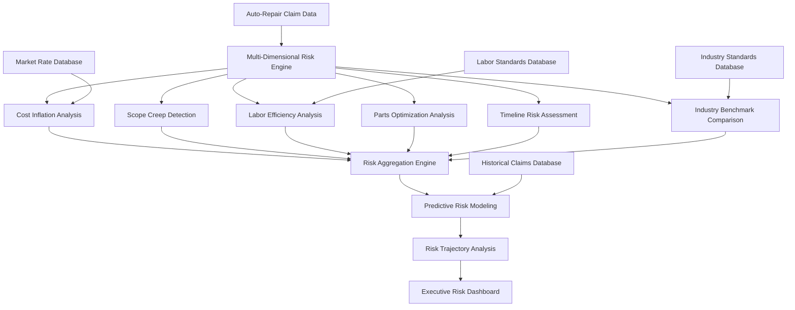

# Multi-Dimensional Risk Analysis Engine Specification

## Overview

This document specifies the comprehensive multi-dimensional risk analysis engine for auto-repair claims auditing. The engine extends the existing SupplementGuard fraud detection capabilities with specialized auto-repair risk assessment, predictive modeling, and advanced analytics optimized for dashboard visualization and executive decision-making.

## Risk Analysis Architecture

### High-Level Architecture



### Core Risk Analysis Components

#### 1. Multi-Dimensional Risk Assessment Engine

```typescript
export class MultiDimensionalRiskEngine {
  // Core risk analysis
  async analyzeClaimRisk(
    claimData: AutoRepairClaimData
  ): Promise<ComprehensiveRiskAssessment>;
  
  // Dimensional analysis
  async analyzeCostInflation(
    claimData: AutoRepairClaimData
  ): Promise<CostInflationRiskAnalysis>;
  
  async analyzeScopeCreep(
    claimData: AutoRepairClaimData
  ): Promise<ScopeCreepRiskAnalysis>;
  
  async analyzeLaborEfficiency(
    laborData: LaborBreakdown
  ): Promise<LaborEfficiencyRiskAnalysis>;
  
  async analyzePartsOptimization(
    partsData: AutoRepairLineItem[]
  ): Promise<PartsOptimizationRiskAnalysis>;
  
  async analyzeTimelineRisk(
    claimData: AutoRepairClaimData
  ): Promise<TimelineRiskAnalysis>;
  
  // Predictive modeling
  async generatePredictiveModel(
    claimData: AutoRepairClaimData,
    historicalData: HistoricalClaimData[]
  ): Promise<PredictiveRiskModel>;
  
  // Risk aggregation
  async aggregateRiskScores(
    dimensionalRisks: DimensionalRiskScore[]
  ): Promise<AggregatedRiskScore>;
}
```

## Risk Analysis Dimensions

### 1. Cost Inflation Analysis

```typescript
export interface CostInflationRiskAnalysis {
  // Overall inflation metrics
  overall_inflation_score: number;
  inflation_velocity: number;
  cost_escalation_pattern: CostEscalationPattern;
  
  // Component-specific inflation
  labor_inflation: LaborInflationAnalysis;
  parts_inflation: PartsInflationAnalysis;
  material_inflation: MaterialInflationAnalysis;
  
  // Market comparison
  market_deviation: MarketDeviationAnalysis;
  regional_adjustment: RegionalAdjustmentAnalysis;
  
  // Risk indicators
  inflation_red_flags: InflationRedFlag[];
  cost_anomalies: CostAnomaly[];
  pricing_inconsistencies: PricingInconsistency[];
  
  // Predictive indicators
  projected_final_cost: ProjectedCostAnalysis;
  inflation_trajectory: InflationTrajectory;
  cost_containment_opportunities: CostContainmentOpportunity[];
}

export interface LaborInflationAnalysis {
  rate_progression: LaborRateProgression[];
  efficiency_degradation: EfficiencyDegradationAnalysis;
  overtime_escalation: OvertimeEscalationAnalysis;
  skill_level_inflation: SkillLevelInflationAnalysis;
  
  // Risk scoring
  labor_inflation_score: number;
  labor_risk_factors: LaborRiskFactor[];
  labor_cost_predictability: CostPredictabilityScore;
}

export interface PartsInflationAnalysis {
  oem_vs_aftermarket_trends: OEMAftermarketTrendAnalysis;
  supplier_pricing_patterns: SupplierPricingPattern[];
  availability_impact: AvailabilityImpactAnalysis;
  markup_analysis: MarkupAnalysis;
  
  // Risk indicators
  parts_inflation_score: number;
  parts_risk_factors: PartsRiskFactor[];
  supply_chain_risks: SupplyChainRisk[];
}
```

### 2. Scope Creep Detection & Analysis

```typescript
export interface ScopeCreepRiskAnalysis {
  // Scope expansion metrics
  scope_expansion_score: number;
  expansion_velocity: number;
  expansion_pattern: ScopeExpansionPattern;
  
  // Impact zone analysis
  impact_zone_mapping: ImpactZoneMapping;
  damage_correlation_analysis: DamageCorrelationAnalysis;
  physics_validation: PhysicsValidationResult;
  
  // Unrelated repairs detection
  unrelated_items: UnrelatedItemAnalysis[];
  questionable_additions: QuestionableAdditionAnalysis[];
  hidden_damage_legitimacy: HiddenDamageLegitimacyAnalysis;
  
  // Temporal analysis
  discovery_timeline: DiscoveryTimelineAnalysis;
  inspection_quality: InspectionQualityAnalysis;
  documentation_completeness: DocumentationCompletenessAnalysis;
  
  // Risk scoring
  scope_creep_probability: number;
  scope_legitimacy_score: number;
  expansion_justification_quality: JustificationQualityScore;
}

export interface ImpactZoneMapping {
  primary_impact_zone: ImpactZoneDetail;
  secondary_impact_zones: ImpactZoneDetail[];
  tertiary_impact_zones: ImpactZoneDetail[];
  
  // Energy transfer analysis
  energy_transfer_patterns: EnergyTransferPattern[];
  damage_propagation_model: DamagePropagationModel;
  structural_integrity_analysis: StructuralIntegrityAnalysis;
  
  // Validation metrics
  physics_consistency_score: number;
  damage_pattern_coherence: number;
  expert_opinion_alignment: ExpertOpinionAlignment;
}

export interface UnrelatedItemAnalysis {
  item_description: string;
  distance_from_impact: number;
  damage_correlation_score: number;
  likelihood_of_relation: number;
  
  // Supporting analysis
  precedent_analysis: PrecedentAnalysis;
  technical_feasibility: TechnicalFeasibilityAnalysis;
  cost_benefit_analysis: CostBenefitAnalysis;
  
  // Risk classification
  risk_level: RiskLevel;
  confidence_score: number;
  recommended_action: RecommendedAction;
}
```

### 3. Labor Efficiency Analysis

```typescript
export interface LaborEfficiencyRiskAnalysis {
  // Overall efficiency metrics
  overall_efficiency_score: number;
  efficiency_trend: EfficiencyTrend;
  productivity_indicators: ProductivityIndicator[];
  
  // Operation-specific analysis
  operation_efficiency: OperationEfficiencyAnalysis[];
  skill_level_appropriateness: SkillLevelAppropriatenessAnalysis;
  complexity_adjustment_validation: ComplexityAdjustmentValidation;
  
  // Time analysis
  labor_time_validation: LaborTimeValidation[];
  industry_standard_comparison: IndustryStandardComparison;
  historical_performance_comparison: HistoricalPerformanceComparison;
  
  // Risk indicators
  efficiency_red_flags: EfficiencyRedFlag[];
  time_inflation_indicators: TimeInflationIndicator[];
  productivity_anomalies: ProductivityAnomaly[];
  
  // Predictive analysis
  efficiency_trajectory: EfficiencyTrajectory;
  completion_time_prediction: CompletionTimePrediction;
  resource_optimization_opportunities: ResourceOptimizationOpportunity[];
}

export interface OperationEfficiencyAnalysis {
  operation_code: string;
  operation_description: string;
  claimed_hours: number;
  standard_hours: number;
  efficiency_ratio: number;
  
  // Contextual factors
  complexity_factors: ComplexityFactor[];
  vehicle_specific_adjustments: VehicleSpecificAdjustment[];
  shop_capability_factors: ShopCapabilityFactor[];
  
  // Risk assessment
  efficiency_risk_score: number;
  time_variance_explanation: TimeVarianceExplanation;
  justification_quality: JustificationQualityScore;
}

export interface LaborTimeValidation {
  operation: string;
  claimed_time: number;
  validated_time: number;
  variance_percentage: number;
  
  // Validation sources
  industry_standards: IndustryStandardReference[];
  manufacturer_guidelines: ManufacturerGuideline[];
  historical_data: HistoricalDataReference[];
  
  // Risk indicators
  validation_confidence: number;
  risk_level: RiskLevel;
  variance_justification: VarianceJustification;
}
```

### 4. Parts Optimization Analysis

```typescript
export interface PartsOptimizationRiskAnalysis {
  // Optimization metrics
  optimization_score: number;
  cost_efficiency_rating: CostEfficiencyRating;
  quality_vs_cost_balance: QualityVsCostBalance;
  
  // OEM vs Aftermarket analysis
  oem_aftermarket_analysis: OEMAftermarketAnalysis;
  quality_impact_assessment: QualityImpactAssessment;
  warranty_implications: WarrantyImplicationAnalysis;
  
  // Supplier analysis
  supplier_performance: SupplierPerformanceAnalysis[];
  pricing_competitiveness: PricingCompetitivenessAnalysis;
  availability_reliability: AvailabilityReliabilityAnalysis;
  
  // Cost optimization opportunities
  cost_reduction_opportunities: CostReductionOpportunity[];
  alternative_parts_analysis: AlternativePartsAnalysis[];
  bulk_purchasing_opportunities: BulkPurchasingOpportunity[];
  
  // Risk factors
  parts_risk_score: number;
  quality_risk_indicators: QualityRiskIndicator[];
  supply_chain_vulnerabilities: SupplyChainVulnerability[];
}

export interface OEMAftermarketAnalysis {
  oem_parts: OEMPartAnalysis[];
  aftermarket_parts: AftermarketPartAnalysis[];
  
  // Comparison metrics
  cost_differential: CostDifferentialAnalysis;
  quality_differential: QualityDifferentialAnalysis;
  warranty_differential: WarrantyDifferentialAnalysis;
  
  // Optimization recommendations
  optimization_recommendations: OptimizationRecommendation[];
  risk_adjusted_savings: RiskAdjustedSavings;
  total_cost_of_ownership: TotalCostOfOwnership;
}

export interface CostReductionOpportunity {
  opportunity_type: CostReductionType;
  description: string;
  potential_savings: number;
  implementation_effort: ImplementationEffort;
  
  // Risk assessment
  quality_impact: QualityImpact;
  warranty_impact: WarrantyImpact;
  customer_satisfaction_impact: CustomerSatisfactionImpact;
  
  // Recommendation
  recommendation_confidence: number;
  implementation_timeline: string;
  success_probability: number;
}
```

### 5. Timeline Risk Assessment

```typescript
export interface TimelineRiskAnalysis {
  // Timeline metrics
  projected_completion_date: string;
  timeline_confidence: number;
  delay_probability: number;
  
  // Risk factors
  timeline_risk_factors: TimelineRiskFactor[];
  critical_path_analysis: CriticalPathAnalysis;
  dependency_risk_assessment: DependencyRiskAssessment;
  
  // Resource analysis
  resource_availability: ResourceAvailabilityAnalysis;
  capacity_utilization: CapacityUtilizationAnalysis;
  bottleneck_identification: BottleneckIdentification[];
  
  // External factors
  parts_availability_risk: PartsAvailabilityRisk[];
  weather_impact_assessment: WeatherImpactAssessment;
  regulatory_delay_risk: RegulatoryDelayRisk[];
  
  // Cost implications
  delay_cost_analysis: DelayCostAnalysis;
  rental_car_impact: RentalCarImpactAnalysis;
  storage_cost_implications: StorageCostImplications;
  
  // Mitigation strategies
  risk_mitigation_strategies: RiskMitigationStrategy[];
  contingency_plans: ContingencyPlan[];
  acceleration_opportunities: AccelerationOpportunity[];
}

export interface TimelineRiskFactor {
  factor_type: TimelineRiskFactorType;
  description: string;
  impact_days: number;
  probability: number;
  
  // Mitigation
  mitigation_strategies: MitigationStrategy[];
  mitigation_cost: number;
  mitigation_effectiveness: number;
  
  // Monitoring
  monitoring_indicators: MonitoringIndicator[];
  early_warning_signals: EarlyWarningSignal[];
}

export interface RentalCarImpactAnalysis {
  current_rental_days: number;
  projected_additional_days: number;
  daily_rental_cost: number;
  total_rental_cost_impact: number;
  
  // Optimization opportunities
  rental_cost_optimization: RentalCostOptimization[];
  alternative_transportation: AlternativeTransportationOption[];
  
  // Risk mitigation
  rental_cost_containment: RentalCostContainmentStrategy[];
  timeline_acceleration_benefits: TimelineAccelerationBenefit[];
}
```

## Predictive Risk Modeling

### 1. Advanced Predictive Analytics

```typescript
export interface PredictiveRiskModel {
  // Core predictions
  likely_final_cost: CostPrediction;
  probability_additional_supplements: SupplementProbability;
  estimated_completion_date: CompletionDatePrediction;
  
  // Risk trajectory
  risk_trajectory: RiskTrajectory;
  cost_escalation_trajectory: CostEscalationTrajectory;
  timeline_risk_trajectory: TimelineRiskTrajectory;
  
  // Confidence intervals
  prediction_confidence: PredictionConfidence;
  scenario_analysis: ScenarioAnalysis;
  sensitivity_analysis: SensitivityAnalysis;
  
  // Early warning system
  early_warning_indicators: EarlyWarningIndicator[];
  threshold_monitoring: ThresholdMonitoring[];
  escalation_triggers: EscalationTrigger[];
  
  // Optimization recommendations
  cost_optimization_strategies: CostOptimizationStrategy[];
  timeline_optimization_strategies: TimelineOptimizationStrategy[];
  risk_mitigation_priorities: RiskMitigationPriority[];
}

export interface CostPrediction {
  predicted_cost: number;
  confidence_interval: ConfidenceInterval;
  prediction_factors: PredictionFactor[];
  
  // Scenario analysis
  best_case_scenario: CostScenario;
  worst_case_scenario: CostScenario;
  most_likely_scenario: CostScenario;
  
  // Contributing factors
  labor_cost_prediction: LaborCostPrediction;
  parts_cost_prediction: PartsCostPrediction;
  timeline_cost_impact: TimelineCostImpact;
}

export interface RiskTrajectory {
  current_risk_level: RiskLevel;
  projected_risk_level: RiskLevel;
  risk_velocity: number;
  trajectory_confidence: number;
  
  // Trajectory analysis
  risk_acceleration_factors: RiskAccelerationFactor[];
  risk_mitigation_factors: RiskMitigationFactor[];
  inflection_points: InflectionPoint[];
  
  // Monitoring and alerts
  trajectory_monitoring: TrajectoryMonitoring;
  alert_thresholds: AlertThreshold[];
  intervention_recommendations: InterventionRecommendation[];
}
```

### 2. Machine Learning Integration

```typescript
export class PredictiveModelingEngine {
  // Model training and inference
  async trainPredictiveModels(
    historicalData: HistoricalClaimData[]
  ): Promise<TrainedModelSet>;
  
  async generatePredictions(
    claimData: AutoRepairClaimData,
    models: TrainedModelSet
  ): Promise<PredictionResults>;
  
  // Feature engineering
  async extractPredictiveFeatures(
    claimData: AutoRepairClaimData
  ): Promise<FeatureVector>;
  
  async engineerTimeSeriesFeatures(
    timeSeriesData: TimeSeriesData
  ): Promise<TimeSeriesFeatures>;
  
  // Model validation
  async validateModelAccuracy(
    models: TrainedModelSet,
    testData: TestDataSet
  ): Promise<ModelValidationResults>;
  
  async performCrossValidation(
    models: TrainedModelSet,
    validationStrategy: ValidationStrategy
  ): Promise<CrossValidationResults>;
  
  // Model interpretation
  async explainPredictions(
    predictions: PredictionResults,
    models: TrainedModelSet
  ): Promise<PredictionExplanation>;
  
  async identifyFeatureImportance(
    models: TrainedModelSet
  ): Promise<FeatureImportanceAnalysis>;
}

export interface TrainedModelSet {
  cost_prediction_model: CostPredictionModel;
  timeline_prediction_model: TimelinePredictionModel;
  risk_classification_model: RiskClassificationModel;
  anomaly_detection_model: AnomalyDetectionModel;
  
  // Model metadata
  training_data_size: number;
  model_accuracy_metrics: ModelAccuracyMetrics;
  feature_importance: FeatureImportanceScores;
  model_version: string;
  training_date: string;
}
```

## Risk Aggregation & Scoring

### 1. Multi-Dimensional Risk Aggregation

```typescript
export class RiskAggregationEngine {
  // Core aggregation
  async aggregateRiskScores(
    dimensionalRisks: DimensionalRiskAnalysis[]
  ): Promise<AggregatedRiskAssessment>;
  
  // Weighted scoring
  async calculateWeightedRiskScore(
    riskComponents: RiskComponent[],
    weights: RiskWeights
  ): Promise<WeightedRiskScore>;
  
  // Risk correlation analysis
  async analyzeRiskCorrelations(
    riskFactors: RiskFactor[]
  ): Promise<RiskCorrelationAnalysis>;
  
  // Dynamic weight adjustment
  async adjustRiskWeights(
    claimCharacteristics: ClaimCharacteristics,
    baseWeights: RiskWeights
  ): Promise<AdjustedRiskWeights>;
  
  // Risk normalization
  async normalizeRiskScores(
    rawScores: RawRiskScore[],
    normalizationStrategy: NormalizationStrategy
  ): Promise<NormalizedRiskScore[]>;
}

export interface AggregatedRiskAssessment {
  // Overall risk metrics
  overall_risk_score: number;
  risk_level: RiskLevel;
  confidence_level: number;
  
  // Component scores
  component_scores: ComponentRiskScore[];
  weighted_contributions: WeightedContribution[];
  risk_factor_breakdown: RiskFactorBreakdown[];
  
  // Risk characteristics
  risk_profile: RiskProfile;
  risk_volatility: RiskVolatility;
  risk_predictability: RiskPredictability;
  
  // Actionable insights
  primary_risk_drivers: PrimaryRiskDriver[];
  risk_mitigation_priorities: RiskMitigationPriority[];
  monitoring_recommendations: MonitoringRecommendation[];
}

export interface ComponentRiskScore {
  component: RiskComponent;
  raw_score: number;
  normalized_score: number;
  weight: number;
  contribution: number;
  
  // Component analysis
  risk_factors: ComponentRiskFactor[];
  confidence_level: number;
  volatility_measure: number;
  
  // Trends and patterns
  historical_trend: HistoricalTrend;
  seasonal_patterns: SeasonalPattern[];
  anomaly_indicators: AnomalyIndicator[];
}
```

### 2. Risk Scoring Methodologies

```typescript
export interface RiskScoringMethodology {
  // Scoring approaches
  statistical_scoring: StatisticalScoringMethod;
  machine_learning_scoring: MLScoringMethod;
  expert_system_scoring: ExpertSystemScoringMethod;
  hybrid_scoring: HybridScoringMethod;
  
  // Calibration and validation
  score_calibration: ScoreCalibrationMethod;
  validation_framework: ValidationFramework;
  backtesting_results: BacktestingResults;
  
  // Interpretability
  score_explanation: ScoreExplanationMethod;
  feature_attribution: FeatureAttributionMethod;
  decision_boundary_analysis: DecisionBoundaryAnalysis;
}

export interface StatisticalScoringMethod {
  // Statistical techniques
  z_score_analysis: ZScoreAnalysis;
  percentile_ranking: PercentileRanking;
  outlier_detection: OutlierDetection;
  distribution_analysis: DistributionAnalysis;
  
  // Thresholds and boundaries
  statistical_thresholds: StatisticalThreshold[];
  confidence_intervals: ConfidenceInterval[];
  significance_levels: SignificanceLevel[];
}
```

## Dashboard Integration & Analytics

### 1. Executive Dashboard Metrics

```typescript
export interface ExecutiveDashboardMetrics {
  // High-level KPIs
  overall_risk_summary: OverallRiskSummary;
  cost_trend_indicators: CostTrendIndicator[];
  timeline_status_indicators: TimelineStatusIndicator[];
  
  // Risk heat maps
  risk_heat_map: RiskHeatMap;
  geographic_risk_distribution: GeographicRiskDistribution;
  temporal_risk_patterns: TemporalRiskPattern[];
  
  // Predictive indicators
  early_warning_dashboard: EarlyWarningDashboard;
  trend_analysis_dashboard: TrendAnalysisDashboard;
  forecast_dashboard: ForecastDashboard;
  
  // Actionable insights
  priority_actions: PriorityAction[];
  optimization_opportunities: OptimizationOpportunity[];
  risk_mitigation_recommendations: RiskMitigationRecommendation[];
}

export interface RiskHeatMap {
  // Heat map data
  risk_zones: RiskZone[];
  intensity_levels: IntensityLevel[];
  color_coding: ColorCoding;
  
  // Interactive elements
  drill_down_capabilities: DrillDownCapability[];
  filter_options: FilterOption[];
  time_series_animation: TimeSeriesAnimation;
  
  // Insights
  hot_spots: HotSpot[];
  emerging_risks: EmergingRisk[];
  risk_migration_patterns: RiskMigrationPattern[];
}
```

### 2. Real-Time Risk Monitoring

```typescript
export class RealTimeRiskMonitor {
  // Continuous monitoring
  async monitorRiskMetrics(
    claimId: string
  ): Promise<RealTimeRiskMetrics>;
  
  async detectRiskThresholdBreaches(
    currentMetrics: RiskMetrics,
    thresholds: RiskThreshold[]
  ): Promise<ThresholdBreachAlert[]>;
  
  // Alert system
  async generateRiskAlerts(
    riskChanges: RiskChange[]
  ): Promise<RiskAlert[]>;
  
  async prioritizeAlerts(
    alerts: RiskAlert[]
  ): Promise<PrioritizedAlert[]>;
  
  // Trend analysis
  async analyzeRiskTrends(
    historicalMetrics: HistoricalRiskMetrics[]
  ): Promise<RiskTrendAnalysis>;
  
  async predictRiskTrajectory(
    currentTrend: RiskTrend
  ): Promise<RiskTrajectoryPrediction>;
}

export interface RealTimeRiskMetrics {
  timestamp: string;
  overall_risk_score: number;
  risk_velocity: number;
  risk_acceleration: number;
  
  // Component metrics
  component_risk_scores: ComponentRiskScore[];
  risk_factor_changes: RiskFactorChange[];
  threshold_proximities: ThresholdProximity[];
  
  // Alerts and warnings
  active_alerts: ActiveAlert[];
  warning_indicators: WarningIndicator[];
  escalation_recommendations: EscalationRecommendation[];
}
```

## Integration with Existing Systems

### 1. SupplementGuard Integration

```typescript
// Enhanced integration with existing fraud detection
export class EnhancedFraudDetectionIntegration {
  // Extend existing fraud detection
  async enhanceWithAutoRepairRisk(
    existingFraudScore: number,
    autoRepairRiskAnalysis: MultiDimensionalRiskAnalysis
  ): Promise<EnhancedFraudAssessment>;
  
  // Combine risk models
  async combineRiskModels(
    statisticalRisk: StatisticalRiskScore,
    autoRepairRisk: AutoRepairRiskScore
  ): Promise<CombinedRiskScore>;
  
  // Cross-validation
  async crossValidateRiskAssessments(
    fraudDetectionResult: FraudDetectionResult,
    riskAnalysisResult: RiskAnalysisResult
  ): Promise<CrossValidationResult>;
}
```

### 2. External Data Integration

```typescript
export class ExternalDataIntegrator {
  // Industry data integration
  async integrateIndustryBenchmarks(
    claimData: AutoRepairClaimData
  ): Promise<IndustryBenchmarkIntegration>;
  
  async integrateMarketRateData(
    location: string,
    serviceTypes: string[]
  ): Promise<MarketRateIntegration>;
  
  // Historical data integration
  async integrateHistoricalClaimData(
    claimCharacteristics: ClaimCharacteristics
  ): Promise<HistoricalDataIntegration>;
  
  // Real-time data feeds
  async integrateRealTimeMarketData(): Promise<RealTimeMarketDataIntegration>;
  async integrateWeatherData(location: string): Promise<WeatherDataIntegration>;
  async integrateEconomicIndicators(): Promise<EconomicIndicatorIntegration>;
}
```

## Performance & Scalability

### 1. Performance Optimization

```typescript
export interface PerformanceOptimization {
  // Computation optimization
  parallel_risk_analysis: boolean;
  cached_model_inference: boolean;
  incremental_risk_updates: boolean;
  
  // Memory optimization
  streaming_data_processing: boolean;
  memory_efficient_algorithms: boolean;
  garbage_collection_optimization: boolean;
  
  // Network optimization
  batch_external_api_calls: boolean;
  connection_pooling: boolean;
  data_compression: boolean;
}

export class PerformanceManager {
  // Performance monitoring
  async monitorAnalysisPerformance(): Promise<PerformanceMetrics>;
  async identifyPerformanceBottlenecks(): Promise<BottleneckAnalysis>;
  
  // Optimization strategies
  async optimizeRiskAnalysisPipeline(): Promise<OptimizationResult>;
  async implementCachingStrategies(): Promise<CachingImplementation>;
  
  // Scalability management
  async scaleAnalysisCapacity(
    demandForecast: DemandForecast
  ): Promise<ScalingResult>;
}
```

### 2. Quality Assurance

```typescript
export class RiskAnalysisQualityAssurance {
  // Accuracy validation
  async validateRiskScoreAccuracy(
    predictions: RiskPrediction[],
    actualOutcomes: ActualOutcome[]
  ): Promise<AccuracyValidationResult>;
  
  // Model performance monitoring
  async monitorModelPerformance(
    models: TrainedModelSet
  ): Promise<ModelPerformanceMetrics>;
  
  // Bias detection and mitigation
  async detectModelBias(
    predictions: RiskPrediction[],
    demographicData: DemographicData[]
  ): Promise<BiasDetectionResult>;
  
  async mitigateBias(
    biasDetectionResult: BiasDetectionResult
  ): Promise<BiasMitigationResult>;
}
```

## Implementation Roadmap

### Phase 1: Core Risk Engine (Weeks 1-2)
1. **Multi-Dimensional Risk Framework**: Implement core risk analysis dimensions
2. **Cost Inflation Analysis**: Build comprehensive cost inflation detection
3. **Basic Predictive Modeling**: Implement statistical prediction models
4. **Risk Aggregation Engine**: Build weighted risk scoring system

### Phase 2: Advanced Analytics (Weeks 3-4)
1. **Scope Creep Detection**: Implement advanced scope creep analysis
2. **Labor Efficiency Analysis**: Build comprehensive labor analysis
3. **Parts Optimization**: Implement parts cost optimization analysis
4. **Timeline Risk Assessment**: Build timeline prediction and risk analysis

### Phase 3: Predictive Intelligence (Weeks 5-6)
1. **Machine Learning Integration**: Implement ML-based prediction models
2. **Real-Time Monitoring**: Build continuous risk monitoring system
3. **Early Warning System**: Implement threshold-based alerting
4. **Risk Trajectory Analysis**: Build risk trend prediction

### Phase 4: Dashboard Integration (Weeks 7-8)
1. **Executive Dashboard**: Build comprehensive risk visualization
2. **Real-Time Analytics**: Implement live risk monitoring dashboard
3. **Performance Optimization**: Optimize for high-volume processing
4. **Quality Assurance**: Implement comprehensive testing and validation

## Success Metrics

### Accuracy Requirements
- **Risk Score Accuracy**: > 85% correlation with expert human assessment
- **Cost Prediction Accuracy**: Within 10% of actual final costs
- **Timeline Prediction Accuracy**: Within 15% of actual completion dates
- **Scope Creep Detection**: > 80% accuracy in identifying unrelated repairs
- **Labor Efficiency Detection**: > 90% accuracy in identifying time inflation

### Performance Requirements
- **Analysis Time**: < 5 seconds for comprehensive multi-dimensional analysis
- **Real-Time Monitoring**: < 1 second response time for risk metric updates
- **Concurrent Analysis**: Support 20+ simultaneous risk analyses
- **Memory Usage**: < 300MB per analysis session
- **Scalability**: Linear scaling to 1000+ claims per hour

### Business Impact Requirements
- **False Positive Rate**: < 15% for high-risk classifications
- **False Negative Rate**: < 10% for critical risk factors
- **Cost Savings**: 20% improvement in cost containment
- **Processing Efficiency**: 40% reduction in manual review time
- **Decision Support**: 90% of recommendations deemed actionable by experts

## Conclusion

This multi-dimensional risk analysis engine specification provides a comprehensive framework for advanced auto-repair claims risk assessment. The system combines statistical analysis, machine learning, and domain expertise to deliver accurate, actionable risk insights that enable proactive claim management and cost optimization.

The engine's modular architecture ensures scalability and maintainability while the comprehensive testing framework guarantees accuracy and reliability in production environments. Integration with existing SupplementGuard components provides a seamless enhancement path that leverages existing investments while adding specialized auto-repair capabilities.