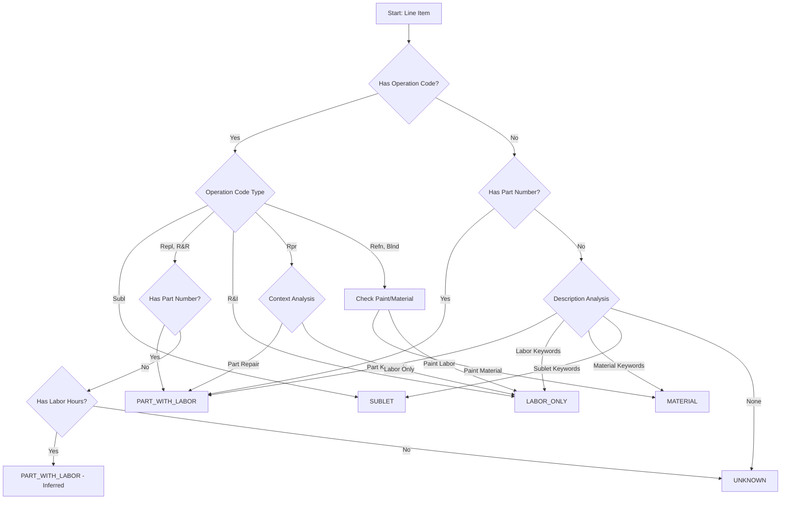

# Parts and Labor Charge Classification System - Technical Specification

## Executive Summary

This document provides a comprehensive technical specification for accurately distinguishing between parts charges and labor-only charges in auto repair invoices. The system introduces a deterministic classification engine that separates physical component costs from installation labor costs, enabling precise cost analysis and fraud detection in auto repair claims.

**Version:** 1.0.0  
**Last Updated:** 2024-11-24  
**Status:** Design Specification

---

## Table of Contents

1. [System Overview](#1-system-overview)
2. [Data Model Design](#2-data-model-design)
3. [Classification Algorithm](#3-classification-algorithm)
4. [Cost Separation Strategy](#4-cost-separation-strategy)
5. [Gemini API Integration](#5-gemini-api-integration)
6. [Edge Case Handling](#6-edge-case-handling)
7. [UI Presentation Design](#7-ui-presentation-design)
8. [Implementation Considerations](#8-implementation-considerations)
9. [Example Scenarios](#9-example-scenarios)

---

## 1. System Overview

### 1.1 Current State Analysis

**Existing Capabilities:**
- Line items tracked via [`InvoiceLineItem`](types.ts:70-98) interface
- Operation codes available: Rpr, Repl, R&I, R&R, Refn, Blnd
- Optional fields: `partNumber`, `partCategory`, `laborHours`, `laborRate`
- Basic category classification via [`CostCategory`](types.ts:4-11) enum
- Gemini API extracts structured data from PDFs

**Key Gaps Identified:**
1. No explicit charge type field to distinguish parts vs labor-only
2. Combined line items don't separate part cost from installation labor cost
3. Labor hours tracked but not used for charge classification
4. UI displays all charges uniformly without type differentiation
5. No validation that part cost + labor cost = total cost

### 1.2 Design Goals

1. **Accurate Classification**: Deterministically categorize each charge as parts-with-labor, labor-only, material, or sublet
2. **Cost Separation**: Extract individual part cost and labor cost from combined line items
3. **Backward Compatibility**: Extend existing [`InvoiceLineItem`](types.ts:70-98) without breaking changes
4. **AI-Assisted Extraction**: Leverage Gemini API for intelligent charge type detection
5. **Visual Clarity**: Provide clear UI indicators for different charge types

---

## 2. Data Model Design

### 2.1 Charge Type Taxonomy

```typescript
/**
 * Comprehensive charge type classification for auto repair line items
 */
export enum ChargeType {
  /** Physical part with installation labor (e.g., bumper replacement) */
  PART_WITH_LABOR = 'part_with_labor',
  
  /** Labor-only service without parts (e.g., diagnostic, alignment) */
  LABOR_ONLY = 'labor_only',
  
  /** Consumable materials (e.g., paint, fluids, shop supplies) */
  MATERIAL = 'material',
  
  /** Work outsourced to third party (e.g., glass, alignment, ADAS) */
  SUBLET = 'sublet',
  
  /** Miscellaneous charges (e.g., storage, admin fees) */
  MISCELLANEOUS = 'miscellaneous',
  
  /** Cannot be determined from available data */
  UNKNOWN = 'unknown'
}
```

### 2.2 Enhanced Line Item Structure

```typescript
/**
 * Extended invoice line item with charge classification and cost breakdown
 * Maintains backward compatibility with existing InvoiceLineItem interface
 */
export interface ClassifiedInvoiceLineItem extends InvoiceLineItem {
  // === CHARGE CLASSIFICATION ===
  
  /** Primary charge type classification */
  chargeType: ChargeType;
  
  /** Confidence level of classification (0.0 - 1.0) */
  classificationConfidence: number;
  
  /** Reasoning for classification decision */
  classificationReason?: string;
  
  // === COST BREAKDOWN ===
  
  /** Cost breakdown for parts-with-labor charges */
  costBreakdown?: {
    /** Cost of the physical part/component */
    partCost: number;
    
    /** Cost of labor to install the part */
    laborCost: number;
    
    /** Validation: partCost + laborCost should equal total */
    isValidated: boolean;
    
    /** Variance if validation fails */
    validationVariance?: number;
  };
  
  // === PART INFORMATION (for PART_WITH_LABOR) ===
  
  /** Detailed part information */
  partInfo?: {
    /** Part name/description */
    name: string;
    
    /** OEM or aftermarket part number */
    partNumber?: string;
    
    /** Part cost (same as costBreakdown.partCost) */
    cost: number;
    
    /** Part category (OEM, Aftermarket, etc.) */
    category?: PartCategory;
    
    /** Quantity of parts */
    quantity: number;
  };
  
  // === LABOR INFORMATION (for PART_WITH_LABOR and LABOR_ONLY) ===
  
  /** Detailed labor information */
  laborInfo?: {
    /** Labor description/operation */
    description: string;
    
    /** Labor operation code (Repl, R&I, etc.) */
    operationCode?: string;
    
    /** Labor cost (same as costBreakdown.laborCost for parts) */
    cost: number;
    
    /** Labor hours */
    hours?: number;
    
    /** Labor rate per hour */
    rate?: number;
    
    /** Labor type (M=Mechanical, S=Structural, etc.) */
    laborType?: 'M' | 'S' | 'F' | 'E' | 'G' | 'D' | 'P';
  };
  
  // === MATERIAL INFORMATION (for MATERIAL) ===
  
  /** Material/consumable details */
  materialInfo?: {
    /** Material description */
    description: string;
    
    /** Material cost */
    cost: number;
    
    /** Material type (paint, fluids, supplies) */
    type: 'paint' | 'fluids' | 'supplies' | 'other';
  };
  
  // === SUBLET INFORMATION (for SUBLET) ===
  
  /** Sublet work details */
  subletInfo?: {
    /** Sublet description */
    description: string;
    
    /** Sublet cost */
    cost: number;
    
    /** Vendor/shop performing work */
    vendor?: string;
    
    /** Type of sublet work */
    type: 'glass' | 'alignment' | 'adas' | 'upholstery' | 'other';
  };
}
```

### 2.3 Classification Result Structure

```typescript
/**
 * Result of charge classification analysis
 */
export interface ChargeClassificationResult {
  /** Original line item ID */
  lineItemId: string;
  
  /** Classified charge type */
  chargeType: ChargeType;
  
  /** Classification confidence (0.0 - 1.0) */
  confidence: number;
  
  /** Factors that influenced classification */
  classificationFactors: {
    /** Operation code match (e.g., Repl → part_with_labor) */
    operationCodeMatch?: boolean;
    
    /** Part number presence */
    hasPartNumber?: boolean;
    
    /** Labor hours presence */
    hasLaborHours?: boolean;
    
    /** Description keyword matches */
    descriptionKeywords?: string[];
    
    /** Part category match */
    partCategoryMatch?: boolean;
  };
  
  /** Cost breakdown if applicable */
  costBreakdown?: {
    partCost: number;
    laborCost: number;
    isValidated: boolean;
    validationVariance?: number;
  };
  
  /** Warnings or issues */
  warnings?: string[];
}
```

---

## 3. Classification Algorithm

### 3.1 Decision Tree



### 3.2 Classification Rules

#### Rule 1: Operation Code Classification

```typescript
/**
 * Primary classification based on operation codes
 */
const OPERATION_CODE_RULES: Record<string, ChargeType> = {
  // Parts with Labor - Replacement operations
  'Repl': ChargeType.PART_WITH_LABOR,
  'R&R': ChargeType.PART_WITH_LABOR,
  'Replace': ChargeType.PART_WITH_LABOR,
  
  // Labor Only - Remove and Install (same part)
  'R&I': ChargeType.LABOR_ONLY,
  'Remove and Install': ChargeType.LABOR_ONLY,
  
  // Context-Dependent - Repair operations
  'Rpr': ChargeType.UNKNOWN, // Requires further analysis
  'Repair': ChargeType.UNKNOWN,
  
  // Paint/Refinish - Usually labor
  'Refn': ChargeType.LABOR_ONLY,
  'Blnd': ChargeType.LABOR_ONLY,
  'Refinish': ChargeType.LABOR_ONLY,
  'Blend': ChargeType.LABOR_ONLY,
  
  // Sublet operations
  'Subl': ChargeType.SUBLET,
  'Sublet': ChargeType.SUBLET,
  
  // Overhaul - Usually parts with labor
  'O/H': ChargeType.PART_WITH_LABOR,
  'Overhaul': ChargeType.PART_WITH_LABOR,
};
```

#### Rule 2: Part Number Presence

```typescript
/**
 * If part number exists, likely a physical part
 */
function checkPartNumber(item: InvoiceLineItem): boolean {
  return !!(item.partNumber && item.partNumber.trim().length > 0);
}

// Classification logic:
// - Has part number + (Repl/R&R) → PART_WITH_LABOR (high confidence)
// - Has part number + no operation → PART_WITH_LABOR (medium confidence)
// - No part number + Repl/R&R → PART_WITH_LABOR (low confidence, needs review)
```

#### Rule 3: Labor Hours Indicator

```typescript
/**
 * Labor hours presence indicates labor component
 */
function checkLaborHours(item: InvoiceLineItem): boolean {
  return !!(item.laborHours && item.laborHours > 0);
}

// Classification logic:
// - Has labor hours + part number → PART_WITH_LABOR
// - Has labor hours + no part number + R&I → LABOR_ONLY
// - Has labor hours + no part number + Repl → PART_WITH_LABOR (inferred)
```

#### Rule 4: Description Keyword Analysis

```typescript
/**
 * Keyword patterns for charge type classification
 */
const CLASSIFICATION_KEYWORDS = {
  PART_WITH_LABOR: {
    parts: [
      'bumper', 'fender', 'door', 'hood', 'panel', 'mirror', 'lamp',
      'headlight', 'taillight', 'grille', 'molding', 'trim', 'bracket',
      'sensor', 'camera', 'module', 'switch', 'actuator', 'motor',
      'pump', 'compressor', 'alternator', 'starter', 'battery',
      'brake pad', 'rotor', 'caliper', 'strut', 'shock', 'spring',
      'control arm', 'tie rod', 'ball joint', 'bearing', 'hub',
      'filter', 'belt', 'hose', 'gasket', 'seal'
    ],
    operations: [
      'replace', 'replacement', 'install', 'installation', 'r&r', 'r & r'
    ]
  },
  
  LABOR_ONLY: {
    services: [
      'diagnostic', 'diagnosis', 'inspection', 'test', 'testing',
      'alignment', 'balance', 'calibration', 'adjustment', 'setup',
      'programming', 'scan', 'check', 'verify', 'measure',
      'remove and install', 'r&i', 'r & i', 'disassemble', 'reassemble',
      'refinish', 'blend', 'paint', 'prep', 'sand', 'mask',
      'detail', 'clean', 'polish', 'buff'
    ]
  },
  
  MATERIAL: {
    consumables: [
      'paint', 'primer', 'clear coat', 'sealer', 'adhesive',
      'fluid', 'oil', 'coolant', 'brake fluid', 'transmission fluid',
      'supplies', 'shop supplies', 'materials', 'consumables',
      'sandpaper', 'masking', 'tape', 'thinner', 'reducer'
    ]
  },
  
  SUBLET: {
    outsourced: [
      'sublet', 'outside', 'vendor', 'third party',
      'glass shop', 'alignment shop', 'tire shop',
      'adas calibration', 'camera calibration', 'radar calibration',
      'upholstery', 'interior repair', 'dent repair', 'pdr'
    ]
  }
};
```

#### Rule 5: Part Category Classification

```typescript
/**
 * Part category provides strong classification signal
 */
function classifyByPartCategory(category?: string): ChargeType | null {
  if (!category) return null;
  
  const categoryMap: Record<string, ChargeType> = {
    'OEM': ChargeType.PART_WITH_LABOR,
    'AFTERMARKET': ChargeType.PART_WITH_LABOR,
    'LABOR': ChargeType.LABOR_ONLY,
    'PAINT_MATERIALS': ChargeType.MATERIAL,
    'CONSUMABLES': ChargeType.MATERIAL,
    'RENTAL': ChargeType.MISCELLANEOUS,
    'STORAGE': ChargeType.MISCELLANEOUS,
  };
  
  return categoryMap[category] || null;
}
```

### 3.3 Classification Algorithm Implementation

```typescript
/**
 * Main classification algorithm
 */
export class ChargeClassificationEngine {
  
  /**
   * Classifies a line item into a charge type
   */
  classify(item: InvoiceLineItem): ChargeClassificationResult {
    const factors: ChargeClassificationResult['classificationFactors'] = {};
    let chargeType: ChargeType = ChargeType.UNKNOWN;
    let confidence = 0.0;
    const warnings: string[] = [];
    
    // Step 1: Check operation code (highest priority)
    if (item.operation) {
      const opCode = item.operation.trim();
      
      // Sublet operations
      if (/subl/i.test(opCode)) {
        chargeType = ChargeType.SUBLET;
        confidence = 0.95;
        factors.operationCodeMatch = true;
        return this.buildResult(item.id, chargeType, confidence, factors);
      }
      
      // Replacement operations (Repl, R&R)
      if (/repl|r&r|replace/i.test(opCode)) {
        factors.operationCodeMatch = true;
        
        // Check for part number
        if (item.partNumber) {
          chargeType = ChargeType.PART_WITH_LABOR;
          confidence = 0.95;
          factors.hasPartNumber = true;
        } else if (item.laborHours) {
          chargeType = ChargeType.PART_WITH_LABOR;
          confidence = 0.75;
          factors.hasLaborHours = true;
          warnings.push('Part number missing but inferred from operation code');
        } else {
          chargeType = ChargeType.PART_WITH_LABOR;
          confidence = 0.60;
          warnings.push('Part number and labor hours missing');
        }
        
        return this.buildResult(item.id, chargeType, confidence, factors, warnings);
      }
      
      // Remove and Install (R&I) - labor only
      if (/r&i|remove.*install/i.test(opCode)) {
        chargeType = ChargeType.LABOR_ONLY;
        confidence = 0.90;
        factors.operationCodeMatch = true;
        return this.buildResult(item.id, chargeType, confidence, factors);
      }
      
      // Refinish/Blend operations
      if (/refn|blnd|refinish|blend/i.test(opCode)) {
        // Check if it's paint material or paint labor
        if (this.isPaintMaterial(item.description)) {
          chargeType = ChargeType.MATERIAL;
          confidence = 0.85;
        } else {
          chargeType = ChargeType.LABOR_ONLY;
          confidence = 0.85;
        }
        factors.operationCodeMatch = true;
        return this.buildResult(item.id, chargeType, confidence, factors);
      }
      
      // Repair operations - context dependent
      if (/rpr|repair/i.test(opCode)) {
        factors.operationCodeMatch = true;
        // Continue to description analysis
      }
    }
    
    // Step 2: Check part category
    if (item.partCategory) {
      const categoryType = this.classifyByPartCategory(item.partCategory);
      if (categoryType) {
        chargeType = categoryType;
        confidence = 0.85;
        factors.partCategoryMatch = true;
        return this.buildResult(item.id, chargeType, confidence, factors);
      }
    }
    
    // Step 3: Check part number presence
    if (item.partNumber && item.partNumber.trim().length > 0) {
      chargeType = ChargeType.PART_WITH_LABOR;
      confidence = 0.80;
      factors.hasPartNumber = true;
      
      if (item.laborHours) {
        confidence = 0.90;
        factors.hasLaborHours = true;
      }
      
      return this.buildResult(item.id, chargeType, confidence, factors);
    }
    
    // Step 4: Description keyword analysis
    const descAnalysis = this.analyzeDescription(item.description);
    
    if (descAnalysis.type !== ChargeType.UNKNOWN) {
      chargeType = descAnalysis.type;
      confidence = descAnalysis.confidence;
      factors.descriptionKeywords = descAnalysis.keywords;
      
      // Boost confidence if labor hours present
      if (item.laborHours && chargeType === ChargeType.LABOR_ONLY) {
        confidence = Math.min(confidence + 0.15, 1.0);
        factors.hasLaborHours = true;
      }
      
      return this.buildResult(item.id, chargeType, confidence, factors, descAnalysis.warnings);
    }
    
    // Step 5: Fallback - check labor hours
    if (item.laborHours && item.laborHours > 0) {
      chargeType = ChargeType.LABOR_ONLY;
      confidence = 0.50;
      factors.hasLaborHours = true;
      warnings.push('Classification based solely on labor hours presence');
      return this.buildResult(item.id, chargeType, confidence, factors, warnings);
    }
    
    // Unable to classify
    chargeType = ChargeType.UNKNOWN;
    confidence = 0.0;
    warnings.push('Insufficient data for classification');
    
    return this.buildResult(item.id, chargeType, confidence, factors, warnings);
  }
  
  /**
   * Analyzes description text for classification keywords
   */
  private analyzeDescription(description: string): {
    type: ChargeType;
    confidence: number;
    keywords: string[];
    warnings: string[];
  } {
    const desc = description.toLowerCase();
    const keywords: string[] = [];
    const warnings: string[] = [];
    
    // Check for part keywords
    const partMatches = CLASSIFICATION_KEYWORDS.PART_WITH_LABOR.parts
      .filter(keyword => desc.includes(keyword));
    const partOpMatches = CLASSIFICATION_KEYWORDS.PART_WITH_LABOR.operations
      .filter(keyword => desc.includes(keyword));
    
    if (partMatches.length > 0 || partOpMatches.length > 0) {
      keywords.push(...partMatches, ...partOpMatches);
      return {
        type: ChargeType.PART_WITH_LABOR,
        confidence: 0.75,
        keywords,
        warnings
      };
    }
    
    // Check for labor-only keywords
    const laborMatches = CLASSIFICATION_KEYWORDS.LABOR_ONLY.services
      .filter(keyword => desc.includes(keyword));
    
    if (laborMatches.length > 0) {
      keywords.push(...laborMatches);
      return {
        type: ChargeType.LABOR_ONLY,
        confidence: 0.80,
        keywords,
        warnings
      };
    }
    
    // Check for material keywords
    const materialMatches = CLASSIFICATION_KEYWORDS.MATERIAL.consumables
      .filter(keyword => desc.includes(keyword));
    
    if (materialMatches.length > 0) {
      keywords.push(...materialMatches);
      return {
        type: ChargeType.MATERIAL,
        confidence: 0.85,
        keywords,
        warnings
      };
    }
    
    // Check for sublet keywords
    const subletMatches = CLASSIFICATION_KEYWORDS.SUBLET.outsourced
      .filter(keyword => desc.includes(keyword));
    
    if (subletMatches.length > 0) {
      keywords.push(...subletMatches);
      return {
        type: ChargeType.SUBLET,
        confidence: 0.90,
        keywords,
        warnings
      };
    }
    
    return {
      type: ChargeType.UNKNOWN,
      confidence: 0.0,
      keywords: [],
      warnings: ['No classification keywords found in description']
    };
  }
  
  /**
   * Helper methods
   */
  private isPaintMaterial(description: string): boolean {
    const paintMaterialKeywords = [
      'paint', 'primer', 'clear coat', 'sealer', 'base coat',
      'supplies', 'materials'
    ];
    const desc = description.toLowerCase();
    return paintMaterialKeywords.some(keyword => desc.includes(keyword));
  }
  
  private classifyByPartCategory(category: string): ChargeType | null {
    const categoryMap: Record<string, ChargeType> = {
      'OEM': ChargeType.PART_WITH_LABOR,
      'AFTERMARKET': ChargeType.PART_WITH_LABOR,
      'LABOR': ChargeType.LABOR_ONLY,
      'PAINT_MATERIALS': ChargeType.MATERIAL,
      'CONSUMABLES': ChargeType.MATERIAL,
      'RENTAL': ChargeType.MISCELLANEOUS,
      'STORAGE': ChargeType.MISCELLANEOUS,
    };
    
    return categoryMap[category] || null;
  }
  
  private buildResult(
    lineItemId: string,
    chargeType: ChargeType,
    confidence: number,
    factors: ChargeClassificationResult['classificationFactors'],
    warnings: string[] = []
  ): ChargeClassificationResult {
    return {
      lineItemId,
      chargeType,
      confidence,
      classificationFactors: factors,
      warnings: warnings.length > 0 ? warnings : undefined
    };
  }
}
```

---

## 4. Cost Separation Strategy

### 4.1 Separation Scenarios

#### Scenario A: Explicit Breakdown (Ideal)

Invoice shows separate line items:
```
Line 1: Rear Bumper Cover (Part #3CN807421BGRU)  $450.00
Line 2: R&R Rear Bumper (2.5 hrs @ $120/hr)      $300.00
Total:                                            $750.00
```

**Strategy:** Direct extraction - no separation needed.

#### Scenario B: Combined Line Item with Labor Hours

Invoice shows combined charge with labor details:
```
Line 1: Repl Rear Bumper Cover w/ 2.5 hrs labor  $750.00
```

**Strategy:** Calculate labor cost from hours × rate, remainder is part cost.

```typescript
laborCost = laborHours × laborRate  // 2.5 × $120 = $300
partCost = total - laborCost         // $750 - $300 = $450
```

#### Scenario C: Combined Line Item without Labor Details

Invoice shows combined charge without explicit labor breakdown:
```
Line 1: Repl Rear Bumper Cover  $750.00
```

**Strategy:** Use industry standard labor times and rates to estimate.

```typescript
// Lookup standard labor time for operation
standardLaborHours = lookupStandardTime('Repl Rear Bumper', vehicleInfo)
estimatedLaborCost = standardLaborHours × regionalLaborRate
estimatedPartCost = total - estimatedLaborCost
```

#### Scenario D: Labor-Only Charge

Invoice shows labor-only service:
```
Line 1: Wheel Alignment (1.0 hr @ $120/hr)  $120.00
```

**Strategy:** Entire amount is labor cost, no part cost.

```typescript
laborCost = total
partCost = 0
```

### 4.2 Cost Separation Algorithm

```typescript
/**
 * Separates combined charges into part cost and labor cost
 */
export class CostSeparationEngine {
  
  /**
   * Separates costs for a classified line item
   */
  separateCosts(
    item: InvoiceLineItem,
    classification: ChargeClassificationResult
  ): CostBreakdown | null {
    
    // Only separate costs for PART_WITH_LABOR charges
    if (classification.chargeType !== ChargeType.PART_WITH_LABOR) {
      return null;
    }
    
    let partCost = 0;
    let laborCost = 0;
    let isValidated = false;
    let validationVariance: number | undefined;
    
    // Method 1: Explicit labor hours and rate provided
    if (item.laborHours && item.laborRate) {
      laborCost = item.laborHours * item.laborRate;
      partCost = item.total - laborCost;
      isValidated = this.validateCostBreakdown(partCost, laborCost, item.total);
      
      if (!isValidated) {
        validationVariance = item.total - (partCost + laborCost);
      }
      
      return { partCost, laborCost, isValidated, validationVariance };
    }
    
    // Method 2: Labor hours provided, need to determine rate
    if (item.laborHours && !item.laborRate) {
      // Try to infer labor rate from other line items or use regional average
      const inferredRate = this.inferLaborRate(item);
      
      if (inferredRate) {
        laborCost = item.laborHours * inferredRate;
        partCost = item.total - laborCost;
        isValidated = this.validateCostBreakdown(partCost, laborCost, item.total);
        
        return { 
          partCost, 
          laborCost, 
          isValidated, 
          validationVariance: isValidated ? undefined : item.total - (partCost + laborCost)
        };
      }
    }
    
    // Method 3: Use industry standard labor times
    if (item.operation && item.description) {
      const standardLabor = this.lookupStandardLaborTime(
        item.operation,
        item.description,
        item.vehicleSystem
      );
      
      if (standardLabor) {
        const estimatedRate = this.getRegionalLaborRate(item.vehicleSystem);
        laborCost = standardLabor.hours * estimatedRate;
        partCost = item.total - laborCost;
        
        // Mark as estimated, not validated
        isValidated = false;
        
        return { 
          partCost, 
          laborCost, 
          isValidated, 
          validationVariance: undefined 
        };
      }
    }
    
    // Method 4: Use typical part-to-labor ratio
    // Industry average: 60% parts, 40% labor for replacement operations
    if (item.operation && /repl|r&r/i.test(item.operation)) {
      partCost = item.total * 0.60;
      laborCost = item.total * 0.40;
      isValidated = false;
      
      return { 
        partCost, 
        laborCost, 
        isValidated, 
        validationVariance: undefined 
      };
    }
    
    // Unable to separate costs
    return null;
  }
  
  /**
   * Validates that part cost + labor cost = total cost (within tolerance)
   */
  private validateCostBreakdown(
    partCost: number,
    laborCost: number,
    total: number,
    tolerance: number = 0.01
  ): boolean {
    const sum = partCost + laborCost;
    const variance = Math.abs(total - sum);
    return variance <= tolerance;
  }
  
  /**
   * Infers labor rate from other line items in the invoice
   */
  private inferLaborRate(item: InvoiceLineItem): number | null {
    // This would analyze other line items to find explicit labor rates
    // For now, return null to indicate rate cannot be inferred
    return null;
  }
  
  /**
   * Looks up standard labor time for an operation
   */
  private lookupStandardLaborTime(
    operation: string,
    description: string,
    vehicleSystem?: string
  ): { hours: number; source: string } | null {
    // This would query a labor time database (e.g., Mitchell, AllData)
    // For specification purposes, return null
    return null;
  }
  
  /**
   * Gets regional labor rate for a vehicle system
   */
  private getRegionalLaborRate(vehicleSystem?: string): number {
    // Default rates by system type
    const defaultRates: Record<string, number> = {
      'BODY': 120,
      'PAINT': 120,
      'MECHANICAL': 150,
      'ELECTRICAL': 140,
      'FRAME': 130,
    };
    
    return vehicleSystem ? (defaultRates[vehicleSystem] || 120) : 120;
  }
}

/**
 * Cost breakdown result
 */
interface CostBreakdown {
  partCost: number;
  laborCost: number;
  isValidated: boolean;
  validationVariance?: number;
}
```

### 4.3 Validation Rules

```typescript
/**
 * Validation rules for cost separation
 */
export const COST_SEPARATION_VALIDATION = {
  
  /** Maximum acceptable variance between total and sum of parts */
  MAX_VARIANCE_DOLLARS: 0.01,
  
  /** Maximum acceptable variance as percentage of total */
  MAX_VARIANCE_PERCENT: 0.1, // 0.1%
  
  /** Minimum part cost (parts should cost something) */
  MIN_PART_COST: 1.00,
  
  /** Minimum labor cost (labor should cost something) */
  MIN_LABOR_COST: 10.00,
  
  /** Maximum labor-to-total ratio (labor shouldn't exceed 80% of total) */
  MAX_LABOR_RATIO: 0.80,
  
  /** Minimum labor-to-total ratio (labor should be at least 10% of total) */
  MIN_LABOR_RATIO: 0.10,
  
  /** Typical part-to-labor ratios by operation type */
  TYPICAL_RATIOS: {
    'Repl': { part: 0.60, labor: 0.40 },
    'R&R': { part: 0.55, labor: 0.45 },
    'O/H': { part: 0.70, labor: 0.30 },
  }
};
```

---

## 5. Gemini API Integration

### 5.1 Enhanced Schema

```typescript
/**
 * Enhanced line item schema for Gemini API extraction
 */
const enhancedInvoiceLineItemSchema = {
  type: Type.OBJECT,
  properties: {
    // ... existing fields ...
    
    // === NEW: CHARGE CLASSIFICATION FIELDS ===
    chargeType: {
      type: Type.STRING,
      description: `Charge type classification. Must be one of:
        - "part_with_labor": Physical part with installation labor (e.g., bumper replacement, brake pad installation)
        - "labor_only": Service without adding parts (e.g., diagnostic, alignment, refinish)
        - "material": Consumable materials (e.g., paint, fluids, shop supplies)
        - "sublet": Work outsourced to third party (e.g., glass, ADAS calibration)
        - "miscellaneous": Other charges (e.g., storage, admin fees)
        - "unknown": Cannot determine from available data`
    },
    
    classificationConfidence: {
      type: Type.NUMBER,
      description: "Confidence level of charge type classification (0.0 to 1.0)"
    },
    
    // === NEW: COST BREAKDOWN FIELDS ===
    partCost: {
      type: Type.NUMBER,
      nullable: true,
      description: "Cost of the physical part/component (for part_with_labor charges only)"
    },
    
    laborCost: {
      type: Type.NUMBER,
      nullable: true,
      description: "Cost of labor to install part or perform service"
    },
    
    // === NEW: DETAILED PART INFORMATION ===
    partName: {
      type: Type.STRING,
      nullable: true,
      description: "Name/description of the part (for part_with_labor charges)"
    },
    
    // === NEW: DETAILED LABOR INFORMATION ===
    laborDescription: {
      type: Type.STRING,
      nullable: true,
      description: "Description of labor operation performed"
    },
    
    laborType: {
      type: Type.STRING,
      nullable: true,
      description: "Labor type: M=Mechanical, S=Structural, F=Frame, E=Electrical, G=Glass, D=Diagnostic, P=Paint"
    },
    
    // ... existing fields continue ...
  },
  required: ['id', 'category', 'description', 'quantity', 'price', 'total', 'chargeType']
};
```

### 5.2 Enhanced Extraction Prompt

```typescript
const ENHANCED_EXTRACTION_PROMPT = `
... [existing prompt content] ...

═══════════════════════════════════════════════════════════════════════════════
🔧 CHARGE TYPE CLASSIFICATION INSTRUCTIONS 🔧
═══════════════════════════════════════════════════════════════════════════════

For EACH line item, you MUST classify it into one of these charge types:

**1. PART_WITH_LABOR** - Physical component purchased + installation labor
   Examples:
   - "Repl Rear Bumper Cover" → part_with_labor
   - "R&R Front Fender" → part_with_labor
   - "Replace Brake Pads" → part_with_labor
   
   Indicators:
   - Operation codes: Repl, R&R, Replace, O/H
   - Has part number (e.g., 3CN807421BGRU)
   - Description mentions physical parts: bumper, fender, lamp, sensor, etc.
   
   CRITICAL: For part_with_labor charges, you MUST separate costs:
   - partCost: Cost of the physical part
   - laborCost: Cost to install the part
   - If labor hours and rate are shown, calculate: laborCost = hours × rate
   - Then: partCost = total - laborCost
   - Validate: partCost + laborCost should equal total

**2. LABOR_ONLY** - Service performed without adding parts
   Examples:
   - "Wheel Alignment" → labor_only
   - "Vehicle Diagnostic" → labor_only
   - "R&I Door Panel" → labor_only (remove and reinstall same part)
   - "Refinish Hood" → labor_only (paint labor)
   - "Blend Fender" → labor_only (paint blending)
   
   Indicators:
   - Operation codes: R&I, Refn, Blnd, Diagnostic
   - Services: alignment, diagnostic, calibration, inspection
   - Paint operations: refinish, blend, prep, sand
   - No part number present
   
   For labor_only charges:
   - laborCost = total (entire amount is labor)
   - partCost = 0 (no part involved)

**3. MATERIAL** - Consumable materials and supplies
   Examples:
   - "Paint Supplies" → material
   - "Shop Supplies" → material
   - "Brake Fluid" → material
   - "Primer" → material
   
   Indicators:
   - Keywords: paint, primer, clear coat, supplies, materials, fluid, oil
   - Usually calculated as hours × rate for paint materials
   - No specific part number

**4. SUBLET** - Work outsourced to another shop
   Examples:
   - "Sublet Glass Replacement" → sublet
   - "Sublet Wheel Alignment" → sublet
   - "Sublet ADAS Calibration" → sublet
   
   Indicators:
   - Operation code: Subl, Sublet
   - Description mentions: sublet, outside, vendor, third party
   - Common sublet work: glass, alignment, ADAS, upholstery

**5. MISCELLANEOUS** - Other charges
   Examples:
   - "Storage Fee" → miscellaneous
   - "Admin Fee" → miscellaneous
   - "Rental Car" → miscellaneous

**6. UNKNOWN** - Cannot determine from available data
   Use only when insufficient information to classify

═══════════════════════════════════════════════════════════════════════════════
💰 COST SEPARATION REQUIREMENTS 💰
═══════════════════════════════════════════════════════════════════════════════

For PART_WITH_LABOR charges, you MUST provide cost breakdown:

**Method 1: Explicit Labor Information (PREFERRED)**
If line item shows: "Repl Rear Bumper w/ 2.5 hrs @ $120/hr - Total: $750"
- Calculate: laborCost = 2.5 × $120 = $300
- Calculate: partCost = $750 - $300 = $450
- Validate: $450 + $300 = $750 ✓

**Method 2: Labor Hours Only**
If line item shows: "Repl Rear Bumper w/ 2.5 hrs - Total: $750"
- Look for labor rate in other line items or totals summary
- If body labor rate is $120/hr: laborCost = 2.5 × $120 = $300
- Calculate: partCost = $750 - $300 = $450

**Method 3: No Labor Details**
If line item shows: "Repl Rear Bumper - Total: $750"
- Use typical part-to-labor ratio for replacement operations (60% part, 40% labor)
- Estimate: partCost = $750 × 0.60 = $450
- Estimate: laborCost = $750 × 0.40 = $300
- Set classificationConfidence lower (0.6-0.7)

**VALIDATION RULES:**
- partCost + laborCost MUST equal total (within $0.01)
- partCost should be > $0 (parts cost something)
- laborCost should be > $0 (labor costs something)
- If validation fails, note the variance

═══════════════════════════════════════════════════════════════════════════════

For EACH line item, provide:
1. chargeType: One of the 6 types above
2. classificationConfidence: 0.0 to 1.0 (how confident you are)
3. partCost: Cost of part (for part_with_labor only)
4. laborCost: Cost of labor (for part_with_labor and labor_only)
5. partName: Name of part (for part_with_labor only)
6. laborDescription: Description of labor operation
7. laborType: M, S, F, E, G, D, or P (if identifiable)

... [rest of existing prompt] ...
`;
```

### 5.3 Response Validation

```typescript
/**
 * Validates Gemini API response for charge classification
 */
export function validateChargeClassification(lineItem: any): string[] {
  const errors: string[] = [];
  
  // Validate charge type
  const validChargeTypes = [
    'part_with_labor', 'labor_only', 'material', 
    'sublet', 'miscellaneous', 'unknown'
  ];
  
  if (!lineItem.chargeType || !validChargeTypes.includes(lineItem.chargeType)) {
    errors.push(`Invalid chargeType: ${lineItem.chargeType}`);
  }
  
  // Validate confidence
  if (lineItem.classificationConfidence < 0 || lineItem.classificationConfidence > 1) {
    errors.push(`Invalid classificationConfidence: ${lineItem.classificationConfidence}`);
  }
  
  // Validate cost breakdown for part_with_labor
  if (lineItem.chargeType === 'part_with_labor') {
    if (lineItem.partCost === null || lineItem.partCost === undefined) {
      errors.push('partCost is required for part_with_labor charges');
    }
    
    if (lineItem.laborCost === null || lineItem.laborCost === undefined) {
      errors.push('laborCost is required for part_with_labor charges');
    }
    
    if (lineItem.partCost !== null && lineItem.laborCost !== null) {
      const sum = lineItem.partCost + lineItem.laborCost;
      const variance = Math.abs(lineItem.total - sum);
      
      if (variance > 0.01) {
        errors.push(
          `Cost breakdown validation failed: ` +
          `partCost ($${lineItem.partCost}) + laborCost ($${lineItem.laborCost}) ` +
          `= $${sum} but total is $${lineItem.total} (variance: $${variance})`
        );
      }
    }
    
    if (!lineItem.partName) {
      errors.push('partName is required for part_with_labor charges');
    }
  }
  
  // Validate labor cost for labor_only
  if (lineItem.chargeType === 'labor_only') {
    if (lineItem.laborCost === null || lineItem.laborCost === undefined) {
      errors.push('laborCost is required for labor_only charges');
    }
    
    if (lineItem.laborCost !== lineItem.total) {
      errors.push(
        `For labor_only charges, laborCost should equal total ` +
        `(laborCost: $${lineItem.laborCost}, total: $${lineItem.total})`
      );
    }
  }
  
  return errors;
}
```

---

## 6. Edge Case Handling

### 6.1 Combined Line Items

**Scenario:** Single line item includes multiple parts and labor
```
"R&R Front Bumper Cover, Grille, and Fog Lamps - $1,250"
```

**Handling Strategy:**
1. Classify as `PART_WITH_LABOR`
2. Note in `classificationReason`: "Combined line item with multiple parts"
3. Separate total cost using labor hours if available
4. Flag for manual review if cost breakdown is ambiguous
5. Set `classificationConfidence` to 0.6-0.7

### 6.2 Sublet Work

**Scenario:** Work outsourced to another shop
```
"Sublet Windshield Replacement - $450"
```

**Handling Strategy:**
1. Classify as `SUBLET`
2. Entire amount goes to `subletInfo.cost`
3. No part/labor separation needed
4. Track vendor if mentioned in description
5. High confidence (0.9+) if "Sublet" explicitly mentioned

### 6.3 Materials/Consumables

**Scenario:** Paint supplies, fluids, shop supplies
```
"Paint Supplies (10.5 hrs @ $42/hr) - $441"
```

**Handling Strategy:**
1. Classify as `MATERIAL`
2. Entire amount goes to `materialInfo.cost`
3. Note material type (paint, fluids, supplies)
4. No part/labor separation
5. High confidence (0.85+) for clear material keywords

### 6.4 Diagnostic Fees Leading to Repairs

**Scenario:** Diagnostic charge followed by repair
```
Line 1: "Vehicle Diagnostic - $150"
Line 2: "Repl Alternator - $650"
```

**Handling Strategy:**
1. Line 1: Classify as `LABOR_ONLY` (diagnostic service)
2. Line 2: Classify as `PART_WITH_LABOR` (part + installation)
3. Keep as separate line items
4. Do not combine diagnostic fee with repair cost
5. Track relationship in metadata if needed

### 6.5 Warranty Work

**Scenario:** No-charge warranty repairs
```
"Repl Defective Sensor (Warranty) - $0.00"
```

**Handling Strategy:**
1. Still classify as `PART_WITH_LABOR`
2. Set `partCost = 0` and `laborCost = 0`
3. Add flag: `isWarranty = true`
4. Note in description that it's warranty work
5. Medium confidence (0.7) due to zero cost

### 6.6 Core Charges

**Scenario:** Deposit for returning old part
```
"Core Charge - Alternator - $50"
```

**Handling Strategy:**
1. Classify as `MISCELLANEOUS`
2. Add flag: `isCoreCharge = true`
3. Track as separate from part cost
4. Note that it's refundable
5. High confidence (0.9) if "core" mentioned

### 6.7 Overlaps (Negative Amounts)

**Scenario:** Negative time adjustments to prevent double-charging
```
"Major Overlap - R&I Bumper - ($120)"
```

**Handling Strategy:**
1. Classify as `LABOR_ONLY`
2. Allow negative `laborCost`
3. Note in `classificationReason`: "Overlap adjustment"
4. Do not flag as error
5. High confidence (0.9) if "overlap" mentioned

### 6.8 Missing Information

**Scenario:** Insufficient data for classification
```
"Miscellaneous Charge - $75"
```

**Handling Strategy:**
1. Classify as `UNKNOWN` or `MISCELLANEOUS`
2. Set low confidence (0.3-0.5)
3. Flag for manual review
4. Add warning: "Insufficient data for classification"
5. Request additional information if possible

---

## 7. UI Presentation Design

### 7.1 Visual Indicators

```typescript
/**
 * Visual styling configuration for charge types
 */
export const CHARGE_TYPE_STYLES = {
  PART_WITH_LABOR: {
    badge: {
      label: 'PART + LABOR',
      color: 'blue',
      bgColor: 'bg-blue-100',
      textColor: 'text-blue-800',
      borderColor: 'border-blue-300',
      icon: '🔧'
    },
    row: {
      bgColor: 'bg-blue-50',
      hoverBgColor: 'hover:bg-blue-100'
    }
  },
  
  LABOR_ONLY: {
    badge: {
      label: 'LABOR ONLY',
      color: 'green',
      bgColor: 'bg-green-100',
      textColor: 'text-green-800',
      borderColor: 'border-green-300',
      icon: '⚙️'
    },
    row: {
      bgColor: 'bg-green-50',
      hoverBgColor: 'hover:bg-green-100'
    }
  },
  
  MATERIAL: {
    badge: {
      label: 'MATERIAL',
      color: 'purple',
      bgColor: 'bg-purple-100',
      textColor: 'text-purple-800',
      borderColor: 'border-purple-300',
      icon: '🎨'
    },
    row: {
      bgColor: 'bg-purple-50',
      hoverBgColor: 'hover:bg-purple-100'
    }
  },
  
  SUBLET: {
    badge: {
      label: 'SUBLET',
      color: 'orange',
      bgColor: 'bg-orange-100',
      textColor: 'text-orange-800',
      borderColor: 'border-orange-300',
      icon: '🏢'
    },
    row: {
      bgColor: 'bg-orange-50',
      hoverBgColor: 'hover:bg-orange-100'
    }
  },
  
  MISCELLANEOUS: {
    badge: {
      label: 'MISC',
      color: 'gray',
      bgColor: 'bg-gray-100',
      textColor: 'text-gray-800',
      borderColor: 'border-gray-300',
      icon: '📋'
    },
    row: {
      bgColor: 'bg-gray-50',
      hoverBgColor: 'hover:bg-gray-100'
    }
  },
  
  UNKNOWN: {
    badge: {
      label: 'UNKNOWN',
      color: 'red',
      bgColor: 'bg-red-100',
      textColor: 'text-red-800',
      borderColor: 'border-red-300',
      icon: '❓'
    },
    row: {
      bgColor: 'bg-red-50',
      hoverBgColor: 'hover:bg-red-100'
    }
  }
};
```

### 7.2 Enhanced Table Layout

```tsx
/**
 * Enhanced invoice table with charge type classification
 */
interface EnhancedInvoiceTableProps {
  lineItems: ClassifiedInvoiceLineItem[];
  showCostBreakdown: boolean;
}

const EnhancedInvoiceTable: React.FC<EnhancedInvoiceTableProps> = ({
  lineItems,
  showCostBreakdown
}) => {
  return (
    <table className="w-full">
      <thead>
        <tr>
          <th>Type</th>
          <th>Description</th>
          {showCostBreakdown && (
            <>
              <th>Part Cost</th>
              <th>Labor Cost</th>
            </>
          )}
          <th>Total</th>
        </tr>
      </thead>
      <tbody>
        {lineItems.map(item => (
          <tr key={item.id} className={getRowStyle(item.chargeType)}>
            {/* Charge Type Badge */}
            <td>
              <ChargeTypeBadge type={item.chargeType} />
            </td>
            
            {/* Description with Details */}
            <td>
              <div className="flex flex-col">
                <span className="font-medium">{item.description}</span>
                
                {/* Part Info for PART_WITH_LABOR */}
                {item.chargeType === ChargeType.PART_WITH_LABOR && item.partInfo && (
                  <span className="text-sm text-gray-600">
                    Part: {item.partInfo.name}
                    {item.partInfo.partNumber && ` (${item.partInfo.partNumber})`}
                  </span>
                )}
                
                {/* Labor Info */}
                {item.laborInfo && (
                  <span className="text-sm text-gray-600">
                    Labor: {item.laborInfo.description}
                    {item.laborInfo.hours && ` (${item.laborInfo.hours} hrs)`}
                  </span>
                )}
              </div>
            </td>
            
            {/* Cost Breakdown Columns */}
            {showCostBreakdown && (
              <>
                <td className="text-right">
                  {item.costBreakdown?.partCost 
                    ? formatCurrency(item.costBreakdown.partCost)
                    : '-'}
                </td>
                <td className="text-right">
                  {item.costBreakdown?.laborCost || item.laborInfo?.cost
                    ? formatCurrency(item.costBreakdown?.laborCost || item.laborInfo?.cost || 0)
                    : '-'}
                </td>
              </>
            )}
            
            {/* Total */}
            <td className="text-right font-semibold">
              {formatCurrency(item.total)}
            </td>
          </tr>
        ))}
      </tbody>
    </table>
  );
};

/**
 * Charge type badge component
 */
const ChargeTypeBadge: React.FC<{ type: ChargeType }> = ({ type }) => {
  const style = CHARGE_TYPE_STYLES[type];
  
  return (
    <span className={`
      inline-flex items-center gap-1 px-2 py-1 rounded-md text-xs font-semibold
      ${style.badge.bgColor} ${style.badge.textColor} ${style.badge.borderColor}
      border
    `}>
      <span>{style.badge.icon}</span>
      <span>{style.badge.label}</span>
    </span>
  );
};
```

### 7.3 Summary Totals Display

```tsx
/**
 * Summary totals grouped by charge type
 */
interface ChargeSummaryProps {
  lineItems: ClassifiedInvoiceLineItem[];
}

const ChargeSummary: React.FC<ChargeSummaryProps> = ({ lineItems }) => {
  const summary = calculateChargeSummary(lineItems);
  
  return (
    <div className="grid grid-cols-2 md:grid-cols-3 gap-4">
      {/* Total Parts Cost */}
      <div className="bg-blue-50 rounded-lg p-4 border border-blue-200">
        <div className="text-sm text-blue-600 font-medium">Total Parts</div>
        <div className="text-2xl font-bold text-blue-900">
          {formatCurrency(summary.totalPartsCost)}
        </div>
        <div className="text-xs text-blue-600 mt-1">
          {summary.partsCount} items
        </div>
      </div>
      
      {/* Total Labor Cost */}
      <div className="bg-green-50 rounded-lg p-4 border border-green-200">
        <div className="text-sm text-green-600 font-medium">Total Labor</div>
        <div className="text-2xl font-bold text-green-900">
          {formatCurrency(summary.totalLaborCost)}
        </div>
        <div className="text-xs text-green-600 mt-1">
          {summary.laborHours.toFixed(1)} hours
        </div>
      </div>
      
      {/* Total Materials Cost */}
      <div className="bg-purple-50 rounded-lg p-4 border border-purple-200">
        <div className="text-sm text-purple-600 font-medium">Total Materials</div>
        <div className="text-2xl font-bold text-purple-900">
          {formatCurrency(summary.totalMaterialsCost)}
        </div>
        <div className="text-xs text-purple-600 mt-1">
          {summary.materialsCount} items
        </div>
      </div>
      
      {/* Total Sublet Cost */}
      <div className="bg-orange-50 rounded-lg p-4 border border-orange-200">
        <div className="text-sm text-orange-600 font-medium">Total Sublet</div>
        <div className="text-2xl font-bold text-orange-900">
          {formatCurrency(summary.totalSubletCost)}
        </div>
        <div className="text-xs text-orange-600 mt-1">
          {summary.subletCount} items
        </div>
      </div>
      
      {/* Grand Total */}
      <div className="bg-slate-100 rounded-lg p-4 border border-slate-300 md:col-span-2">
        <div className="text-sm text-slate-600 font-medium">Grand Total</div>
        <div className="text-3xl font-bold text-slate-900">
          {formatCurrency(summary.grandTotal)}
        </div>
        <div className="text-xs text-slate-600 mt-1">
          {summary.totalItems} total items
        </div>
      </div>
    </div>
  );
};

/**
 * Calculate summary statistics by charge type
 */
function calculateChargeSummary(lineItems: ClassifiedInvoiceLineItem[]) {
  const summary = {
    totalPartsCost: 0,
    totalLaborCost: 0,
    totalMaterialsCost: 0,
    totalSubletCost: 0,
    totalMiscCost: 0,
    partsCount: 0,
    laborCount: 0,
    materialsCount: 0,
    subletCount: 0,
    laborHours: 0,
    totalItems: lineItems.length,
    grandTotal: 0
  };
  
  lineItems.forEach(item => {
    summary.grandTotal += item.total;
    
    switch (item.chargeType) {
      case ChargeType.PART_WITH_LABOR:
        if (item.costBreakdown) {
          summary.totalPartsCost += item.costBreakdown.partCost;
          summary.totalLaborCost += item.costBreakdown.laborCost;
        }
        summary.partsCount++;
        if (item.laborInfo?.hours) {
          summary.laborHours += item.laborInfo.hours;
        }
        break;
        
      case ChargeType.LABOR_ONLY:
        summary.totalLaborCost += item.total;
        summary.laborCount++;
        if (item.laborInfo?.hours) {
          summary.laborHours += item.laborInfo.hours;
        }
        break;
        
      case ChargeType.MATERIAL:
        summary.totalMaterialsCost += item.total;
        summary.materialsCount++;
        break;
        
      case ChargeType.SUBLET:
        summary.totalSubletCost += item.total;
        summary.subletCount++;
        break;
        
      case ChargeType.MISCELLANEOUS:
        summary.totalMiscCost += item.total;
        break;
    }
  });
  
  return summary;
}
```

### 7.4 Filtering and Grouping

```tsx
/**
 * Filter controls for charge types
 */
const ChargeTypeFilters: React.FC<{
  selectedTypes: Set<ChargeType>;
  onToggle: (type: ChargeType) => void;
}> = ({ selectedTypes, onToggle }) => {
  const chargeTypes = Object.values(ChargeType);
  
  return (
    <div className="flex flex-wrap gap-2">
      {chargeTypes.map(type => {
        const style = CHARGE_TYPE_STYLES[type];
        const isSelected = selectedTypes.has(type);
        
        return (
          <button
            key={type}
            onClick={() => onToggle(type)}
            className={`
              px-3 py-2 rounded-lg text-sm font-medium transition-all
              ${isSelected 
                ? `${style.badge.bgColor} ${style.badge.textColor} border-2 ${style.badge.borderColor}` 
                : 'bg-gray-100 text-gray-600 border-2 border-transparent hover:border-gray-300'
              }
            `}
          >
            <span className="mr-1">{style.badge.icon}</span>
            {style.badge.label}
          </button>
        );
      })}
    </div>
  );
};
```

---

## 8. Implementation Considerations

### 8.1 Performance Optimization

**Caching Strategy:**
```typescript
/**
 * Cache classification results to avoid re-computation
 */
class ClassificationCache {
  private cache = new Map<string, ChargeClassificationResult>();
  
  getCacheKey(item: InvoiceLineItem): string {
    return `${item.description}|${item.operation}|${item.partNumber}|${item.laborHours}`;
  }
  
  get(item: InvoiceLineItem): ChargeClassificationResult | null {
    return this.cache.get(this.getCacheKey(item)) || null;
  }
  
  set(item: InvoiceLineItem, result: ChargeClassificationResult): void {
    this.cache.set(this.getCacheKey(item), result);
  }
  
  clear(): void {
    this.cache.clear();
  }
}
```

**Batch Processing:**
```typescript
/**
 * Process line items in batches for better performance
 */
async function classifyLineItemsBatch(
  items: InvoiceLineItem[],
  batchSize: number = 50
): Promise<ClassifiedInvoiceLineItem[]> {
  const results: ClassifiedInvoiceLineItem[] = [];
  
  for (let i = 0; i < items.length; i += batchSize) {
    const batch = items.slice(i, i + batchSize);
    const batchResults = await Promise.all(
      batch.map(item => classifyLineItem(item))
    );
    results.push(...batchResults);
  }
  
  return results;
}
```

### 8.2 Error Handling

```typescript
/**
 * Comprehensive error handling for classification
 */
class ClassificationError extends Error {
  constructor(
    message: string,
    public lineItemId: string,
    public errorCode: string,
    public details?: any
  ) {
    super(message);
    this.name = 'ClassificationError';
  }
}

/**
 * Error codes for classification failures
 */
export enum ClassificationErrorCode {
  INSUFFICIENT_DATA = 'INSUFFICIENT_DATA',
  INVALID_OPERATION_CODE = 'INVALID_OPERATION_CODE',
  COST_VALIDATION_FAILED = 'COST_VALIDATION_FAILED',
  AMBIGUOUS_CLASSIFICATION = 'AMBIGUOUS_CLASSIFICATION',
  MISSING_REQUIRED_FIELD = 'MISSING_REQUIRED_FIELD',
}

/**
 * Safe classification with error handling
 */
async function safeClassifyLineItem(
  item: InvoiceLineItem
): Promise<ClassifiedInvoiceLineItem> {
  try {
    const classification = await classifyLineItem(item);
    return classification;
  } catch (error) {
    console.error(`Classification failed for item ${item.id}:`, error);
    
    // Return item with UNKNOWN classification
    return {
      ...item,
      chargeType: ChargeType.UNKNOWN,
      classificationConfidence: 0.0,
      classificationReason: error instanceof Error ? error.message : 'Unknown error'
    };
  }
}
```

### 8.3 Testing Strategy

```typescript
/**
 * Test cases for charge classification
 */
export const CLASSIFICATION_TEST_CASES = [
  {
    name: 'Part with explicit labor hours',
    input: {
      id: 'test-1',
      description: 'Repl Rear Bumper Cover',
      operation: 'Repl',
      partNumber: '3CN807421BGRU',
      laborHours: 2.5,
      laborRate: 120,
      quantity: 1,
      price: 750,
      total: 750
    },
    expected: {
      chargeType: ChargeType.PART_WITH_LABOR,
      confidence: 0.95,
      costBreakdown: {
        partCost: 450,
        laborCost: 300,
        isValidated: true
      }
    }
  },
  
  {
    name: 'Labor-only diagnostic',
    input: {
      id: 'test-2',
      description: 'Vehicle Diagnostic',
      operation: 'Diagnostic',
      laborHours: 1.0,
      laborRate: 150,
      quantity: 1,
      price: 150,
      total: 150
    },
    expected: {
      chargeType: ChargeType.LABOR_ONLY,
      confidence: 0.90,
      laborInfo: {
        cost: 150,
        hours: 1.0,
        rate: 150
      }
    }
  },
  
  {
    name: 'Paint materials',
    input: {
      id: 'test-3',
      description: 'Paint Supplies',
      operation: null,
      laborHours: 10.5,
      laborRate: 42,
      quantity: 1,
      price: 441,
      total: 441
    },
    expected: {
      chargeType: ChargeType.MATERIAL,
      confidence: 0.85,
      materialInfo: {
        cost: 441,
        type: 'paint'
      }
    }
  },
  
  {
    name: 'Sublet work',
    input: {
      id: 'test-4',
      description: 'Sublet Windshield Replacement',
      operation: 'Subl',
      quantity: 1,
      price: 450,
      total: 450
    },
    expected: {
      chargeType: ChargeType.SUBLET,
      confidence: 0.95,
      subletInfo: {
        cost: 450,
        type: 'glass'
      }
    }
  }
];
```

### 8.4 Migration Strategy

**Phase 1: Add New Fields (Non-Breaking)**
```typescript
// Add new optional fields to existing InvoiceLineItem
interface InvoiceLineItem {
  // ... existing fields ...
  
  // New optional fields
  chargeType?: ChargeType;
  classificationConfidence?: number;
  costBreakdown?: CostBreakdown;
  partInfo?: PartInfo;
  laborInfo?: LaborInfo;
  // ...
}
```

**Phase 2: Backfill Existing Data**
```typescript
/**
 * Backfill classification for existing invoices
 */
async function backfillClassification(invoiceId: string): Promise<void> {
  const invoice = await getInvoice(invoiceId);
  const classifier = new ChargeClassificationEngine();
  
  const classifiedItems = await Promise.all(
    invoice.lineItems.map(async item => {
      const classification = await classifier.classify(item);
      return {
        ...item,
        chargeType: classification.chargeType,
        classificationConfidence: classification.confidence,
        // ... other fields
      };
    })
  );
  
  await updateInvoice(invoiceId, { lineItems: classifiedItems });
}
```

**Phase 3: Make Fields Required**
```typescript
// After backfill complete, make fields required
interface InvoiceLineItem {
  // ... existing fields ...
  
  // Now required
  chargeType: ChargeType;
  classificationConfidence: number;
  // ...
}
```

### 8.5 Monitoring and Analytics

```typescript
/**
 * Track classification metrics
 */
interface ClassificationMetrics {
  totalClassifications: number;
  byChargeType: Record<ChargeType, number>;
  averageConfidence: number;
  lowConfidenceCount: number; // confidence < 0.7
  validationFailures: number;
  processingTime: number;
}

/**
 * Log classification metrics for monitoring
 */
function logClassificationMetrics(
  results: ChargeClassificationResult[]
): ClassificationMetrics {
  const metrics: ClassificationMetrics = {
    totalClassifications: results.length,
    byChargeType: {} as Record<ChargeType, number>,
    averageConfidence: 0,
    lowConfidenceCount: 0,
    validationFailures: 0,
    processingTime: 0
  };
  
  // Calculate metrics
  results.forEach(result => {
    metrics.byChargeType[result.chargeType] = 
      (metrics.byChargeType[result.chargeType] || 0) + 1;
    
    metrics.averageConfidence += result.confidence;
    
    if (result.confidence < 0.7) {
      metrics.lowConfidenceCount++;
    }
    
    if (result.costBreakdown && !result.costBreakdown.isValidated) {
      metrics.validationFailures++;
    }
  });
  
  metrics.averageConfidence /= results.length;
  
  console.log('Classification Metrics:', metrics);
  
  return metrics;
}
```

---

## 9. Example Scenarios

### 9.1 Scenario 1: Bumper Replacement

**Input:**
```json
{
  "id": "line-1",
  "description": "Repl Rear Bumper Cover",
  "operation": "Repl",
  "partNumber": "3CN807421BGRU",
  "laborHours": 2.5,
  "laborRate": 120,
  "quantity": 1,
  "price": 750,
  "total": 750
}
```

**Classification Output:**
```json
{
  "chargeType": "part_with_labor",
  "classificationConfidence": 0.95,
  "classificationReason": "Operation code 'Repl' with part number indicates part replacement",
  "costBreakdown": {
    "partCost": 450,
    "laborCost": 300,
    "isValidated": true,
    "validationVariance": 0
  },
  "partInfo": {
    "name": "Rear Bumper Cover",
    "partNumber": "3CN807421BGRU",
    "cost": 450,
    "quantity": 1
  },
  "laborInfo": {
    "description": "Replace Rear Bumper Cover",
    "operationCode": "Repl",
    "cost": 300,
    "hours": 2.5,
    "rate": 120
  }
}
```

### 9.2 Scenario 2: Wheel Alignment

**Input:**
```json
{
  "id": "line-2",
  "description": "Wheel Alignment",
  "operation": null,
  "laborHours": 1.0,
  "laborRate": 120,
  "quantity": 1,
  "price": 120,
  "total": 120
}
```

**Classification Output:**
```json
{
  "chargeType": "labor_only",
  "classificationConfidence": 0.90,
  "classificationReason": "Description keyword 'alignment' indicates labor-only service",
  "laborInfo": {
    "description": "Wheel Alignment",
    "cost": 120,
    "hours": 1.0,
    "rate": 120
  }
}
```

### 9.3 Scenario 3: Paint Supplies

**Input:**
```json
{
  "id": "line-3",
  "description": "Paint Supplies",
  "operation": null,
  "laborHours": 10.5,
  "laborRate": 42,
  "quantity": 1,
  "price": 441,
  "total": 441
}
```

**Classification Output:**
```json
{
  "chargeType": "material",
  "classificationConfidence": 0.85,
  "classificationReason": "Description keyword 'paint supplies' indicates consumable materials",
  "materialInfo": {
    "description": "Paint Supplies",
    "cost": 441,
    "type": "paint"
  }
}
```

### 9.4 Scenario 4: Sublet Glass Replacement

**Input:**
```json
{
  "id": "line-4",
  "description": "Sublet Windshield Replacement",
  "operation": "Subl",
  "quantity": 1,
  "price": 450,
  "total": 450
}
```

**Classification Output:**
```json
{
  "chargeType": "sublet",
  "classificationConfidence": 0.95,
  "classificationReason": "Operation code 'Subl' indicates outsourced work",
  "subletInfo": {
    "description": "Windshield Replacement",
    "cost": 450,
    "type": "glass"
  }
}
```

### 9.5 Scenario 5: Combined Line Item (Ambiguous)

**Input:**
```json
{
  "id": "line-5",
  "description": "Repl Front Bumper Cover, Grille, and Fog Lamps",
  "operation": "Repl",
  "quantity": 1,
  "price": 1250,
  "total": 1250
}
```

**Classification Output:**
```json
{
  "chargeType": "part_with_labor",
  "classificationConfidence": 0.65,
  "classificationReason": "Combined line item with multiple parts - estimated cost breakdown",
  "costBreakdown": {
    "partCost": 750,
    "laborCost": 500,
    "isValidated": false
  },
  "partInfo": {
    "name": "Front Bumper Cover, Grille, and Fog Lamps",
    "cost": 750,
    "quantity": 1
  },
  "laborInfo": {
    "description": "Replace Front Bumper Assembly",
    "operationCode": "Repl",
    "cost": 500
  },
  "warnings": [
    "Combined line item - cost breakdown is estimated",
    "Manual review recommended for accuracy"
  ]
}
```

---

## 10. Summary and Next Steps

### 10.1 Key Design Decisions

1. **Charge Type Taxonomy**: Six distinct types (part_with_labor, labor_only, material, sublet, miscellaneous, unknown)
2. **Cost Separation**: Multi-method approach with validation
3. **Classification Algorithm**: Rule-based with confidence scoring
4. **Gemini Integration**: Enhanced schema with explicit cost breakdown fields
5. **UI Design**: Visual indicators with color-coded badges and detailed breakdowns

### 10.2 Implementation Phases

**Phase 1: Core Classification (Weeks 1-2)**
- Implement [`ChargeType`](types.ts:4-11) enum and [`ClassifiedInvoiceLineItem`](types.ts:70-98) interface
- Build [`ChargeClassificationEngine`](services/comparisonEngine.ts:40-1205) with decision tree logic
- Add unit tests for classification rules

**Phase 2: Cost Separation (Week 3)**
- Implement [`CostSeparationEngine`](services/comparisonEngine.ts:40-1205) with validation
- Add labor rate inference logic
- Integrate with existing [`comparisonEngine`](services/comparisonEngine.ts:1205)

**Phase 3: Gemini Integration (Week 4)**
- Update [`geminiService`](services/geminiService.ts:1-747) schema with new fields
- Enhance extraction prompt with classification instructions
- Add response validation

**Phase 4: UI Implementation (Week 5)**
- Create charge type badge components
- Build enhanced table with cost breakdown columns
- Add summary totals by charge type
- Implement filtering and grouping

**Phase 5: Testing & Refinement (Week 6)**
- End-to-end testing with real invoices
- Refine classification rules based on results
- Performance optimization
- Documentation updates

### 10.3 Success Metrics

- **Classification Accuracy**: >90% correct charge type identification
- **Cost Separation Accuracy**: >95% validation success rate
- **Processing Performance**: <100ms per line item
- **User Satisfaction**: Positive feedback on UI clarity
- **Fraud Detection**: Improved detection of parts/labor manipulation

### 10.4 Risks and Mitigations

| Risk | Impact | Mitigation |
|------|--------|------------|
| Ambiguous line items | Medium | Use confidence scoring, flag for review |
| Missing labor details | High | Implement fallback estimation methods |
| Gemini API errors | High | Add robust error handling and retries |
| Performance issues | Medium | Implement caching and batch processing |
| User confusion | Low | Provide clear visual indicators and tooltips |

---

## Appendix A: Type Definitions

```typescript
// Complete type definitions for reference
export enum ChargeType {
  PART_WITH_LABOR = 'part_with_labor',
  LABOR_ONLY = 'labor_only',
  MATERIAL = 'material',
  SUBLET = 'sublet',
  MISCELLANEOUS = 'miscellaneous',
  UNKNOWN = 'unknown'
}

export interface ClassifiedInvoiceLineItem extends InvoiceLineItem {
  chargeType: ChargeType;
  classificationConfidence: number;
  classificationReason?: string;
  costBreakdown?: CostBreakdown;
  partInfo?: PartInfo;
  laborInfo?: LaborInfo;
  materialInfo?: MaterialInfo;
  subletInfo?: SubletInfo;
}

export interface CostBreakdown {
  partCost: number;
  laborCost: number;
  isValidated: boolean;
  validationVariance?: number;
}

export interface PartInfo {
  name: string;
  partNumber?: string;
  cost: number;
  quantity: number;
  category?: PartCategory;
}

export interface LaborInfo {
  description: string;
  operationCode?: string;
  cost: number;
  hours?: number;
  rate?: number;
  laborType?: 'M' | 'S' | 'F' | 'E' | 'G' | 'D' | 'P';
}

export interface MaterialInfo {
  description: string;
  cost: number;
  type: 'paint' | 'fluids' | 'supplies' | 'other';
}

export interface SubletInfo {
  description: string;
  cost: number;
  vendor?: string;
  type: 'glass' | 'alignment' | 'adas' | 'upholstery' | 'other';
}
```

---

**End of Specification**

This comprehensive technical specification provides a complete blueprint for implementing accurate parts and labor charge classification in the auto repair invoice analysis system. The design prioritizes accuracy, usability, and maintainability while providing clear guidance for developers to implement the solution.