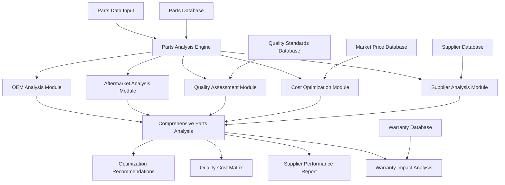

# Parts Optimization and OEM/Aftermarket Analysis Specification

## Overview

This document specifies a comprehensive parts optimization and OEM/aftermarket analysis system for auto-repair claims auditing. The system provides sophisticated analysis of parts pricing, quality comparisons, supplier performance, availability optimization, and cost-benefit analysis while maintaining quality standards and warranty compliance through advanced analytics and machine learning techniques.

## Parts Analysis Architecture

### High-Level Architecture



### Core Parts Analysis Components

#### 1. Comprehensive Parts Analysis Engine

```typescript
export class PartsAnalysisEngine {
  // Primary analysis methods
  async analyzePartsOptimization(
    partsData: PartsData[]
  ): Promise<PartsOptimizationResult>;
  
  async compareOEMvsAftermarket(
    oemParts: OEMPart[],
    aftermarketParts: AftermarketPart[]
  ): Promise<OEMAftermarketComparisonResult>;
  
  async analyzeQualityVsCost(
    partsData: PartsData[],
    qualityMetrics: QualityMetric[]
  ): Promise<QualityVsCostAnalysisResult>;
  
  async optimizePartSelection(
    partRequirements: PartRequirement[],
    availableParts: AvailablePart[]
  ): Promise<PartSelectionOptimizationResult>;
  
  // Advanced analysis
  async analyzeSupplierPerformance(
    supplierData: SupplierData[],
    performanceMetrics: SupplierPerformanceMetric[]
  ): Promise<SupplierPerformanceAnalysisResult>;
  
  async assessWarrantyImpact(
    partsData: PartsData[],
    warrantyData: WarrantyData[]
  ): Promise<WarrantyImpactAssessmentResult>;
  
  async analyzeAvailabilityOptimization(
    partsData: PartsData[],
    availabilityData: AvailabilityData[]
  ): Promise<AvailabilityOptimizationResult>;
  
  // Market analysis
  async analyzeMarketTrends(
    marketData: PartsMarketData[]
  ): Promise<MarketTrendAnalysisResult>;
  
  async benchmarkPartsPricing(
    partsPricing: PartsPricing[],
    marketBenchmarks: MarketBenchmark[]
  ): Promise<PricingBenchmarkResult>;
}
```

## OEM vs Aftermarket Analysis

### 1. Comprehensive OEM/Aftermarket Comparison System

```typescript
export interface OEMAftermarketComparisonResult {
  // Comparison overview
  comparison_summary: ComparisonSummary;
  cost_analysis: CostAnalysis;
  quality_analysis: QualityAnalysis;
  
  // Detailed comparisons
  part_by_part_comparison: PartByPartComparison[];
  category_comparison: CategoryComparison[];
  supplier_comparison: SupplierComparison[];
  
  // Performance metrics
  performance_comparison: PerformanceComparison;
  reliability_comparison: ReliabilityComparison;
  durability_comparison: DurabilityComparison;
  
  // Financial analysis
  total_cost_of_ownership: TotalCostOfOwnership;
  roi_analysis: ROIAnalysis;
  cost_benefit_analysis: CostBenefitAnalysis;
  
  // Risk assessment
  quality_risk_assessment: QualityRiskAssessment;
  warranty_risk_assessment: WarrantyRiskAssessment;
  supplier_risk_assessment: SupplierRiskAssessment;
  
  // Recommendations
  optimization_recommendations: OptimizationRecommendation[];
  selection_guidelines: SelectionGuideline[];
  risk_mitigation_strategies: RiskMitigationStrategy[];
}

export class OEMAftermarketAnalyzer {
  // Core comparison methods
  async compareOEMvsAftermarket(
    oemParts: OEMPart[],
    aftermarketParts: AftermarketPart[]
  ): Promise<OEMAftermarketComparisonResult>;
  
  async analyzeCostDifferentials(
    oemPricing: OEMPricing[],
    aftermarketPricing: AftermarketPricing[]
  ): Promise<CostDifferentialAnalysis>;
  
  async analyzeQualityDifferentials(
    oemQuality: OEMQualityData[],
    aftermarketQuality: AftermarketQualityData[]
  ): Promise<QualityDifferentialAnalysis>;
  
  // Performance analysis
  async analyzePerformanceMetrics(
    oemPerformance: OEMPerformanceData[],
    aftermarketPerformance: AftermarketPerformanceData[]
  ): Promise<PerformanceMetricsAnalysis>;
  
  async analyzeReliabilityMetrics(
    oemReliability: OEMReliabilityData[],
    aftermarketReliability: AftermarketReliabilityData[]
  ): Promise<ReliabilityMetricsAnalysis>;
  
  async analyzeDurabilityMetrics(
    oemDurability: OEMDurabilityData[],
    aftermarketDurability: AftermarketDurabilityData[]
  ): Promise<DurabilityMetricsAnalysis>;
  
  // Financial analysis
  async calculateTotalCostOfOwnership(
    oemCosts: OEMCostData[],
    aftermarketCosts: AftermarketCostData[]
  ): Promise<TotalCostOfOwnershipCalculation>;
  
  async performROIAnalysis(
    oemInvestment: OEMInvestmentData[],
    aftermarketInvestment: AftermarketInvestmentData[]
  ): Promise<ROIAnalysisResult>;
  
  // Risk analysis
  async assessQualityRisks(
    oemQualityRisks: OEMQualityRisk[],
    aftermarketQualityRisks: AftermarketQualityRisk[]
  ): Promise<QualityRiskAssessmentResult>;
  
  async assessWarrantyRisks(
    oemWarrantyRisks: OEMWarrantyRisk[],
    aftermarketWarrantyRisks: AftermarketWarrantyRisk[]
  ): Promise<WarrantyRiskAssessmentResult>;
}

export interface ComparisonSummary {
  // Overall metrics
  total_parts_analyzed: number;
  oem_parts_count: number;
  aftermarket_parts_count: number;
  
  // Cost summary
  average_oem_cost: number;
  average_aftermarket_cost: number;
  average_cost_savings: number;
  cost_savings_percentage: number;
  
  // Quality summary
  average_oem_quality_score: number;
  average_aftermarket_quality_score: number;
  quality_differential: number;
  
  // Performance summary
  oem_performance_rating: PerformanceRating;
  aftermarket_performance_rating: PerformanceRating;
  performance_gap_analysis: PerformanceGapAnalysis;
  
  // Recommendation summary
  recommended_oem_parts: number;
  recommended_aftermarket_parts: number;
  mixed_recommendations: number;
  
  // Risk summary
  overall_risk_assessment: OverallRiskAssessment;
  risk_mitigation_requirements: RiskMitigationRequirement[];
}

export interface PartByPartComparison {
  // Part identification
  part_category: string;
  part_description: string;
  part_number: string;
  
  // OEM details
  oem_part: OEMPartDetails;
  oem_pricing: OEMPricingDetails;
  oem_quality_metrics: OEMQualityMetrics;
  oem_availability: OEMAvailabilityDetails;
  
  // Aftermarket details
  aftermarket_options: AftermarketPartDetails[];
  aftermarket_pricing: AftermarketPricingDetails[];
  aftermarket_quality_metrics: AftermarketQualityMetrics[];
  aftermarket_availability: AftermarketAvailabilityDetails[];
  
  // Comparison metrics
  cost_comparison: CostComparisonMetrics;
  quality_comparison: QualityComparisonMetrics;
  performance_comparison: PerformanceComparisonMetrics;
  availability_comparison: AvailabilityComparisonMetrics;
  
  // Recommendation
  recommended_option: RecommendedOption;
  recommendation_rationale: RecommendationRationale;
  risk_assessment: PartRiskAssessment;
  
  // Supporting data
  market_analysis: PartMarketAnalysis;
  historical_performance: HistoricalPerformanceData;
  customer_feedback: CustomerFeedbackData;
}
```

### 2. Advanced Quality Assessment System

```typescript
export interface QualityAssessmentResult {
  // Quality overview
  quality_assessment_summary: QualityAssessmentSummary;
  quality_scoring: QualityScoring;
  quality_benchmarks: QualityBenchmark[];
  
  // Quality dimensions
  material_quality: MaterialQualityAssessment;
  manufacturing_quality: ManufacturingQualityAssessment;
  design_quality: DesignQualityAssessment;
  performance_quality: PerformanceQualityAssessment;
  
  // Quality validation
  quality_certifications: QualityCertification[];
  testing_results: TestingResult[];
  compliance_assessment: ComplianceAssessment;
  
  // Quality trends
  quality_trend_analysis: QualityTrendAnalysis;
  quality_improvement_tracking: QualityImprovementTracking;
  quality_degradation_indicators: QualityDegradationIndicator[];
  
  // Quality-cost correlation
  quality_cost_correlation: QualityCostCorrelation;
  value_proposition_analysis: ValuePropositionAnalysis;
  quality_optimization_opportunities: QualityOptimizationOpportunity[];
}

export class QualityAssessmentEngine {
  // Core quality assessment
  async assessPartQuality(
    partsData: PartsData[],
    qualityStandards: QualityStandard[]
  ): Promise<QualityAssessmentResult>;
  
  async evaluateMaterialQuality(
    materialData: MaterialData[],
    materialStandards: MaterialStandard[]
  ): Promise<MaterialQualityEvaluation>;
  
  async assessManufacturingQuality(
    manufacturingData: ManufacturingData[],
    manufacturingStandards: ManufacturingStandard[]
  ): Promise<ManufacturingQualityAssessment>;
  
  // Quality validation
  async validateQualityCertifications(
    certifications: QualityCertification[],
    certificationStandards: CertificationStandard[]
  ): Promise<CertificationValidationResult>;
  
  async analyzeTestingResults(
    testingData: TestingData[],
    testingStandards: TestingStandard[]
  ): Promise<TestingResultsAnalysis>;
  
  async assessCompliance(
    complianceData: ComplianceData[],
    regulatoryRequirements: RegulatoryRequirement[]
  ): Promise<ComplianceAssessmentResult>;
  
  // Quality correlation analysis
  async correlateQualityWithCost(
    qualityData: QualityData[],
    costData: CostData[]
  ): Promise<QualityCostCorrelationAnalysis>;
  
  async correlateQualityWithPerformance(
    qualityData: QualityData[],
    performanceData: PerformanceData[]
  ): Promise<QualityPerformanceCorrelationAnalysis>;
  
  // Quality optimization
  async identifyQualityOptimizationOpportunities(
    qualityAssessment: QualityAssessmentResult
  ): Promise<QualityOptimizationOpportunity[]>;
  
  async recommendQualityImprovements(
    qualityData: QualityData[],
    improvementTargets: ImprovementTarget[]
  ): Promise<QualityImprovementRecommendation[]>;
}

export interface QualityScoring {
  // Overall quality scores
  overall_quality_score: number;
  weighted_quality_score: number;
  normalized_quality_score: number;
  
  // Dimensional scores
  material_quality_score: number;
  manufacturing_quality_score: number;
  design_quality_score: number;
  performance_quality_score: number;
  
  // Comparative scores
  industry_benchmark_score: number;
  competitor_comparison_score: number;
  historical_comparison_score: number;
  
  // Quality indicators
  quality_consistency_indicator: QualityConsistencyIndicator;
  quality_reliability_indicator: QualityReliabilityIndicator;
  quality_improvement_indicator: QualityImprovementIndicator;
  
  // Confidence metrics
  scoring_confidence: ScoringConfidence;
  data_quality_score: DataQualityScore;
  assessment_completeness: AssessmentCompleteness;
}
```

## Cost Optimization Analysis

### 1. Comprehensive Cost Optimization System

```typescript
export interface CostOptimizationResult {
  // Optimization overview
  optimization_summary: OptimizationSummary;
  cost_reduction_potential: CostReductionPotential;
  optimization_strategies: OptimizationStrategy[];
  
  // Cost analysis
  current_cost_analysis: CurrentCostAnalysis;
  optimized_cost_projection: OptimizedCostProjection;
  cost_savings_breakdown: CostSavingsBreakdown;
  
  // Optimization opportunities
  immediate_opportunities: ImmediateOptimizationOpportunity[];
  medium_term_opportunities: MediumTermOptimizationOpportunity[];
  long_term_opportunities: LongTermOptimizationOpportunity[];
  
  // Risk-adjusted optimization
  risk_adjusted_savings: RiskAdjustedSavings;
  optimization_risk_assessment: OptimizationRiskAssessment;
  risk_mitigation_costs: RiskMitigationCost[];
  
  // Implementation analysis
  implementation_roadmap: ImplementationRoadmap;
  resource_requirements: ResourceRequirement[];
  timeline_projections: TimelineProjection[];
  
  // Performance tracking
  optimization_kpis: OptimizationKPI[];
  success_metrics: SuccessMetric[];
  monitoring_framework: MonitoringFramework;
}

export class CostOptimizationEngine {
  // Core optimization methods
  async optimizePartsCosts(
    partsData: PartsData[],
    optimizationCriteria: OptimizationCriteria[]
  ): Promise<CostOptimizationResult>;
  
  async identifyOptimizationOpportunities(
    costData: CostData[],
    benchmarkData: BenchmarkData[]
  ): Promise<OptimizationOpportunityIdentification>;
  
  async calculateOptimizationPotential(
    currentCosts: CurrentCost[],
    optimizationScenarios: OptimizationScenario[]
  ): Promise<OptimizationPotentialCalculation>;
  
  // Advanced optimization
  async performMultiObjectiveOptimization(
    objectives: OptimizationObjective[],
    constraints: OptimizationConstraint[]
  ): Promise<MultiObjectiveOptimizationResult>;
  
  async optimizeSupplierMix(
    supplierData: SupplierData[],
    optimizationGoals: OptimizationGoal[]
  ): Promise<SupplierMixOptimizationResult>;
  
  async optimizeInventoryLevels(
    inventoryData: InventoryData[],
    demandForecasts: DemandForecast[]
  ): Promise<InventoryOptimizationResult>;
  
  // Risk-adjusted optimization
  async performRiskAdjustedOptimization(
    optimizationOptions: OptimizationOption[],
    riskAssessments: RiskAssessment[]
  ): Promise<RiskAdjustedOptimizationResult>;
  
  async calculateRiskAdjustedROI(
    optimizationInvestments: OptimizationInvestment[],
    riskFactors: RiskFactor[]
  ): Promise<RiskAdjustedROICalculation>;
  
  // Implementation planning
  async developImplementationPlan(
    optimizationRecommendations: OptimizationRecommendation[]
  ): Promise<ImplementationPlan>;
  
  async prioritizeOptimizationInitiatives(
    initiatives: OptimizationInitiative[],
    prioritizationCriteria: PrioritizationCriteria
  ): Promise<PrioritizedInitiative[]>;
}

export interface OptimizationSummary {
  // Current state
  current_total_cost: number;
  current_average_cost_per_part: number;
  current_cost_distribution: CostDistribution;
  
  // Optimized state
  optimized_total_cost: number;
  optimized_average_cost_per_part: number;
  optimized_cost_distribution: OptimizedCostDistribution;
  
  // Savings potential
  total_savings_potential: number;
  percentage_savings_potential: number;
  annual_savings_projection: number;
  
  // Optimization categories
  supplier_optimization_savings: SupplierOptimizationSavings;
  volume_optimization_savings: VolumeOptimizationSavings;
  quality_optimization_savings: QualityOptimizationSavings;
  process_optimization_savings: ProcessOptimizationSavings;
  
  // Implementation metrics
  implementation_complexity: ImplementationComplexity;
  implementation_timeline: ImplementationTimeline;
  implementation_investment: ImplementationInvestment;
  
  // Risk assessment
  optimization_risk_level: OptimizationRiskLevel;
  risk_mitigation_requirements: RiskMitigationRequirement[];
  success_probability: SuccessProbability;
}

export interface CostReductionPotential {
  // Immediate potential (0-3 months)
  immediate_savings_potential: ImmediateSavingsPotential;
  immediate_implementation_cost: ImmediateImplementationCost;
  immediate_roi: ImmediateROI;
  
  // Medium-term potential (3-12 months)
  medium_term_savings_potential: MediumTermSavingsPotential;
  medium_term_implementation_cost: MediumTermImplementationCost;
  medium_term_roi: MediumTermROI;
  
  // Long-term potential (12+ months)
  long_term_savings_potential: LongTermSavingsPotential;
  long_term_implementation_cost: LongTermImplementationCost;
  long_term_roi: LongTermROI;
  
  // Cumulative analysis
  cumulative_savings_projection: CumulativeSavingsProjection;
  cumulative_investment_requirement: CumulativeInvestmentRequirement;
  cumulative_roi_analysis: CumulativeROIAnalysis;
  
  // Sensitivity analysis
  best_case_scenario: BestCaseScenario;
  worst_case_scenario: WorstCaseScenario;
  most_likely_scenario: MostLikelyScenario;
}
```

### 2. Advanced Supplier Performance Analysis

```typescript
export interface SupplierPerformanceAnalysisResult {
  // Performance overview
  supplier_performance_summary: SupplierPerformanceSummary;
  performance_rankings: SupplierPerformanceRanking[];
  performance_trends: SupplierPerformanceTrend[];
  
  // Performance dimensions
  quality_performance: SupplierQualityPerformance[];
  delivery_performance: SupplierDeliveryPerformance[];
  cost_performance: SupplierCostPerformance[];
  service_performance: SupplierServicePerformance[];
  
  // Comparative analysis
  supplier_benchmarking: SupplierBenchmarking;
  peer_comparison: SupplierPeerComparison;
  market_positioning: SupplierMarketPositioning;
  
  // Risk assessment
  supplier_risk_assessment: SupplierRiskAssessment[];
  supply_chain_risk_analysis: SupplyChainRiskAnalysis;
  business_continuity_assessment: BusinessContinuityAssessment;
  
  // Optimization recommendations
  supplier_optimization_recommendations: SupplierOptimizationRecommendation[];
  supplier_development_opportunities: SupplierDevelopmentOpportunity[];
  supplier_relationship_strategies: SupplierRelationshipStrategy[];
}

export class SupplierPerformanceAnalyzer {
  // Core performance analysis
  async analyzeSupplierPerformance(
    supplierData: SupplierData[],
    performanceMetrics: SupplierPerformanceMetric[]
  ): Promise<SupplierPerformanceAnalysisResult>;
  
  async evaluateQualityPerformance(
    qualityData: SupplierQualityData[],
    qualityStandards: QualityStandard[]
  ): Promise<SupplierQualityPerformanceEvaluation>;
  
  async evaluateDeliveryPerformance(
    deliveryData: SupplierDeliveryData[],
    deliveryStandards: DeliveryStandard[]
  ): Promise<SupplierDeliveryPerformanceEvaluation>;
  
  // Performance benchmarking
  async benchmarkSupplierPerformance(
    supplierPerformance: SupplierPerformanceData[],
    industryBenchmarks: IndustryBenchmark[]
  ): Promise<SupplierPerformanceBenchmarking>;
  
  async compareSupplierPerformance(
    suppliers: SupplierData[],
    comparisonCriteria: ComparisonCriteria[]
  ): Promise<SupplierPerformanceComparison>;
  
  // Risk analysis
  async assessSupplierRisks(
    supplierData: SupplierData[],
    riskFactors: SupplierRiskFactor[]
  ): Promise<SupplierRiskAssessmentResult>;
  
  async analyzeSupplyChainRisks(
    supplyChainData: SupplyChainData[],
    riskScenarios: RiskScenario[]
  ): Promise<SupplyChainRiskAnalysisResult>;
  
  // Optimization analysis
  async identifySupplierOptimizationOpportunities(
    supplierPerformance: SupplierPerformanceAnalysisResult
  ): Promise<SupplierOptimizationOpportunity[]>;
  
  async recommendSupplierDevelopment(
    supplierData: SupplierData[],
    developmentGoals: DevelopmentGoal[]
  ): Promise<SupplierDevelopmentRecommendation[]>;
}

export interface SupplierPerformanceSummary {
  // Overall metrics
  total_suppliers_analyzed: number;
  average_performance_score: number;
  performance_distribution: PerformanceDistribution;
  
  // Top performers
  top_performing_suppliers: TopPerformingSupplier[];
  performance_leaders_by_category: PerformanceLeadersByCategory;
  excellence_award_candidates: ExcellenceAwardCandidate[];
  
  // Underperformers
  underperforming_suppliers: UnderperformingSupplier[];
  performance_improvement_candidates: PerformanceImprovementCandidate[];
  at_risk_suppliers: AtRiskSupplier[];
  
  // Performance trends
  overall_performance_trend: OverallPerformanceTrend;
  category_performance_trends: CategoryPerformanceTrend[];
  seasonal_performance_patterns: SeasonalPerformancePattern[];
  
  // Key insights
  performance_insights: PerformanceInsight[];
  improvement_opportunities: ImprovementOpportunity[];
  strategic_recommendations: StrategicRecommendation[];
}
```

## Warranty and Compliance Analysis

### 1. Comprehensive Warranty Impact Assessment

```typescript
export interface WarrantyImpactAssessmentResult {
  // Warranty overview
  warranty_assessment_summary: WarrantyAssessmentSummary;
  warranty_coverage_analysis: WarrantyCoverageAnalysis;
  warranty_risk_assessment: WarrantyRiskAssessment;
  
  // OEM vs Aftermarket warranty comparison
  oem_warranty_analysis: OEMWarrantyAnalysis;
  aftermarket_warranty_analysis: AftermarketWarrantyAnalysis;
  warranty_comparison_matrix: WarrantyComparisonMatrix;
  
  // Financial impact analysis
  warranty_cost_analysis: WarrantyCostAnalysis;
  warranty_savings_analysis: WarrantySavingsAnalysis;
  warranty_roi_analysis: WarrantyROIAnalysis;
  
  // Risk mitigation
  warranty_risk_mitigation: WarrantyRiskMitigation;
  warranty_optimization_strategies: WarrantyOptimizationStrategy[];
  warranty_management_recommendations: WarrantyManagementRecommendation[];
  
  // Compliance assessment
  warranty_compliance_assessment: WarrantyComplianceAssessment;
  regulatory_compliance_analysis: RegulatoryComplianceAnalysis;
  legal_risk_assessment: LegalRiskAssessment;
}

export class WarrantyAnalysisEngine {
  // Core warranty analysis
  async assessWarrantyImpact(
    partsData: PartsData[],
    warrantyData: WarrantyData[]
  ): Promise<WarrantyImpactAssessmentResult>;
  
  async analyzeWarrantyCoverage(
    warrantyTerms: WarrantyTerm[],
    coverageRequirements: CoverageRequirement[]
  ): Promise<WarrantyCoverageAnalysisResult>;
  
  async assessWarrantyRisks(
    warrantyData: WarrantyData[],
    riskFactors: WarrantyRiskFactor[]
  ): Promise<WarrantyRiskAssessmentResult>;
  
  // Comparative warranty analysis
  async compareWarrantyTerms(
    oemWarranties: OEMWarranty[],
    aftermarketWarranties: AftermarketWarranty[]
  ): Promise<WarrantyComparisonResult>;
  
  async analyzeWarrantyValue(
    warrantyTerms: WarrantyTerm[],
    valueMetrics: WarrantyValueMetric[]
  ): Promise<WarrantyValueAnalysisResult>;
  
  // Financial analysis
  async calculateWarrantyCosts(
    warrantyData: WarrantyData[],
    costFactors: WarrantyCostFactor[]
  ): Promise<WarrantyCostCalculation>;
  
  async analyzeWarrantyROI(
    warrantyInvestments: WarrantyInvestment[],
    warrantyBenefits: WarrantyBenefit[]
  ): Promise<WarrantyROIAnalysisResult>;
  
  // Compliance analysis
  async assessWarrantyCompliance(
    warrantyPolicies: WarrantyPolicy[],
    complianceRequirements: ComplianceRequirement[]
  ): Promise<WarrantyComplianceAssessmentResult>;
  
  async analyzeRegulatoryCompliance(
    warrantyData: WarrantyData[],
    regulatoryRequirements: RegulatoryRequirement[]
  ): Promise<RegulatoryComplianceAnalysisResult>;
}

export interface WarrantyComparisonMatrix {
  // Comparison dimensions
  coverage_comparison: CoverageComparison;
  duration_comparison: DurationComparison;
  terms_comparison: TermsComparison;
  exclusions_comparison: ExclusionsComparison;
  
  // Value comparison
  warranty_value_comparison: WarrantyValueComparison;
  cost_benefit_comparison: CostBenefitComparison;
  risk_coverage_comparison: RiskCoverageComparison;
  
  // Performance comparison
  claim_processing_comparison: ClaimProcessingComparison;
  customer_service_comparison: CustomerServiceComparison;
  resolution_time_comparison: ResolutionTimeComparison;
  
  // Recommendation matrix
  recommendation_by_scenario: RecommendationByScenario[];
  risk_tolerance_recommendations: RiskToleranceRecommendation[];
  cost_optimization_recommendations: CostOptimizationRecommendation[];
}
```

## Machine Learning and Predictive Analytics

### 1. Advanced ML-Based Parts Analysis

```typescript
export class MLPartsAnalysisEngine {
  // Model training and inference
  async trainPartsOptimizationModels(
    trainingData: PartsTrainingData[]
  ): Promise<PartsOptimizationModel[]>;
  
  async predictOptimalPartSelection(
    partRequirements: PartRequirement[],
    optimizationModels: PartsOptimizationModel[]
  ): Promise<OptimalPartPrediction[]>;
  
  async predictPartsPricing(
    marketData: PartsMarketData[],
    pricingModels: PricingPredictionModel[]
  ): Promise<PartsPricingPrediction[]>;
  
  // Quality prediction
  async predictPartQuality(
    partSpecifications: PartSpecification[],
    qualityModels: QualityPredictionModel[]
  ): Promise<PartQualityPrediction[]>;
  
  async predictReliability(
    partData: PartData[],
    reliabilityModels: ReliabilityPredictionModel[]
  ): Promise<ReliabilityPrediction[]>;
  
  // Supplier performance prediction
  async predictSupplierPerformance(
    supplierData: SupplierData[],
    performanceModels: SupplierPerformanceModel[]
  ): Promise<SupplierPerformancePrediction[]>;
  
  async predictSupplyChainRisks(
    supplyChainData: SupplyChainData[],
    riskModels: SupplyChainRiskModel[]
  ): Promise<SupplyChainRiskPrediction[]>;
  
  // Market analysis
  async predictMarketTrends(
    marketData: MarketData[],
    trendModels: MarketTrendModel[]
  ): Promise<MarketTrendPrediction[]>;
  
  async predictDemandPatterns(
    demandData: DemandData[],
    demandModels: DemandPredictionModel[]
  ): Promise<DemandPatternPrediction[]>;
  
  // Model validation and improvement
  async validateModelAccuracy(
    models: PartsAnalysisModel[],
    validationData: ValidationData[]
  ): Promise<ModelValidationResult[]>;
  
  async improveModelPerformance(
    models: PartsAnalysisModel[],
    performanceData: ModelPerformanceData[]
  ): Promise<ImprovedModel[]>;
}

export interface PartsOptimizationModel {
  // Model metadata
  model_id: string;
  model_type: PartsModelType;
  model_version: string;
  training_date: string;
  
  // Model configuration
  algorithm_type: AlgorithmType;
  feature_engineering: FeatureEngineering;
  hyperparameters: ModelHyperparameter[];
  
  // Performance metrics
  accuracy_metrics: ModelAccuracyMetric[];
  validation_scores: ModelValidationScore[];
  cross_validation_results: CrossValidationResult[];
  
  // Model interpretation
  feature_importance: FeatureImportanceScore[];
  model_explainability: ModelExplainability;
  decision_tree_visualization: DecisionTreeVisualization;
}
```

### 2. Predictive Parts Analytics

```typescript
export interface PredictivePartsAnalytics {
  // Cost predictions
  parts_cost_forecasts: PartsCostForecast[];
  pricing_trend_predictions: PricingTrendPrediction[];
  inflation_impact_predictions: InflationImpactPrediction[];
  
  // Quality predictions
  quality_performance_forecasts: QualityPerformanceForecast[];
  reliability_predictions: ReliabilityPrediction[];
  durability_forecasts: DurabilityForecast[];
  
  // Supply chain predictions
  availability_forecasts: AvailabilityForecast[];
  supply_chain_disruption_predictions: SupplyChainDisruptionPrediction[];
  lead_time_predictions: LeadTimePrediction[];
  
  // Market predictions
  market_trend_forecasts: MarketTrendForecast[];
  demand_pattern_predictions: DemandPatternPrediction[];
  competitive_landscape_predictions: CompetitiveLandscapePrediction[];
  
  // Optimization predictions
  optimization_opportunity_forecasts: OptimizationOpportunityForecast[];
  savings_potential_predictions: SavingsPotentialPrediction[];
  roi_projections: ROIProjection[];
}

export class PredictivePartsAnalyzer {
  // Predictive modeling
  async generateCostForecasts(
    historicalCostData: HistoricalCostData[],
    marketFactors: MarketFactor[]
  ): Promise<PartsCostForecast[]>;
  
  async predictQualityTrends(
    qualityData: QualityData[],
    qualityFactors: QualityFactor[]
  ): Promise<QualityTrendPrediction[]>;
  
  async forecastSupplyChainPerformance(
    supplyChainData: SupplyChainData[],
    externalFactors: ExternalFactor[]
  ): Promise<SupplyChainPerformanceForecast>;
  
  // Risk prediction
  async predictQualityRisks(
    qualityRiskFactors: QualityRiskFactor[],
    riskModels: QualityRiskModel[]
  ): Promise<QualityRiskPrediction[]>;
  
  async predictSupplyRisks(
    supplyRiskFactors: SupplyRiskFactor[],
    supplyRiskModels: SupplyRiskModel[]
  ): Promise<SupplyRiskPrediction[]>;
  
  // Optimization prediction
  async predictOptimizationOutcomes(
    optimizationScenarios: OptimizationScenario[],
    outcomeModels: OptimizationOutcomeModel[]
  ): Promise<OptimizationOutcomePrediction[]>;
  
  async forecastSavingsRealization(
    savingsInitiatives: SavingsInitiative[],
    realizationModels: SavingsRealizationModel[]
  ): Promise<SavingsRealizationForecast[]>;
}
```

## Integration and Implementation

### 1. System Integration Architecture

```typescript
export class PartsAnalysisIntegrator {
  // Core integration
  async integrateWithRiskAnalysis(
    partsAnalysis: PartsAnalysisResult,
    riskAnalysis: RiskAnalysisResult
  ): Promise<IntegratedPartsRiskAnalysis>;
  
  async integrateWithCostOptimization(
    partsAnalysis: PartsAnalysisResult,
    costOptimization: CostOptimizationResult
  ): Promise<IntegratedPartsCostAnalysis>;
  
  async integrateWithSupplierManagement(
    partsAnalysis: PartsAnalysisResult,
    supplierData: SupplierManagementData
  ): Promise<IntegratedSupplierPartsAnalysis>;
  
  // External system integration
  async integrateWithERPSystems(
    partsData: PartsData[],
    erpSystems: ERPSystem[]
  ): Promise<ERPIntegration>;
  
  async integrateWithInventoryManagement(
    partsData: PartsData[],
    inventorySystems: InventoryManagementSystem[]
  ): Promise<InventoryIntegration>;
  
  async integrateWithProcurementSystems(
    partsData: PartsData[],
    procurementSystems: ProcurementSystem[]
  ): Promise<ProcurementIntegration>;
  
  // Data synchronization
  async synchronizePartsData(
    dataSources: PartsDataSource[]
  ): Promise<SynchronizedPartsData>;
  
  async validateDataConsistency(
    partsData: PartsData[]
  ): Promise<DataConsistencyValidation>;
}
```

### 2. Performance Optimization

```typescript
export class PartsAnalysisOptimizer {
  // Performance optimization
  async optimizeAnalysisPerformance(
    analysisEngine: PartsAnalysisEngine,
    performanceTargets: PerformanceTarget[]
  ): Promise<OptimizedPartsAnalysisEngine>;
  
  async implementCaching(
    analysisResults: PartsAnalysisResult[],
    cachingStrategy: CachingStrategy
  ): Promise<CachedPartsAnalysisSystem>;
  
  async optimizeDataProcessing(
    dataProcessingPipeline: PartsDataProcessingPipeline,
    optimizationRules: OptimizationRule[]
  ): Promise<OptimizedPartsDataProcessing>;
  
  // Scalability management
  async scaleForHighVolume(
    partsAnalysisSystem: PartsAnalysisSystem,
    volumeProjections: VolumeProjection[]
  ): Promise<ScaledPartsAnalysisSystem>;
  
  async implementLoadBalancing(
    analysisServices: PartsAnalysisService[],
    loadBalancingConfig: LoadBalancingConfiguration
  ): Promise<LoadBalancedPartsSystem>;
}
```

## Implementation Roadmap

### Phase 1: Core Parts Analysis (Weeks 1-2)
1. **OEM/Aftermarket Comparison**: Implement comprehensive OEM vs aftermarket analysis engine
2. **Quality Assessment System**: Build quality scoring and assessment framework
3. **Cost Optimization Engine**: Create cost optimization and savings identification system
4. **Basic Integration**: Establish integration with existing SupplementGuard components

### Phase 2: Advanced Analytics (Weeks 3-4)
1. **Supplier Performance Analysis**: Implement comprehensive supplier performance tracking
2. **Warranty Impact Assessment**: Build warranty analysis and compliance checking
3. **Market Analysis**: Create market trend analysis and benchmarking capabilities
4. **Predictive Analytics**: Implement basic predictive modeling for costs and quality

### Phase 3: Machine Learning Enhancement (Weeks 5-6)
1. **ML Models**: Implement machine learning models for optimization and prediction
2. **Advanced Predictions**: Build sophisticated forecasting for costs, quality, and supply chain
3. **Pattern Recognition**: Create advanced pattern recognition for optimization opportunities
4. **Model Validation**: Implement comprehensive model validation and improvement

### Phase 4: Integration and Optimization (Weeks 7-8)
1. **System Integration**: Complete integration with all SupplementGuard components
2. **External System Integration**: Integrate with ERP, inventory, and procurement systems
3. **Performance Optimization**: Optimize for high-volume processing and real-time analysis
4. **Quality Assurance**: Implement comprehensive testing and validation

## Success Metrics

### Analysis Accuracy Requirements
- **OEM/Aftermarket Classification**: > 94% accuracy in part type classification
- **Quality Assessment Accuracy**: > 90% correlation with expert quality ratings
- **Cost Optimization Accuracy**: > 88% accuracy in identifying cost savings opportunities
- **Supplier Performance Prediction**: > 85% accuracy in performance forecasting
- **Warranty Risk Assessment**: > 92% accuracy in warranty risk identification

### Performance Requirements
- **Analysis Speed**: < 12 seconds for comprehensive parts analysis
- **Real-Time Processing**: < 3 seconds for real-time parts optimization
- **Concurrent Analysis**: Support 25+ simultaneous parts analyses
- **Memory Efficiency**: < 200MB per analysis session
- **Scalability**: Linear scaling to 250+ analyses per hour

### Business Impact Requirements
- **Cost Savings**: 22% improvement in parts cost optimization
- **Quality Improvement**: 30% improvement in parts quality assessment accuracy
- **Supplier Performance**: 25% improvement in supplier selection and management
- **Processing Efficiency**: 40% reduction in parts analysis time
- **ROI Achievement**: Clear ROI demonstration within 5 months

## Conclusion

This comprehensive parts optimization and OEM/aftermarket analysis specification provides a robust framework for sophisticated analysis of parts costs, quality, supplier performance, and optimization opportunities in auto-repair claims. The system combines advanced analytics, machine learning, and domain expertise to deliver accurate, actionable insights that enable strategic parts management and cost optimization.

The modular architecture ensures seamless integration with existing SupplementGuard capabilities while the predictive analytics and optimization engines provide forward-looking insights that support proactive decision-making and continuous improvement in parts procurement and management strategies.