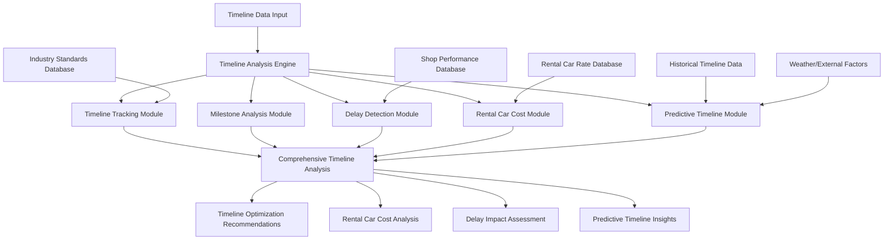

# Timeline Analysis and Rental Car Cost Tracking Specification

## Overview

This document specifies a comprehensive timeline analysis and rental car cost tracking system for auto-repair claims auditing. The system provides sophisticated analysis of repair timelines, milestone tracking, delay detection, rental car cost optimization, and predictive timeline modeling while identifying bottlenecks, inefficiencies, and cost containment opportunities through advanced analytics and machine learning techniques.

## Timeline Analysis Architecture

### High-Level Architecture



### Core Timeline Analysis Components

#### 1. Comprehensive Timeline Analysis Engine

```typescript
export class TimelineAnalysisEngine {
  // Primary analysis methods
  async analyzeRepairTimeline(
    timelineData: RepairTimelineData
  ): Promise<TimelineAnalysisResult>;
  
  async trackMilestones(
    milestoneData: MilestoneData[]
  ): Promise<MilestoneTrackingResult>;
  
  async detectDelays(
    timelineData: RepairTimelineData,
    benchmarkData: TimelineBenchmarkData
  ): Promise<DelayDetectionResult>;
  
  async analyzeRentalCarCosts(
    rentalCarData: RentalCarData[]
  ): Promise<RentalCarCostAnalysisResult>;
  
  // Advanced analysis
  async analyzeCriticalPath(
    taskData: TaskData[],
    dependencies: TaskDependency[]
  ): Promise<CriticalPathAnalysisResult>;
  
  async predictTimelineCompletion(
    currentProgress: ProgressData,
    historicalData: HistoricalTimelineData[]
  ): Promise<TimelineCompletionPrediction>;
  
  async optimizeTimeline(
    timelineData: RepairTimelineData,
    optimizationCriteria: OptimizationCriteria[]
  ): Promise<TimelineOptimizationResult>;
  
  // Cost impact analysis
  async analyzeTimelineCostImpact(
    timelineData: RepairTimelineData,
    costData: TimelineCostData
  ): Promise<TimelineCostImpactAnalysis>;
  
  async optimizeRentalCarCosts(
    rentalCarData: RentalCarData[],
    optimizationOptions: RentalCarOptimizationOption[]
  ): Promise<RentalCarCostOptimizationResult>;
}
```

## Timeline Tracking and Analysis

### 1. Comprehensive Timeline Tracking System

```typescript
export interface TimelineAnalysisResult {
  // Timeline overview
  timeline_summary: TimelineSummary;
  timeline_metrics: TimelineMetrics;
  timeline_performance: TimelinePerformance;
  
  // Phase analysis
  phase_breakdown: PhaseBreakdown[];
  phase_performance: PhasePerformance[];
  phase_transitions: PhaseTransition[];
  
  // Task analysis
  task_analysis: TaskAnalysis[];
  task_dependencies: TaskDependencyAnalysis[];
  task_bottlenecks: TaskBottleneck[];
  
  // Delay analysis
  delay_analysis: DelayAnalysis;
  delay_causes: DelayCause[];
  delay_impact_assessment: DelayImpactAssessment;
  
  // Efficiency metrics
  efficiency_metrics: TimelineEfficiencyMetrics;
  productivity_indicators: ProductivityIndicator[];
  resource_utilization: ResourceUtilizationAnalysis;
  
  // Predictive insights
  completion_prediction: CompletionPrediction;
  risk_assessment: TimelineRiskAssessment;
  optimization_opportunities: TimelineOptimizationOpportunity[];
}

export class TimelineTracker {
  // Core tracking methods
  async trackRepairTimeline(
    repairData: RepairData
  ): Promise<TimelineTrackingResult>;
  
  async updateTimelineProgress(
    timelineId: string,
    progressUpdate: ProgressUpdate
  ): Promise<TimelineUpdateResult>;
  
  async calculateTimelineMetrics(
    timelineData: RepairTimelineData
  ): Promise<TimelineMetrics>;
  
  // Phase tracking
  async trackPhaseProgress(
    phaseData: PhaseData[]
  ): Promise<PhaseProgressTracking>;
  
  async analyzePhaseTransitions(
    phaseTransitions: PhaseTransition[]
  ): Promise<PhaseTransitionAnalysis>;
  
  async identifyPhaseBottlenecks(
    phaseData: PhaseData[]
  ): Promise<PhaseBottleneckIdentification>;
  
  // Task tracking
  async trackTaskProgress(
    taskData: TaskData[]
  ): Promise<TaskProgressTracking>;
  
  async analyzeDependencies(
    dependencies: TaskDependency[]
  ): Promise<DependencyAnalysis>;
  
  async identifyTaskBottlenecks(
    taskData: TaskData[],
    dependencies: TaskDependency[]
  ): Promise<TaskBottleneckIdentification>;
  
  // Performance analysis
  async analyzeTimelinePerformance(
    timelineData: RepairTimelineData,
    benchmarks: TimelineBenchmark[]
  ): Promise<TimelinePerformanceAnalysis>;
  
  async calculateEfficiencyMetrics(
    timelineData: RepairTimelineData
  ): Promise<TimelineEfficiencyMetrics>;
}

export interface TimelineSummary {
  // Basic timeline information
  timeline_id: string;
  claim_number: string;
  repair_start_date: string;
  estimated_completion_date: string;
  actual_completion_date: string | null;
  
  // Duration metrics
  total_estimated_duration: number;
  actual_duration_to_date: number;
  remaining_estimated_duration: number;
  
  // Progress metrics
  overall_progress_percentage: number;
  phases_completed: number;
  phases_in_progress: number;
  phases_pending: number;
  
  // Performance indicators
  on_schedule_status: OnScheduleStatus;
  timeline_variance: TimelineVariance;
  performance_rating: TimelinePerformanceRating;
  
  // Key milestones
  key_milestones: KeyMilestone[];
  milestone_completion_rate: number;
  overdue_milestones: OverdueMilestone[];
  
  // Risk indicators
  timeline_risk_level: TimelineRiskLevel;
  delay_probability: DelayProbability;
  critical_issues: CriticalTimelineIssue[];
}

export interface PhaseBreakdown {
  // Phase identification
  phase_id: string;
  phase_name: string;
  phase_category: PhaseCategory;
  phase_sequence: number;
  
  // Phase timing
  planned_start_date: string;
  actual_start_date: string | null;
  planned_end_date: string;
  actual_end_date: string | null;
  planned_duration: number;
  actual_duration: number | null;
  
  // Phase progress
  progress_percentage: number;
  completion_status: PhaseCompletionStatus;
  tasks_completed: number;
  tasks_remaining: number;
  
  // Phase performance
  schedule_variance: ScheduleVariance;
  performance_metrics: PhasePerformanceMetrics;
  efficiency_rating: EfficiencyRating;
  
  // Dependencies and constraints
  predecessor_phases: PredecessorPhase[];
  successor_phases: SuccessorPhase[];
  resource_requirements: ResourceRequirement[];
  
  // Issues and risks
  phase_issues: PhaseIssue[];
  risk_factors: PhaseRiskFactor[];
  mitigation_actions: MitigationAction[];
}
```

### 2. Advanced Milestone Tracking System

```typescript
export interface MilestoneTrackingResult {
  // Milestone overview
  milestone_summary: MilestoneSummary;
  milestone_performance: MilestonePerformance;
  milestone_trends: MilestoneTrend[];
  
  // Milestone categories
  critical_milestones: CriticalMilestone[];
  regulatory_milestones: RegulatoryMilestone[];
  customer_milestones: CustomerMilestone[];
  internal_milestones: InternalMilestone[];
  
  // Milestone status
  completed_milestones: CompletedMilestone[];
  upcoming_milestones: UpcomingMilestone[];
  overdue_milestones: OverdueMilestone[];
  at_risk_milestones: AtRiskMilestone[];
  
  // Impact analysis
  milestone_impact_analysis: MilestoneImpactAnalysis;
  delay_cascade_analysis: DelayCascadeAnalysis;
  cost_impact_assessment: MilestoneCostImpactAssessment;
  
  // Optimization recommendations
  milestone_optimization_recommendations: MilestoneOptimizationRecommendation[];
  schedule_acceleration_opportunities: ScheduleAccelerationOpportunity[];
  risk_mitigation_strategies: MilestoneRiskMitigationStrategy[];
}

export class MilestoneTracker {
  // Core milestone tracking
  async trackMilestones(
    milestoneData: MilestoneData[]
  ): Promise<MilestoneTrackingResult>;
  
  async updateMilestoneStatus(
    milestoneId: string,
    statusUpdate: MilestoneStatusUpdate
  ): Promise<MilestoneUpdateResult>;
  
  async analyzeMilestonePerformance(
    milestoneData: MilestoneData[],
    performanceStandards: MilestonePerformanceStandard[]
  ): Promise<MilestonePerformanceAnalysis>;
  
  // Milestone categorization
  async categorizeMilestones(
    milestones: Milestone[]
  ): Promise<CategorizedMilestones>;
  
  async identifyCriticalMilestones(
    milestones: Milestone[],
    criticalityFactors: CriticalityFactor[]
  ): Promise<CriticalMilestoneIdentification>;
  
  // Impact analysis
  async analyzeMilestoneImpact(
    milestone: Milestone,
    impactFactors: ImpactFactor[]
  ): Promise<MilestoneImpactAnalysis>;
  
  async analyzeDelayCascade(
    delayedMilestone: DelayedMilestone,
    dependentMilestones: DependentMilestone[]
  ): Promise<DelayCascadeAnalysis>;
  
  // Optimization
  async optimizeMilestoneSchedule(
    milestones: Milestone[],
    optimizationCriteria: MilestoneOptimizationCriteria
  ): Promise<MilestoneScheduleOptimization>;
  
  async identifyAccelerationOpportunities(
    milestones: Milestone[],
    accelerationOptions: AccelerationOption[]
  ): Promise<AccelerationOpportunityIdentification>;
}

export interface CriticalMilestone {
  // Milestone details
  milestone_id: string;
  milestone_name: string;
  milestone_description: string;
  criticality_level: CriticalityLevel;
  
  // Timing information
  planned_date: string;
  current_forecast_date: string;
  latest_acceptable_date: string;
  buffer_time: number;
  
  // Dependencies
  dependent_tasks: DependentTask[];
  dependent_milestones: DependentMilestone[];
  resource_dependencies: ResourceDependency[];
  
  // Impact assessment
  delay_impact_score: DelayImpactScore;
  cost_impact_estimate: CostImpactEstimate;
  customer_impact_assessment: CustomerImpactAssessment;
  
  // Risk factors
  completion_risk_factors: CompletionRiskFactor[];
  delay_probability: DelayProbability;
  risk_mitigation_plan: RiskMitigationPlan;
  
  // Monitoring and alerts
  monitoring_frequency: MonitoringFrequency;
  alert_thresholds: AlertThreshold[];
  escalation_procedures: EscalationProcedure[];
}
```

## Delay Detection and Analysis

### 1. Comprehensive Delay Detection System

```typescript
export interface DelayDetectionResult {
  // Delay overview
  delay_summary: DelaySummary;
  delay_classification: DelayClassification;
  delay_patterns: DelayPattern[];
  
  // Delay categories
  schedule_delays: ScheduleDelay[];
  resource_delays: ResourceDelay[];
  external_delays: ExternalDelay[];
  quality_delays: QualityDelay[];
  
  // Root cause analysis
  delay_root_causes: DelayRootCause[];
  contributing_factors: ContributingFactor[];
  systemic_issues: SystemicIssue[];
  
  // Impact analysis
  delay_impact_analysis: DelayImpactAnalysis;
  cost_impact_assessment: DelayCostImpactAssessment;
  timeline_impact_assessment: DelayTimelineImpactAssessment;
  
  // Prevention and mitigation
  delay_prevention_strategies: DelayPreventionStrategy[];
  mitigation_recommendations: DelayMitigationRecommendation[];
  process_improvement_opportunities: ProcessImprovementOpportunity[];
}

export class DelayDetectionEngine {
  // Core delay detection
  async detectDelays(
    timelineData: RepairTimelineData,
    benchmarkData: TimelineBenchmarkData
  ): Promise<DelayDetectionResult>;
  
  async classifyDelays(
    detectedDelays: DetectedDelay[]
  ): Promise<DelayClassificationResult>;
  
  async analyzeDelayPatterns(
    historicalDelays: HistoricalDelayData[]
  ): Promise<DelayPatternAnalysis>;
  
  // Root cause analysis
  async performRootCauseAnalysis(
    delay: Delay,
    contextualData: ContextualData[]
  ): Promise<RootCauseAnalysisResult>;
  
  async identifyContributingFactors(
    delay: Delay,
    factorData: FactorData[]
  ): Promise<ContributingFactorIdentification>;
  
  async identifySystemicIssues(
    delays: Delay[],
    systemData: SystemData[]
  ): Promise<SystemicIssueIdentification>;
  
  // Impact analysis
  async analyzeDelayImpact(
    delay: Delay,
    impactFactors: DelayImpactFactor[]
  ): Promise<DelayImpactAnalysisResult>;
  
  async calculateCostImpact(
    delay: Delay,
    costFactors: DelayCostFactor[]
  ): Promise<DelayCostImpactCalculation>;
  
  // Prevention and mitigation
  async recommendPreventionStrategies(
    delayAnalysis: DelayAnalysis
  ): Promise<DelayPreventionRecommendation[]>;
  
  async recommendMitigationActions(
    activeDelays: ActiveDelay[]
  ): Promise<DelayMitigationRecommendation[]>;
}

export interface DelaySummary {
  // Overall delay metrics
  total_delays_detected: number;
  total_delay_duration: number;
  average_delay_duration: number;
  delay_frequency: DelayFrequency;
  
  // Delay severity
  critical_delays: number;
  major_delays: number;
  minor_delays: number;
  delay_severity_distribution: DelaySeverityDistribution;
  
  // Delay categories
  schedule_delays_count: number;
  resource_delays_count: number;
  external_delays_count: number;
  quality_delays_count: number;
  
  // Impact metrics
  total_cost_impact: number;
  timeline_impact_days: number;
  customer_impact_score: CustomerImpactScore;
  
  // Trends and patterns
  delay_trend: DelayTrend;
  seasonal_patterns: SeasonalDelayPattern[];
  recurring_delay_patterns: RecurringDelayPattern[];
  
  // Performance indicators
  delay_prevention_effectiveness: DelayPreventionEffectiveness;
  mitigation_success_rate: MitigationSuccessRate;
  process_improvement_impact: ProcessImprovementImpact;
}

export interface DelayRootCause {
  // Root cause identification
  root_cause_id: string;
  root_cause_category: RootCauseCategory;
  root_cause_description: string;
  confidence_level: ConfidenceLevel;
  
  // Analysis details
  analysis_method: RootCauseAnalysisMethod;
  supporting_evidence: SupportingEvidence[];
  data_sources: DataSource[];
  
  // Impact assessment
  frequency_of_occurrence: FrequencyOfOccurrence;
  impact_severity: ImpactSeverity;
  cost_impact: RootCauseCostImpact;
  
  // Addressability
  addressability_score: AddressabilityScore;
  required_resources: RequiredResource[];
  implementation_complexity: ImplementationComplexity;
  
  // Recommendations
  corrective_actions: CorrectiveAction[];
  preventive_measures: PreventiveMeasure[];
  monitoring_requirements: MonitoringRequirement[];
}
```

### 2. Advanced Timeline Prediction System

```typescript
export interface TimelineCompletionPrediction {
  // Prediction overview
  prediction_summary: PredictionSummary;
  completion_scenarios: CompletionScenario[];
  confidence_intervals: ConfidenceInterval[];
  
  // Prediction models
  statistical_prediction: StatisticalPrediction;
  machine_learning_prediction: MachineLearningPrediction;
  expert_judgment_prediction: ExpertJudgmentPrediction;
  ensemble_prediction: EnsemblePrediction;
  
  // Risk-adjusted predictions
  risk_adjusted_prediction: RiskAdjustedPrediction;
  uncertainty_analysis: UncertaintyAnalysis;
  sensitivity_analysis: SensitivityAnalysis;
  
  // Scenario analysis
  best_case_scenario: BestCaseScenario;
  worst_case_scenario: WorstCaseScenario;
  most_likely_scenario: MostLikelyScenario;
  
  // Influencing factors
  prediction_factors: PredictionFactor[];
  external_factors: ExternalFactor[];
  controllable_factors: ControllableFactor[];
  
  // Monitoring and updates
  prediction_monitoring: PredictionMonitoring;
  update_triggers: UpdateTrigger[];
  recalibration_schedule: RecalibrationSchedule;
}

export class TimelinePredictionEngine {
  // Core prediction methods
  async predictTimelineCompletion(
    currentProgress: ProgressData,
    historicalData: HistoricalTimelineData[]
  ): Promise<TimelineCompletionPrediction>;
  
  async generateCompletionScenarios(
    timelineData: RepairTimelineData,
    scenarioParameters: ScenarioParameter[]
  ): Promise<CompletionScenario[]>;
  
  async calculateConfidenceIntervals(
    predictions: Prediction[],
    confidenceLevels: ConfidenceLevel[]
  ): Promise<ConfidenceInterval[]>;
  
  // Advanced prediction models
  async applyStatisticalModels(
    timelineData: RepairTimelineData,
    statisticalModels: StatisticalModel[]
  ): Promise<StatisticalPredictionResult>;
  
  async applyMachineLearningModels(
    timelineData: RepairTimelineData,
    mlModels: MachineLearningModel[]
  ): Promise<MachineLearningPredictionResult>;
  
  async combineExpertJudgment(
    expertPredictions: ExpertPrediction[],
    combinationMethod: CombinationMethod
  ): Promise<ExpertJudgmentPredictionResult>;
  
  // Risk and uncertainty analysis
  async performRiskAdjustment(
    basePrediction: BasePrediction,
    riskFactors: TimelineRiskFactor[]
  ): Promise<RiskAdjustedPredictionResult>;
  
  async analyzeUncertainty(
    predictions: Prediction[],
    uncertaintyFactors: UncertaintyFactor[]
  ): Promise<UncertaintyAnalysisResult>;
  
  // Model validation and improvement
  async validatePredictionAccuracy(
    predictions: Prediction[],
    actualOutcomes: ActualOutcome[]
  ): Promise<PredictionValidationResult>;
  
  async improvePredictionModels(
    models: PredictionModel[],
    performanceData: ModelPerformanceData[]
  ): Promise<ImprovedPredictionModel[]>;
}
```

## Rental Car Cost Analysis

### 1. Comprehensive Rental Car Cost Tracking

```typescript
export interface RentalCarCostAnalysisResult {
  // Cost overview
  rental_cost_summary: RentalCostSummary;
  cost_breakdown: RentalCostBreakdown;
  cost_trends: RentalCostTrend[];
  
  // Rental period analysis
  rental_period_analysis: RentalPeriodAnalysis;
  extension_analysis: RentalExtensionAnalysis;
  utilization_analysis: RentalUtilizationAnalysis;
  
  // Cost optimization
  cost_optimization_opportunities: RentalCostOptimizationOpportunity[];
  alternative_transportation_options: AlternativeTransportationOption[];
  cost_reduction_strategies: RentalCostReductionStrategy[];
  
  // Market analysis
  market_rate_comparison: RentalMarketRateComparison;
  supplier_performance_analysis: RentalSupplierPerformanceAnalysis;
  negotiation_opportunities: RentalNegotiationOpportunity[];
  
  // Impact analysis
  timeline_cost_correlation: TimelineRentalCostCorrelation;
  delay_cost_impact: DelayRentalCostImpact;
  total_cost_of_delay: TotalCostOfDelay;
  
  // Predictive insights
  cost_forecasts: RentalCostForecast[];
  duration_predictions: RentalDurationPrediction[];
  optimization_impact_projections: OptimizationImpactProjection[];
}

export class RentalCarCostAnalyzer {
  // Core cost analysis
  async analyzeRentalCarCosts(
    rentalCarData: RentalCarData[]
  ): Promise<RentalCarCostAnalysisResult>;
  
  async trackRentalCosts(
    rentalData: RentalData[]
  ): Promise<RentalCostTrackingResult>;
  
  async analyzeRentalPeriods(
    rentalPeriods: RentalPeriod[]
  ): Promise<RentalPeriodAnalysisResult>;
  
  // Cost optimization
  async identifyOptimizationOpportunities(
    rentalCostData: RentalCostData[]
  ): Promise<RentalOptimizationOpportunity[]>;
  
  async analyzeAlternativeTransportation(
    transportationOptions: TransportationOption[],
    customerNeeds: CustomerNeed[]
  ): Promise<AlternativeTransportationAnalysis>;
  
  async optimizeRentalSupplierMix(
    supplierData: RentalSupplierData[],
    optimizationCriteria: OptimizationCriteria[]
  ): Promise<SupplierMixOptimization>;
  
  // Market analysis
  async compareMarketRates(
    rentalRates: RentalRate[],
    marketData: RentalMarketData[]
  ): Promise<MarketRateComparisonResult>;
  
  async analyzeSupplierPerformance(
    supplierData: RentalSupplierData[],
    performanceMetrics: SupplierPerformanceMetric[]
  ): Promise<RentalSupplierPerformanceResult>;
  
  // Predictive analysis
  async forecastRentalCosts(
    historicalData: HistoricalRentalData[],
    forecastFactors: ForecastFactor[]
  ): Promise<RentalCostForecastResult>;
  
  async predictRentalDuration(
    repairTimeline: RepairTimelineData,
    rentalFactors: RentalFactor[]
  ): Promise<RentalDurationPredictionResult>;
}

export interface RentalCostSummary {
  // Basic cost metrics
  total_rental_cost: number;
  average_daily_rate: number;
  total_rental_days: number;
  cost_per_repair_dollar: number;
  
  // Cost breakdown
  vehicle_rental_cost: number;
  insurance_cost: number;
  fuel_cost: number;
  additional_fees: number;
  taxes_and_surcharges: number;
  
  // Period analysis
  initial_rental_period: InitialRentalPeriod;
  extension_periods: ExtensionPeriod[];
  total_extensions: number;
  extension_cost_impact: ExtensionCostImpact;
  
  // Performance metrics
  cost_efficiency_rating: CostEfficiencyRating;
  market_competitiveness: MarketCompetitiveness;
  optimization_potential: OptimizationPotential;
  
  // Trends and patterns
  cost_trend: RentalCostTrend;
  seasonal_variations: SeasonalVariation[];
  utilization_patterns: UtilizationPattern[];
  
  // Benchmarking
  industry_benchmark_comparison: IndustryBenchmarkComparison;
  peer_comparison: RentalCostPeerComparison;
  best_practice_gap: BestPracticeGap;
}

export interface RentalCostOptimizationOpportunity {
  // Opportunity identification
  opportunity_id: string;
  opportunity_type: RentalOptimizationType;
  opportunity_description: string;
  
  // Financial impact
  potential_savings: PotentialSavings;
  implementation_cost: ImplementationCost;
  net_benefit: NetBenefit;
  payback_period: PaybackPeriod;
  
  // Implementation details
  implementation_complexity: ImplementationComplexity;
  required_resources: RequiredResource[];
  implementation_timeline: ImplementationTimeline;
  
  // Risk assessment
  implementation_risks: ImplementationRisk[];
  customer_impact: CustomerImpact;
  service_level_impact: ServiceLevelImpact;
  
  // Success factors
  success_criteria: SuccessCriteria[];
  key_performance_indicators: KPI[];
  monitoring_requirements: MonitoringRequirement[];
  
  // Recommendations
  implementation_recommendations: ImplementationRecommendation[];
  best_practices: BestPractice[];
  lessons_learned: LessonLearned[];
}
```

### 2. Advanced Rental Car Optimization System

```typescript
export interface RentalCarOptimizationResult {
  // Optimization overview
  optimization_summary: RentalOptimizationSummary;
  optimization_strategies: RentalOptimizationStrategy[];
  implementation_roadmap: OptimizationImplementationRoadmap;
  
  // Cost optimization
  cost_optimization_results: RentalCostOptimizationResult[];
  supplier_optimization: RentalSupplierOptimization;
  rate_optimization: RentalRateOptimization;
  
  // Service optimization
  service_level_optimization: ServiceLevelOptimization;
  customer_satisfaction_optimization: CustomerSatisfactionOptimization;
  convenience_optimization: ConvenienceOptimization;
  
  // Process optimization
  booking_process_optimization: BookingProcessOptimization;
  management_process_optimization: ManagementProcessOptimization;
  billing_process_optimization: BillingProcessOptimization;
  
  // Technology optimization
  technology_enhancement_opportunities: TechnologyEnhancementOpportunity[];
  automation_opportunities: AutomationOpportunity[];
  integration_improvements: IntegrationImprovement[];
  
  // Performance tracking
  optimization_kpis: OptimizationKPI[];
  success_metrics: SuccessMetric[];
  monitoring_framework: MonitoringFramework;
}

export class RentalCarOptimizer {
  // Core optimization methods
  async optimizeRentalCarCosts(
    rentalData: RentalCarData[],
    optimizationGoals: OptimizationGoal[]
  ): Promise<RentalCarOptimizationResult>;
  
  async optimizeSupplierMix(
    supplierData: RentalSupplierData[],
    optimizationCriteria: SupplierOptimizationCriteria
  ): Promise<SupplierMixOptimizationResult>;
  
  async optimizeRentalRates(
    rateData: RentalRateData[],
    marketData: RentalMarketData[]
  ): Promise<RateOptimizationResult>;
  
  // Service optimization
  async optimizeServiceLevels(
    serviceData: RentalServiceData[],
    customerRequirements: CustomerRequirement[]
  ): Promise<ServiceLevelOptimizationResult>;
  
  async optimizeCustomerExperience(
    experienceData: CustomerExperienceData[],
    satisfactionTargets: SatisfactionTarget[]
  ): Promise<CustomerExperienceOptimizationResult>;
  
  // Process optimization
  async optimizeBookingProcess(
    bookingData: BookingProcessData[],
    efficiencyTargets: EfficiencyTarget[]
  ): Promise<BookingProcessOptimizationResult>;
  
  async optimizeManagementProcess(
    managementData: RentalManagementData[],
    processGoals: ProcessGoal[]
  ): Promise<ManagementProcessOptimizationResult>;
  
  // Technology optimization
  async identifyTechnologyOpportunities(
    currentTechnology: CurrentTechnologyStack,
    optimizationGoals: TechnologyOptimizationGoal[]
  ): Promise<TechnologyOptimizationOpportunity[]>;
  
  async recommendAutomationImprovements(
    processData: RentalProcessData[],
    automationCriteria: AutomationCriteria
  ): Promise<AutomationRecommendation[]>;
}
```

## Machine Learning and Predictive Analytics

### 1. Advanced ML-Based Timeline Analysis

```typescript
export class MLTimelineAnalysisEngine {
  // Model training and inference
  async trainTimelineModels(
    trainingData: TimelineTrainingData[]
  ): Promise<TimelineAnalysisModel[]>;
  
  async predictTimelineCompletion(
    timelineData: RepairTimelineData,
    predictionModels: TimelinePredictionModel[]
  ): Promise<TimelineCompletionPrediction>;
  
  async predictDelayRisks(
    riskFactors: TimelineRiskFactor[],
    delayPredictionModels: DelayPredictionModel[]
  ): Promise<DelayRiskPrediction[]>;
  
  // Rental car predictions
  async predictRentalCarCosts(
    rentalFactors: RentalFactor[],
    costPredictionModels: RentalCostPredictionModel[]
  ): Promise<RentalCostPrediction[]>;
  
  async predictRentalDuration(
    timelineData: RepairTimelineData,
    durationModels: RentalDurationModel[]
  ): Promise<RentalDurationPrediction>;
  
  // Optimization predictions
  async predictOptimizationImpact(
    optimizationScenarios: TimelineOptimizationScenario[],
    impactModels: OptimizationImpactModel[]
  ): Promise<OptimizationImpactPrediction[]>;
  
  async predictResourceRequirements(
    timelineData: RepairTimelineData,
    resourceModels: ResourcePredictionModel[]
  ): Promise<ResourceRequirementPrediction[]>;
  
  // Pattern recognition
  async identifyTimelinePatterns(
    historicalData: HistoricalTimelineData[],
    patternModels: PatternRecognitionModel[]
  ): Promise<TimelinePatternIdentification[]>;
  
  async detectAnomalousTimelines(
    timelineData: RepairTimelineData[],
    anomalyModels: AnomalyDetectionModel[]
  ): Promise<TimelineAnomalyDetection[]>;
  
  // Model validation and improvement
  async validateModelAccuracy(
    models: TimelineAnalysisModel[],
    validationData: ValidationData[]
  ): Promise<ModelValidationResult[]>;
  
  async improveModelPerformance(
    models: TimelineAnalysisModel[],
    feedbackData: ModelFeedbackData[]
  ): Promise<ImprovedModel[]>;
}

export interface TimelineAnalysisModel {
  // Model metadata
  model_id: string;
  model_type: TimelineModelType;
  model_version: string;
  training_date: string;
  
  // Model configuration
  algorithm_type: AlgorithmType;
  feature_set: TimelineFeatureSet;
  hyperparameters: ModelHyperparameter[];
  
  // Performance metrics
  accuracy_metrics: TimelineAccuracyMetric[];
  validation_scores: ValidationScore[];
  cross_validation_results: CrossValidationResult[];
  
  // Model interpretation
  feature_importance: FeatureImportanceScore[];
  model_explainability: ModelExplainability;
  prediction_confidence: PredictionConfidence[];
}
```

## Integration and Implementation

### 1. System Integration Architecture

```typescript
export class TimelineAnalysisIntegrator {
  // Core integration
  async integrateWithRiskAnalysis(
    timelineAnalysis: TimelineAnalysisResult,
    riskAnalysis: RiskAnalysisResult
  ): Promise<IntegratedTimelineRiskAnalysis>;
  
  async integrateWithCostAnalysis(
    timelineAnalysis: TimelineAnalysisResult,
    costAnalysis: CostAnalysisResult
  ): Promise<IntegratedTimelineCostAnalysis>;
  
  async integrateWithResourceManagement(
    timelineAnalysis: TimelineAnalysisResult,
    resourceData: ResourceManagementData
  ): Promise<IntegratedResourceTimelineAnalysis>;
  
  // External system integration
  async integrateWithProjectManagement(
    timelineData: RepairTimelineData,
    projectManagementSystems: ProjectManagementSystem[]
  ): Promise<ProjectManagementIntegration>;
  
  async integrateWithRentalCarSystems(
    rentalData: RentalCarData[],
    rentalCarSystems: RentalCarSystem[]
  ): Promise<RentalCarSystemIntegration>;
  
  async integrateWithCustomerSystems(
    timelineData: RepairTimelineData,
    customerSystems: CustomerSystem[]
  ): Promise<CustomerSystemIntegration>;
  
  // Data synchronization
  async synchronizeTimelineData(
    dataSources: TimelineDataSource[]
  ): Promise<SynchronizedTimelineData>;
  
  async validateDataConsistency(
    timelineData: RepairTimelineData[]
  ): Promise<DataConsistencyValidation>;
}
```

### 2. Performance Optimization

```typescript
export class TimelineAnalysisOptimizer {
  // Performance optimization
  async optimizeAnalysisPerformance(
    analysisEngine: TimelineAnalysisEngine,
    performanceTargets: PerformanceTarget[]
  ): Promise<OptimizedTimelineAnalysisEngine>;
  
  async implementCaching(
    analysisResults: TimelineAnalysisResult[],
    cachingStrategy: CachingStrategy
  ): Promise<CachedTimelineAnalysisSystem>;
  
  async optimizeDataProcessing(
    dataProcessingPipeline: TimelineDataProcessingPipeline,
    optimizationRules: OptimizationRule[]
  ): Promise<OptimizedTimelineDataProcessing>;
  
  // Scalability management
  async scaleForHighVolume(
    timelineAnalysisSystem: TimelineAnalysisSystem,
    volumeProjections: VolumeProjection[]
  ): Promise<ScaledTimelineAnalysisSystem>;
  
  async implementLoadBalancing(
    analysisServices: TimelineAnalysisService[],
    loadBalancingConfig: LoadBalancingConfiguration
  ): Promise<LoadBalancedTimelineSystem>;
}
```

## Implementation Roadmap

### Phase 1: Core Timeline Analysis (Weeks 1-2)
1. **Timeline Tracking System**: Implement comprehensive timeline tracking and milestone management
2. **Delay Detection Engine**: Build delay detection and root cause analysis capabilities
3. **Basic Rental Car Tracking**: Create rental car cost tracking and analysis
4. **Integration Framework**: Establish integration with existing SupplementGuard components

### Phase 2: Advanced Analytics (Weeks 3-4)
1. **Predictive Timeline Modeling**: Implement timeline completion prediction and scenario analysis
2. **Advanced Delay Analysis**: Build sophisticated delay pattern recognition and prevention
3. **Rental Car Optimization**: Create comprehensive rental car cost optimization system
4. **Performance Analytics**: Implement timeline performance analysis and benchmarking

### Phase 3: Machine Learning Enhancement (Weeks 5-6)
1. **ML Prediction Models**: Implement machine learning models for timeline and cost prediction
2. **Pattern Recognition**: Build advanced pattern recognition for timeline optimization
3. **Anomaly Detection**: Create ML-based anomaly detection for timeline irregularities
4. **Optimization Intelligence**: Implement AI-driven optimization recommendations

### Phase 4: Integration and Optimization (Weeks 7-8)
1. **System Integration**: Complete integration with all SupplementGuard components
2. **External System Integration**: Integrate with project management and rental car systems
3. **Performance Optimization**: Optimize for high-volume processing and real-time analysis
4. **Quality Assurance**: Implement comprehensive testing and validation

## Success Metrics

### Analysis Accuracy Requirements
- **Timeline Prediction Accuracy**: > 85% accuracy in completion date prediction
- **Delay Detection Accuracy**: > 90% accuracy in identifying potential delays
- **Rental Cost Optimization**: > 88% accuracy in identifying cost savings opportunities
- **Milestone Tracking Accuracy**: > 95% accuracy in milestone status tracking
- **Root Cause Identification**: > 82% accuracy in delay root cause analysis

### Performance Requirements
- **Analysis Speed**: < 10 seconds for comprehensive timeline analysis
- **Real-Time Processing**: < 2 seconds for real-time timeline updates
- **Concurrent Analysis**: Support 20+ simultaneous timeline analyses
- **Memory Efficiency**: < 180MB per analysis session
- **Scalability**: Linear scaling to 200+ analyses per hour

### Business Impact Requirements
- **Timeline Optimization**: 20% improvement in timeline accuracy and management
- **Rental Car Cost Reduction**: 15% reduction in rental car costs through optimization
- **Delay Prevention**: 30% improvement in delay prevention and early detection
- **Processing Efficiency**: 35% reduction in timeline analysis time
- **Customer Satisfaction**: 25% improvement in timeline communication and management

## Conclusion

This comprehensive timeline analysis and rental car cost tracking specification provides a robust framework for sophisticated analysis of repair timelines, delay patterns, and rental car cost optimization in auto-repair claims. The system combines advanced analytics, machine learning, and predictive modeling to deliver accurate, actionable insights that enable proactive timeline management and cost containment.

The modular architecture ensures seamless integration with existing SupplementGuard capabilities while the predictive analytics and optimization engines provide forward-looking insights that support strategic decision-making and continuous improvement in timeline management and rental car cost optimization strategies.